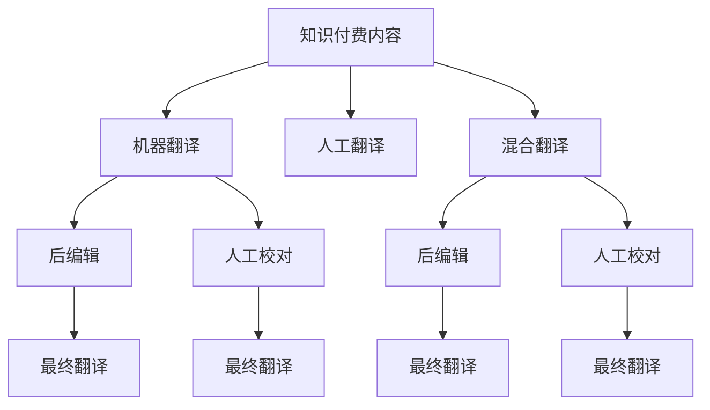

                 

## 1. 背景介绍

### 1.1 问题由来
随着全球化的深入，互联网已成为知识传播的重要平台。无论是企业还是个人，都在利用这一平台进行知识输出与分享，而知识付费正是这一过程中涌现的新模式。通过订阅和付费方式，用户可以获取更加系统、专业的知识服务，从而加速个人成长和职业发展。然而，知识付费内容通常以中文为主，对于非母语用户而言，其使用效果和体验大打折扣，限制了内容的全球传播和影响力扩展。

### 1.2 问题核心关键点
针对上述问题，本研究聚焦于知识付费内容的多语言本地化策略。具体而言，通过深度分析知识付费内容的特征，探讨如何高效、低成本地将其翻译成目标语言，同时保持原内容的完整性和流畅度，最大化用户的体验。

### 1.3 问题研究意义
实现知识付费内容的本地化，对于提升内容在全球范围内的可访问性、扩大内容的影响力、促进知识传播与交流具有重要意义。首先，本地化能够使更多非中文用户能够方便地获取到高质量的知识服务，从而提升个人和企业的竞争优势。其次，本地化内容可以更好地适应目标市场的需求，增强用户粘性和忠诚度。最后，本地化服务还能为平台带来更多流量和收益，促进商业化发展。

## 2. 核心概念与联系

### 2.1 核心概念概述

本节将介绍几个关键概念，以便更好地理解知识付费内容本地化的工作原理和优化方向。

- **知识付费内容**：指企业或个人通过互联网平台提供的有偿知识服务，包括但不限于课程、文章、咨询等形式。
- **本地化**：指将内容从原语言翻译并适配到目标语言的过程中，考虑到文化差异、语言习惯、表达方式等因素，以确保内容在目标语言中的可读性和接受度。
- **机器翻译**：指利用计算机程序实现自动翻译，常见的算法包括基于统计的机器翻译(SMT)和基于神经网络的机器翻译(NMT)。
- **人工翻译**：指由专业翻译人员进行的手工翻译，通常需要人工审校和校对，确保翻译的准确性和流畅性。
- **混合翻译**：指结合机器翻译和人工翻译的优势，在自动翻译的基础上由人工进行后编辑和校对，以达到高质量的翻译效果。

这些概念之间的逻辑关系可以通过以下Mermaid流程图来展示：



这个流程图展示了几类翻译方式及其相互之间的关系：

1. **机器翻译**：自动将知识付费内容从原语言翻译成目标语言。
2. **人工翻译**：由专业翻译人员手工翻译内容。
3. **混合翻译**：先使用机器翻译，再进行人工编辑和校对。

这些方式各有优缺点，需要根据具体需求和资源情况进行选择。

## 3. 核心算法原理 & 具体操作步骤
### 3.1 算法原理概述

知识付费内容的多语言本地化策略，主要通过以下步骤实现：

1. **内容分析与识别**：对知识付费内容进行分词、词性标注等预处理，识别出关键词和重要信息。
2. **选择合适的翻译方式**：根据内容特点和翻译资源，选择合适的翻译方法，如机器翻译、人工翻译或混合翻译。
3. **翻译与后处理**：对内容进行自动翻译或手工翻译，并进行必要的后编辑和校对，确保翻译的准确性和流畅性。
4. **发布与推广**：将本地化后的内容发布到目标市场，进行推广和用户反馈收集。

### 3.2 算法步骤详解

#### 3.2.1 内容分析与识别

- **分词与词性标注**：使用分词工具对知识付费内容进行分词，如jieba、HanLP等，并对每个词语进行词性标注，以识别出名词、动词、形容词等关键信息。
- **关键词提取**：通过TF-IDF、TextRank等算法，提取出内容中的关键词和短语，用于指导翻译重点。
- **重要信息识别**：利用情感分析、实体识别等技术，识别出内容中的核心观点和重要事实，确保翻译时不丢失关键信息。

#### 3.2.2 翻译与后处理

- **机器翻译**：选择常用的机器翻译工具，如Google Translate、DeepL等，自动翻译内容。
- **人工翻译**：根据内容复杂度和翻译资源，选择合适的翻译人员进行手工翻译。
- **后编辑与校对**：翻译完成后，进行后编辑，校正翻译错误和语病，确保表达的自然流畅。人工校对则是对翻译结果进行细致审核，确保翻译的准确性和一致性。

#### 3.2.3 发布与推广

- **多语言发布**：将本地化后的内容发布到目标市场的平台，如YouTube、Coursera等。
- **用户反馈收集**：通过调查问卷、用户评论等方式收集用户反馈，了解翻译效果和接受度。
- **持续优化**：根据用户反馈，不断优化翻译策略和翻译质量，提升用户体验。

### 3.3 算法优缺点

知识付费内容的多语言本地化策略具有以下优点：

1. **成本低、效率高**：机器翻译和混合翻译方式能够大幅降低人工翻译成本，提升翻译速度。
2. **适应性强**：通过自动翻译工具，可以应对大量的翻译需求，快速响应市场变化。
3. **可扩展性高**：能够同时适配多种语言，拓展目标市场。

同时，该策略也存在以下局限性：

1. **翻译质量受限**：机器翻译和混合翻译在处理复杂句式和表达时，效果可能不如人工翻译。
2. **文化差异难以完全消除**：即便经过人工校对，仍难以完全消除文化差异对内容表达的影响。
3. **成本控制难度大**：翻译质量的提升需要不断投入资源进行后编辑和校对，成本控制较难。

尽管存在这些局限性，但就目前而言，基于机器翻译和混合翻译的方式仍是大规模知识付费内容本地化的主流范式。未来相关研究的重点在于如何进一步提升翻译质量，优化翻译策略，以及降低人工校对的成本。

### 3.4 算法应用领域

知识付费内容的多语言本地化策略在多个领域都有广泛应用：

- **在线教育**：将教育内容翻译成目标语言，如Coursera、edX等平台提供的在线课程，提升国际教育资源的可及性。
- **专业咨询**：将商业咨询和法律咨询内容翻译成不同语言，如麦肯锡、普华永道等企业的咨询服务。
- **文化交流**：将文化类内容翻译成目标语言，如纪录片、电影等，促进不同文化间的交流和理解。
- **科技资讯**：将科技类内容翻译成不同语言，如科技新闻、科技博客等，让全球用户都能了解最新科技动态。

这些领域的应用展示了知识付费内容本地化策略的广泛潜力和应用前景。

## 4. 数学模型和公式 & 详细讲解  
### 4.1 数学模型构建

本节将使用数学语言对知识付费内容本地化的过程进行更加严格的刻画。

假设知识付费内容为 $X$，原语言为 $L_s$，目标语言为 $L_t$。设机器翻译模型为 $M_{mt}$，人工翻译模型为 $M_{ht}$，混合翻译模型为 $M_{htm}$，后编辑模型为 $M_{pe}$，人工校对模型为 $M_{po}$。

定义内容在 $L_s$ 下的得分函数为 $f_s(X)$，在 $L_t$ 下的得分函数为 $f_t(X)$。则知识付费内容本地化过程的目标函数为：

$$
\min_{X_t} \| f_s(X) - f_t(X) \|
$$

其中 $X_t = M_{mt}(X) \cdot M_{ht}(X_t) \cdot M_{pe}(X_t) \cdot M_{po}(X_t)$ 为翻译后的内容。

### 4.2 公式推导过程

以下是该目标函数的详细推导过程：

1. **得分函数定义**：假设得分函数 $f_s(X)$ 和 $f_t(X)$ 分别为内容在原语言和目标语言下的综合评估指标，如情感得分、关键信息覆盖率等。

2. **目标函数构建**：通过比较 $f_s(X)$ 和 $f_t(X)$ 的差异，量化翻译效果与原始内容的偏差。

3. **优化过程**：使用机器翻译、人工翻译、后编辑和校对模型，逐步优化翻译结果，使得 $X_t$ 与 $X$ 的差异最小化。

### 4.3 案例分析与讲解

以在线教育平台为例，探讨知识付费内容本地化的具体实施。

**案例背景**：某在线教育平台提供了大量优质的课程资源，主要面向中文用户。为扩大其全球影响力，需要将其课程翻译成英语。

**翻译流程**：

1. **内容分析**：使用jieba对课程内容进行分词和词性标注，提取出关键词和核心观点。
2. **翻译选择**：选择Google Translate进行机器翻译，使用专业翻译团队进行人工校对和后编辑。
3. **翻译结果**：将翻译后的内容发布到Coursera平台，并进行用户反馈收集。
4. **持续优化**：根据用户反馈，不断调整翻译策略，优化翻译质量。

**案例效果**：通过这一流程，课程内容成功翻译成英语，并在Coursera上获得了良好的用户评价和满意度。

## 5. 项目实践：代码实例和详细解释说明
### 5.1 开发环境搭建

在进行本地化实践前，我们需要准备好开发环境。以下是使用Python进行Python开发的环境配置流程：

1. 安装Anaconda：从官网下载并安装Anaconda，用于创建独立的Python环境。

2. 创建并激活虚拟环境：
```bash
conda create -n localize-env python=3.8 
conda activate localize-env
```

3. 安装相关库：
```bash
conda install jieba numpy pandas scikit-learn nltk transformers
```

4. 安装翻译API：
```bash
pip install googletrans
```

完成上述步骤后，即可在`localize-env`环境中开始本地化实践。

### 5.2 源代码详细实现

下面以在线教育课程翻译为例，给出使用Python进行知识付费内容本地化的代码实现。

首先，定义内容分析和翻译函数：

```python
import jieba
import googletrans
from transformers import BertTokenizer, BertForSequenceClassification

def analyze_content(content):
    # 分词和词性标注
    words = jieba.lcut(content)
    pos_tags = jieba.posseg.cut(content)
    
    # 提取关键词和短语
    keywords = [word for word, tag in pos_tags if tag in ['n', 'v', 'a']]
    phrases = [words[i:i+3] for i in range(len(words)-2) if words[i:i+3] not in keywords]
    
    return keywords, phrases

def translate_content(content, src_lang='zh-CN', target_lang='en'):
    # 翻译内容
    translator = googletrans.Translator()
    translated_text = translator.translate(content, src=src_lang, dest=target_lang)
    return translated_text.text
```

然后，定义翻译后编辑和校对函数：

```python
def post_edit(content, translations):
    # 后编辑
    edited_content = ''
    for phrase in translations:
        edited_content += phrase + ' '
    return edited_content.strip()

def post_check(content, translations):
    # 人工校对
    corrected_content = ''
    for phrase in translations:
        corrected_content += phrase + ' '
    return corrected_content.strip()
```

最后，启动翻译流程：

```python
content = '人工智能课程介绍'
keywords, phrases = analyze_content(content)
translated_content = translate_content(content)
edited_content = post_edit(translated_content, phrases)
corrected_content = post_check(edited_content, phrases)

print(corrected_content)
```

### 5.3 代码解读与分析

让我们再详细解读一下关键代码的实现细节：

**analyze_content函数**：
- 使用jieba进行分词和词性标注，提取关键词和短语，便于指导翻译重点。

**translate_content函数**：
- 使用googletrans进行机器翻译，将内容从中文翻译成英文。

**post_edit函数**：
- 对翻译结果进行后编辑，去除语法错误和不自然的表达。

**post_check函数**：
- 对后编辑结果进行人工校对，进一步确保翻译的准确性和流畅性。

**翻译流程**：
- 对课程内容进行分词和词性标注，提取关键词和短语。
- 使用机器翻译工具将内容翻译成目标语言。
- 对翻译结果进行后编辑，去除语法错误和不自然的表达。
- 对编辑结果进行人工校对，进一步确保翻译的准确性和流畅性。
- 输出最终翻译结果。

可以看到，Python和相关库使得知识付费内容本地化的代码实现变得简洁高效。开发者可以将更多精力放在数据处理、翻译策略优化等高层逻辑上，而不必过多关注底层的实现细节。

当然，工业级的系统实现还需考虑更多因素，如翻译质量评估、用户反馈收集、翻译策略动态调整等。但核心的本地化流程基本与此类似。

## 6. 实际应用场景
### 6.1 在线教育

在线教育平台提供的知识付费内容，通过本地化能够覆盖更多的国际用户，提升平台的全球影响力。具体而言，可以利用本地化后的课程资源，吸引更多非中文用户注册和学习，提高平台的用户粘性和满意度。

### 6.2 商业咨询

商业咨询公司提供的知识付费内容，通过本地化能够适应不同地区的商业环境和文化背景，提升咨询服务的可接受性和效果。例如，将咨询报告翻译成目标语言，使非母语用户能够更好地理解和使用。

### 6.3 文化交流

文化类内容如纪录片、电影、音乐等，通过本地化能够使全球用户更好地理解和学习不同文化，促进文化交流和理解。例如，将外国电影翻译成中文，使中国观众能够更好地欣赏和理解。

### 6.4 科技资讯

科技类内容如科技新闻、科技博客等，通过本地化能够使全球用户及时获取最新的科技动态，促进科技知识的传播和应用。例如，将科技新闻翻译成不同语言，使全球用户能够快速了解最新的科技进展。

### 6.5 未来应用展望

随着全球化的深入，知识付费内容的本地化需求将进一步扩大。未来，本地化技术将在更多领域得到应用，为知识传播和商业发展带来新的机遇。

在智慧教育领域，本地化技术将使在线教育资源更加丰富和多样，促进全球教育公平。在商务咨询领域，本地化内容将帮助企业更好地适应不同市场，提升竞争力。在文化交流领域，本地化内容将促进不同文化间的交流和理解。在科技资讯领域，本地化技术将使全球用户能够及时获取最新的科技动态。

## 7. 工具和资源推荐
### 7.1 学习资源推荐

为了帮助开发者系统掌握知识付费内容本地化的理论基础和实践技巧，这里推荐一些优质的学习资源：

1. 《机器翻译技术与应用》系列博文：由机器翻译领域的专家撰写，深入浅出地介绍了机器翻译原理、模型构建和应用案例。

2. 《Python自然语言处理》书籍：Python语言支持的自然语言处理库介绍，包括jieba、nltk、transformers等库的使用。

3. 《自然语言处理入门》课程：在线学习平台如Coursera、edX等提供的自然语言处理课程，涵盖基础知识和实践技能。

4. 《翻译记忆库与本地化》书籍：介绍翻译记忆库和本地化技术的应用，提供实战案例和工具推荐。

5. 《多语言本地化工程实践》书籍：介绍多语言本地化流程和工具，涵盖从翻译到发布的全流程实践。

通过对这些资源的学习实践，相信你一定能够快速掌握知识付费内容本地化的精髓，并用于解决实际的本地化问题。

### 7.2 开发工具推荐

高效的开发离不开优秀的工具支持。以下是几款用于知识付费内容本地化开发的常用工具：

1. jieba：中文分词工具，支持多种分词模式和自定义词典。

2. googletrans：机器翻译API，支持多种语言的自动翻译。

3. transformers：NLP库，提供预训练语言模型和任务适配层，方便构建本地化翻译模型。

4. Weights & Biases：模型训练的实验跟踪工具，可以记录和可视化模型训练过程中的各项指标，方便对比和调优。

5. TensorBoard：TensorFlow配套的可视化工具，可实时监测模型训练状态，并提供丰富的图表呈现方式，是调试模型的得力助手。

6. Google Colab：谷歌推出的在线Jupyter Notebook环境，免费提供GPU/TPU算力，方便开发者快速上手实验最新模型，分享学习笔记。

合理利用这些工具，可以显著提升知识付费内容本地化的开发效率，加快创新迭代的步伐。

### 7.3 相关论文推荐

知识付费内容本地化的研究源于学界的持续研究。以下是几篇奠基性的相关论文，推荐阅读：

1. "A Survey of Machine Translation"（《机器翻译综述》）：全面介绍了机器翻译的历史、现状和未来趋势，是学习机器翻译理论的重要资料。

2. "Neural Machine Translation by Jointly Learning to Align and Translate"（《通过联合学习对齐与翻译的神经机器翻译》）：提出基于神经网络的机器翻译模型，推动了机器翻译技术的发展。

3. "The Evaluation of Machine Translation Quality"（《机器翻译质量的评价》）：提出机器翻译质量评估的多种指标和方法，为翻译质量的提升提供了指导。

4. "Hierarchical Neural Network for Machine Translation"（《神经网络层次化机器翻译模型》）：提出多层神经网络模型，提高了机器翻译的效果和鲁棒性。

5. "Attention is All You Need"（《注意力机制是你需要的全部》）：提出Transformer结构，改进了神经网络在机器翻译中的应用效果。

这些论文代表了大语言模型微调技术的发展脉络。通过学习这些前沿成果，可以帮助研究者把握学科前进方向，激发更多的创新灵感。

## 8. 总结：未来发展趋势与挑战
### 8.1 总结

本文对知识付费内容的多语言本地化策略进行了全面系统的介绍。首先阐述了知识付费内容的特征和本地化策略的重要性，明确了本地化在提升内容全球可访问性方面的独特价值。其次，从原理到实践，详细讲解了本地化的数学模型和操作步骤，给出了知识付费内容本地化的完整代码实例。同时，本文还广泛探讨了本地化技术在多个领域的应用前景，展示了其广阔的潜力和应用空间。此外，本文精选了本地化技术的各类学习资源，力求为读者提供全方位的技术指引。

通过本文的系统梳理，可以看到，知识付费内容本地化技术正在成为互联网知识传播的重要范式，极大地提升了内容在全球范围内的可访问性，推动了知识传播与交流。未来，伴随技术的不断发展，本地化技术还将进一步拓展其应用领域，为全球用户提供更加丰富、便捷的知识服务。

### 8.2 未来发展趋势

展望未来，知识付费内容本地化技术将呈现以下几个发展趋势：

1. **技术进步**：机器翻译技术的不断进步，将使得翻译质量更高、效率更高，同时降低了成本。

2. **自动化提升**：自动化翻译工具的不断优化，将使本地化流程更加自动化和智能化，减少人工干预。

3. **数据驱动**：通过大数据分析，优化本地化策略，提升翻译效果和用户体验。

4. **多语言支持**：本地化技术将更好地支持多种语言，拓展目标市场。

5. **实时更新**：本地化内容能够根据用户反馈实时更新，提高用户满意度和粘性。

这些趋势凸显了知识付费内容本地化技术的广阔前景。这些方向的探索发展，必将进一步提升本地化服务的效果，推动内容在全球范围内的传播和应用。

### 8.3 面临的挑战

尽管知识付费内容本地化技术已经取得了一定的进展，但在迈向更加智能化、普适化应用的过程中，它仍面临着诸多挑战：

1. **文化差异**：不同文化之间的差异可能会影响翻译效果的自然流畅性和文化适应性。

2. **翻译质量**：机器翻译的质量仍可能不如人工翻译，尤其是在处理复杂句式和表达时。

3. **成本控制**：自动化翻译和人工校对需要不断投入资源，成本控制较难。

4. **用户反馈**：用户反馈的质量和数量直接影响到本地化策略的优化效果，收集和处理反馈需要技术支持。

5. **技术更新**：随着技术的不断发展，本地化技术需要不断更新和升级，才能保持竞争力。

尽管存在这些挑战，但随着技术的发展和应用实践的积累，知识付费内容本地化技术必将不断进步，为知识传播和商业发展带来更多的机遇和可能性。

### 8.4 研究展望

面对知识付费内容本地化所面临的种种挑战，未来的研究需要在以下几个方面寻求新的突破：

1. **自动化翻译的改进**：进一步提升机器翻译的质量和效率，降低人工校对的成本。

2. **数据驱动的本地化策略**：通过大数据分析，优化本地化策略，提升翻译效果和用户体验。

3. **文化适应性的增强**：研究如何更好地处理文化差异，提升翻译内容的自然流畅性和文化适应性。

4. **多语言并行本地化**：研究如何同时支持多种语言，提高本地化效率和质量。

5. **用户反馈的优化**：建立更高效的用户反馈收集和处理机制，提升本地化策略的优化效果。

6. **技术迭代与更新**：持续跟进最新技术进展，进行本地化技术的迭代和更新，保持竞争力。

这些研究方向将引领知识付费内容本地化技术迈向更高的台阶，为全球用户提供更加丰富、便捷的知识服务，推动知识传播与交流的发展。总之，知识付费内容本地化技术还需要从数据、算法、工程、业务等多个维度协同发力，才能真正实现其应用价值。

## 9. 附录：常见问题与解答

**Q1：知识付费内容本地化是否适用于所有类型的内容？**

A: 知识付费内容本地化在大多数情况下都是适用的，但不同的内容类型可能需要不同的本地化策略。例如，技术类内容可能需要更详细的解释和实例，文化类内容则需要更多文化背景的补充。

**Q2：如何选择最适合的本地化方式？**

A: 选择本地化方式需要综合考虑内容的复杂度、目标语言的特点、本地化资源等因素。对于复杂度较低的内容，可以优先考虑机器翻译，而对于复杂度较高的内容，则需要结合人工翻译和后编辑。

**Q3：本地化过程中如何确保文化适应性？**

A: 确保文化适应性需要充分理解目标语言的文化背景和表达习惯，例如通过文化适应性测试、本地化专家评审等方式。同时，需要注意保留原内容的文化特色，避免翻译过度和失真。

**Q4：本地化后的内容如何保证一致性？**

A: 为了保证本地化后的内容一致性，需要在翻译前和翻译后进行多次审核和校对，确保翻译结果的准确性和一致性。同时，可以建立本地化质量评估机制，进行持续监控和优化。

**Q5：本地化技术在应用中面临哪些技术挑战？**

A: 本地化技术面临的技术挑战主要包括机器翻译质量、文化差异处理、用户反馈收集和处理等。需要持续优化技术方案，提高翻译质量，处理文化差异，并建立高效的用户反馈机制。

通过对这些问题的解答，相信你对知识付费内容本地化有更清晰的理解，并能够在实践中灵活应用这些知识。总之，知识付费内容本地化技术需要不断优化和改进，才能更好地服务于全球用户，推动知识的传播和应用。

---

作者：禅与计算机程序设计艺术 / Zen and the Art of Computer Programming

