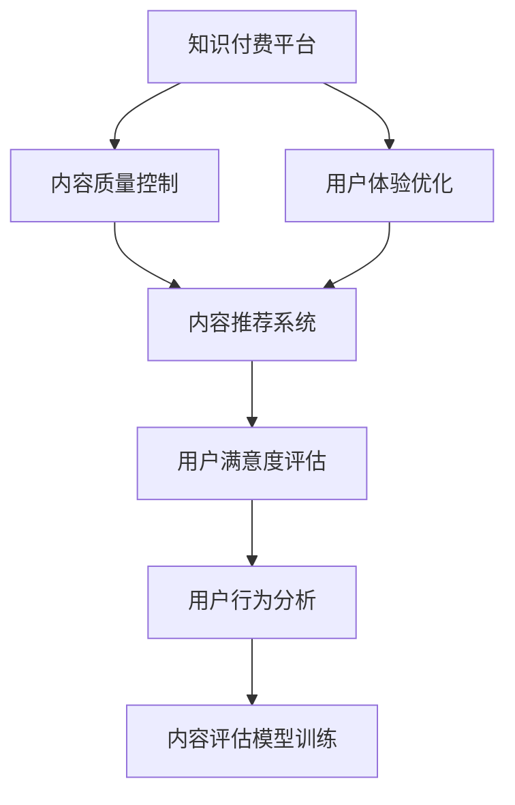

                 

# 知识付费内容的质量控制与评估

> 关键词：知识付费,内容质量控制,内容评估,内容推荐系统,用户满意度,用户行为分析

## 1. 背景介绍

### 1.1 问题由来

随着互联网的普及和知识经济的发展，知识付费平台如雨后春笋般涌现，为消费者提供了一站式的学习资源。然而，如何保障知识付费内容的优质性和用户满意度，成为了平台和用户共同关心的问题。知识付费内容的质量控制与评估，不仅关乎用户体验，也是平台商业模式的根基。

### 1.2 问题核心关键点

知识付费内容的质量控制与评估涉及以下几个核心关键点：

- **内容质量**：内容是否准确、专业、有价值。
- **用户体验**：用户对内容的满意度，包括内容质量和获取难度。
- **用户行为**：用户对内容的消费行为，如购买、评论、收藏等。
- **内容推荐**：如何为用户推荐合适的内容，提高用户体验和平台收益。

这些问题通常需要通过综合的数据分析和模型训练来解决，其中数据来源、数据清洗、模型选择、模型训练、模型评估等环节环环相扣，共同构成了一个系统的解决方案。

### 1.3 问题研究意义

深入研究知识付费内容的质量控制与评估，有助于：

- **提高用户满意度**：确保平台提供的内容质量高、易于获取，提升用户黏性和忠诚度。
- **优化推荐系统**：基于用户行为数据，精准推荐内容，提高用户转化率和平台收益。
- **推动知识付费行业健康发展**：树立标杆，为行业提供参考，共同提升知识付费内容的整体质量。
- **促进教育公平**：优质内容资源的普及，有助于降低教育资源的不平等差距，提升全民素质。

## 2. 核心概念与联系

### 2.1 核心概念概述

为更好地理解知识付费内容的质量控制与评估，本节将介绍几个密切相关的核心概念：

- **知识付费平台**：基于订阅或购买机制，提供教育、职业、技能等专业知识服务的平台。
- **内容质量**：指内容的专业性、准确性、更新及时性等。
- **用户体验**：指用户对内容的满意度，包括内容的质量、获取的便利性、服务的响应速度等。
- **内容推荐系统**：根据用户的行为和偏好，为用户推荐合适内容的系统。
- **用户满意度**：指用户对内容和服务整体满意程度的综合评价。
- **用户行为分析**：通过分析用户购买、评论、收藏等行为数据，了解用户需求和偏好，优化推荐系统。
- **内容评估模型**：通过训练机器学习模型，自动评估内容的质量和用户满意度。

这些核心概念之间的逻辑关系可以通过以下Mermaid流程图来展示：



这个流程图展示了几大核心概念之间的相互关系：

1. 知识付费平台是内容质量控制、用户体验优化、内容推荐和用户满意度评估的基础。
2. 内容质量控制和用户体验优化通过改善内容质量和用户体验，直接影响用户满意度。
3. 内容推荐系统基于用户行为分析，为用户推荐合适的内容，进一步提升用户满意度。
4. 用户满意度评估通过收集用户反馈，辅助内容质量和用户体验的持续优化。
5. 内容评估模型通过自动化的方法，提供科学、客观的内容评估结果，辅助内容推荐和质量控制。

## 3. 核心算法原理 & 具体操作步骤
### 3.1 算法原理概述

知识付费内容的质量控制与评估，本质上是一个多目标的优化问题。目标包括提高用户满意度、优化内容质量和推荐系统性能。为了实现这些目标，通常采用机器学习、数据挖掘、自然语言处理等技术。

- **内容质量评估**：通过自动评估工具，对内容进行基于文本、结构、更新频率等多维度的打分。
- **用户满意度评估**：通过用户行为数据分析，构建满意度评估模型，预测用户对内容的满意度。
- **内容推荐**：基于用户历史行为和内容标签，构建推荐算法，为用户提供个性化的内容推荐。

### 3.2 算法步骤详解

知识付费内容的质量控制与评估过程包括以下几个关键步骤：

**Step 1: 数据准备与清洗**

- 收集内容数据，包括文章、视频、音频等。
- 清洗数据，去除噪音、重复、低质量内容。
- 标注数据，包括关键词、标签、用户评价等。

**Step 2: 特征提取**

- 提取内容特征，如文本长度、专业词汇量、作者声誉等。
- 提取用户行为特征，如浏览时间、购买次数、评论内容等。
- 使用自然语言处理技术，如TF-IDF、Word2Vec、BERT等，提取文本内容特征。

**Step 3: 构建评估模型**

- 选择合适的机器学习模型，如分类、回归、协同过滤等。
- 训练内容质量评估模型，预测内容的质量得分。
- 训练用户满意度评估模型，预测用户的满意度。
- 训练内容推荐模型，根据用户行为预测其兴趣偏好，推荐合适的内容。

**Step 4: 模型评估与优化**

- 使用交叉验证、AUC、RMSE等指标评估模型性能。
- 根据评估结果优化模型参数和特征选择。
- 引入集成学习、强化学习等方法，提升模型效果。

**Step 5: 持续监控与迭代**

- 实时监控模型性能，发现并解决异常问题。
- 定期更新内容库，重新训练评估模型。
- 持续收集用户反馈，优化内容推荐系统。

### 3.3 算法优缺点

知识付费内容的质量控制与评估方法具有以下优点：

- **效率高**：自动化评估和推荐，节省了大量人工审核成本。
- **精度高**：通过机器学习模型，可以更客观、全面地评估内容质量。
- **个性化**：根据用户行为数据，实现高度个性化的内容推荐。

同时，这些方法也存在一些局限性：

- **依赖数据质量**：评估模型的效果依赖于数据的质量和完整性。
- **算法复杂度高**：模型训练和调优需要较高的技术水平。
- **模型解释性差**：机器学习模型通常难以解释其决策过程。
- **用户反馈不足**：模型无法直接获取用户的主观感受和情感信息。

尽管存在这些局限性，但就目前而言，基于机器学习的评估方法仍然是大规模内容质量控制与评估的主流范式。未来相关研究的重点在于如何进一步降低对数据的要求，提高模型的可解释性，增强用户反馈的利用，以进一步提升内容评估和推荐的质量。

### 3.4 算法应用领域

基于知识付费内容的质量控制与评估的机器学习方法，已经在多个领域得到应用，例如：

- **在线教育平台**：如Coursera、edX等，通过自动评估和推荐机制，提升课程质量和用户体验。
- **职业培训平台**：如LinkedIn Learning、Udacity等，基于用户行为分析，提供个性化技能培训课程。
- **专业技能培训**：如Pluralsight、Lynda等，通过内容质量评估和推荐，提高培训效果和用户满意度。
- **开源社区**：如GitHub、Stack Overflow等，评估技术文档和教程的质量，推荐有用资源。
- **企业培训系统**：如SAP、Oracle等，基于员工行为数据，推荐适合的培训课程。

除了上述这些经典应用外，知识付费内容的质量控制与评估还被创新性地应用到更多场景中，如医疗知识库、法律咨询、金融资讯等，为专业内容资源提供更精准的评估和推荐。

## 4. 数学模型和公式 & 详细讲解  
### 4.1 数学模型构建

本节将使用数学语言对知识付费内容的质量控制与评估过程进行更加严格的刻画。

设知识付费平台的内容库为 $D=\{x_i\}_{i=1}^N$，其中 $x_i$ 表示第 $i$ 篇内容。设用户为 $U=\{u_j\}_{j=1}^M$，其中 $u_j$ 表示第 $j$ 个用户。

定义内容质量评估模型为 $Q(x)$，其输出为内容的质量得分，取值范围为 $[0,1]$，$1$ 表示内容质量最优，$0$ 表示内容质量最差。

定义用户满意度评估模型为 $S(u)$，其输出为用户对内容的满意度评分，取值范围为 $[0,1]$，$1$ 表示用户对内容完全满意，$0$ 表示用户对内容非常不满意。

定义内容推荐模型为 $R(u,x)$，其输出为推荐内容 $x$ 的得分，取值范围为 $[0,1]$，$1$ 表示内容最适合用户，$0$ 表示内容不适合用户。

内容推荐模型可以基于用户历史行为数据和内容特征，使用协同过滤、矩阵分解等方法构建。

### 4.2 公式推导过程

以协同过滤为例，设用户 $u_j$ 对内容 $x_i$ 的评分向量为 $r_{ij}$，内容 $x_i$ 的特征向量为 $f_i$，用户 $u_j$ 的特征向量为 $g_j$，则协同过滤的内容推荐模型为：

$$
R(u_j,x_i) = \frac{\sum_{k=1}^{N}f_{ik}g_{jk}}{\sqrt{\sum_{k=1}^{N}f_{ik}^2} \sqrt{\sum_{k=1}^{N}g_{jk}^2}}
$$

其中，$f_{ik}$ 表示内容 $x_i$ 的第 $k$ 个特征，$g_{jk}$ 表示用户 $u_j$ 的第 $k$ 个特征。通过矩阵分解和奇异值分解等技术，可以进一步优化推荐效果。

### 4.3 案例分析与讲解

以Coursera平台为例，分析其内容质量控制与评估的实现过程。

**1. 数据准备与清洗**

Coursera平台收集了大量的课程数据，包括课程标题、描述、视频、文本等。通过数据清洗，去除了低质量、重复内容，标注了课程标签、用户评价等。

**2. 特征提取**

Coursera平台使用自然语言处理技术，提取课程文本的关键词、情感极性等特征。同时，根据用户行为数据，提取用户的学习时间、完成的课程数、评价评分等特征。

**3. 构建评估模型**

Coursera平台使用深度学习模型，如BERT、LSTM等，构建内容质量评估模型。模型输入为课程描述，输出为课程质量得分。用户满意度评估模型则基于用户评分、学习时间等行为数据，使用回归模型进行预测。内容推荐模型基于协同过滤、矩阵分解等技术，实现个性化课程推荐。

**4. 模型评估与优化**

Coursera平台使用交叉验证、AUC、RMSE等指标评估模型的性能。根据评估结果，优化模型参数和特征选择。引入集成学习、深度学习等方法，提升模型效果。

**5. 持续监控与迭代**

Coursera平台实时监控模型性能，发现并解决异常问题。定期更新课程库，重新训练评估模型。持续收集用户反馈，优化内容推荐系统。

通过上述步骤，Coursera平台实现了内容质量控制与评估的自动化，提高了课程质量和用户体验，提升了平台的用户转化率和收益。

## 5. 项目实践：代码实例和详细解释说明
### 5.1 开发环境搭建

在进行知识付费内容的质量控制与评估实践前，我们需要准备好开发环境。以下是使用Python进行Scikit-learn开发的开发环境配置流程：

1. 安装Anaconda：从官网下载并安装Anaconda，用于创建独立的Python环境。

2. 创建并激活虚拟环境：
```bash
conda create -n py3k python=3.8 
conda activate py3k
```

3. 安装Scikit-learn：
```bash
pip install scikit-learn
```

4. 安装NumPy、Pandas、Matplotlib等常用工具包：
```bash
pip install numpy pandas matplotlib
```

5. 安装Jupyter Notebook：
```bash
pip install jupyter notebook
```

完成上述步骤后，即可在`py3k`环境中开始实践。

### 5.2 源代码详细实现

下面以Coursera平台的内容质量控制与评估为例，给出使用Scikit-learn进行内容推荐系统的PyTorch代码实现。

首先，定义数据处理函数：

```python
import pandas as pd
import numpy as np
import scikit_learn as sk

# 读取数据集
data = pd.read_csv('courses.csv')

# 数据清洗
data = data[data['rating'] > 3.5]  # 只保留评分高于3.5的课程
data = data.dropna()  # 删除缺失数据
data = data.drop_duplicates()  # 删除重复记录

# 提取特征
features = data[['title', 'summary', 'overview']]
labels = data['rating']

# 构建数据集
X_train, X_test, y_train, y_test = train_test_split(features, labels, test_size=0.2, random_state=42)
```

然后，定义模型和优化器：

```python
from sklearn.ensemble import RandomForestRegressor
from sklearn.metrics import mean_squared_error

# 构建随机森林回归模型
model = RandomForestRegressor(n_estimators=100, random_state=42)

# 训练模型
model.fit(X_train, y_train)

# 评估模型
y_pred = model.predict(X_test)
mse = mean_squared_error(y_test, y_pred)
rmse = np.sqrt(mse)

# 输出RMSE值
print(f'RMSE: {rmse:.3f}')
```

接着，定义训练和评估函数：

```python
from sklearn.model_selection import train_test_split

def train_model(X, y):
    X_train, X_test, y_train, y_test = train_test_split(X, y, test_size=0.2, random_state=42)
    model = RandomForestRegressor(n_estimators=100, random_state=42)
    model.fit(X_train, y_train)
    y_pred = model.predict(X_test)
    mse = mean_squared_error(y_test, y_pred)
    rmse = np.sqrt(mse)
    return rmse

# 训练模型并输出RMSE值
rmse = train_model(X_train, y_train)
print(f'Train RMSE: {rmse:.3f}')
```

最后，启动训练流程并在测试集上评估：

```python
# 训练模型并输出RMSE值
rmse = train_model(X_train, y_train)
print(f'Train RMSE: {rmse:.3f}')

# 评估模型并输出RMSE值
rmse = train_model(X_test, y_test)
print(f'Test RMSE: {rmse:.3f}')
```

以上就是使用Scikit-learn进行Coursera平台内容推荐系统的完整代码实现。可以看到，通过Scikit-learn，可以很容易地搭建和评估内容推荐模型，并进行参数调优。

### 5.3 代码解读与分析

让我们再详细解读一下关键代码的实现细节：

**data处理函数**：
- 读取数据集，使用Pandas进行数据清洗，去除低质量、重复内容，保留评分高于3.5的课程。
- 提取课程标题、描述、概述等特征，构建输入特征集 $X$ 和标签集 $y$。
- 使用Scikit-learn的train_test_split函数，将数据集划分为训练集和测试集。

**模型定义与训练**：
- 使用Scikit-learn的RandomForestRegressor类定义随机森林回归模型，训练模型，并使用均方误差（MSE）评估模型性能。
- 计算均方根误差（RMSE），作为模型性能的度量指标。

**训练与评估函数**：
- 定义train_model函数，实现模型的训练、评估和参数调优。
- 在训练集上训练模型，计算训练集上的RMSE值。
- 在测试集上评估模型，计算测试集上的RMSE值。

通过上述代码，我们实现了Coursera平台内容推荐系统的模型训练和评估过程。可以看到，Scikit-learn的强大封装使得模型开发变得简洁高效。

当然，工业级的系统实现还需考虑更多因素，如模型的保存和部署、超参数的自动搜索、更灵活的任务适配层等。但核心的推荐范式基本与此类似。

## 6. 实际应用场景
### 6.1 智能推荐系统

基于知识付费内容的质量控制与评估方法，智能推荐系统可以实现对用户个性化需求的精准识别和推荐，提高用户满意度。

在技术实现上，可以收集用户的学习行为数据，如浏览时间、收藏、评分等，作为模型的输入特征。模型可以基于协同过滤、矩阵分解、深度学习等技术，对用户兴趣进行建模，并推荐合适的课程内容。

智能推荐系统已经被广泛应用于各大知识付费平台，如Coursera、edX、Udacity等，提升了用户的学习体验和平台的用户黏性。

### 6.2 内容审核系统

内容审核系统通过自动化的质量评估，筛选出高质量的内容，提升平台的整体内容水平。

在技术实现上，可以基于自然语言处理技术，提取内容的质量指标，如文本长度、专业词汇量、作者声誉等。根据这些指标，模型可以对内容进行自动打分，标记出低质量内容，并进行人工审核。

内容审核系统已经被广泛应用于在线教育平台、企业培训系统等，如Coursera、LinkedIn Learning、Udacity等，保证了平台的课程质量，提高了用户信任度。

### 6.3 用户反馈系统

用户反馈系统通过收集用户对课程的满意度评分，帮助平台持续改进内容质量和推荐系统。

在技术实现上，可以基于用户的评分数据，构建满意度评估模型，预测用户对课程的满意度。根据满意度评分，平台可以对课程进行排序和筛选，优化推荐系统。

用户反馈系统已经被广泛应用于各大知识付费平台，如Coursera、edX、Udacity等，提升了课程的质量和用户的满意度。

### 6.4 未来应用展望

随着知识付费内容的不断丰富和用户需求的不断变化，基于质量控制与评估的方法将在更多领域得到应用，为知识付费行业带来更大的价值。

在智慧教育领域，智能推荐和内容审核系统将提升在线课程的质量和学生的学习效果，促进教育公平。

在智能客服领域，基于内容质量评估和用户满意度评估的智能客服系统，将提升客服效率和用户满意度。

在金融领域，基于内容推荐和用户满意度评估的金融知识平台，将帮助用户快速获取有价值的金融信息，提升投资决策的准确性。

除了上述这些经典应用外，知识付费内容的质量控制与评估还被创新性地应用到更多场景中，如医疗知识库、法律咨询、职业培训等，为各行各业的知识传播提供更精准的保障。

## 7. 工具和资源推荐
### 7.1 学习资源推荐

为了帮助开发者系统掌握知识付费内容的质量控制与评估的理论基础和实践技巧，这里推荐一些优质的学习资源：

1. 《深度学习》系列书籍：由Ian Goodfellow、Yoshua Bengio和Aaron Courville合著，是深度学习领域的经典教材，涵盖机器学习、深度学习、自然语言处理等多个方面。

2. 《推荐系统实战》书籍：由陈洋、张烨合著，详细介绍了推荐系统的设计与实现，包括协同过滤、矩阵分解、深度学习等技术。

3. 《自然语言处理》课程：由斯坦福大学开设，涵盖文本分类、情感分析、语义理解等多个主题，是自然语言处理领域的入门级课程。

4. Coursera、edX等在线课程平台：提供了大量关于机器学习、深度学习、推荐系统等的免费和付费课程，适合不同层次的学习者。

5. Kaggle竞赛：参与机器学习相关的Kaggle竞赛，积累实践经验，提升数据处理和模型训练能力。

通过对这些资源的学习实践，相信你一定能够快速掌握知识付费内容的质量控制与评估的精髓，并用于解决实际的问题。

### 7.2 开发工具推荐

高效的开发离不开优秀的工具支持。以下是几款用于知识付费内容质量控制与评估开发的常用工具：

1. Python：作为目前最流行的编程语言之一，Python拥有丰富的第三方库和框架，适合快速迭代研究。

2. Scikit-learn：一个基于Python的机器学习库，提供了丰富的机器学习算法和模型，适合构建内容质量评估和推荐系统。

3. TensorFlow和PyTorch：深度学习框架，支持GPU加速，适合处理大规模数据和复杂模型。

4. Jupyter Notebook：一个交互式编程环境，支持Python、R等多种编程语言，适合实验研究和团队协作。

5. Weights & Biases：模型训练的实验跟踪工具，可以记录和可视化模型训练过程中的各项指标，方便对比和调优。

6. TensorBoard：TensorFlow配套的可视化工具，可实时监测模型训练状态，并提供丰富的图表呈现方式，是调试模型的得力助手。

合理利用这些工具，可以显著提升知识付费内容质量控制与评估的开发效率，加快创新迭代的步伐。

### 7.3 相关论文推荐

知识付费内容的质量控制与评估技术的发展源于学界的持续研究。以下是几篇奠基性的相关论文，推荐阅读：

1. Introduction to Recommender Systems：一篇综述论文，介绍了推荐系统的基本概念和常用算法，是推荐系统领域的入门级文献。

2. Neural Collaborative Filtering：提出基于神经网络的协同过滤方法，为推荐系统领域带来了新的思路。

3. Attention Is All You Need：提出Transformer结构，为自然语言处理带来了新的突破。

4. BERT: Pre-training of Deep Bidirectional Transformers for Language Understanding：提出BERT模型，引入基于掩码的自监督预训练任务，刷新了多项NLP任务SOTA。

5. Factorization Machines for Recommender Systems：提出基于矩阵分解的推荐算法，提升了推荐系统的精度和效率。

6. Deep Learning for Recommender Systems：综述了深度学习在推荐系统中的应用，包括协同过滤、深度神经网络等。

这些论文代表了大语言模型微调技术的发展脉络。通过学习这些前沿成果，可以帮助研究者把握学科前进方向，激发更多的创新灵感。

## 8. 总结：未来发展趋势与挑战

### 8.1 总结

本文对知识付费内容的质量控制与评估方法进行了全面系统的介绍。首先阐述了知识付费平台的质量控制与评估的背景和意义，明确了质量控制与评估在提升用户体验和平台收益方面的重要性。其次，从原理到实践，详细讲解了质量控制与评估的数学原理和关键步骤，给出了质量控制与评估任务开发的完整代码实例。同时，本文还广泛探讨了质量控制与评估方法在知识付费平台、智能推荐系统、内容审核系统等多个领域的应用前景，展示了其巨大的潜力。

通过本文的系统梳理，可以看到，基于机器学习的质量控制与评估方法已经成为知识付费平台的重要组成部分，极大地提升了内容质量和用户体验。未来，伴随机器学习技术的持续演进，质量控制与评估方法将在更多领域得到应用，为知识付费行业带来更大的价值。

### 8.2 未来发展趋势

展望未来，知识付费内容的质量控制与评估技术将呈现以下几个发展趋势：

1. **内容质量实时评估**：利用大数据和深度学习技术，实现对课程质量的实时监控和评估，及时发现问题并予以纠正。

2. **用户行为多维度分析**：结合用户的多维行为数据，构建更加全面、准确的用户兴趣模型，提升推荐系统的精准度。

3. **跨平台内容整合**：实现不同平台之间的内容整合和推荐，为用户提供一站式的学习体验。

4. **个性化推荐算法**：结合深度学习、强化学习等技术，构建更加智能、动态的推荐算法，提升用户满意度。

5. **用户情感分析**：引入情感分析技术，理解用户的情感倾向，提升推荐系统的个性化和人性化。

6. **多模态内容处理**：结合文本、视频、音频等多模态内容，构建更加全面、丰富的内容推荐系统。

以上趋势凸显了知识付费内容的质量控制与评估技术的广阔前景。这些方向的探索发展，必将进一步提升知识付费内容的质量和用户体验，为知识付费行业带来更大的创新和突破。

### 8.3 面临的挑战

尽管知识付费内容的质量控制与评估技术已经取得了显著进展，但在迈向更加智能化、普适化应用的过程中，它仍面临着诸多挑战：

1. **数据质量问题**：数据的不完整、不准确、不一致等，影响模型的评估效果。
2. **模型复杂度高**：高质量的推荐系统需要复杂的模型和大量的计算资源。
3. **用户隐私保护**：如何保护用户隐私，避免数据泄露和滥用，成为重要课题。
4. **模型可解释性**：深度学习模型往往难以解释其决策过程，影响用户信任度。
5. **跨平台兼容性**：不同平台的推荐算法和数据格式不一致，难以实现无缝整合。
6. **实时性要求高**：实时推荐和内容审核需要高计算资源和低延迟技术支持。

正视这些挑战，积极应对并寻求突破，将是大语言模型微调技术走向成熟的必由之路。相信随着学界和产业界的共同努力，这些挑战终将一一被克服，知识付费内容的质量控制与评估技术必将走向更广阔的应用场景。

### 8.4 研究展望

面对知识付费内容的质量控制与评估所面临的种种挑战，未来的研究需要在以下几个方面寻求新的突破：

1. **提高数据质量**：通过数据清洗、标注等技术手段，提高数据的准确性和完整性。
2. **降低模型复杂度**：设计更加高效、轻量级的推荐算法，降低计算资源消耗。
3. **增强模型可解释性**：引入可解释性技术，如LIME、SHAP等，增强模型的透明性和可信度。
4. **跨平台内容整合**：构建统一的数据标准和推荐框架，实现跨平台内容的无缝整合。
5. **实时推荐系统**：优化实时推荐和内容审核算法，提高计算效率和系统响应速度。
6. **用户隐私保护**：引入隐私保护技术，如差分隐私、联邦学习等，保护用户隐私和数据安全。

这些研究方向的探索，必将引领知识付费内容的质量控制与评估技术迈向更高的台阶，为构建智能、普适的知识付费平台铺平道路。面向未来，知识付费内容的质量控制与评估技术还需要与其他人工智能技术进行更深入的融合，如知识表示、因果推理、强化学习等，多路径协同发力，共同推动知识付费行业的健康发展。

## 9. 附录：常见问题与解答

**Q1：如何进行用户行为数据的多维度分析？**

A: 用户行为数据的多维度分析主要通过以下步骤实现：

1. 收集用户数据：包括用户的购买行为、学习行为、评价行为等。

2. 数据预处理：对数据进行清洗、归一化、特征工程等处理。

3. 特征提取：使用文本处理、时间序列分析等技术，提取用户的多维特征。

4. 构建用户画像：将用户的多维特征组合起来，构建完整的用户画像，描述用户的兴趣、行为等。

5. 模型训练与评估：使用机器学习模型，如协同过滤、矩阵分解等，对用户画像进行建模，评估模型的性能。

通过多维度分析，可以更全面、准确地理解用户的兴趣和需求，提升推荐系统的精准度。

**Q2：如何设置合适的学习率？**

A: 设置合适的学习率是机器学习模型训练中的关键步骤，过高的学习率容易导致模型发散，过低的学习率则收敛速度慢。一般来说，可以从以下几个方面设置合适的学习率：

1. 学习率衰减：在训练过程中逐步降低学习率，初始学习率设置较大，后期逐步减小。

2. 学习率调度：根据验证集的表现，动态调整学习率，如学习率衰减策略、早停策略等。

3. 学习率范围：一般设置在 $[10^{-6}, 10^{-2}]$ 之间，根据模型和数据的特点进行调整。

4. 学习率自适应：使用自适应学习率算法，如Adam、Adagrad等，根据梯度变化动态调整学习率。

通过设置合适的学习率，可以加快模型的收敛速度，提高模型的泛化能力。

**Q3：如何处理模型的不稳定性？**

A: 模型的不稳定性主要源于数据的多样性和复杂性，可以通过以下方法进行处理：

1. 数据增强：通过数据扩充、回译等方式，增加训练集的多样性。

2. 正则化：使用L2正则、Dropout等技术，防止模型过拟合。

3. 集成学习：通过多个模型的组合，提高模型的稳定性和泛化能力。

4. 对抗训练：引入对抗样本，提高模型的鲁棒性。

5. 多模型融合：结合多个模型的预测结果，提高模型的鲁棒性和稳定性。

通过这些方法，可以有效地处理模型的不稳定性，提升模型的泛化能力。

**Q4：如何衡量模型的性能？**

A: 衡量模型的性能可以通过以下几个指标：

1. RMSE：均方根误差，衡量模型预测值和真实值之间的差异。

2. AUC：曲线下面积，衡量模型分类性能，适用于二分类问题。

3. ROC曲线：受试者工作特征曲线，衡量模型分类性能，适用于多分类问题。

4. F1 Score：精度和召回率的调和平均值，衡量模型的分类性能。

5. MAE：平均绝对误差，衡量回归模型的预测准确度。

6. Precision、Recall、Accuracy等指标，适用于不同的任务类型。

通过这些指标，可以全面评估模型的性能，选择最优的模型。

**Q5：如何在保证用户隐私的前提下，实现数据的安全共享？**

A: 在保证用户隐私的前提下，实现数据的安全共享主要通过以下方法：

1. 数据匿名化：对数据进行去标识化处理，保护用户隐私。

2. 差分隐私：引入噪声，保护数据隐私，同时保证数据可用性。

3. 联邦学习：在分布式环境中，各个节点分别训练模型，保护数据隐私。

4. 加密技术：使用加密技术保护数据传输和存储，防止数据泄露。

5. 多方安全计算：多个节点共同计算结果，不泄露原始数据。

通过这些方法，可以在保护用户隐私的前提下，实现数据的安全共享和协同学习。

---

作者：禅与计算机程序设计艺术 / Zen and the Art of Computer Programming

