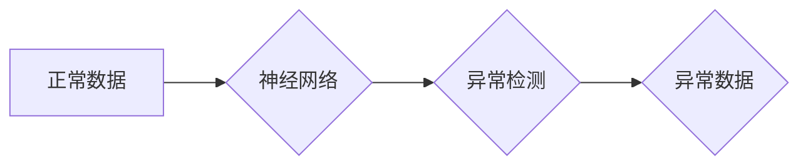

> 异常检测，神经网络，机器学习，数据分析，模式识别，数据可视化，深度学习

## 1. 背景介绍

在当今数据爆炸的时代，异常检测作为一种重要的数据分析技术，发挥着越来越关键的作用。它能够帮助我们从海量数据中识别出与正常模式相悖的异常数据点，从而发现潜在的风险、欺诈行为或系统故障。传统的异常检测方法通常依赖于手工设计的规则或统计模型，但这些方法往往难以应对复杂、非线性的数据模式。

近年来，随着深度学习技术的快速发展，神经网络异常检测方法逐渐成为研究热点。神经网络具有强大的非线性建模能力和自学习特征的能力，能够从数据中自动学习复杂的模式，并有效地识别出异常数据点。

## 2. 核心概念与联系

### 2.1 异常检测概述

异常检测是指从数据集中识别出与大多数数据点显著不同的数据点，这些数据点通常被称为异常值或异常事件。异常检测在各个领域都有广泛的应用，例如：

* **金融领域:** 识别欺诈交易、洗钱行为
* **网络安全领域:** 检测入侵攻击、恶意软件
* **医疗领域:** 发现异常医疗记录、疾病诊断
* **工业领域:** 识别设备故障、生产异常

### 2.2 神经网络基础

神经网络是一种模仿人脑神经网络结构的机器学习模型。它由多个层级的神经元组成，每个神经元接收来自前一层神经元的输入，并通过激活函数进行处理，然后将处理后的结果传递给下一层神经元。

神经网络的学习过程是通过调整神经元之间的连接权重来实现的。通过训练数据，神经网络可以学习到数据的特征和模式，并能够将新的数据点分类或预测。

### 2.3 异常检测与神经网络的结合

将神经网络应用于异常检测，可以充分利用神经网络强大的非线性建模能力和自学习特征的能力。

神经网络可以学习到数据的正常模式，并将与正常模式相悖的数据点识别为异常值。

**Mermaid 流程图**



## 3. 核心算法原理 & 具体操作步骤

### 3.1 算法原理概述

神经网络异常检测算法通常分为以下几种类型：

* **自编码器 (Autoencoder):** 自编码器是一种无监督学习算法，它通过学习数据的压缩表示来识别异常值。自编码器由编码器和解码器两部分组成，编码器将输入数据压缩成低维表示，解码器将低维表示恢复成原始数据。当输入数据为异常值时，自编码器难以将其准确地恢复，从而导致重建误差较大。

* **生成对抗网络 (GAN):** GAN由两个神经网络组成：生成器和鉴别器。生成器试图生成与真实数据相似的样本，而鉴别器试图区分真实数据和生成数据。通过对抗训练，生成器可以学习到数据的真实分布，并生成逼真的样本。异常值通常与真实数据分布相悖，因此难以被生成器生成，从而被识别出来。

* **深度信念网络 (DBN):** DBN是一种多层神经网络，它由多个受限玻尔兹曼机 (RBM) 组成。RBM是一种无监督学习算法，它可以学习到数据的概率分布。DBN通过逐层训练 RBM，可以学习到数据的复杂特征，并识别出异常值。

### 3.2 算法步骤详解

以自编码器为例，详细说明其异常检测步骤：

1. **数据预处理:** 对输入数据进行清洗、归一化等预处理操作，以提高模型的训练效果。
2. **自编码器构建:** 根据数据特点选择合适的网络结构，例如卷积自编码器、循环自编码器等。
3. **模型训练:** 使用训练数据训练自编码器，通过最小化重建误差来调整网络参数。
4. **异常值识别:** 将新的数据点输入到训练好的自编码器中，计算其重建误差。如果重建误差超过设定阈值，则认为该数据点为异常值。

### 3.3 算法优缺点

**优点:**

* 能够学习到复杂、非线性的数据模式。
* 无需人工设计特征，能够自动学习特征。
* 能够处理高维数据。

**缺点:**

* 训练时间较长，需要大量的训练数据。
* 模型解释性较差，难以理解模型的决策过程。
* 容易受到噪声数据的影响。

### 3.4 算法应用领域

神经网络异常检测算法广泛应用于以下领域：

* **金融欺诈检测:** 识别信用卡欺诈、账户盗用等行为。
* **网络安全威胁检测:** 检测入侵攻击、恶意软件感染等威胁。
* **工业设备故障预测:** 预判设备故障，避免生产停机。
* **医疗诊断辅助:** 辅助医生诊断疾病，识别异常医疗记录。

## 4. 数学模型和公式 & 详细讲解 & 举例说明

### 4.1 数学模型构建

自编码器模型的数学模型可以概括为以下公式：

* **编码器:** $h = f(W_1 x + b_1)$
* **解码器:** $x' = g(W_2 h + b_2)$

其中：

* $x$ 是输入数据
* $h$ 是编码后的低维表示
* $x'$ 是解码后的输出数据
* $W_1$, $W_2$ 是编码器和解码器的权重矩阵
* $b_1$, $b_2$ 是编码器和解码器的偏置向量
* $f$ 和 $g$ 是激活函数

### 4.2 公式推导过程

自编码器的目标是最小化输入数据与解码输出数据的差异，即最小化重建误差。常用的重建误差函数是均方误差 (MSE):

$$
MSE = \frac{1}{N} \sum_{i=1}^{N} ||x_i - x'_i||^2
$$

其中：

* $N$ 是数据点的数量
* $x_i$ 是第 $i$ 个数据点
* $x'_i$ 是第 $i$ 个数据点的解码输出

通过梯度下降算法，自编码器的权重参数 $W_1$, $W_2$, $b_1$, $b_2$ 会不断更新，以最小化重建误差。

### 4.3 案例分析与讲解

假设我们有一个包含正常用户行为和异常用户行为的数据集。我们可以使用自编码器训练一个模型，学习到正常用户行为的模式。当新的用户行为数据输入到模型中时，如果重建误差较大，则认为该用户行为为异常行为。

例如，如果一个用户的交易金额突然大幅增加，而其以往的交易金额都比较稳定，则该用户的交易行为可能被识别为异常行为。

## 5. 项目实践：代码实例和详细解释说明

### 5.1 开发环境搭建

* Python 3.x
* TensorFlow 或 PyTorch 深度学习框架
* Jupyter Notebook 或 VS Code 开发环境

### 5.2 源代码详细实现

```python
import tensorflow as tf

# 定义自编码器模型
class Autoencoder(tf.keras.Model):
    def __init__(self, latent_dim):
        super(Autoencoder, self).__init__()
        self.encoder = tf.keras.Sequential([
            tf.keras.layers.Dense(128, activation='relu'),
            tf.keras.layers.Dense(latent_dim)
        ])
        self.decoder = tf.keras.Sequential([
            tf.keras.layers.Dense(128, activation='relu'),
            tf.keras.layers.Dense(input_dim, activation='sigmoid')
        ])

    def call(self, x):
        encoded = self.encoder(x)
        decoded = self.decoder(encoded)
        return decoded

# 训练数据
(x_train, _), (x_test, _) = tf.keras.datasets.mnist.load_data()
x_train = x_train.astype('float32') / 255.0
x_test = x_test.astype('float32') / 255.0

# 构建模型
model = Autoencoder(latent_dim=32)

# 编译模型
model.compile(optimizer='adam', loss='mse')

# 训练模型
model.fit(x_train, x_train, epochs=10)

# 预测异常值
x_test_encoded = model.encoder(x_test)
x_test_decoded = model.decoder(x_test_encoded)
reconstruction_error = tf.reduce_mean(tf.square(x_test - x_test_decoded))

print(f'Reconstruction error: {reconstruction_error.numpy()}')
```

### 5.3 代码解读与分析

* 代码首先定义了一个自编码器模型，包含编码器和解码器两部分。
* 编码器将输入数据压缩成低维表示，解码器将低维表示恢复成原始数据。
* 训练数据使用 MNIST 手写数字数据集，数据预处理包括归一化。
* 模型使用 Adam 优化器和均方误差损失函数进行训练。
* 训练完成后，使用测试数据计算重建误差，并打印结果。

### 5.4 运行结果展示

运行代码后，会输出重建误差的值。重建误差越小，表示模型训练效果越好。

## 6. 实际应用场景

### 6.1 金融欺诈检测

神经网络异常检测算法可以用于识别信用卡欺诈、账户盗用等行为。

例如，可以训练一个自编码器模型，学习到正常用户交易模式，当出现异常交易行为时，模型会发出警报。

### 6.2 网络安全威胁检测

神经网络异常检测算法可以用于检测入侵攻击、恶意软件感染等网络安全威胁。

例如，可以训练一个 GAN 模型，学习到正常网络流量模式，当出现异常网络流量时，模型会识别为潜在威胁。

### 6.3 工业设备故障预测

神经网络异常检测算法可以用于预测工业设备故障，避免生产停机。

例如，可以训练一个 DBN 模型，学习到设备运行状态的特征，当设备状态出现异常时，模型会发出预警。

### 6.4 未来应用展望

随着人工智能技术的不断发展，神经网络异常检测算法将在更多领域得到应用，例如：

* **医疗诊断辅助:** 识别疾病、预测患者风险
* **交通安全:** 检测驾驶员疲劳、车辆故障
* **环境监测:** 识别污染源、预测自然灾害

## 7. 工具和资源推荐

### 7.1 学习资源推荐

* **书籍:**
    * Deep Learning by Ian Goodfellow, Yoshua Bengio, and Aaron Courville
    * Hands-On Machine Learning with Scikit-Learn, Keras & TensorFlow by Aurélien Géron
* **在线课程:**
    * TensorFlow Tutorials: https://www.tensorflow.org/tutorials
    * PyTorch Tutorials: https://pytorch.org/tutorials/

### 7.2 开发工具推荐

* **TensorFlow:** https://www.tensorflow.org/
* **PyTorch:** https://pytorch.org/
* **Keras:** https://keras.io/

### 7.3 相关论文推荐

* Autoencoders for Anomaly Detection: https://arxiv.org/abs/1803.03287
* Generative Adversarial Networks for Anomaly Detection: https://arxiv.org/abs/1703.05933
* Deep Belief Networks for Anomaly Detection: https://arxiv.org/abs/1006.1626

## 8. 总结：未来发展趋势与挑战

### 8.1 研究成果总结

神经网络异常检测算法取得了显著的成果，在金融、网络安全、工业等领域得到了广泛应用。

### 8.2 未来发展趋势

* **模型复杂度提升:** 研究更深、更复杂的网络结构，提高模型的表达能力和检测精度。
*