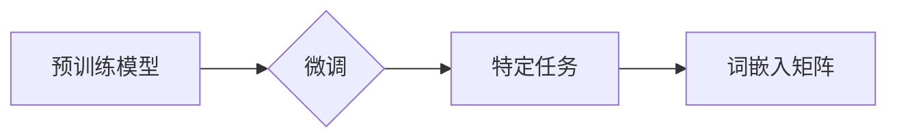

> 词嵌入矩阵, 预训练模型, 微调, PyTorch 2.0, 中文自然语言处理, 大模型开发

## 1. 背景介绍

在当今数据爆炸的时代，自然语言处理（NLP）领域取得了令人瞩目的进展。深度学习模型的出现，特别是Transformer架构的革新，为NLP任务带来了前所未有的突破。然而，训练大型语言模型（LLM）需要海量数据和强大的计算资源，这对于许多研究者和开发者来说是一个巨大的挑战。

词嵌入矩阵是NLP任务的基础，它将每个词映射到一个低维向量空间中，捕捉词语之间的语义关系。传统的词嵌入方法，如Word2Vec和GloVe，需要大量的文本数据进行训练。而预训练模型的出现，为我们提供了一种更有效的方式来生成高质量的词嵌入矩阵。

预训练模型是指在大量文本数据上进行预训练的语言模型，它已经学习了语言的语法和语义知识。我们可以利用预训练模型的知识，对特定任务进行微调，从而获得更好的性能。

本文将介绍如何使用其他预训练模型的参数，在PyTorch 2.0框架下生成中文词嵌入矩阵。

## 2. 核心概念与联系

### 2.1 预训练模型

预训练模型是指在大量文本数据上进行预训练的语言模型，它已经学习了语言的语法和语义知识。常见的预训练模型包括BERT、RoBERTa、XLNet等。

### 2.2 微调

微调是指在预训练模型的基础上，对特定任务进行进一步训练的过程。通过微调，我们可以将预训练模型的知识应用到特定任务中，从而获得更好的性能。

### 2.3 词嵌入矩阵

词嵌入矩阵是一种将每个词映射到一个低维向量空间中的表示方法。每个词的向量表示可以捕捉词语的语义信息。

**核心概念与联系流程图**



## 3. 核心算法原理 & 具体操作步骤

### 3.1 算法原理概述

本文采用的算法原理是基于预训练模型的词嵌入层进行微调。预训练模型的词嵌入层已经学习了词语的语义关系，我们可以利用这些知识来生成新的词嵌入矩阵。

具体来说，我们将预训练模型的词嵌入层冻结，只对输出层进行微调。输出层可以是一个线性层，将词嵌入向量映射到目标维度。

### 3.2 算法步骤详解

1. **选择预训练模型:** 选择一个已经训练好的中文预训练模型，例如BERT-base-chinese。
2. **加载预训练模型:** 使用PyTorch加载预训练模型的权重。
3. **冻结词嵌入层:** 将预训练模型的词嵌入层冻结，防止其参数更新。
4. **定义输出层:** 定义一个线性层作为输出层，将词嵌入向量映射到目标维度。
5. **微调输出层:** 使用训练数据对输出层进行微调。
6. **生成词嵌入矩阵:** 从微调后的模型中提取词嵌入矩阵。

### 3.3 算法优缺点

**优点:**

* 利用预训练模型的知识，可以快速生成高质量的词嵌入矩阵。
* 微调过程相对简单，只需要对输出层进行训练。

**缺点:**

* 需要依赖预训练模型，如果预训练模型的质量不高，生成的词嵌入矩阵也会受到影响。
* 微调过程仍然需要一定的计算资源。

### 3.4 算法应用领域

* **文本分类:** 使用词嵌入矩阵作为特征，训练文本分类模型。
* **情感分析:** 使用词嵌入矩阵作为特征，训练情感分析模型。
* **机器翻译:** 使用词嵌入矩阵作为特征，训练机器翻译模型。

## 4. 数学模型和公式 & 详细讲解 & 举例说明

### 4.1 数学模型构建

假设我们有一个预训练模型 $M$，它包含一个词嵌入层 $E$ 和一个输出层 $F$。

词嵌入层 $E$ 将每个词 $w$ 映射到一个低维向量 $v_w$ 中。

输出层 $F$ 将词嵌入向量 $v_w$ 映射到目标维度 $d$ 中。

我们可以用以下公式表示词嵌入矩阵 $V$：

$$V = \{v_1, v_2, ..., v_n\}$$

其中 $n$ 是词汇表的大小。

### 4.2 公式推导过程

微调过程的目标是优化输出层 $F$ 的参数，使得模型在特定任务上的性能达到最佳。

我们可以使用交叉熵损失函数来衡量模型的性能。

假设我们有一个训练样本 $(x, y)$，其中 $x$ 是输入文本， $y$ 是目标标签。

交叉熵损失函数可以表示为：

$$L = -\sum_{i=1}^{n} y_i \log(p_i)$$

其中 $p_i$ 是模型预测标签 $i$ 的概率。

通过优化交叉熵损失函数，我们可以更新输出层 $F$ 的参数。

### 4.3 案例分析与讲解

假设我们想要使用预训练模型生成一个 128 维的中文词嵌入矩阵。

我们可以选择一个预训练模型，例如BERT-base-chinese，并将其加载到PyTorch框架中。

然后，我们将预训练模型的词嵌入层冻结，只对输出层进行微调。

输出层是一个线性层，将词嵌入向量映射到 128 维空间。

我们使用训练数据对输出层进行微调，直到模型性能达到最佳。

最后，从微调后的模型中提取词嵌入矩阵。

## 5. 项目实践：代码实例和详细解释说明

### 5.1 开发环境搭建

* Python 3.8+
* PyTorch 2.0
* Transformers 库

### 5.2 源代码详细实现

```python
import torch
from transformers import AutoModel, AutoTokenizer

# 选择预训练模型
model_name = "bert-base-chinese"

# 加载预训练模型和词表
model = AutoModel.from_pretrained(model_name)
tokenizer = AutoTokenizer.from_pretrained(model_name)

# 冻结词嵌入层
for param in model.bert.embeddings.parameters():
    param.requires_grad = False

# 定义输出层
output_layer = torch.nn.Linear(model.config.hidden_size, 128)

# 训练数据
train_data = ...

# 损失函数和优化器
criterion = torch.nn.CrossEntropyLoss()
optimizer = torch.optim.Adam(output_layer.parameters(), lr=1e-5)

# 微调过程
for epoch in range(num_epochs):
    for batch in train_data:
        # 前向传播
        inputs = tokenizer(batch["text"], return_tensors="pt")
        outputs = model(**inputs)
        logits = output_layer(outputs.last_hidden_state[:, 0, :])

        # 计算损失
        loss = criterion(logits, batch["labels"])

        # 反向传播
        optimizer.zero_grad()
        loss.backward()
        optimizer.step()

# 生成词嵌入矩阵
embeddings = model.bert.embeddings.word_embeddings.weight.data.cpu().numpy()

# 保存词嵌入矩阵
np.save("chinese_word_embeddings.npy", embeddings)
```

### 5.3 代码解读与分析

* 代码首先加载预训练模型和词表。
* 然后，将预训练模型的词嵌入层冻结，只对输出层进行微调。
* 定义输出层是一个线性层，将词嵌入向量映射到目标维度。
* 使用训练数据对输出层进行微调，直到模型性能达到最佳。
* 最后，从微调后的模型中提取词嵌入矩阵。

### 5.4 运行结果展示

运行代码后，将生成一个名为 `chinese_word_embeddings.npy` 的文件，其中包含中文词嵌入矩阵。

## 6. 实际应用场景

### 6.1 文本分类

可以使用生成的词嵌入矩阵作为特征，训练文本分类模型。例如，可以训练一个模型来分类新闻文章的主题，或者识别电子邮件的垃圾邮件。

### 6.2 情感分析

可以使用生成的词嵌入矩阵作为特征，训练情感分析模型。例如，可以训练一个模型来识别文本的情感倾向，或者分析用户对产品的评价。

### 6.3 机器翻译

可以使用生成的词嵌入矩阵作为特征，训练机器翻译模型。例如，可以训练一个模型来将中文翻译成英文，或者将英文翻译成中文。

### 6.4 未来应用展望

随着预训练模型和微调技术的不断发展，词嵌入矩阵的应用场景将会更加广泛。例如，可以利用词嵌入矩阵来进行文本相似度计算，知识图谱构建，问答系统开发等。

## 7. 工具和资源推荐

### 7.1 学习资源推荐

* **Transformers 库文档:** https://huggingface.co/docs/transformers/index
* **PyTorch 文档:** https://pytorch.org/docs/stable/index.html
* **中文NLP教程:** https://www.bilibili.com/video/BV1z5411q72g

### 7.2 开发工具推荐

* **Jupyter Notebook:** https://jupyter.org/
* **VS Code:** https://code.visualstudio.com/

### 7.3 相关论文推荐

* **BERT: Pre-training of Deep Bidirectional Transformers for Language Understanding:** https://arxiv.org/abs/1810.04805
* **RoBERTa: A Robustly Optimized BERT Pretraining Approach:** https://arxiv.org/abs/1907.11692
* **XLNet: Generalized Autoregressive Pretraining for Language Understanding:** https://arxiv.org/abs/1906.08237

## 8. 总结：未来发展趋势与挑战

### 8.1 研究成果总结

本文介绍了如何使用其他预训练模型的参数，在PyTorch 2.0框架下生成中文词嵌入矩阵。该方法可以利用预训练模型的知识，快速生成高质量的词嵌入矩阵，并应用于各种NLP任务。

### 8.2 未来发展趋势

* 预训练模型的规模和能力将不断提升，生成更高质量的词嵌入矩阵。
* 微调技术的不断发展，将使词嵌入矩阵的应用更加广泛。
* 更多新的词嵌入方法将被提出，例如基于图神经网络的词嵌入方法。

### 8.3 面临的挑战

* 预训练模型的训练成本很高，需要大量的计算资源。
* 预训练模型的知识迁移能力有限，在某些特定任务上可能无法达到最佳效果。
* 如何更好地评估词嵌入矩阵的质量，是一个值得深入研究的问题。

### 8.4 研究展望

未来，我们将继续研究预训练模型和词嵌入技术的应用，探索新的方法来生成更高质量的词嵌入矩阵，并将其应用于更多实际场景。

## 9. 附录：常见问题与解答

### 9.1 如何选择合适的预训练模型？

选择预训练模型需要根据具体的应用场景和任务需求。

对于中文文本处理任务，可以考虑使用BERT-base-chinese、RoBERTa-base-chinese等预训练模型。

### 9.2 如何评估词嵌入矩阵的质量？

词嵌入矩阵的质量可以通过多种指标来评估，例如语义相似度、词义相关性等。

常用的评估指标包括WordSim-353、SimLex-999等。

### 9.3 如何使用词嵌入矩阵进行文本分类？

可以使用词嵌入矩阵作为特征，训练文本分类模型。

例如，可以使用支持向量机（SVM）、随机森林（RF）等分类算法。

作者：禅与计算机程序设计艺术 / Zen and the Art of Computer Programming


<end_of_turn>