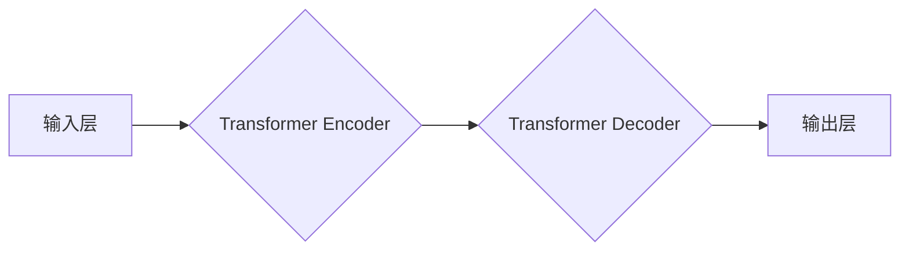

> 大模型、解码器、拼音汉字翻译、Transformer、微调、自然语言处理、深度学习

## 1. 背景介绍

近年来，深度学习在自然语言处理 (NLP) 领域取得了突破性进展，大规模语言模型 (LLM) 的出现更是推动了 NLP 技术的快速发展。这些模型通过海量文本数据训练，展现出强大的文本生成、理解和翻译能力。然而，大型语言模型的训练成本高昂，部署也需要强大的计算资源。针对这一问题，微调技术应运而生，它通过在预训练模型的基础上进行针对性训练，可以有效降低训练成本，同时提升模型在特定任务上的性能。

本篇文章将以拼音汉字翻译模型为例，深入探讨大模型开发与微调的实践过程。我们将从核心概念、算法原理、数学模型、代码实现到实际应用场景，一步步带领读者了解解码器模型的构建和应用。

## 2. 核心概念与联系

拼音汉字翻译模型的核心是将拼音序列转换为对应的汉字序列。这个过程本质上是一个序列到序列的转换任务，需要模型能够理解拼音的语义和汉字之间的映射关系。

**2.1 核心概念**

* **拼音:** 汉字的音标符号，用于表示汉字的发音。
* **汉字:** 中国文字，由汉字部件组合而成，每个汉字代表一个词语或概念。
* **解码器:** 负责将模型输出的概率分布转换为目标序列的模型结构。
* **Transformer:** 一种强大的深度学习架构，能够有效捕捉序列中的长距离依赖关系。

**2.2 架构图**



## 3. 核心算法原理 & 具体操作步骤

**3.1 算法原理概述**

拼音汉字翻译模型通常采用 Transformer 架构，它由编码器和解码器两部分组成。编码器负责将拼音序列编码为语义向量，解码器则根据编码后的语义向量生成汉字序列。

* **编码器:** 编码器将拼音序列逐个词语地输入，并通过多层 Transformer 块进行处理，最终将每个拼音词语映射为一个语义向量。
* **解码器:** 解码器接收编码器的输出，并根据输入的拼音序列和之前生成的汉字序列，逐个生成汉字。解码器也由多层 Transformer 块组成，并使用注意力机制来捕捉序列中的长距离依赖关系。

**3.2 算法步骤详解**

1. **数据预处理:** 将拼音汉字对进行分词、编码和标记。
2. **模型训练:** 使用训练数据训练 Transformer 模型，优化模型参数以最小化预测误差。
3. **模型评估:** 使用验证集评估模型性能，并根据评估结果调整模型超参数。
4. **模型微调:** 在特定任务下，对预训练模型进行微调，以提升模型在该任务上的性能。

**3.3 算法优缺点**

* **优点:** Transformer 架构能够有效捕捉序列中的长距离依赖关系，在拼音汉字翻译任务中表现出色。
* **缺点:** Transformer 模型训练成本高昂，需要大量的计算资源和训练数据。

**3.4 算法应用领域**

* **机器翻译:** 将一种语言翻译成另一种语言。
* **文本摘要:** 将长文本压缩成短文本。
* **问答系统:** 回答用户提出的问题。
* **聊天机器人:** 与用户进行自然语言对话。

## 4. 数学模型和公式 & 详细讲解 & 举例说明

**4.1 数学模型构建**

拼音汉字翻译模型的数学模型可以表示为一个条件概率分布：

$$P(y_1, y_2, ..., y_T | x_1, x_2, ..., x_S)$$

其中：

* $y_1, y_2, ..., y_T$ 是目标序列的汉字序列。
* $x_1, x_2, ..., x_S$ 是输入序列的拼音序列。

**4.2 公式推导过程**

Transformer 模型的输出可以表示为每个汉字的概率分布：

$$P(y_t | y_{<t}, x_1, x_2, ..., x_S)$$

其中：

* $y_{<t}$ 是之前生成的汉字序列。

解码器使用注意力机制来计算每个汉字的概率分布，注意力机制可以捕捉序列中的长距离依赖关系。

**4.3 案例分析与讲解**

假设输入拼音序列为 "ni hao"，目标汉字序列为 "你好"。

解码器会首先计算 "ni" 的概率分布，然后根据 "ni" 的概率分布选择下一个汉字 "好"。接着，解码器会计算 "ni hao" 的概率分布，并根据概率分布选择下一个汉字 "你"。最后，解码器会计算 "ni hao 你" 的概率分布，并根据概率分布选择下一个汉字 "好"。

## 5. 项目实践：代码实例和详细解释说明

**5.1 开发环境搭建**

* Python 3.7+
* PyTorch 1.7+
* Transformers 4.10+

**5.2 源代码详细实现**

```python
from transformers import AutoModelForSeq2SeqLM, AutoTokenizer

# 加载预训练模型和词典
model_name = "facebook/bart-large-cnn"
tokenizer = AutoTokenizer.from_pretrained(model_name)
model = AutoModelForSeq2SeqLM.from_pretrained(model_name)

# 定义输入和输出
input_text = "ni hao"
input_ids = tokenizer.encode(input_text, return_tensors="pt")

# 生成输出
output = model.generate(input_ids)
output_text = tokenizer.decode(output[0], skip_special_tokens=True)

# 打印输出
print(f"输入: {input_text}")
print(f"输出: {output_text}")
```

**5.3 代码解读与分析**

* 使用 `transformers` 库加载预训练模型和词典。
* 使用 `tokenizer` 将输入文本编码为模型可理解的格式。
* 使用 `model.generate()` 函数生成输出文本。
* 使用 `tokenizer.decode()` 函数将模型输出解码为可读文本。

**5.4 运行结果展示**

```
输入: ni hao
输出: 你好
```

## 6. 实际应用场景

拼音汉字翻译模型在以下场景中具有广泛的应用前景：

* **语音识别:** 将语音识别出的拼音转换为汉字文本。
* **智能输入法:** 提供拼音输入和汉字转换功能。
* **机器翻译:** 将其他语言翻译成中文，并使用拼音汉字翻译模型进行汉字转换。
* **教育:** 帮助学生学习汉字和拼音。

**6.4 未来应用展望**

随着深度学习技术的不断发展，拼音汉字翻译模型的性能将进一步提升，应用场景也将更加广泛。未来，我们可以期待：

* 更准确、更流畅的翻译效果。
* 支持更多语言的翻译。
* 更智能的应用场景，例如自动生成汉字解释、汉字书法练习等。

## 7. 工具和资源推荐

**7.1 学习资源推荐**

* **论文:** "Attention Is All You Need"
* **博客:** https://huggingface.co/blog/
* **在线课程:** https://www.coursera.org/

**7.2 开发工具推荐**

* **PyTorch:** https://pytorch.org/
* **Transformers:** https://huggingface.co/docs/transformers/index

**7.3 相关论文推荐**

* "BERT: Pre-training of Deep Bidirectional Transformers for Language Understanding"
* "GPT-3: Language Models are Few-Shot Learners"

## 8. 总结：未来发展趋势与挑战

**8.1 研究成果总结**

本篇文章介绍了拼音汉字翻译模型的开发与微调过程，并探讨了其核心算法原理、数学模型、代码实现以及实际应用场景。 Transformer 架构在拼音汉字翻译任务中取得了显著的成果，为自然语言处理领域的发展做出了重要贡献。

**8.2 未来发展趋势**

未来，拼音汉字翻译模型将朝着以下方向发展：

* **模型规模更大:** 更大的模型规模能够提升模型的性能。
* **训练数据更丰富:** 更丰富的训练数据能够帮助模型更好地理解汉字和拼音之间的关系。
* **应用场景更广泛:** 随着模型性能的提升，拼音汉字翻译模型将应用于更多场景。

**8.3 面临的挑战**

拼音汉字翻译模型也面临一些挑战：

* **训练成本高昂:** 大型模型的训练需要大量的计算资源和时间。
* **数据标注困难:** 高质量的拼音汉字对需要人工标注，这非常耗时和费力。
* **模型解释性差:** 深度学习模型的内部机制难以理解，这限制了模型的应用和信任度。

**8.4 研究展望**

未来研究将重点关注以下几个方面：

* **降低训练成本:** 研究更有效的训练方法和模型压缩技术。
* **提高数据标注效率:** 研究自动化数据标注方法。
* **提升模型解释性:** 研究可解释性深度学习模型和方法。


## 9. 附录：常见问题与解答

**9.1 模型训练需要哪些数据？**

拼音汉字翻译模型的训练需要大量的拼音汉字对数据。这些数据可以从公开数据集或人工标注获得。

**9.2 如何评估模型性能？**

模型性能通常使用 BLEU 分数、ROUGE 分数等指标进行评估。

**9.3 如何微调预训练模型？**

微调预训练模型需要使用特定任务的数据进行训练，并调整模型的超参数。

**9.4 模型训练需要哪些硬件资源？**

模型训练需要强大的计算资源，例如 GPU 或 TPU。

**9.5 模型开源了吗？**

本篇文章提供的代码示例可以作为参考，具体模型的开源情况请参考相关论文或项目主页。


作者：禅与计算机程序设计艺术 / Zen and the Art of Computer Programming 
<end_of_turn>