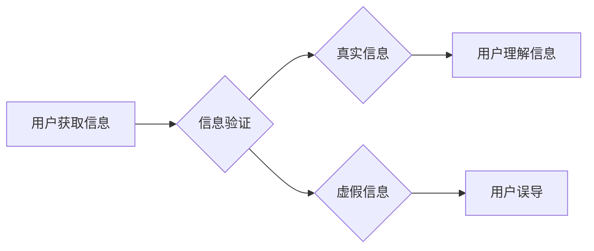

> 信息验证、批判性阅读、假新闻、媒体操纵、深度学习、自然语言处理、信息安全、网络安全、数据分析

## 1. 背景介绍

在信息爆炸的时代，我们每天都被海量的信息淹没。从社交媒体到新闻网站，从搜索引擎到电子邮件，信息无处不在。然而，这些信息并非都真实可靠。假新闻、谣言、误导性内容泛滥，严重影响着人们的判断力和决策能力，甚至引发社会动荡。

面对这种信息环境的挑战，我们迫切需要掌握信息验证和批判性阅读的技能，才能有效地辨别真假，避免被误导。

## 2. 核心概念与联系

**2.1 信息验证**

信息验证是指通过多种手段和方法，对信息的真实性、准确性和可靠性进行核实和评估的过程。

**2.2 媒体操纵**

媒体操纵是指利用媒体平台和传播手段，有意地传播虚假信息、误导公众舆论，达到特定目的的行为。

**2.3 算法与信息传播**

互联网平台的推荐算法和搜索引擎的排序机制，在很大程度上影响着我们获取信息的渠道和内容。这些算法往往基于用户的历史行为和偏好，可能导致我们陷入“信息茧房”，只接触到符合我们已有观点的信息，从而加剧信息偏差和认知分化。

**2.4 关键技术：深度学习与自然语言处理**

深度学习和自然语言处理（NLP）技术在信息验证和媒体操纵检测方面发挥着越来越重要的作用。

* **深度学习**可以用于识别和分类不同类型的虚假信息，例如谣言、假新闻、恶意评论等。
* **自然语言处理**可以用于分析文本内容，识别情感倾向、识别潜在的操纵手法，以及追踪信息的传播路径。

**Mermaid 流程图**



## 3. 核心算法原理 & 具体操作步骤

### 3.1 算法原理概述

信息验证算法通常基于以下几个核心原理：

* **文本特征提取**: 从文本中提取关键词、语法结构、情感倾向等特征，用于描述文本内容和识别潜在的异常信息。
* **知识图谱**: 利用知识图谱中的结构化知识，对文本信息进行关联分析，识别虚假信息和逻辑矛盾。
* **机器学习**: 利用机器学习模型，训练识别不同类型虚假信息的分类器，例如谣言检测、假新闻识别等。
* **社会网络分析**: 分析信息传播路径和传播者关系，识别信息源和潜在的操纵者。

### 3.2 算法步骤详解

1. **数据收集**: 收集大量真实和虚假信息的文本数据，作为算法训练和测试的数据集。
2. **数据预处理**: 对文本数据进行清洗、格式化、分词等预处理操作，以便于后续算法的训练和应用。
3. **特征提取**: 利用自然语言处理技术，从文本数据中提取关键词、语法结构、情感倾向等特征。
4. **模型训练**: 利用机器学习算法，训练识别不同类型虚假信息的分类器。
5. **模型评估**: 利用测试数据集评估模型的性能，例如准确率、召回率、F1-score等。
6. **模型部署**: 将训练好的模型部署到实际应用场景中，例如信息验证平台、社交媒体平台等。

### 3.3 算法优缺点

**优点**:

* 自动化信息验证，提高效率和准确性。
* 能够识别多种类型的虚假信息，例如谣言、假新闻、恶意评论等。
* 可以帮助用户识别潜在的媒体操纵和信息偏差。

**缺点**:

* 算法需要大量的数据进行训练，数据质量直接影响算法性能。
* 算法可能存在偏差和误判，需要不断改进和完善。
* 算法无法解决所有信息验证问题，例如识别隐性操纵和情感操控等。

### 3.4 算法应用领域

* **新闻媒体**: 验证新闻真实性，识别假新闻和谣言。
* **社交媒体**: 识别恶意评论、网络暴力和虚假信息传播。
* **搜索引擎**: 排序搜索结果，提高用户获取真实信息的效率。
* **教育领域**: 帮助学生提高批判性阅读能力，识别虚假信息。
* **政府机构**: 监测网络舆情，识别潜在的威胁和风险。

## 4. 数学模型和公式 & 详细讲解 & 举例说明

### 4.1 数学模型构建

信息验证算法通常基于概率模型，例如贝叶斯网络、隐马尔可夫模型等。这些模型可以用来计算文本信息真实性的概率，并根据概率阈值进行判断。

**贝叶斯网络**

贝叶斯网络是一种概率图模型，可以表示变量之间的依赖关系。在信息验证中，可以构建一个贝叶斯网络，其中节点代表文本特征、知识图谱信息、传播路径等，边表示变量之间的依赖关系。

**举例说明**:

假设我们想要判断一篇新闻文章的真实性。我们可以构建一个贝叶斯网络，其中节点包括：

* **关键词**: 文章中出现的关键词
* **语法结构**: 文章的语法结构是否规范
* **情感倾向**: 文章的情感倾向是否偏激
* **知识图谱**: 文章中提到的实体是否在知识图谱中存在
* **传播路径**: 文章的传播路径是否可信

这些节点之间的依赖关系可以根据专家知识和数据分析进行设定。例如，如果文章中出现大量负面关键词，并且语法结构不规范，那么文章的真实性概率会降低。

### 4.2 公式推导过程

贝叶斯定理是贝叶斯网络的核心公式，用于计算条件概率。

$$P(A|B) = \frac{P(B|A)P(A)}{P(B)}$$

其中：

* $P(A|B)$ 是事件 A 在事件 B 发生的条件概率。
* $P(B|A)$ 是事件 B 在事件 A 发生的条件概率。
* $P(A)$ 是事件 A 的概率。
* $P(B)$ 是事件 B 的概率。

在信息验证中，我们可以利用贝叶斯定理计算文本信息真实性的概率。

### 4.3 案例分析与讲解

假设我们有一个文本信息，其关键词为“疫苗安全”，语法结构规范，情感倾向中性，知识图谱中存在相关实体，传播路径可信。

根据贝叶斯网络的结构和专家知识，我们可以设定以下概率：

* $P(\text{真实信息}|\text{关键词}=\text{疫苗安全}) = 0.8$
* $P(\text{真实信息}|\text{语法结构规范}) = 0.9$
* $P(\text{真实信息}|\text{情感倾向中性}) = 0.7$
* $P(\text{真实信息}|\text{知识图谱存在相关实体}) = 0.9$
* $P(\text{真实信息}|\text{传播路径可信}) = 0.8$

利用贝叶斯定理，我们可以计算该文本信息的真实性概率。

## 5. 项目实践：代码实例和详细解释说明

### 5.1 开发环境搭建

* **操作系统**: Ubuntu 20.04 LTS
* **编程语言**: Python 3.8
* **深度学习框架**: TensorFlow 2.0
* **自然语言处理库**: NLTK, spaCy

### 5.2 源代码详细实现

```python
import tensorflow as tf
from tensorflow.keras.models import Sequential
from tensorflow.keras.layers import Embedding, LSTM, Dense

# 数据加载和预处理
# ...

# 模型构建
model = Sequential()
model.add(Embedding(input_dim=vocab_size, output_dim=embedding_dim, input_length=max_length))
model.add(LSTM(units=128))
model.add(Dense(units=1, activation='sigmoid'))

# 模型编译
model.compile(optimizer='adam', loss='binary_crossentropy', metrics=['accuracy'])

# 模型训练
model.fit(x_train, y_train, epochs=10, batch_size=32)

# 模型评估
loss, accuracy = model.evaluate(x_test, y_test)
print('Test Loss:', loss)
print('Test Accuracy:', accuracy)

# 模型预测
predictions = model.predict(x_new)
```

### 5.3 代码解读与分析

* **数据加载和预处理**: 首先需要加载和预处理文本数据，例如分词、词向量化等。
* **模型构建**: 使用深度学习框架构建一个LSTM模型，用于识别虚假信息。
* **模型编译**: 配置模型的优化器、损失函数和评价指标。
* **模型训练**: 使用训练数据训练模型，并根据评价指标调整模型参数。
* **模型评估**: 使用测试数据评估模型的性能。
* **模型预测**: 使用训练好的模型对新的文本数据进行预测。

### 5.4 运行结果展示

训练完成后，可以查看模型的训练损失和准确率，以及对测试数据的预测结果。

## 6. 实际应用场景

### 6.1 新闻媒体

* **假新闻检测**: 利用信息验证算法识别和标记假新闻，帮助用户辨别真实信息。
* **新闻内容审核**: 对新闻稿件进行自动审核，识别潜在的误导性内容和违规信息。
* **舆情监测**: 监测新闻媒体的报道内容，识别潜在的舆情风险和热点话题。

### 6.2 社交媒体

* **恶意评论识别**: 识别网络暴力、仇恨言论和虚假信息传播。
* **账号安全**: 检测账号异常行为，防止账号被盗用和恶意操控。
* **信息传播分析**: 分析信息传播路径和传播者关系，识别信息源和潜在的操纵者。

### 6.3 搜索引擎

* **搜索结果排序**: 根据信息真实性和可靠性，对搜索结果进行排序，提高用户获取真实信息的效率。
* **虚假信息过滤**: 过滤搜索结果中的虚假信息，防止用户误信。
* **相关性推荐**: 基于用户搜索历史和偏好，推荐相关且真实的信息。

### 6.4 未来应用展望

* **个性化信息验证**: 根据用户的知识背景、兴趣爱好和价值观，提供个性化的信息验证服务。
* **跨语言信息验证**: 支持多语言信息验证，帮助用户理解来自不同语言环境的信息。
* **多模态信息验证**: 将文本、图像、音频等多模态信息融合，提高信息验证的准确性和可靠性。

## 7. 工具和资源推荐

### 7.1 学习资源推荐

* **书籍**:
    * 《信息论基础》
    * 《机器学习》
    * 《深度学习》
* **在线课程**:
    * Coursera: 深度学习
    * edX: 机器学习
    * Udacity: 自然语言处理

### 7.2 开发工具推荐

* **深度学习框架**: TensorFlow, PyTorch
* **自然语言处理库**: NLTK, spaCy, Gensim
* **数据可视化工具**: Matplotlib, Seaborn

### 7.3 相关论文推荐

* **BERT**: Devlin, J., Chang, M. W., Lee, K., & Toutanova, K. (2018). BERT: Pre-training of deep bidirectional transformers for language understanding. arXiv preprint arXiv:1810.04805.
* **GPT-3**: Brown, T. B., Mann, B., Ryder, N., Subbiah, M., Kaplan, J., Dhariwal, P., ... & Amodei, D. (2020). Language models are few-shot learners. arXiv preprint arXiv:2005.14165.
* **FactCheck.org**: https://www.factcheck.org/

## 8. 总结：未来发展趋势与挑战

### 8.1 研究成果总结

信息验证