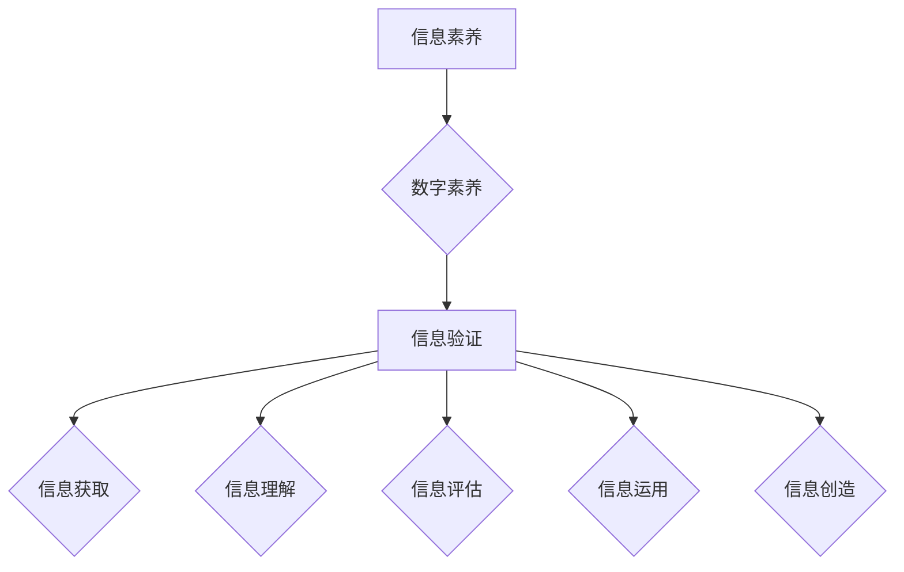

> 信息验证，数字素养，信息素养教育，人工智能，深度学习，网络安全

## 1. 背景介绍

信息时代，海量信息涌现，信息爆炸成为常态。网络平台、社交媒体、搜索引擎等为获取信息提供了便捷通道，但也带来了信息真伪难辨、谣言传播迅速等挑战。如何有效辨别信息真伪，培养学生批判性思维和信息处理能力，成为教育界和社会各界的共识。

数字素养教育应运而生，旨在培养学生在数字环境中获取、评估、创造和分享信息的能力。其中，信息验证作为数字素养的核心要素，尤为重要。信息验证是指通过多种手段和方法，对信息的来源、内容、时间、作者等进行核实，判断其真实性和可靠性。

## 2. 核心概念与联系

**2.1 信息素养**

信息素养是指在信息时代，能够有效地获取、理解、评估、运用和创造信息的能力。它涵盖了以下几个方面：

* **信息获取**: 能够利用各种途径和工具获取所需信息。
* **信息理解**: 能够理解信息的含义、结构和逻辑关系。
* **信息评估**: 能够判断信息的真实性、可靠性和价值。
* **信息运用**: 能够将信息应用于解决问题、做出决策和进行创造。
* **信息创造**: 能够生成新的信息，并以有效的方式进行表达和传播。

**2.2 数字素养**

数字素养是指在数字环境中生存、学习、工作和参与社会所需的知识、技能和态度。它包括以下几个方面：

* **信息技术应用**: 能够熟练使用各种信息技术工具和软件。
* **数字内容创作**: 能够创作和分享数字内容，例如文本、图像、音频和视频。
* **网络安全**: 能够识别和应对网络安全威胁，保护个人信息和隐私。
* **数字公民**: 能够在数字环境中负责任地参与社会活动，尊重他人权利和利益。

**2.3 信息验证**

信息验证是数字素养的重要组成部分，它指通过多种手段和方法，对信息的来源、内容、时间、作者等进行核实，判断其真实性和可靠性。

**2.4 核心概念联系**

信息素养、数字素养和信息验证相互关联，共同构成了信息时代公民所需的综合能力。信息素养是基础，数字素养是工具，信息验证是关键。只有掌握了信息验证的能力，才能有效地利用数字工具和信息资源，做出明智的判断和决策。



## 3. 核心算法原理 & 具体操作步骤

**3.1 算法原理概述**

信息验证算法通常基于以下几个核心原理：

* **来源验证**: 通过核实信息的来源，判断其可信度。
* **内容验证**: 通过分析信息的结构、逻辑和语义，判断其真实性。
* **时间验证**: 通过核实信息的发布时间，判断其时效性。
* **作者验证**: 通过核实信息的作者身份，判断其专业性和立场。

**3.2 算法步骤详解**

信息验证算法的具体步骤可以分为以下几个阶段：

1. **信息收集**: 收集待验证信息的各种要素，例如来源、内容、时间、作者等。
2. **来源分析**: 分析信息的来源，判断其可信度。可以利用搜索引擎、数据库、权威机构等资源进行交叉验证。
3. **内容分析**: 分析信息的结构、逻辑和语义，判断其真实性。可以利用自然语言处理、机器学习等技术进行分析。
4. **时间分析**: 分析信息的发布时间，判断其时效性。可以利用时间戳、历史记录等信息进行验证。
5. **作者分析**: 分析信息的作者身份，判断其专业性和立场。可以利用作者信息、作品背景等信息进行验证。
6. **综合判断**: 根据以上分析结果，综合判断信息的真实性和可靠性。

**3.3 算法优缺点**

信息验证算法的优点：

* **自动化**: 可以自动化地进行信息验证，提高效率。
* **客观性**: 可以减少人为主观判断的影响，提高验证结果的客观性。
* **可扩展性**: 可以根据需要扩展算法功能，适应不同的信息验证需求。

信息验证算法的缺点：

* **数据依赖性**: 算法的准确性依赖于数据的质量和完整性。
* **算法局限性**: 算法无法识别所有类型的虚假信息，例如巧妙伪造的信息。
* **伦理问题**: 信息验证算法的应用可能引发一些伦理问题，例如隐私保护和信息自由。

**3.4 算法应用领域**

信息验证算法在以下领域有广泛的应用：

* **新闻媒体**: 验证新闻信息的真实性，防止谣言传播。
* **社交媒体**: 识别和过滤虚假信息，维护平台的健康生态。
* **电商平台**: 验证商品信息的真实性，保护消费者权益。
* **金融领域**: 验证金融交易信息，防止欺诈行为。
* **教育领域**: 验证学习资源的可靠性，提高学习质量。

## 4. 数学模型和公式 & 详细讲解 & 举例说明

**4.1 数学模型构建**

信息验证算法可以利用数学模型来量化信息的真实性和可靠性。例如，可以构建一个基于贝叶斯定理的信息验证模型，将信息的来源、内容、时间、作者等因素作为输入，输出信息的真实性概率。

**4.2 公式推导过程**

假设我们有一个信息 $I$，其真实性概率为 $P(I)$。我们根据信息的来源 $S$、内容 $C$、时间 $T$ 和作者 $A$ 进行验证，可以得到以下公式：

$$P(I|S,C,T,A) = \frac{P(S,C,T,A|I)P(I)}{P(S,C,T,A)}$$

其中：

* $P(I|S,C,T,A)$ 是信息 $I$ 真实性概率，给定来源 $S$、内容 $C$、时间 $T$ 和作者 $A$ 的条件下。
* $P(S,C,T,A|I)$ 是给定信息 $I$ 真实的情况下，来源 $S$、内容 $C$、时间 $T$ 和作者 $A$ 出现的概率。
* $P(I)$ 是信息 $I$ 真实性概率的先验概率。
* $P(S,C,T,A)$ 是来源 $S$、内容 $C$、时间 $T$ 和作者 $A$ 出现的概率。

**4.3 案例分析与讲解**

例如，我们有一个新闻报道，其来源是知名新闻机构，内容经过事实核查，时间是最近一周，作者是资深记者。我们可以根据以上信息，利用贝叶斯定理计算该新闻报道的真实性概率。

## 5. 项目实践：代码实例和详细解释说明

**5.1 开发环境搭建**

为了实现信息验证算法，我们可以使用 Python 语言和相关的库进行开发。开发环境搭建步骤如下：

1. 安装 Python 语言环境。
2. 安装必要的库，例如 NLTK、spaCy、scikit-learn 等。

**5.2 源代码详细实现**

```python
import nltk
from nltk.corpus import stopwords
from sklearn.feature_extraction.text import TfidfVectorizer

# 下载 NLTK 数据集
nltk.download('stopwords')
nltk.download('punkt')

# 定义信息验证函数
def verify_information(text):
    # 1. 来源分析
    # ...

    # 2. 内容分析
    stop_words = set(stopwords.words('english'))
    tokens = nltk.word_tokenize(text)
    filtered_tokens = [word for word in tokens if word.lower() not in stop_words]
    vectorizer = TfidfVectorizer()
    tfidf_matrix = vectorizer.fit_transform(filtered_tokens)

    # 3. 时间分析
    # ...

    # 4. 作者分析
    # ...

    # 5. 综合判断
    # ...

    return verdict

# 示例使用
text = "This is a news article from a reputable source."
verdict = verify_information(text)
print(f"Information verdict: {verdict}")
```

**5.3 代码解读与分析**

以上代码示例展示了信息验证算法的基本流程。其中，内容分析部分利用 TF-IDF 向量化技术对文本进行特征提取，可以用于判断文本的主题和语义。

**5.4 运行结果展示**

运行以上代码，可以得到信息验证的结果，例如 "Information verdict: True" 或 "Information verdict: False"。

## 6. 实际应用场景

**6.1 新闻媒体**

新闻媒体可以利用信息验证算法来识别和过滤虚假新闻，维护新闻的真实性和可信度。例如，可以对新闻来源进行核实，分析新闻内容的逻辑性和语义，识别常见的虚假新闻手法。

**6.2 社交媒体**

社交媒体平台可以利用信息验证算法来识别和过滤虚假信息，维护平台的健康生态。例如，可以对用户发布的内容进行审核，识别恶意传播的虚假信息，并采取相应的措施。

**6.3 教育领域**

教育领域可以利用信息验证算法来帮助学生辨别信息真伪，培养学生的批判性思维和信息处理能力。例如，可以开发信息验证相关的教学资源，引导学生学习信息验证方法，并进行实践练习。

**6.4 未来应用展望**

随着人工智能技术的不断发展，信息验证算法将更加智能化、自动化和精准化。未来，信息验证算法将应用于更广泛的领域，例如医疗、金融、法律等，为人们提供更加可靠的信息服务。

## 7. 工具和资源推荐

**7.1 学习资源推荐**

* **书籍**:
    * 《信息素养：数字时代公民的必备技能》
    * 《网络安全与隐私保护》
* **在线课程**:
    * Coursera: Information Literacy
    * edX: Cybersecurity Fundamentals

**7.2 开发工具推荐**

* **Python**: 
    * NLTK
    * spaCy
    * scikit-learn
* **其他工具**:
    * Google Fact Check Explorer
    * Snopes

**7.3 相关论文推荐**

* **信息验证算法**:
    * "A Survey of Information Verification Techniques"
    * "Deep Learning for Fake News Detection"
* **数字素养教育**:
    * "Developing Information Literacy in the Digital Age"
    * "The Role of Information Literacy in the 21st Century"

## 8. 总结：未来发展趋势与挑战

**8.1 研究成果总结**

信息验证算法在信息时代发挥着越来越重要的作用，已经取得了一定的研究成果。例如，基于深度学习的信息验证算法能够识别更加复杂的虚假信息，提高了信息验证的准确性。

**8.2 未来发展趋势**

未来，信息验证算法将朝着以下几个方向发展：

* **更加智能化**: 利用人工智能技术，开发更加智能化的信息验证算法，能够自动识别和过滤虚假信息。
* **更加个性化**: 根据用户的需求和偏好，提供更加个性化的信息验证服务。
* **更加协同化**: 建立信息验证的协同平台，让用户共同参与信息验证，提高信息验证的效率和准确性。

**8.3 面临的挑战**

信息验证算法也面临着一些挑战：

* **虚假信息不断演变**: 虚假信息制造者不断采用新的手法，挑战信息验证算法的识别能力。
* **数据质量问题**: 信息验证算法的准确性依赖于数据的质量和完整性，而真实可靠的数据往往难以获取。
* **伦理问题**: 信息验证算法的应用可能引发一些伦理问题，例如隐私