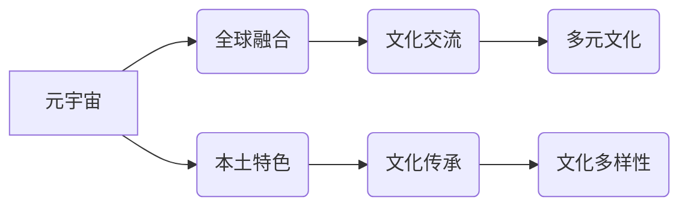

> 元宇宙、文化多样性、全球融合、本土特色、虚拟现实、增强现实、数字身份、跨文化交流、虚拟社区

## 1. 背景介绍

元宇宙的概念近年来备受关注，它被描绘成一个沉浸式、互联、持久虚拟世界，与现实世界紧密相连。在这个虚拟世界中，人们可以创建数字身份，参与各种活动，体验不同的文化和生活方式。然而，元宇宙的构建和发展也面临着诸多挑战，其中之一便是如何兼顾全球融合与本土特色，实现文化多样性的包容与尊重。

传统互联网时代，文化传播主要依靠文字、图片和视频等静态内容，信息流动相对单向。而元宇宙则通过虚拟现实 (VR) 和增强现实 (AR) 技术，构建更加沉浸式和交互式的体验，使得文化传播更加丰富和多元。

## 2. 核心概念与联系

**2.1 元宇宙**

元宇宙是一个由虚拟现实、增强现实、区块链、人工智能等技术融合而成的虚拟世界，它具有以下核心特征：

* **沉浸式体验:** 通过 VR 和 AR 技术，用户可以身临其境地体验虚拟世界。
* **互联性:** 元宇宙是一个开放、互联的网络世界，用户可以自由地与其他用户和虚拟实体交互。
* **持久性:** 元宇宙是一个持续存在的虚拟世界，即使用户离开，虚拟世界也会继续运行。
* **去中心化:** 元宇宙的治理和运营由用户共同参与，而不是由单一机构控制。

**2.2 文化多样性**

文化多样性是指人类社会中不同文化群体之间的差异和丰富性。它包括语言、宗教、习俗、价值观、艺术形式等各个方面。

**2.3 全球融合与本土特色**

在元宇宙中，全球融合是指不同文化群体之间能够更加紧密地联系和交流，共享文化资源和知识。而本土特色是指每个文化群体能够在元宇宙中保留和传承自己的文化传统和价值观。

**2.4 核心概念关系图**



## 3. 核心算法原理 & 具体操作步骤

**3.1 算法原理概述**

元宇宙中实现文化多样性的核心算法主要包括：

* **内容推荐算法:** 根据用户的文化偏好和兴趣，推荐相关的虚拟内容和活动。
* **语言翻译算法:** 帮助不同语言的用户进行交流和理解。
* **虚拟身份定制算法:** 允许用户创建个性化的虚拟身份，并表达自己的文化背景和价值观。
* **虚拟社区构建算法:** 促进不同文化群体之间形成虚拟社区，进行交流和合作。

**3.2 算法步骤详解**

以内容推荐算法为例，其具体操作步骤如下：

1. **用户数据收集:** 收集用户的文化偏好、兴趣爱好、浏览历史、参与活动等数据。
2. **数据分析:** 利用机器学习算法对用户数据进行分析，构建用户画像和文化兴趣模型。
3. **内容匹配:** 根据用户的文化兴趣模型，匹配相关的虚拟内容和活动。
4. **推荐排序:** 利用推荐算法对匹配的内容进行排序，并根据用户的历史行为和反馈进行调整。
5. **内容推送:** 将推荐的内容推送给用户，并提供个性化的交互体验。

**3.3 算法优缺点**

* **优点:** 可以根据用户的文化偏好提供个性化的内容推荐，促进文化交流和理解。
* **缺点:** 算法可能会存在偏差，导致推荐内容不够全面和客观。

**3.4 算法应用领域**

* **文化旅游:** 推荐相关的虚拟旅游景点和文化体验活动。
* **教育培训:** 提供个性化的文化学习资源和互动课程。
* **社交娱乐:** 建立跨文化交流的虚拟社区和游戏平台。

## 4. 数学模型和公式 & 详细讲解 & 举例说明

**4.1 数学模型构建**

我们可以使用一个简单的数学模型来表示用户对不同文化内容的偏好程度。假设用户对 $n$ 种文化内容的偏好程度分别为 $p_1, p_2, ..., p_n$，其中 $0 \le p_i \le 1$，则用户对所有文化内容的总偏好度为：

$$P = \sum_{i=1}^{n} p_i$$

**4.2 公式推导过程**

我们可以根据用户的浏览历史、参与活动等数据，利用机器学习算法来估计每个文化内容的偏好度 $p_i$。例如，我们可以使用以下公式来计算用户对某个文化内容 $i$ 的偏好度：

$$p_i = \frac{f_i}{F}$$

其中，$f_i$ 表示用户对文化内容 $i$ 的交互次数，$F$ 表示用户总的交互次数。

**4.3 案例分析与讲解**

假设用户对三种文化内容的交互次数分别为 10, 5, 15，总的交互次数为 30，则用户对这三种文化内容的偏好度分别为：

* $p_1 = \frac{10}{30} = 0.33$
* $p_2 = \frac{5}{30} = 0.17$
* $p_3 = \frac{15}{30} = 0.50$

由此可见，用户对第三种文化内容的偏好度最高。

## 5. 项目实践：代码实例和详细解释说明

**5.1 开发环境搭建**

* 操作系统: Ubuntu 20.04
* 编程语言: Python 3.8
* 开发框架: Flask
* 数据库: MongoDB

**5.2 源代码详细实现**

```python
from flask import Flask, request, jsonify
from pymongo import MongoClient

app = Flask(__name__)

# 连接数据库
client = MongoClient('mongodb://localhost:27017/')
db = client['metaverse']
users = db['users']

@app.route('/recommend', methods=['POST'])
def recommend():
    data = request.get_json()
    user_id = data['user_id']
    user = users.find_one({'id': user_id})
    if user:
        # 根据用户偏好推荐内容
        # ...
        return jsonify({'recommendations': recommendations})
    else:
        return jsonify({'error': 'User not found'}), 404

if __name__ == '__main__':
    app.run(debug=True)
```

**5.3 代码解读与分析**

* 该代码实现了一个简单的 Flask 应用程序，用于根据用户的文化偏好推荐虚拟内容。
* 应用程序连接到 MongoDB 数据库，存储用户数据。
* `/recommend` 路由接收用户请求，并根据用户 ID 查询用户数据。
* 应用程序使用用户数据和推荐算法来生成推荐内容列表。
* 最后，应用程序返回推荐内容列表作为 JSON 格式的响应。

**5.4 运行结果展示**

当用户发送 POST 请求到 `/recommend` 路由时，应用程序会返回一个 JSON 格式的响应，包含推荐内容列表。

## 6. 实际应用场景

**6.1 文化旅游**

元宇宙可以为用户提供沉浸式的虚拟旅游体验，例如参观世界各地的博物馆、古迹和自然景观。通过文化内容推荐算法，用户可以根据自己的兴趣爱好，选择体验不同的文化场景和活动。

**6.2 教育培训**

元宇宙可以为用户提供个性化的文化学习资源和互动课程。例如，用户可以虚拟参观不同国家的学校，体验当地的教育方式和文化氛围。

**6.3 社交娱乐**

元宇宙可以为用户提供跨文化交流的虚拟社区和游戏平台。用户可以与来自不同国家的玩家互动，共同体验不同的文化活动和游戏内容。

**6.4 未来应用展望**

随着元宇宙技术的不断发展，其在文化多样性方面的应用场景将会更加丰富和广泛。例如，未来我们可以看到：

* 基于虚拟现实技术的沉浸式文化体验平台。
* 基于人工智能技术的个性化文化学习和推荐系统。
* 基于区块链技术的去中心化文化内容创作和分享平台。

## 7. 工具和资源推荐

**7.1 学习资源推荐**

* **书籍:**
    * 《元宇宙：虚拟世界与现实的融合》
    * 《元宇宙：未来世界的构建》
* **在线课程:**
    * Coursera: 元宇宙与虚拟现实
    * edX: 元宇宙技术与应用

**7.2 开发工具推荐**

* **Unity:** 游戏引擎，用于开发元宇宙应用。
* **Unreal Engine:** 游戏引擎，用于开发元宇宙应用。
* **Blender:** 3D 建模软件，用于创建元宇宙场景和资产。

**7.3 相关论文推荐**

* 《元宇宙：概念、技术和挑战》
* 《元宇宙中的文化多样性》

## 8. 总结：未来发展趋势与挑战

**8.1 研究成果总结**

元宇宙技术的发展为文化多样性的实现提供了新的可能性。通过虚拟现实、增强现实、人工智能等技术的融合，我们可以构建更加沉浸式、交互式和个性化的文化体验平台。

**8.2 未来发展趋势**

* **技术进步:** 元宇宙技术的不断发展将带来更加逼真的虚拟体验、更强大的交互能力和更智能的推荐算法。
* **内容丰富:** 元宇宙平台将提供更加丰富的文化内容，包括虚拟博物馆、历史遗址、艺术展览、音乐会等。
* **社区建设:** 元宇宙将促进不同文化群体之间的交流和合作，构建更加多元和包容的虚拟社区。

**8.3 面临的挑战**

* **技术瓶颈:** 元宇宙技术的实现仍然面临着诸多技术挑战，例如虚拟现实设备的成本、网络带宽的限制和人工智能算法的精度。
* **文化冲突:** 元宇宙中不同文化群体的虚拟互动可能会引发文化冲突，需要制定相应的规则和机制来避免和解决冲突。
* **数据安全:** 元宇宙平台收集和处理大量用户数据，需要加强数据安全保护，防止数据泄露和滥用。

**8.4 研究展望**

未来，我们需要继续深入研究元宇宙技术与文化多样性的关系，探索元宇宙如何更好地促进文化交流、传承文化遗产和构建更加包容的虚拟世界。


## 9. 附录：常见问题与解答

**9.1 如何在元宇宙中体验不同的文化？**

您可以通过以下方式体验不同的文化：

* **虚拟旅游:** 参观世界各地的虚拟博物馆、古迹和自然景观。
* **文化活动:** 参加虚拟音乐会、戏剧表演、舞蹈演出等文化活动。
* **虚拟社区:** 加入来自不同国家的虚拟社区，与其他用户交流和互动。

**9.2 元宇宙会取代现实世界吗？**

元宇宙不会取代现实世界，而是作为现实世界的补充和延伸。它提供了一种新的方式来体验世界、学习知识和与他人互动。

**9.3 元宇宙对文化多样性有什么影响？**

元宇宙可以促进文化多样性的实现，通过虚拟体验和互动，帮助人们更好地了解和欣赏不同的文化。

**9.4 元宇宙的未来发展趋势是什么？**

元宇宙的未来发展趋势是更加沉浸式、交互式和个性化。随着技术的进步，元宇宙将提供更加丰富的文化内容和更智能的体验。


作者：禅与计算机程序设计艺术 / Zen and the Art of Computer Programming 
<end_of_turn>