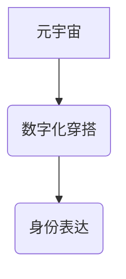

> 元宇宙、时尚、数字化穿搭、身份表达、虚拟服装、NFT、区块链、3D建模、人工智能

## 1. 背景介绍

随着科技的飞速发展，元宇宙概念逐渐从科幻小说走向现实。元宇宙被定义为一个由虚拟现实、增强现实和互联网连接而成的沉浸式数字世界，它将改变我们生活、工作和娱乐的方式。在这个虚拟世界中，人们可以创建虚拟形象，参与各种活动，并与他人互动。其中，时尚作为一种重要的文化表达方式，也将在元宇宙中得到全新的演绎。

数字化穿搭，即在虚拟世界中穿戴虚拟服装，成为元宇宙时尚的重要组成部分。它不仅可以满足人们对个性化表达的需求，还可以为时尚产业带来新的机遇和挑战。

## 2. 核心概念与联系

**2.1 元宇宙**

元宇宙是一个由虚拟现实、增强现实和互联网连接而成的沉浸式数字世界。它具有以下核心特征：

* **沉浸感:** 通过VR/AR技术，用户可以身临其境地体验虚拟世界。
* **持久性:** 元宇宙是一个持续运行的虚拟世界，即使用户离开，世界也会继续存在。
* **互操作性:** 不同平台和应用程序之间可以互联互通，用户可以自由地迁移数据和资产。
* **经济系统:** 元宇宙拥有自己的经济体系，用户可以通过虚拟货币进行交易。

**2.2 数字化穿搭**

数字化穿搭是指在虚拟世界中穿戴虚拟服装。它可以是3D模型、纹理贴图或其他形式的数字资产。

**2.3 身份表达**

服装一直是人类表达身份和个性的重要方式。在元宇宙中，数字化穿搭可以更加自由和个性化，成为用户在虚拟世界中塑造自我形象的重要工具。

**2.4 核心概念关系图**



## 3. 核心算法原理 & 具体操作步骤

**3.1 算法原理概述**

数字化穿搭的核心算法主要涉及以下几个方面：

* **3D建模:** 创建虚拟服装的3D模型。
* **纹理贴图:** 为虚拟服装添加材质和纹理。
* **动画效果:** 为虚拟服装添加动画效果，例如飘动、变化等。
* **虚拟试衣:** 允许用户在虚拟环境中试穿虚拟服装。

**3.2 算法步骤详解**

1. **3D建模:** 使用3D建模软件，例如Blender、Maya等，创建虚拟服装的3D模型。
2. **纹理贴图:** 使用图像编辑软件，例如Photoshop、GIMP等，为虚拟服装添加材质和纹理。
3. **动画效果:** 使用动画软件，例如After Effects、Cinema 4D等，为虚拟服装添加动画效果。
4. **虚拟试衣:** 开发虚拟试衣应用程序，允许用户上传自己的虚拟形象，并试穿虚拟服装。

**3.3 算法优缺点**

* **优点:**

    * 个性化定制: 用户可以根据自己的喜好定制虚拟服装。
    * 低成本: 相比于实体服装，虚拟服装的生产成本更低。
    * 可持续发展: 虚拟服装不会产生浪费，更环保。

* **缺点:**

    * 技术门槛: 3D建模、纹理贴图等技术需要一定的专业知识。
    * 体验感: 目前虚拟试衣的体验感还不如实体试衣。

**3.4 算法应用领域**

* **游戏:** 游戏角色的服装定制。
* **社交平台:** 用户在虚拟世界中创建个性化形象。
* **电商:** 在线虚拟试衣，提升购物体验。
* **时尚设计:** 设计师可以利用虚拟服装进行创意展示。

## 4. 数学模型和公式 & 详细讲解 & 举例说明

**4.1 数学模型构建**

虚拟服装的数字化表达可以抽象为一个多维向量空间。每个维度代表服装的某个属性，例如颜色、材质、款式等。

**4.2 公式推导过程**

假设虚拟服装的属性有三个维度：颜色、材质、款式。每个维度可以取多个值，例如颜色可以是红色、蓝色、绿色等。我们可以用一个三维向量来表示虚拟服装：

```latex
f = (c, m, k)
```

其中：

* $c$ 代表服装的颜色。
* $m$ 代表服装的材质。
* $k$ 代表服装的款式。

**4.3 案例分析与讲解**

例如，一条红色的丝绸连衣裙可以表示为以下向量：

```latex
f = (红色, 丝绸, 连衣裙)
```

**4.4 举例说明**

我们可以使用距离公式来计算两个虚拟服装之间的相似度。

```latex
distance(f1, f2) = sqrt((c1 - c2)^2 + (m1 - m2)^2 + (k1 - k2)^2)
```

其中：

* $f1$ 和 $f2$ 是两个虚拟服装的向量表示。
* $distance(f1, f2)$ 是两个虚拟服装之间的距离。

## 5. 项目实践：代码实例和详细解释说明

**5.1 开发环境搭建**

* 编程语言: Python
* 3D建模软件: Blender
* 虚拟试衣框架: A-Frame

**5.2 源代码详细实现**

```python
# 导入必要的库
import bpy
import json

# 导出3D模型为OBJ格式
bpy.ops.export_mesh.obj(filepath="dress.obj")

# 读取3D模型的属性信息
with open("dress.json", "r") as f:
    dress_data = json.load(f)

# 将3D模型加载到虚拟试衣框架中
# ...

# 允许用户上传自己的虚拟形象
# ...

# 允许用户试穿虚拟服装
# ...
```

**5.3 代码解读与分析**

* 首先，我们使用Python脚本导出Blender中的3D模型为OBJ格式。
* 然后，我们读取3D模型的属性信息，例如颜色、材质、款式等，并将其存储在JSON文件中。
* 最后，我们将3D模型加载到虚拟试衣框架中，并允许用户上传自己的虚拟形象和试穿虚拟服装。

**5.4 运行结果展示**

用户可以在虚拟试衣框架中看到自己的虚拟形象，并试穿不同的虚拟服装。

## 6. 实际应用场景

**6.1 游戏**

在游戏中，玩家可以购买或定制虚拟服装，为自己的角色增添个性和风格。

**6.2 社交平台**

在虚拟社交平台中，用户可以创建虚拟形象，并通过数字化穿搭来表达自己的身份和个性。

**6.3 电商**

电商平台可以利用虚拟试衣技术，为用户提供更便捷的购物体验。

**6.4 未来应用展望**

* **个性化定制:** 用户可以根据自己的喜好定制虚拟服装，甚至可以将自己的照片或艺术作品融入到服装设计中。
* **虚拟时尚秀:** 设计师可以利用虚拟现实技术，举办虚拟时尚秀，展示最新的服装设计。
* **虚拟服装租赁:** 用户可以租赁虚拟服装，体验不同的风格，无需购买昂贵的实体服装。

## 7. 工具和资源推荐

**7.1 学习资源推荐**

* **Blender官方文档:** https://docs.blender.org/
* **A-Frame官方文档:** https://aframe.io/docs/

**7.2 开发工具推荐**

* **Blender:** 3D建模软件
* **Maya:** 3D建模软件
* **Unity:** 游戏引擎
* **Unreal Engine:** 游戏引擎

**7.3 相关论文推荐**

* **Towards a Comprehensive Framework for Virtual Fashion:** https://arxiv.org/abs/2106.09034
* **Digital Fashion: A Review of Current Trends and Future Directions:** https://www.mdpi.com/2076-3417/11/1/10

## 8. 总结：未来发展趋势与挑战

**8.1 研究成果总结**

数字化穿搭技术在元宇宙中具有巨大的潜力，可以为时尚产业带来新的机遇和挑战。

**8.2 未来发展趋势**

* **更逼真的虚拟体验:** 随着VR/AR技术的进步，虚拟试衣的体验感将会更加逼真。
* **更个性化的定制:** 用户将能够更加个性化地定制虚拟服装，甚至可以将自己的创意融入到服装设计中。
* **虚拟服装的经济价值:** 虚拟服装将成为一种新的资产，可以进行交易和投资。

**8.3 面临的挑战**

* **技术门槛:** 3D建模、纹理贴图等技术需要一定的专业知识。
* **版权问题:** 虚拟服装的版权问题需要得到解决。
* **用户接受度:** 用户需要接受虚拟服装的概念和价值。

**8.4 研究展望**

未来，我们将继续研究数字化穿搭技术，探索其在元宇宙中的更多应用场景，并解决其面临的挑战。

## 9. 附录：常见问题与解答

**9.1 如何创建虚拟服装？**

可以使用3D建模软件，例如Blender、Maya等，创建虚拟服装的3D模型。

**9.2 如何将虚拟服装上传到元宇宙平台？**

不同的元宇宙平台有不同的上传方式，请参考平台的官方文档。

**9.3 虚拟服装的版权问题如何解决？**

虚拟服装的版权问题是一个复杂的问题，需要通过法律法规和行业规范来解决。

作者：禅与计算机程序设计艺术 / Zen and the Art of Computer Programming


<end_of_turn>