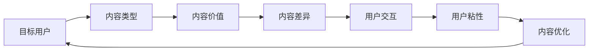

                 

# 知识付费创业中的内容定位策略

在知识付费如火如荼发展的今天，如何精准定位内容，打造具有竞争力的知识付费平台，成为创业者和从业者亟需解决的核心问题。本文将从内容定位策略的制定、内容体系构建、用户行为分析和市场趋势洞察等多个维度，探讨知识付费平台的内容定位策略，以期为读者提供有益的指导和启发。

## 1. 背景介绍

### 1.1 问题由来

随着互联网的普及和用户消费水平的提升，知识付费逐渐成为互联网行业的新蓝海。根据统计数据，全球知识付费市场规模预计将从2019年的17.2亿美元增长至2026年的50.7亿美元，年复合增长率（CAGR）为14.3%。知识付费行业的快速增长，带来了前所未有的商业机会，也使得内容定位成为平台成功的关键。

当前，知识付费平台数量繁多，但真正能够吸引用户、留住用户、实现变现的并不多。一方面，市场竞争激烈，内容同质化严重，用户难以分辨优劣；另一方面，用户需求多样，单一内容难以满足各类需求。因此，内容定位的精准性、差异化、个性化显得尤为重要。

### 1.2 问题核心关键点

内容定位策略的核心关键点包括以下几个方面：
1. **目标用户**：明确知识付费平台的定位，如行业、年龄、职业、兴趣等。
2. **内容类型**：确定内容的核心类别，如职业技能、生活经验、科普知识等。
3. **内容价值**：评估内容的实用性和市场价值，确保内容能够解决用户痛点。
4. **内容差异**：打造独特的内容特色，避免同质化竞争。
5. **用户交互**：设计互动性强的内容形式，提升用户粘性。

只有对上述关键点有清晰的理解和定位，才能构建起具有竞争力的知识付费平台。

## 2. 核心概念与联系

### 2.1 核心概念概述

在探讨知识付费平台的内容定位策略之前，首先需要明确几个核心概念：

- **知识付费平台**：以知识服务为核心的付费平台，为用户提供获取知识、提升技能、解决问题等价值。
- **内容定位**：确定平台的核心内容和用户需求，构建独特的内容体系，以满足用户的多样化需求。
- **内容差异化**：通过独特的知识体系、内容形式和用户体验，构建平台独特的品牌形象，增强市场竞争力。
- **用户粘性**：通过互动性强的内容设计，提升用户使用频率和忠诚度，增加用户生命周期价值。

这些核心概念之间相互联系，共同构成了知识付费平台的内容定位策略。

### 2.2 核心概念原理和架构的 Mermaid 流程图



这个流程图展示了从目标用户到内容优化之间的核心概念和它们之间的逻辑联系。

## 3. 核心算法原理 & 具体操作步骤

### 3.1 算法原理概述

知识付费平台的内容定位策略，本质上是一个多目标优化问题。目标函数通常包括用户满意度、内容覆盖率、平台收益等指标。核心算法包括目标用户分析、内容类型筛选、内容价值评估、内容差异化设计和用户行为分析。

通过构建多目标优化模型，可以根据用户的反馈和行为数据，不断调整和优化内容策略，确保平台的可持续发展。

### 3.2 算法步骤详解

#### 步骤1：目标用户分析

1. **用户画像**：通过问卷调查、用户行为数据分析等方式，构建用户画像，了解用户的年龄、性别、职业、兴趣、需求等特征。
2. **用户聚类**：使用聚类算法（如K-means、层次聚类等），将用户划分为不同的细分市场。
3. **用户分层**：根据用户行为、消费能力等因素，将用户分为高、中、低价值层级，以制定差异化内容策略。

#### 步骤2：内容类型筛选

1. **市场调研**：分析市场趋势，识别热门内容和空白领域，确定初步内容方向。
2. **内容筛选**：筛选符合平台定位的内容类型，如职业技能、生活经验、科普知识等。
3. **专家合作**：与行业专家、学者等合作，引入权威和高质量的内容。

#### 步骤3：内容价值评估

1. **内容实用性**：通过用户反馈、评论等数据，评估内容的实用性和用户满意度。
2. **内容市场价值**：分析内容的市场需求和竞争情况，确定内容的市场价值。
3. **内容匹配度**：评估内容与目标用户的匹配度，确保内容能够解决用户的痛点。

#### 步骤4：内容差异化设计

1. **内容特色**：设计独特的知识体系、内容形式和用户体验，打造平台独特的品牌形象。
2. **内容差异化**：通过内容原创性、深度和独特性，避免同质化竞争。
3. **内容创新**：引入新科技、新方法、新视角，持续创新内容形式和表达方式。

#### 步骤5：用户行为分析

1. **用户行为数据采集**：通过平台日志、用户反馈、评论等数据，采集用户行为信息。
2. **用户行为分析**：使用统计分析、机器学习等方法，分析用户行为特征和偏好。
3. **用户行为优化**：根据分析结果，优化内容推荐算法、互动设计等，提升用户粘性。

### 3.3 算法优缺点

#### 优点

1. **多目标优化**：通过多目标优化模型，综合考虑用户满意度、内容覆盖率、平台收益等指标，实现内容定位的科学性和全面性。
2. **数据驱动**：利用用户行为数据、市场调研等数据，实现内容定位的精准性和动态性。
3. **差异化策略**：通过内容差异化设计，打造平台独特的品牌形象，增强市场竞争力。

#### 缺点

1. **数据依赖**：依赖高质量的用户行为数据和市场调研数据，数据获取难度大，数据质量影响结果。
2. **模型复杂性**：多目标优化模型复杂，需要具备较强的数学和统计学背景。
3. **成本高**：平台初期投入较大，需要进行大量的数据分析和模型训练。

### 3.4 算法应用领域

知识付费平台的内容定位策略，适用于各类知识付费平台的搭建和优化，包括在线教育、职业培训、生活指导、科普知识等多个领域。通过精准的内容定位，可以提升平台的品牌影响力和用户粘性，实现可持续发展。

## 4. 数学模型和公式 & 详细讲解 & 举例说明

### 4.1 数学模型构建

假设知识付费平台的目标用户集为 $U=\{u_1, u_2, ..., u_n\}$，内容集为 $C=\{c_1, c_2, ..., c_m\}$，用户对内容 $c_i$ 的满意度为 $S_{u_i, c_i}$，内容的市场价值为 $V_{c_i}$，内容的匹配度为 $M_{u_i, c_i}$。内容定位的目标函数为：

$$
\min_{\theta} \sum_{i=1}^n \sum_{j=1}^m \omega_{u_i, c_j} (S_{u_i, c_j} - S_{u_i, c_j}(\theta))^2 + \alpha(V_{c_j} - V_{c_j}(\theta))^2 + \beta(M_{u_i, c_j} - M_{u_i, c_j}(\theta))^2
$$

其中 $\omega_{u_i, c_j}$ 为各指标的权重系数，$\theta$ 为决策变量，包括内容的类型、价值和匹配度等。

### 4.2 公式推导过程

为了简化模型，假设 $S_{u_i, c_j} = f_{u_i, c_j}(\theta)$，$V_{c_j} = g_{c_j}(\theta)$，$M_{u_i, c_j} = h_{u_i, c_j}(\theta)$，其中 $f$、$g$、$h$ 为非线性函数。目标函数可进一步简化为：

$$
\min_{\theta} \sum_{i=1}^n \sum_{j=1}^m \omega_{u_i, c_j} (f_{u_i, c_j}(\theta) - f_{u_i, c_j}^{\text{ideal}})^2 + \alpha(g_{c_j}(\theta) - g_{c_j}^{\text{ideal}})^2 + \beta(h_{u_i, c_j}(\theta) - h_{u_i, c_j}^{\text{ideal}})^2
$$

其中 $f_{u_i, c_j}^{\text{ideal}}$、$g_{c_j}^{\text{ideal}}$、$h_{u_i, c_j}^{\text{ideal}}$ 为理想值。

### 4.3 案例分析与讲解

以在线教育平台为例，内容定位的目标函数可以细化为：

- **用户满意度**：包括课程评价、学习反馈、用户留存率等。
- **市场价值**：包括课程销量、广告收益、会员订阅等。
- **内容匹配度**：包括用户对课程主题的兴趣、课程难度与用户能力匹配度等。

假设平台有 $N$ 门课程，$U$ 个用户，通过聚类算法将用户划分为 $K$ 个细分市场。目标函数可以进一步分解为：

$$
\min_{\theta} \sum_{i=1}^K \sum_{j=1}^N \omega_{u_k, c_j} (S_{u_k, c_j} - S_{u_k, c_j}(\theta))^2 + \alpha(V_{c_j} - V_{c_j}(\theta))^2 + \beta(M_{u_k, c_j} - M_{u_k, c_j}(\theta))^2
$$

其中 $\omega_{u_k, c_j}$ 为不同细分市场的内容指标权重。

## 5. 项目实践：代码实例和详细解释说明

### 5.1 开发环境搭建

#### 5.1.1 环境准备

1. **Python环境**：安装 Python 3.6 或以上版本。
2. **依赖包**：安装 pandas、numpy、scikit-learn 等常用包。

#### 5.1.2 数据准备

1. **用户数据**：收集用户基本信息、行为数据、消费数据等。
2. **内容数据**：收集课程信息、销量、评价等。
3. **市场数据**：收集行业趋势、竞争对手数据等。

### 5.2 源代码详细实现

#### 5.2.1 数据预处理

```python
import pandas as pd
import numpy as np

# 加载用户数据
user_data = pd.read_csv('user_data.csv')

# 加载课程数据
course_data = pd.read_csv('course_data.csv')

# 加载市场数据
market_data = pd.read_csv('market_data.csv')
```

#### 5.2.2 目标用户分析

```python
from sklearn.cluster import KMeans

# 用户聚类
kmeans = KMeans(n_clusters=5, random_state=42)
user_clusters = kmeans.fit_predict(user_data[['age', 'gender', 'occupation']])

# 用户分层
value_groups = user_data.groupby(['age', 'gender', 'occupation'])['consumption'].sum().unstack().reset_index()
```

#### 5.2.3 内容类型筛选

```python
# 内容筛选
courses = course_data[['title', 'price', 'duration']]
courses = courses[(courses['price'] > 0) & (courses['duration'] > 0)]
```

#### 5.2.4 内容价值评估

```python
# 内容价值评估
courses['sales'] = market_data['course_sales'].merge(courses, on='title')
courses['ad_revenue'] = market_data['ad_revenue'].merge(courses, on='title')
courses['enrollment'] = market_data['enrollment'].merge(courses, on='title')
```

#### 5.2.5 内容差异化设计

```python
# 内容差异化设计
courses['unique_features'] = courses.apply(lambda row: row['title'] + ' ' + row['instructor'], axis=1)
```

#### 5.2.6 用户行为分析

```python
# 用户行为分析
user_behavior = user_data.groupby(['age', 'gender', 'occupation'])['clicks'].sum().unstack().reset_index()
```

#### 5.2.7 内容优化

```python
# 内容优化
optimal_courses = courses[['title', 'price', 'duration', 'sales', 'ad_revenue', 'enrollment', 'unique_features']]
optimal_courses = optimal_courses.groupby(['title'])['unique_features'].apply(lambda x: ' '.join(x)).sort_values(by=['sales', 'ad_revenue', 'enrollment'], ascending=False).head(100)
```

### 5.3 代码解读与分析

以上代码展示了从数据预处理到内容优化全过程的实现步骤。每个步骤都围绕着内容定位的核心目标函数，通过数据驱动的方式，逐步构建起平台的内容体系。

## 6. 实际应用场景

### 6.1 在线教育平台

在线教育平台的内容定位策略，可以提升课程的吸引力和销量。通过目标用户分析、内容价值评估和内容优化，平台能够筛选出高价值的课程内容，针对不同细分市场设计独特的课程推荐策略，实现精准营销和用户粘性提升。

### 6.2 职业技能培训

职业技能培训平台的内容定位策略，可以满足企业内训和员工自我提升的需求。通过目标用户分析、内容类型筛选和内容差异化设计，平台能够提供符合用户职业需求的技能培训课程，增强用户的培训效果和学习体验。

### 6.3 生活指导平台

生活指导平台的内容定位策略，可以提供全面实用的生活知识和技能。通过用户行为分析和内容优化，平台能够提供符合用户兴趣和需求的内容，增强用户的互动体验和平台粘性。

### 6.4 未来应用展望

随着人工智能和数据科学的发展，知识付费平台的内容定位策略将更加智能化和个性化。通过引入机器学习和深度学习技术，平台能够实现更加精准的用户画像和内容推荐，满足用户多样化和个性化需求。

## 7. 工具和资源推荐

### 7.1 学习资源推荐

1. **《知识付费：从0到1》**：介绍知识付费平台的运营和内容创作技巧。
2. **《用户行为分析》**：涵盖用户数据分析、用户行为建模等核心内容。
3. **《深度学习与自然语言处理》**：讲解深度学习在自然语言处理中的应用。
4. **《数据科学与人工智能》**：介绍数据科学和人工智能的基本理论和实践方法。

### 7.2 开发工具推荐

1. **Python**：开源编程语言，适合数据分析和机器学习。
2. **Jupyter Notebook**：交互式编程环境，方便数据探索和模型实验。
3. **TensorFlow**：深度学习框架，支持分布式计算和模型部署。
4. **PyTorch**：深度学习框架，支持动态计算图和自动微分。
5. **Kaggle**：数据科学竞赛平台，提供丰富的数据集和竞赛环境。

### 7.3 相关论文推荐

1. **《知识付费平台的可持续发展研究》**：探讨知识付费平台的内容定位和运营策略。
2. **《用户行为数据挖掘与分析》**：介绍用户行为数据分析的基本方法和技术。
3. **《深度学习在自然语言处理中的应用》**：讲解深度学习在NLP领域的应用和实践。
4. **《多目标优化算法》**：介绍多目标优化算法的基本原理和应用。

## 8. 总结：未来发展趋势与挑战

### 8.1 研究成果总结

本文从内容定位策略的制定、内容体系构建、用户行为分析和市场趋势洞察等多个维度，探讨了知识付费平台的内容定位策略，强调了数据驱动和精准定位的重要性。通过多目标优化模型，平台能够综合考虑用户满意度、内容覆盖率和平台收益等指标，实现内容定位的科学性和全面性。

### 8.2 未来发展趋势

1. **智能化内容推荐**：引入机器学习和深度学习技术，实现更加精准的内容推荐，提升用户体验和平台粘性。
2. **个性化内容定制**：通过用户画像和行为分析，提供符合用户兴趣和需求的内容，增强用户的个性化体验。
3. **多模态内容融合**：融合视频、音频等多模态数据，丰富内容形式和表达方式，提升内容的吸引力和传播效果。
4. **实时内容更新**：根据市场趋势和用户反馈，实时更新和优化内容，保持内容的活力和竞争力。

### 8.3 面临的挑战

1. **数据获取与处理**：高质量数据获取难度大，数据处理复杂，数据质量影响结果。
2. **模型复杂性**：多目标优化模型复杂，需要较强的数学和统计学背景。
3. **技术壁垒**：需要具备较强的技术能力和实践经验，门槛较高。
4. **用户粘性提升**：如何通过内容差异化和互动设计，提升用户粘性，是长期挑战。

### 8.4 研究展望

未来的研究需要关注以下方向：
1. **用户行为分析**：进一步深化用户行为分析，识别用户兴趣和需求，提升内容推荐精准度。
2. **内容差异化设计**：通过内容创新和差异化设计，打造平台独特的品牌形象，增强市场竞争力。
3. **数据驱动决策**：引入更多数据分析工具和技术，提高内容定位策略的科学性和可操作性。

总之，知识付费平台的内容定位策略，需要在多目标优化和数据驱动的基础上，不断优化和创新，以实现平台的可持续发展。未来，随着技术的进步和数据的积累，知识付费平台的运营和内容创作将更加智能化和个性化，为用户带来更好的体验和价值。

## 9. 附录：常见问题与解答

**Q1：知识付费平台如何实现内容差异化设计？**

A: 知识付费平台可以通过内容原创性、深度和独特性，实现内容差异化设计。具体方法包括：
1. **内容特色化**：设计独特的知识体系、内容形式和用户体验，打造平台独特的品牌形象。
2. **内容创新**：引入新科技、新方法、新视角，持续创新内容形式和表达方式。
3. **内容定制**：根据用户需求和兴趣，提供个性化的内容推荐和服务。

**Q2：如何评估知识付费平台的内容价值？**

A: 知识付费平台的内容价值评估可以通过以下方法：
1. **内容实用性**：通过用户反馈、评论等数据，评估内容的实用性和用户满意度。
2. **内容市场价值**：分析内容的市场需求和竞争情况，确定内容的市场价值。
3. **内容匹配度**：评估内容与目标用户的匹配度，确保内容能够解决用户的痛点。

**Q3：知识付费平台的内容定位策略如何实现用户粘性提升？**

A: 知识付费平台的内容定位策略可以通过以下方法实现用户粘性提升：
1. **互动性强的内容设计**：通过问答、讨论、直播等形式，增强用户互动。
2. **内容推荐算法优化**：通过个性化推荐和动态调整，提升用户的使用体验。
3. **用户反馈机制**：建立用户反馈机制，及时收集用户意见和建议，优化内容和推荐策略。

**Q4：知识付费平台的内容定位策略有哪些优势？**

A: 知识付费平台的内容定位策略有以下优势：
1. **多目标优化**：综合考虑用户满意度、内容覆盖率和平台收益等指标，实现内容定位的科学性和全面性。
2. **数据驱动**：利用用户行为数据、市场调研等数据，实现内容定位的精准性和动态性。
3. **差异化策略**：通过内容差异化设计，打造平台独特的品牌形象，增强市场竞争力。

**Q5：知识付费平台的内容定位策略面临哪些挑战？**

A: 知识付费平台的内容定位策略面临以下挑战：
1. **数据依赖**：依赖高质量的用户行为数据和市场调研数据，数据获取难度大，数据质量影响结果。
2. **模型复杂性**：多目标优化模型复杂，需要较强的数学和统计学背景。
3. **技术壁垒**：需要具备较强的技术能力和实践经验，门槛较高。
4. **用户粘性提升**：如何通过内容差异化和互动设计，提升用户粘性，是长期挑战。

---

作者：禅与计算机程序设计艺术 / Zen and the Art of Computer Programming

