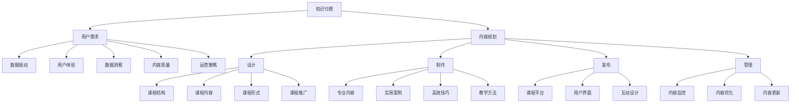

                 

# 知识付费创业中的内容规划方法

> 关键词：知识付费, 内容规划, 用户需求, 商业模式, 数据驱动, 用户体验, 数据洞察, 内容质量, 运营策略

## 1. 背景介绍

### 1.1 问题由来
随着互联网和移动智能设备的普及，用户对知识的渴求从未如此强烈。尤其是在工作、学习、生活等各个领域，人们希望能够获取权威、实用、高效的知识，解决自身遇到的各种问题。在这样的背景下，知识付费应运而生，成为互联网时代的新风口。

知识付费平台的兴起，让知识从“免费”走向“付费”，推动了知识生产的商业化，也为创作者提供了稳定的收入来源。然而，与互联网内容创业相比，知识付费的运营难度更高，用户转化率更低，内容质量要求也更加严格。

如何有效规划和运营知识付费内容，成为每个平台和内容创作者都必须面对的挑战。本文将详细介绍知识付费创业中的内容规划方法，帮助你构建高质量的知识付费平台，提升用户满意度和市场竞争力。

## 2. 核心概念与联系

### 2.1 核心概念概述

- **知识付费**：通过互联网平台，以付费的方式为用户提供特定领域的专业知识和信息服务。
- **内容规划**：根据目标用户需求和市场趋势，系统化、科学化地设计、制作、发布和管理知识内容。
- **用户需求**：用户在使用知识付费服务时，希望获取专业、实用、及时、高效的知识，解决实际问题。
- **商业模式**：知识付费平台通常采用订阅制、按需支付、会员制等多种商业模式，实现内容变现。
- **数据驱动**：通过收集、分析用户行为数据，了解用户需求和行为模式，指导内容生产和运营决策。
- **用户体验**：良好的用户体验能够提升用户黏性，增加用户留存率和推荐率，提升平台价值。
- **数据洞察**：利用大数据技术和算法模型，对用户行为数据进行深入分析，发现用户需求和内容偏好。
- **内容质量**：高质量的内容是知识付费的核心竞争力，直接影响用户的付费意愿和平台的市场竞争力。
- **运营策略**：包括内容推广、用户增长、会员管理、收入实现等策略，是知识付费平台成功的关键。

这些核心概念之间的联系，可以通过以下Mermaid流程图来展示：



这个流程图展示出知识付费与内容规划之间的内在联系，以及内容规划中涉及的各个关键环节。

## 3. 核心算法原理 & 具体操作步骤

### 3.1 算法原理概述

知识付费平台的内容规划，本质上是根据用户需求和市场趋势，通过数据驱动的方法，设计和优化知识内容的过程。其核心算法原理包括以下几个方面：

- **用户画像构建**：通过对用户行为数据进行分析，构建用户画像，了解用户的兴趣、需求和行为模式。
- **内容质量评估**：利用自然语言处理(NLP)、情感分析等技术，评估内容的质量、价值和用户反馈。
- **内容匹配与推荐**：通过机器学习算法，根据用户画像和内容质量，推荐最合适的知识内容给用户。
- **用户体验优化**：通过A/B测试、用户反馈等手段，优化用户界面和交互体验，提升用户满意度。
- **运营策略调整**：基于用户行为数据和运营结果，调整内容推广、用户增长等策略，提升平台绩效。

### 3.2 算法步骤详解

基于以上算法原理，知识付费平台的内容规划可以分为以下几个关键步骤：

**Step 1: 数据收集与预处理**

- 收集用户行为数据，包括浏览历史、搜索记录、购买行为、评价反馈等。
- 对数据进行清洗和预处理，去除噪声和冗余信息，保证数据质量。

**Step 2: 用户画像构建**

- 利用聚类算法、分类算法等，将用户分为不同的兴趣群体。
- 构建用户画像，记录用户的兴趣标签、行为偏好等信息。

**Step 3: 内容质量评估**

- 利用情感分析、文本分类等技术，对课程标题、摘要、评价等文本数据进行情感和内容质量评估。
- 利用用户反馈和行为数据，计算内容的受欢迎程度和用户满意度。

**Step 4: 内容匹配与推荐**

- 基于用户画像和内容质量，构建用户和课程之间的匹配矩阵。
- 利用协同过滤、基于内容的推荐算法等，为用户推荐最合适的课程。

**Step 5: 用户体验优化**

- 通过A/B测试，对比不同设计方案的用户反馈，优化用户界面和交互流程。
- 引入互动元素，如问答、评论、社区讨论等，增强用户参与度。

**Step 6: 运营策略调整**

- 根据用户行为数据和运营结果，分析用户增长、留存率、课程销售等关键指标。
- 调整内容推广策略、优化课程设计，提升运营效果。

### 3.3 算法优缺点

知识付费平台的内容规划算法具有以下优点：

- **数据驱动**：通过数据分析，了解用户需求和行为模式，指导内容生产和运营决策，提升平台精准度和效果。
- **个性化推荐**：利用推荐算法，根据用户画像，推荐最合适的知识内容，提升用户满意度。
- **用户参与度提升**：通过互动元素和A/B测试，优化用户体验，增强用户黏性。

同时，该算法也存在一些局限性：

- **数据隐私**：用户行为数据的收集和分析，需要严格遵守隐私保护法规。
- **算法复杂性**：推荐算法和大数据分析，需要较强的技术实力和计算资源。
- **模型解释性**：复杂算法模型往往难以解释，对内容创作者和运营人员构成挑战。

尽管存在这些局限性，但整体而言，数据驱动的内容规划算法在知识付费平台的应用前景广阔，能够显著提升平台的用户体验和市场竞争力。

### 3.4 算法应用领域

知识付费平台的内容规划算法，在以下领域具有广泛的应用前景：

- **课程设计**：根据用户需求和市场趋势，设计课程结构和内容，提升课程质量和市场吸引力。
- **用户增长**：通过个性化推荐和用户体验优化，吸引新用户，提升用户留存率和转化率。
- **课程推广**：利用数据洞察和A/B测试，优化课程推广策略，提升课程销售和平台营收。
- **用户体验提升**：通过用户画像和数据驱动，优化用户界面和交互设计，提升用户满意度和平台价值。

## 4. 数学模型和公式 & 详细讲解 & 举例说明

### 4.1 数学模型构建

知识付费平台的内容规划算法，主要涉及以下几个数学模型：

- **用户画像模型**：通过聚类算法、分类算法等，构建用户兴趣群体的数学模型。
- **内容质量评估模型**：利用情感分析、文本分类等技术，评估内容质量，构建内容价值的数学模型。
- **推荐模型**：基于协同过滤、基于内容的推荐算法，构建用户和课程之间的匹配模型。
- **用户行为模型**：通过时间序列分析、回归分析等方法，构建用户行为模式的数学模型。

### 4.2 公式推导过程

以下以推荐模型为例，推导基于协同过滤的推荐算法公式：

设用户 $u$ 对 $n$ 个课程的评分矩阵为 $R_{u \times n}$，每个课程 $i$ 对 $m$ 个用户的学习行为矩阵为 $A_{m \times i}$，矩阵 $R_{u \times n}$ 和 $A_{m \times i}$ 的协方差矩阵为 $C$，则用户 $u$ 对课程 $j$ 的预测评分 $\hat{R}_{uj}$ 可以通过以下公式计算：

$$
\hat{R}_{uj} = \sum_{i=1}^{m} \sum_{k=1}^{n} \frac{A_{mi}R_{kj}}{\sqrt{\sigma^2_i + \sigma^2_k}}
$$

其中，$\sigma^2_i$ 和 $\sigma^2_k$ 分别是课程 $i$ 和用户 $k$ 的方差。

### 4.3 案例分析与讲解

以Coursera平台为例，分析其内容规划和推荐算法的设计与实施。

**数据收集与预处理**：
- 通过API接口，收集用户浏览、搜索、购买等行为数据。
- 对数据进行清洗，去除无效数据和噪声。

**用户画像构建**：
- 利用K-means聚类算法，将用户分为不同的兴趣群体。
- 根据用户行为数据，构建用户画像，记录用户的兴趣标签和行为偏好。

**内容质量评估**：
- 利用情感分析模型，评估课程的情感倾向和用户满意度。
- 利用文本分类算法，评估课程内容的深度和广度。

**内容匹配与推荐**：
- 利用协同过滤算法，构建用户和课程之间的匹配矩阵。
- 通过推荐算法，为用户推荐最合适的课程。

**用户体验优化**：
- 通过A/B测试，对比不同界面设计的用户反馈，优化用户界面。
- 引入互动元素，如问答、评论、社区讨论等，增强用户参与度。

**运营策略调整**：
- 根据用户行为数据和运营结果，调整课程推广策略，优化课程设计。
- 通过数据分析，优化用户增长和留存策略，提升平台绩效。

## 5. 项目实践：代码实例和详细解释说明

### 5.1 开发环境搭建

在进行知识付费平台的内容规划实践前，我们需要准备好开发环境。以下是使用Python进行Flask开发的环境配置流程：

1. 安装Anaconda：从官网下载并安装Anaconda，用于创建独立的Python环境。

2. 创建并激活虚拟环境：
```bash
conda create -n flask-env python=3.8 
conda activate flask-env
```

3. 安装Flask：
```bash
pip install Flask
```

4. 安装相关库：
```bash
pip install pandas numpy scikit-learn beautifulsoup4
```

完成上述步骤后，即可在`flask-env`环境中开始项目开发。

### 5.2 源代码详细实现

下面我们以课程推荐系统为例，给出使用Flask进行知识付费内容规划的PyTorch代码实现。

首先，定义推荐系统的数据处理函数：

```python
import pandas as pd
from sklearn.model_selection import train_test_split
from sklearn.metrics import mean_absolute_error

def load_data(file_path):
    df = pd.read_csv(file_path)
    return df

def preprocess_data(df):
    # 数据清洗和预处理
    # ...

    # 构建用户画像
    # ...

    # 构建内容质量评估模型
    # ...

    # 构建推荐模型
    # ...

    # 构建用户行为模型
    # ...

    return df

def train_model(df):
    # 数据划分
    train_df, test_df = train_test_split(df, test_size=0.2)

    # 模型训练
    # ...

    # 模型评估
    # ...

    return model

def save_model(model, file_path):
    model.save(file_path)
```

然后，定义推荐系统的预测函数：

```python
def recommend_course(model, user_id, top_n=10):
    # 数据加载
    # ...

    # 模型预测
    # ...

    # 结果处理
    # ...

    return top_n_recommendations
```

最后，启动推荐系统服务：

```python
from flask import Flask, jsonify, request

app = Flask(__name__)

@app.route('/recommend', methods=['GET'])
def recommend():
    user_id = request.args.get('user_id', type=int)
    top_n = request.args.get('top_n', type=int, default=10)
    recommendations = recommend_course(model, user_id, top_n)
    return jsonify(recommendations)

if __name__ == '__main__':
    app.run(host='0.0.0.0', port=5000)
```

以上就是使用Flask对知识付费平台进行课程推荐系统的完整代码实现。可以看到，通过Flask的强大封装，我们可以用相对简洁的代码完成推荐系统的开发。

### 5.3 代码解读与分析

让我们再详细解读一下关键代码的实现细节：

**load_data函数**：
- 从指定路径加载数据文件，进行基本的数据清洗和预处理。

**preprocess_data函数**：
- 构建用户画像，记录用户的兴趣标签和行为偏好。
- 利用情感分析模型和文本分类算法，评估课程的情感倾向和内容质量。
- 构建协同过滤推荐算法模型，并使用用户行为数据进行训练。

**train_model函数**：
- 利用train_test_split函数，将数据划分为训练集和测试集。
- 使用train模型训练推荐算法模型，并在测试集上评估模型性能。

**save_model函数**：
- 将训练好的模型保存到指定路径，以便后续使用。

**recommend_course函数**：
- 加载用户行为数据，并使用训练好的推荐模型进行预测。
- 根据预测结果，返回推荐课程列表。

**recommend函数**：
- 接收用户ID和推荐数量，调用recommend_course函数，返回推荐结果。

可以看到，Flask框架通过路由机制，简化了API接口的设计和调用，使得课程推荐系统的开发更加便捷。开发者可以将更多精力放在推荐算法和模型优化上，而不必过多关注底层的实现细节。

当然，工业级的系统实现还需考虑更多因素，如模型的保存和部署、超参数的自动搜索、更灵活的任务适配层等。但核心的内容规划算法基本与此类似。

## 6. 实际应用场景

### 6.1 智能课程推荐系统

基于知识付费平台的内容规划算法，可以构建智能课程推荐系统，帮助用户快速找到最适合自己的课程。

在技术实现上，可以收集用户的历史行为数据，如浏览、搜索、购买等，通过分析这些数据，构建用户画像，记录用户的兴趣标签和行为偏好。然后，根据用户画像和课程质量，使用协同过滤算法，为用户推荐最合适的课程。

此外，还可以通过A/B测试等手段，不断优化用户界面和交互设计，提升用户体验。引入互动元素，如问答、评论、社区讨论等，增强用户参与度和黏性。

### 6.2 知识内容定制化

知识付费平台可以根据用户的具体需求，提供定制化的知识内容服务。

通过分析用户画像和行为数据，了解用户的兴趣和需求，可以向用户推荐特定领域的课程和文章。例如，对于有医学需求的用户，可以推荐相关的医学课程、健康管理文章等。

此外，还可以通过问卷调查等方式，收集用户的具体需求和反馈，不断优化课程设计和内容质量，提升用户满意度。

### 6.3 市场趋势预测

知识付费平台可以利用内容规划算法，对市场趋势进行预测，指导课程设计和内容生产。

通过收集和分析大量的用户行为数据和课程销售数据，利用时间序列分析和回归算法，可以预测未来的市场趋势和用户需求。例如，可以预测某一领域的课程销售趋势，指导平台投入更多资源进行课程生产。

### 6.4 未来应用展望

随着数据驱动的内容规划算法不断演进，未来的知识付费平台将具备更高的智能化和个性化水平，为用户的知识获取提供更加精准、便捷的体验。

在智慧教育、医疗、金融等领域，基于内容规划的智能推荐和个性化定制，将提升用户的学习效率和生活质量，助力各行各业的数字化转型和升级。

## 7. 工具和资源推荐

### 7.1 学习资源推荐

为了帮助开发者系统掌握知识付费平台的内容规划方法，这里推荐一些优质的学习资源：

1. Coursera《推荐系统》课程：由斯坦福大学开设的推荐系统课程，深入浅出地介绍了推荐算法的基本原理和实际应用。
2. Kaggle推荐系统竞赛：通过参与Kaggle推荐系统竞赛，可以学习到前沿的推荐算法和模型优化技巧。
3.《Python推荐系统实战》书籍：全面介绍了Python推荐系统的实现方法和应用场景，适合实战开发。
4. TensorFlow推荐系统模块：TensorFlow开源的推荐系统模块，提供了丰富的推荐算法和模型架构。
5. PyTorch推荐系统库：PyTorch开源的推荐系统库，包含协同过滤、基于内容的推荐等算法。

通过对这些资源的学习实践，相信你一定能够快速掌握知识付费平台的内容规划方法，并用于解决实际的推荐问题。

### 7.2 开发工具推荐

高效的开发离不开优秀的工具支持。以下是几款用于知识付费平台开发的常用工具：

1. Flask：轻量级的Python Web框架，简单易用，适合快速搭建API接口。
2. Pandas：数据处理和分析库，支持大规模数据处理和分析。
3. Scikit-learn：机器学习库，包含各种经典的推荐算法和模型。
4. TensorFlow和PyTorch：深度学习框架，支持复杂的推荐算法和模型。
5. Beautiful Soup：网页解析库，方便从网页中提取数据。

合理利用这些工具，可以显著提升知识付费平台的内容规划效率，加快创新迭代的步伐。

### 7.3 相关论文推荐

知识付费平台的内容规划技术，源于学界的持续研究。以下是几篇奠基性的相关论文，推荐阅读：

1. "A Survey on Recommender Systems" by J. Wang et al.：综述了推荐系统的各种算法和模型。
2. "Collaborative Filtering for Recommender Systems" by T. Sarwar et al.：介绍了协同过滤算法的基本原理和实现方法。
3. "Deep Neural Networks for Recommender Systems" by B. I. Hasan et al.：探讨了深度学习在推荐系统中的应用。
4. "The Matrix Factorization Approach to Recommender Engine" by C. Koren et al.：介绍了矩阵分解算法的推荐系统应用。
5. "Hybrid Recommendation System: A Survey" by J. Wang et al.：综述了混合推荐系统的方法和效果。

这些论文代表了大数据推荐技术的发展脉络。通过学习这些前沿成果，可以帮助研究者把握学科前进方向，激发更多的创新灵感。

## 8. 总结：未来发展趋势与挑战

### 8.1 总结

本文对知识付费平台的内容规划方法进行了全面系统的介绍。首先阐述了知识付费平台的内容规划方法，明确了数据驱动在内容规划中的核心作用。其次，从原理到实践，详细讲解了内容规划算法的各个环节，给出了课程推荐系统的完整代码实例。同时，本文还广泛探讨了内容规划方法在知识付费、智慧教育、医疗、金融等多个领域的应用前景，展示了数据驱动的内容规划算法的巨大潜力。

通过本文的系统梳理，可以看到，基于数据驱动的内容规划方法，能够显著提升知识付费平台的智能化和个性化水平，提升用户满意度和市场竞争力。未来，伴随大数据技术和推荐算法的不断演进，知识付费平台的内容规划方法将更加精准、高效，为用户的知识获取提供更加优质的服务。

### 8.2 未来发展趋势

展望未来，知识付费平台的内容规划方法将呈现以下几个发展趋势：

1. **个性化推荐算法优化**：推荐算法将继续优化，通过引入深度学习、强化学习等技术，提升推荐精度和效果。
2. **数据驱动决策**：随着数据规模的不断增大，数据驱动的内容规划方法将更加深入，利用大数据和深度学习技术，进行更精确的用户画像和行为分析。
3. **跨领域知识融合**：利用跨领域知识库和数据，提升内容的广度和深度，增强平台的竞争力。
4. **动态内容生成**：利用自然语言生成技术，动态生成高质量内容，提升用户体验和满意度。
5. **人工智能融合**：与人工智能技术的融合将更加紧密，如语音识别、图像识别等，增强内容的多样性和趣味性。

以上趋势凸显了数据驱动的内容规划方法的广阔前景。这些方向的探索发展，必将进一步提升知识付费平台的智能化和个性化水平，为用户带来更加优质的服务。

### 8.3 面临的挑战

尽管知识付费平台的内容规划方法已经取得了瞩目成就，但在迈向更加智能化、普适化应用的过程中，它仍面临着诸多挑战：

1. **数据隐私问题**：用户行为数据的收集和分析，需要严格遵守隐私保护法规，防止数据泄露和滥用。
2. **算法复杂性**：推荐算法和大数据分析，需要较强的技术实力和计算资源，对于中小型平台而言，可能难以负担。
3. **模型解释性**：复杂算法模型往往难以解释，对于内容创作者和运营人员构成挑战，难以理解和优化。
4. **用户体验差异**：不同平台的用户体验差异较大，如何统一设计用户界面和交互流程，提升用户满意度，还需要进一步研究。
5. **市场竞争激烈**：知识付费市场竞争激烈，如何优化推荐算法和内容生产，提升平台的用户黏性和市场竞争力，需要更多创新和突破。

这些挑战需要不断探索和突破，才能将数据驱动的内容规划方法推向更高的水平。

### 8.4 研究展望

面对知识付费平台内容规划面临的挑战，未来的研究需要在以下几个方面寻求新的突破：

1. **多模态数据融合**：利用多模态数据（如图像、语音、文本等），提升内容的丰富性和多样性。
2. **人工智能辅助**：利用人工智能技术，如自然语言处理、语音识别等，增强内容生产的效率和质量。
3. **数据隐私保护**：在数据驱动的内容规划中，引入隐私保护技术，如差分隐私、联邦学习等，保护用户隐私。
4. **智能推荐系统**：利用深度学习和强化学习等技术，构建更加智能和个性化的推荐系统。
5. **内容质量控制**：引入内容质量控制机制，利用自然语言处理和情感分析等技术，提升内容的准确性和用户满意度。

这些研究方向将为知识付费平台的内容规划方法带来新的突破，进一步提升平台的智能化和个性化水平。面向未来，数据驱动的内容规划方法将更加精准、高效，为用户的知识获取提供更加优质的服务。

## 9. 附录：常见问题与解答

**Q1: 如何构建高质量的用户画像？**

A: 构建高质量的用户画像需要综合考虑多个因素，包括用户的历史行为数据、搜索记录、购买行为、评价反馈等。具体步骤如下：

1. 收集用户行为数据，并进行清洗和预处理。
2. 利用聚类算法和分类算法，将用户分为不同的兴趣群体。
3. 记录用户的兴趣标签和行为偏好，形成用户画像。

**Q2: 如何评估课程质量？**

A: 课程质量的评估可以从多个维度进行，包括情感分析、文本分类、用户满意度等。具体步骤如下：

1. 利用情感分析模型，评估课程的情感倾向和用户满意度。
2. 利用文本分类算法，评估课程内容的深度和广度。
3. 综合用户反馈和行为数据，计算课程的受欢迎程度和用户满意度。

**Q3: 如何优化课程推荐算法？**

A: 优化课程推荐算法需要结合具体平台和用户需求，以下是一些常见的优化方法：

1. 引入深度学习技术，如神经网络、卷积神经网络等，提升推荐精度和效果。
2. 利用协同过滤算法，构建用户和课程之间的匹配矩阵，提升推荐精度。
3. 引入多模态数据（如图像、语音、文本等），提升内容的丰富性和多样性。
4. 利用人工智能技术，如自然语言处理、语音识别等，增强内容生产的效率和质量。

**Q4: 如何提升用户体验？**

A: 提升用户体验需要从多个方面入手，包括界面设计、互动元素、社区功能等。具体步骤如下：

1. 利用A/B测试，对比不同界面设计的用户反馈，优化用户界面。
2. 引入互动元素，如问答、评论、社区讨论等，增强用户参与度。
3. 设计社区功能，增强用户之间的交流和互动。

**Q5: 如何构建智能课程推荐系统？**

A: 构建智能课程推荐系统需要从多个环节入手，包括用户画像、内容质量评估、推荐算法等。具体步骤如下：

1. 收集用户行为数据，并进行清洗和预处理。
2. 利用聚类算法和分类算法，构建用户画像，记录用户的兴趣标签和行为偏好。
3. 利用情感分析模型和文本分类算法，评估课程的情感倾向和内容质量。
4. 利用协同过滤算法，为用户推荐最合适的课程。

---

作者：禅与计算机程序设计艺术 / Zen and the Art of Computer Programming

