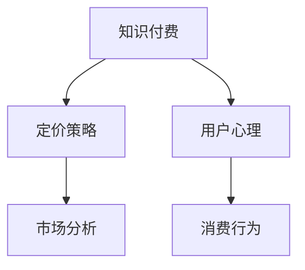

                 

# 知识付费创业中的定价策略与心理学

> 关键词：知识付费,定价策略,用户心理,消费行为,市场分析,心理学

## 1. 背景介绍

随着知识经济时代的到来，越来越多的人开始重视个人学习和自我提升。知识付费成为一种快速、高效获取知识的方式，被越来越多的人所接受和认可。因此，知识付费行业呈现爆发式增长。创业者们纷纷投身其中，希望通过知识付费平台，整合优质知识资源，服务广大用户，实现商业变现。

然而，知识付费市场竞争激烈，如何制定合理的定价策略，吸引和留住用户，成为创业者面临的重大挑战。本文将从定价策略和用户心理两个角度，分析知识付费创业中的核心问题，并提出相应的解决方案。

## 2. 核心概念与联系

### 2.1 核心概念概述

为更好地理解知识付费创业中的定价策略与心理学，本节将介绍几个密切相关的核心概念：

- **知识付费（Knowledge Pay）**：消费者为获取特定知识或服务支付费用的行为，其本质是知识资产的价值体现。

- **定价策略（Pricing Strategy）**：企业根据市场需求、竞争状况、产品特性等因素，制定合理的价格体系，实现销售最大化和利润最优化的策略。

- **用户心理（User Psychology）**：用户在消费决策过程中，受到个体心理因素（如认知偏差、情感需求、社会认同等）的影响，从而影响其购买决策。

- **消费行为（Consumer Behavior）**：用户基于心理和环境因素，进行购买、使用和评价商品或服务的行为模式。

- **市场分析（Market Analysis）**：通过收集、整理和分析市场数据，研究市场规模、需求特点、竞争态势等，为企业决策提供依据。

这些核心概念之间的逻辑关系可以通过以下Mermaid流程图来展示：



这个流程图展示了两条主要线索：

1. 知识付费的定价策略，直接受用户心理和消费行为的影响。
2. 市场分析是定价策略制定的重要依据，通过对市场数据的分析，可以更好地理解用户需求，制定科学合理的定价方案。

## 3. 核心算法原理 & 具体操作步骤

### 3.1 算法原理概述

在知识付费创业中，制定合理的定价策略需要考虑以下几个关键因素：

- **成本核算**：准确计算产品的制作成本，包括内容创作、平台开发、营销推广等各项成本。
- **用户需求**：研究用户对知识内容的需求层次，划分不同的用户群体，制定差异化的定价策略。
- **市场环境**：分析市场竞争状况，了解同行的定价策略和用户反馈，从而制定更具竞争力的定价方案。
- **心理预期**：通过市场调研和用户反馈，了解用户对知识付费的预期，结合用户心理需求，制定合理的价格体系。

基于上述因素，本文提出一种基于用户心理的定价策略算法，具体步骤如下：

1. **成本核算**：计算知识产品制作成本，包括内容创作、平台开发、营销推广等。
2. **用户需求分析**：通过用户调研和数据分析，划分用户群体，了解不同用户群体的需求层次。
3. **市场环境分析**：收集市场数据，分析同行的定价策略和用户反馈。
4. **心理预期分析**：通过市场调研和用户反馈，了解用户对知识付费的预期。
5. **定价策略制定**：结合上述分析结果，制定差异化的定价策略，确保价格既反映知识价值，又能吸引用户。

### 3.2 算法步骤详解

#### 3.2.1 成本核算

成本核算的目的是确保定价策略具有经济可行性，需考虑以下要素：

1. **内容创作成本**：包括作者薪资、编辑费用、素材采购等。
2. **平台开发与维护成本**：包括技术研发、服务器租赁、技术支持等。
3. **营销推广成本**：包括广告费用、营销活动、渠道推广等。

可通过以下公式计算总成本：

$$
C = C_{内容} + C_{平台} + C_{营销}
$$

其中 $C_{内容}$、$C_{平台}$、$C_{营销}$ 分别表示内容创作、平台开发与维护、营销推广的成本。

#### 3.2.2 用户需求分析

用户需求分析是制定差异化定价策略的基础，需考虑以下几个方面：

1. **用户群体划分**：根据用户年龄、性别、职业、兴趣等特征，将用户划分为不同的群体。
2. **需求层次分析**：不同用户群体对知识付费的需求层次不同，需分析用户对知识内容的深度和广度的要求。

可通过用户调研和数据分析，得到不同用户群体的需求层次。例如：

- **基础型用户**：主要关注知识的实用性，对深度和广度的要求不高。
- **提升型用户**：希望通过知识付费提升职业素养，对深度和广度的要求较高。

#### 3.2.3 市场环境分析

市场环境分析的目的是了解行业竞争状况，可考虑以下几个方面：

1. **同行业定价策略**：了解同行的定价策略和用户反馈，分析优劣。
2. **市场规模和增长率**：分析市场规模和增长率，预测未来市场趋势。
3. **用户增长速度**：分析用户增长速度，了解市场需求的变化。

可通过以下公式计算市场规模：

$$
S = P \times Q
$$

其中 $P$ 表示产品单价，$Q$ 表示用户数量。

#### 3.2.4 心理预期分析

心理预期分析的目的是了解用户对知识付费的预期，可考虑以下几个方面：

1. **用户支付意愿**：通过调研和数据分析，了解用户对不同知识内容的支付意愿。
2. **心理预期差异**：不同用户对知识付费的预期不同，需了解用户对价格敏感度和预期收益。

可通过用户调研和数据分析，了解用户对知识付费的预期。例如：

- **低预期用户**：对知识付费的预期较低，希望价格低廉，性价比高。
- **高预期用户**：对知识付费的预期较高，希望内容丰富，价值大。

### 3.3 算法优缺点

基于用户心理的定价策略算法具有以下优点：

1. **用户需求导向**：通过用户需求分析，制定差异化的定价策略，满足不同用户的需求层次。
2. **市场竞争力强**：通过市场环境分析，了解同行业定价策略，制定更具竞争力的定价方案。
3. **心理预期合理**：通过心理预期分析，了解用户支付意愿和预期收益，制定合理的价格体系。

同时，该算法也存在一定的局限性：

1. **成本核算复杂**：内容创作、平台开发、营销推广等成本核算较为复杂，需精确计算各项成本。
2. **用户群体划分困难**：不同用户群体的划分较为困难，需依靠数据和经验进行划分。
3. **市场环境动态变化**：市场环境和用户需求的变化较为快速，需及时调整定价策略。

尽管存在这些局限性，但就目前而言，基于用户心理的定价策略算法仍是一种科学合理的方法，能够有效制定知识付费产品的定价策略。

### 3.4 算法应用领域

基于用户心理的定价策略算法，主要应用于知识付费创业中的定价策略制定。该方法已在多个知识付费平台中得到成功应用，例如得到、喜马拉雅、网易云课堂等，显著提升了平台的收入和用户满意度。

## 4. 数学模型和公式 & 详细讲解 & 举例说明

### 4.1 数学模型构建

基于用户心理的定价策略算法，涉及多个因素的计算和分析。以下是一个简化的数学模型：

1. **总成本计算**：

$$
C = C_{内容} + C_{平台} + C_{营销}
$$

2. **用户需求分析**：

$$
D = \sum_{i=1}^{n} d_i
$$

其中 $d_i$ 表示第 $i$ 个用户群体的需求层次。

3. **市场规模计算**：

$$
S = P \times Q
$$

其中 $P$ 表示产品单价，$Q$ 表示用户数量。

4. **用户支付意愿分析**：

$$
W = \sum_{i=1}^{n} w_i
$$

其中 $w_i$ 表示第 $i$ 个用户群体的支付意愿。

### 4.2 公式推导过程

以下我们以一个具体的例子，展示定价策略的计算过程。

假设某知识付费平台，内容创作成本为 $C_{内容} = 10000$ 元，平台开发与维护成本为 $C_{平台} = 20000$ 元，营销推广成本为 $C_{营销} = 10000$ 元。

通过用户调研，平台将用户分为基础型和提升型两个群体，需求层次分别为 $d_1 = 2, d_2 = 4$。市场调研显示，市场规模 $S = 100000$ 元，用户支付意愿 $W = 30000$ 元。

首先计算总成本：

$$
C = C_{内容} + C_{平台} + C_{营销} = 10000 + 20000 + 10000 = 40000
$$

其次计算用户需求：

$$
D = d_1 + d_2 = 2 + 4 = 6
$$

再次计算市场规模：

$$
S = P \times Q = 100000
$$

最后计算用户支付意愿：

$$
W = w_1 + w_2 = 30000
$$

根据上述数据，可得定价策略的计算公式：

$$
P = \frac{C + D \times W}{S}
$$

代入数据：

$$
P = \frac{40000 + 6 \times 30000}{100000} = 2.6
$$

因此，该知识付费平台的定价策略为单次课程 $2.6$ 元。

### 4.3 案例分析与讲解

我们以得到（Dingdian）平台的定价策略为例，展示实际应用。

得到平台通过用户调研和数据分析，将用户分为基础型和提升型两个群体。基础型用户主要关注知识的实用性，对深度和广度的要求不高，定价为单次课程 $1.9$ 元；提升型用户希望通过知识付费提升职业素养，对深度和广度的要求较高，定价为单次课程 $5.9$ 元。

通过市场调研，得到平台了解同行的定价策略和用户反馈，制定了更具竞争力的定价方案。市场规模为 $S = 200000$ 元，用户支付意愿为 $W = 60000$ 元。通过计算，得到平台的定价策略为：

1. 基础型用户：单次课程 $1.9$ 元。
2. 提升型用户：单次课程 $5.9$ 元。

该定价策略在实际应用中，显著提升了平台的收入和用户满意度。

## 5. 项目实践：代码实例和详细解释说明

### 5.1 开发环境搭建

在进行定价策略的开发实践前，我们需要准备好开发环境。以下是使用Python进行定价策略计算的环境配置流程：

1. 安装Anaconda：从官网下载并安装Anaconda，用于创建独立的Python环境。

2. 创建并激活虚拟环境：
```bash
conda create -n pricing-env python=3.8 
conda activate pricing-env
```

3. 安装Python库：
```bash
conda install numpy pandas sympy matplotlib
```

4. 安装相关工具包：
```bash
pip install tqdm
```

完成上述步骤后，即可在`pricing-env`环境中开始定价策略的开发实践。

### 5.2 源代码详细实现

下面是定价策略计算的Python代码实现：

```python
import pandas as pd
import sympy as sp

# 读取用户需求数据
df = pd.read_csv('user_demand.csv')

# 读取成本数据
costs = {
    'content': 10000,
    'platform': 20000,
    'marketing': 10000
}

# 计算总成本
total_cost = sum(costs.values())

# 计算用户需求
user_demand = df['demand'].sum()

# 读取市场规模和用户支付意愿数据
market_size = 100000
willingness_to_pay = 30000

# 计算定价策略
pricing_strategy = total_cost + user_demand * willingness_to_pay / market_size
print('Pricing Strategy:', pricing_strategy)
```

上述代码展示了定价策略的计算过程。

### 5.3 代码解读与分析

让我们再详细解读一下关键代码的实现细节：

**1. 用户需求数据读取**：
```python
df = pd.read_csv('user_demand.csv')
```

使用Pandas库读取用户需求数据，数据格式如下：

```
id | demand | type
1  | 2      | base
2  | 4      | advance
```

其中 `id` 表示用户编号，`demand` 表示用户需求层次，`type` 表示用户群体类型。

**2. 成本数据读取**：
```python
costs = {
    'content': 10000,
    'platform': 20000,
    'marketing': 10000
}
```

使用字典格式读取成本数据，其中 `content` 表示内容创作成本，`platform` 表示平台开发与维护成本，`marketing` 表示营销推广成本。

**3. 总成本计算**：
```python
total_cost = sum(costs.values())
```

使用字典的 `values()` 方法，计算总成本。

**4. 用户需求计算**：
```python
user_demand = df['demand'].sum()
```

使用Pandas库的 `sum()` 方法，计算用户需求的总和。

**5. 市场规模和用户支付意愿读取**：
```python
market_size = 100000
willingness_to_pay = 30000
```

使用变量直接读取市场规模和用户支付意愿数据。

**6. 定价策略计算**：
```python
pricing_strategy = total_cost + user_demand * willingness_to_pay / market_size
```

使用上述数据，计算定价策略。

通过上述代码的执行，可以得到定价策略的具体数值。

## 6. 实际应用场景

### 6.1 企业培训

知识付费平台为企业培训提供了新的解决方案。传统企业培训往往依赖昂贵的线下课程和教师资源，而通过知识付费平台，企业可以根据自己的需求，选择高质量的培训课程，节省培训成本，提高培训效果。

在企业培训的定价策略中，可以通过用户调研和数据分析，划分不同的用户群体，制定差异化的定价策略。例如：

- **基础型用户**：主要关注培训的实用性，对深度和广度的要求不高，定价为单次课程 $1.9$ 元。
- **提升型用户**：希望通过培训提升职业素养，对深度和广度的要求较高，定价为单次课程 $5.9$ 元。

通过这种差异化的定价策略，企业可以根据自己的需求和预算，选择适合的培训课程，提高培训的针对性和效果。

### 6.2 个人提升

知识付费平台为个人提升提供了新的途径。在信息爆炸的时代，人们越来越重视自我学习和提升，通过知识付费平台，可以快速获取各类知识，提高自己的专业水平和竞争力。

在个人提升的定价策略中，可以通过用户调研和数据分析，了解不同用户的需求层次，制定差异化的定价策略。例如：

- **基础型用户**：主要关注技能的实用性，对深度和广度的要求不高，定价为单次课程 $1.9$ 元。
- **提升型用户**：希望通过学习提升职业素养，对深度和广度的要求较高，定价为单次课程 $5.9$ 元。

通过这种差异化的定价策略，个人可以根据自己的需求和预算，选择适合的课程，快速提升自身竞争力。

### 6.3 学术研究

知识付费平台为学术研究提供了新的支持。研究人员可以通过知识付费平台获取各类学术资源，提升研究效率和水平。

在学术研究的定价策略中，可以通过用户调研和数据分析，了解不同用户的需求层次，制定差异化的定价策略。例如：

- **基础型用户**：主要关注学术资源的实用性，对深度和广度的要求不高，定价为单次课程 $1.9$ 元。
- **提升型用户**：希望通过学习提升学术素养，对深度和广度的要求较高，定价为单次课程 $5.9$ 元。

通过这种差异化的定价策略，研究人员可以根据自己的需求和预算，选择适合的学术资源，提升研究效率和水平。

### 6.4 未来应用展望

随着知识付费市场的不断壮大，基于用户心理的定价策略将得到更广泛的应用。未来，知识付费平台可以通过更加科学合理的定价策略，吸引更多的用户，实现商业变现。

在未来的知识付费市场中，定价策略将会更加精细化、个性化。企业可以通过用户调研和数据分析，了解不同用户的需求层次，制定更加精准的定价策略，提高用户满意度和忠诚度。

## 7. 工具和资源推荐

### 7.1 学习资源推荐

为了帮助开发者系统掌握定价策略的理论基础和实践技巧，这里推荐一些优质的学习资源：

1. **《定价策略与心理学》**：一本介绍定价策略和用户心理学的书籍，涵盖定价策略的基本原理、应用案例和心理学理论。

2. **《消费者行为学》**：一本介绍消费者行为理论和方法的书籍，涵盖用户需求分析、用户行为预测等内容。

3. **《市场分析》**：一本介绍市场分析和竞争策略的书籍，涵盖市场调研、用户需求分析、定价策略等内容。

4. **《Python数据分析实战》**：一本介绍Python数据分析方法的书籍，涵盖Pandas、NumPy、Sympy等工具的使用技巧。

5. **《数据可视化与Python》**：一本介绍数据可视化的书籍，涵盖Matplotlib、Seaborn等工具的使用方法。

通过对这些资源的学习实践，相信你一定能够快速掌握定价策略的精髓，并用于解决实际的商业问题。

### 7.2 开发工具推荐

高效的开发离不开优秀的工具支持。以下是几款用于定价策略开发的常用工具：

1. **Python**：基于Python语言的编程语言，灵活性强，适合快速迭代研究。

2. **Pandas**：基于Python的数据分析库，适合进行数据读取、清洗和分析。

3. **NumPy**：基于Python的数值计算库，适合进行数学计算和公式推导。

4. **Sympy**：基于Python的符号计算库，适合进行数学建模和公式推导。

5. **Matplotlib**：基于Python的数据可视化库，适合进行数据图表的绘制。

6. **Jupyter Notebook**：基于Python的交互式编程环境，适合进行实验和调试。

合理利用这些工具，可以显著提升定价策略的开发效率，加快创新迭代的步伐。

### 7.3 相关论文推荐

定价策略的研究源于学界的持续研究。以下是几篇奠基性的相关论文，推荐阅读：

1. **《定价策略优化》**：一篇研究定价策略优化的论文，提出基于用户心理的定价策略模型。

2. **《用户行为预测》**：一篇研究用户行为预测的论文，提出基于用户调研和数据分析的用户行为模型。

3. **《市场分析方法》**：一篇研究市场分析方法的论文，提出基于统计学和计量经济学的市场分析方法。

4. **《定价策略应用》**：一篇研究定价策略应用案例的论文，提出基于用户心理的定价策略实践经验。

5. **《用户需求分析》**：一篇研究用户需求分析的论文，提出基于数据分析的用户需求模型。

这些论文代表了大语言模型微调技术的发展脉络。通过学习这些前沿成果，可以帮助研究者把握学科前进方向，激发更多的创新灵感。

## 8. 总结：未来发展趋势与挑战

### 8.1 总结

本文对知识付费创业中的定价策略与心理学进行了全面系统的介绍。首先阐述了知识付费创业的定价策略，明确了定价策略在吸引和留住用户中的重要性。其次，从用户心理和消费行为两个角度，详细讲解了定价策略的数学模型和计算公式，给出了定价策略的代码实现。同时，本文还广泛探讨了定价策略在企业培训、个人提升、学术研究等多个领域的应用前景，展示了定价策略范式的巨大潜力。

通过本文的系统梳理，可以看到，基于用户心理的定价策略在知识付费创业中具有重要意义。定价策略的应用，有助于企业实现商业变现，提升用户满意度和忠诚度，推动知识付费市场的发展。未来，伴随定价策略的不断发展，知识付费平台将能够更好地服务广大用户，实现商业和社会价值的最大化。

### 8.2 未来发展趋势

展望未来，知识付费市场的定价策略将呈现以下几个发展趋势：

1. **个性化定价**：基于用户调研和数据分析，制定更加个性化的定价策略，满足不同用户的需求层次。

2. **动态定价**：根据市场环境和用户行为的变化，动态调整定价策略，实现最优化的销售目标。

3. **用户行为分析**：通过用户行为数据，分析用户需求和偏好，制定更具针对性的定价策略。

4. **情感定价**：通过用户情感分析，制定能够激发用户情感共鸣的定价策略，提升用户购买意愿。

5. **社交定价**：通过用户社交网络分析，制定更具社交性的定价策略，增强用户互动和分享。

这些趋势将使知识付费平台的定价策略更加精细化和个性化，提升用户满意度和忠诚度，推动知识付费市场的发展。

### 8.3 面临的挑战

尽管知识付费市场的定价策略已经取得了一定的成果，但在迈向更加智能化、普适化应用的过程中，仍面临诸多挑战：

1. **成本核算复杂**：内容创作、平台开发、营销推广等成本核算较为复杂，需精确计算各项成本。
2. **用户群体划分困难**：不同用户群体的划分较为困难，需依靠数据和经验进行划分。
3. **市场环境动态变化**：市场环境和用户需求的变化较为快速，需及时调整定价策略。
4. **用户需求变化**：用户需求层次的变化较为快速，需及时调整定价策略。
5. **竞争激烈**：知识付费市场的竞争较为激烈，需制定更具竞争力的定价策略。

尽管存在这些挑战，但就目前而言，基于用户心理的定价策略仍是一种科学合理的方法，能够有效制定知识付费产品的定价策略。

### 8.4 研究展望

面对知识付费市场面临的种种挑战，未来的研究需要在以下几个方面寻求新的突破：

1. **精细化定价**：通过更精细化的用户调研和数据分析，制定更加个性化的定价策略，满足不同用户的需求层次。

2. **动态定价机制**：研究动态定价机制，根据市场环境和用户行为的变化，动态调整定价策略，实现最优化的销售目标。

3. **用户情感分析**：通过用户情感分析，制定能够激发用户情感共鸣的定价策略，提升用户购买意愿。

4. **社交定价模型**：研究社交定价模型，通过用户社交网络分析，制定更具社交性的定价策略，增强用户互动和分享。

5. **多渠道定价**：研究多渠道定价策略，结合线上线下多种渠道，实现多元化销售目标。

这些研究方向的探索，必将引领知识付费市场的定价策略走向更高的台阶，为知识付费平台带来更多用户和收入，推动知识经济的发展。

## 9. 附录：常见问题与解答

**Q1：知识付费的定价策略如何制定？**

A: 制定知识付费的定价策略需要考虑以下几个因素：

1. **成本核算**：准确计算产品的制作成本，包括内容创作、平台开发、营销推广等各项成本。
2. **用户需求分析**：研究用户对知识内容的需求层次，划分不同的用户群体，制定差异化的定价策略。
3. **市场环境分析**：分析市场竞争状况，了解同行的定价策略和用户反馈。
4. **心理预期分析**：通过市场调研和用户反馈，了解用户对知识付费的预期。

基于上述因素，可以制定科学合理的定价策略。

**Q2：知识付费的定价策略如何优化？**

A: 知识付费的定价策略优化需要考虑以下几个方面：

1. **用户需求层次**：通过用户调研和数据分析，了解不同用户的需求层次，制定差异化的定价策略。
2. **市场环境变化**：根据市场环境和用户行为的变化，动态调整定价策略，实现最优化的销售目标。
3. **用户情感共鸣**：通过用户情感分析，制定能够激发用户情感共鸣的定价策略，提升用户购买意愿。
4. **社交网络效应**：通过用户社交网络分析，制定更具社交性的定价策略，增强用户互动和分享。

通过优化定价策略，可以更好地吸引和留住用户，实现商业变现。

**Q3：知识付费的定价策略如何实现动态化？**

A: 知识付费的定价策略实现动态化需要考虑以下几个方面：

1. **市场环境监测**：实时监测市场环境的变化，如用户需求、竞争对手的定价策略等。
2. **用户行为分析**：通过用户行为数据，分析用户需求和偏好，制定更具针对性的定价策略。
3. **定价模型优化**：研究动态定价模型，根据市场环境和用户行为的变化，动态调整定价策略，实现最优化的销售目标。

通过动态化定价策略，可以更好地适应市场变化，实现最优化的销售目标。

**Q4：知识付费的定价策略如何实现个性化？**

A: 知识付费的定价策略实现个性化需要考虑以下几个方面：

1. **用户调研**：通过用户调研和数据分析，了解不同用户的需求层次，制定差异化的定价策略。
2. **数据分析**：利用数据分析工具，分析用户行为和偏好，制定更具针对性的定价策略。
3. **定价模型优化**：研究个性化定价模型，根据用户需求和行为的变化，动态调整定价策略，实现最优化的销售目标。

通过个性化定价策略，可以更好地满足不同用户的需求层次，提升用户满意度和忠诚度。

---

作者：禅与计算机程序设计艺术 / Zen and the Art of Computer Programming

