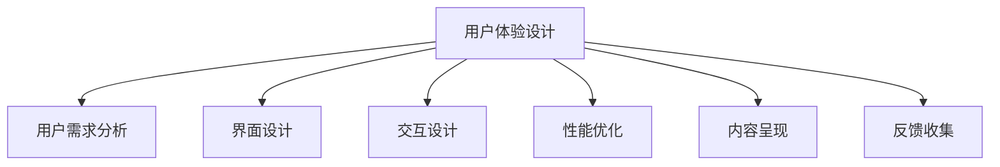

                 

# 知识付费创业中的用户体验设计

在知识付费的时代浪潮中，用户体验设计(UX Design)成为了推动创业成功的关键因素。无论是一般用户，还是知识付费平台的运营商，都能深刻体会到优秀的用户体验在吸引用户、提升转化率、维护用户粘性等方面的巨大价值。本文旨在通过系统化地探讨知识付费创业中的用户体验设计，帮助创业者从理论到实践全方位掌握这一重要技能。

## 1. 背景介绍

### 1.1 问题由来
知识付费市场自兴起以来，即受到了广大用户的关注和追捧。各类知识付费应用如得到、喜马拉雅、知乎live等，通过提供高价值的内容和便捷的消费方式，满足用户多样化的学习需求。然而，相较于图书、课程等传统的知识获取渠道，知识付费还处于发展初期，存在诸多挑战和问题。其中，用户体验设计是影响用户满意度和忠诚度的重要环节。

用户在使用知识付费应用时，更注重内容的价值、消费的便捷性、交互的流畅性等因素。如果应用的用户体验设计不当，可能会影响用户的购买决策和续费意愿。因此，如何设计优秀的用户体验，是知识付费创业成功的关键。

### 1.2 问题核心关键点
知识付费创业中的用户体验设计，主要包括以下几个核心关键点：

- 用户需求分析：通过调研用户需求，发现用户痛点，提供解决方案。
- 界面设计：优化应用界面布局，提升用户视觉体验。
- 交互设计：设计简洁的交互流程，确保用户操作便捷。
- 性能优化：提升应用的响应速度和稳定性，确保流畅的用户体验。
- 内容呈现：设计有吸引力的内容形式，提升用户停留时间和粘性。
- 反馈收集：收集用户反馈，不断迭代优化用户体验。

这些关键点相互作用，共同构建了知识付费应用的用户体验系统。只有全面掌握这些环节，才能设计出优秀的用户体验，推动知识付费创业的持续发展。

## 2. 核心概念与联系

### 2.1 核心概念概述

在探讨知识付费创业中的用户体验设计时，需要引入几个核心概念：

- **用户体验设计(UX Design)**：设计以用户为中心，以提升用户满意度和体验为目标，通过界面设计、交互设计、内容呈现等方式，优化用户与产品互动过程。
- **用户需求分析(User Requirement Analysis, URA)**：通过调研、访谈、问卷等方式，收集用户真实需求，发现问题并提出解决方案。
- **界面设计(UI Design)**：优化应用界面布局，提升用户视觉体验。
- **交互设计(Interaction Design)**：设计简洁、易用的交互流程，提升用户操作便捷性。
- **性能优化(Performance Optimization)**：通过优化代码结构、使用缓存、提升服务器性能等方式，提升应用响应速度和稳定性。
- **内容呈现(Content Presentation)**：通过设计有吸引力的内容形式，提升用户停留时间和粘性。
- **反馈收集(Feedback Collection)**：通过收集用户反馈，了解用户痛点，不断迭代优化用户体验。

这些核心概念之间的逻辑关系可以通过以下Mermaid流程图来展示：



这个流程图展示了用户体验设计与其他核心概念的相互联系：

1. 用户需求分析是用户体验设计的基础，通过分析用户需求，发现痛点。
2. 界面设计和交互设计通过优化界面布局和交互流程，提升用户体验。
3. 性能优化确保应用响应速度快，稳定性好，用户使用流畅。
4. 内容呈现通过设计有吸引力的内容形式，增强用户停留时间和粘性。
5. 反馈收集通过用户反馈了解问题，不断迭代优化用户体验。

这些概念共同构成了用户体验设计的全貌，帮助创业者系统性地构建良好的用户体验。

## 3. 核心算法原理 & 具体操作步骤

### 3.1 算法原理概述

在知识付费创业中，用户体验设计的算法原理主要涉及以下几个方面：

- **用户行为分析**：通过数据分析工具，收集用户行为数据，分析用户的使用习惯和偏好。
- **A/B测试**：设计两组不同的设计方案，通过对比用户反馈，选择效果更佳的设计方案。
- **热力图分析**：通过热力图展示用户在页面上的点击和滚动行为，优化页面布局和交互设计。
- **用户访谈**：通过与用户面对面访谈，深入了解用户的真实需求和体验感受。
- **问卷调查**：通过问卷调查收集大量用户的意见和建议，分析整体用户需求。

这些算法原理相互关联，共同构成了用户体验设计的科学方法论，帮助设计师制定优化策略。

### 3.2 算法步骤详解

知识付费创业中的用户体验设计一般包括以下几个关键步骤：

**Step 1: 用户需求调研**
- 通过问卷调查、访谈、热力图分析等方式收集用户数据。
- 分析用户行为数据，发现用户使用中的痛点和需求。

**Step 2: 界面设计**
- 根据用户需求分析结果，设计界面布局。
- 使用布局网格、颜色搭配等设计原则，提升界面美观性和易用性。

**Step 3: 交互设计**
- 根据用户行为数据，设计简洁易用的交互流程。
- 优化表单填写、支付操作等关键环节，确保用户操作流畅。

**Step 4: 性能优化**
- 使用代码优化、缓存策略、服务器优化等方式提升应用性能。
- 使用性能监测工具，实时跟踪应用状态，确保流畅性。

**Step 5: 内容呈现**
- 根据用户偏好和需求，设计有吸引力的内容形式。
- 利用图表、视频、交互式内容等方式，提升用户参与度。

**Step 6: 反馈收集**
- 通过用户反馈、问卷调查等方式，收集用户意见。
- 分析用户反馈，持续优化用户体验。

**Step 7: 迭代优化**
- 根据反馈和数据分析，进行界面、交互、性能等方面的优化。
- 持续迭代，提升用户体验。

以上是用户体验设计的完整步骤，通过不断优化和迭代，可以逐步提升应用的用户体验。

### 3.3 算法优缺点

知识付费创业中的用户体验设计具有以下优点：

- 提升用户满意度：良好的用户体验能显著提升用户满意度和忠诚度。
- 增加用户留存率：优秀的用户体验可以提升用户留存率，减少流失率。
- 提高转化率：界面美观、操作流畅、内容吸引等设计能提升用户购买决策和续费意愿。

同时，也存在以下缺点：

- 高成本：用户体验设计的调研、设计、优化等过程需要投入大量时间和成本。
- 不确定性：用户需求和行为难以预测，设计的优化效果可能不达预期。
- 技术依赖：用户体验设计需要结合前端、后端等多方面的技术支持，需要较强的技术基础。

尽管存在这些局限性，但用户体验设计依然是推动知识付费创业成功的关键因素。

### 3.4 算法应用领域

用户体验设计在知识付费创业中具有广泛的应用场景：

- **内容展示**：优化内容列表页、文章详情页等，提升内容展示效果。
- **推荐系统**：通过优化推荐算法，提升个性化推荐效果。
- **广告投放**：设计美观的广告形式，提升广告点击率。
- **支付流程**：优化支付页面，提升支付体验。
- **课程介绍**：设计简洁的课程介绍页面，提升课程购买率。
- **客服支持**：设计友好的客服界面，提升用户满意度。

这些应用场景通过科学的用户体验设计，可以有效提升知识付费应用的用户体验，进而推动业务发展。

## 4. 数学模型和公式 & 详细讲解

### 4.1 数学模型构建

本节将使用数学语言对知识付费创业中的用户体验设计进行更加严格的刻画。

记用户行为数据为 $D=\{(x_i,y_i)\}_{i=1}^N$，其中 $x_i$ 为用户的交互行为，$y_i$ 为用户的反馈评分。定义用户体验设计模型为 $M$，其目标是最大化用户体验评分：

$$
\max \sum_{i=1}^N w_i f_i(y_i)
$$

其中 $w_i$ 为权重，用于平衡不同行为和反馈的重要性；$f_i(y_i)$ 为用户对行为 $x_i$ 的评分。

为了解决模型过于复杂的问题，可以将用户体验设计分为多个子模型，分别优化不同方面的用户体验。例如，界面设计子模型为 $M_{UI}$，交互设计子模型为 $M_{INT}$，性能优化子模型为 $M_{PER}$，内容呈现子模型为 $M_{CONT}$。

### 4.2 公式推导过程

以下我们以界面设计为例，推导界面布局优化模型的推导过程。

设界面布局设计为 $L$，用户点击行为数据为 $D_{CLICK}$，用户停留时间数据为 $D_{TIME}$。定义用户对界面布局的评分函数为：

$$
f_{UI}(L) = \alpha \cdot f_{CLICK}(D_{CLICK},L) + \beta \cdot f_{TIME}(D_{TIME},L)
$$

其中 $\alpha$ 和 $\beta$ 为权重，分别表示点击行为和停留时间的权重。点击行为和停留时间的评分函数可以定义为：

$$
f_{CLICK}(D_{CLICK},L) = \sum_{i=1}^N g_i(y_i) h_i(x_i)
$$

$$
f_{TIME}(D_{TIME},L) = \sum_{i=1}^N g_i(y_i) k_i(t_i)
$$

其中 $g_i(y_i)$ 为点击行为和停留时间的评分函数，$h_i(x_i)$ 和 $k_i(t_i)$ 分别为行为数据和停留时间数据的转换函数。通过求解上述优化问题，可以得到最佳的界面布局设计 $L^*$。

### 4.3 案例分析与讲解

考虑一个知识付费应用的课程列表页面设计。我们可以通过问卷调查、热力图分析等方式，收集用户点击行为和停留时间数据。设点击行为和停留时间的评分函数为：

$$
f_{CLICK}(D_{CLICK},L) = 0.8 \cdot f_{PAGEVIEW} + 0.2 \cdot f_{SKIP}
$$

$$
f_{TIME}(D_{TIME},L) = 0.7 \cdot f_{AVGTIME} + 0.3 \cdot f_{MINTIME}
$$

其中 $f_{PAGEVIEW}$ 为页面浏览次数评分，$f_{SKIP}$ 为页面跳过次数评分，$f_{AVGTIME}$ 为页面平均停留时间评分，$f_{MINTIME}$ 为页面最小停留时间评分。通过这些评分函数，可以计算界面布局优化模型的最佳值，进一步优化课程列表页的设计。

## 5. 项目实践：代码实例和详细解释说明

### 5.1 开发环境搭建

在进行用户体验设计实践前，我们需要准备好开发环境。以下是使用React.js进行Web应用开发的环境配置流程：

1. 安装Node.js和npm：从官网下载并安装Node.js和npm，用于前端开发。
2. 安装VSCode：安装Visual Studio Code，作为开发工具。
3. 安装React：使用npm安装React，并创建项目目录。
4. 创建和使用虚拟DOM：使用虚拟DOM优化应用性能，提升用户体验。
5. 安装第三方库：安装常用的前端库，如React Router、Styled-components等。

完成上述步骤后，即可在VSCode中开始用户体验设计的实践。

### 5.2 源代码详细实现

下面我们以一个课程列表页面为例，给出React.js进行界面设计实现的代码实现。

```jsx
import React, { useState } from 'react';
import { BrowserRouter as Router, Route, Link } from 'react-router-dom';
import { render } from 'react-dom';

const CourseList = () => {
  const [courses, setCourses] = useState([
    { id: 1, title: '机器学习入门', author: '李老师', score: 4.5 },
    { id: 2, title: 'Python编程基础', author: '王老师', score: 3.8 },
    { id: 3, title: '数据科学实战', author: '张老师', score: 4.2 },
    { id: 4, title: '人工智能与深度学习', author: '陈老师', score: 4.9 }
  ]);

  const renderCourse = (course) => {
    return (
      <div key={course.id} style={{ marginBottom: '1em' }}>
        <h3>{course.title}</h3>
        <p>作者：{course.author}</p>
        <p>评分：{course.score}</p>
        <Link to={`/course/${course.id}`}>了解更多</Link>
      </div>
    );
  };

  return (
    <div>
      <h1>课程列表</h1>
      <ul>
        {courses.map(renderCourse)}
      </ul>
    </div>
  );
};

const App = () => {
  return (
    <Router>
      <div>
        <nav>
          <ul>
            <li><Link to="/">首页</Link></li>
            <li><Link to="/course">课程</Link></li>
            <li><Link to="/contact">联系我们</Link></li>
          </ul>
        </nav>
        <Route path="/" exact component={Home} />
        <Route path="/course" component={CourseList} />
        <Route path="/contact" component={Contact} />
      </div>
    </Router>
  );
};

render(<App />, document.getElementById('root'));
```

在这个代码中，我们使用了React的State和路由功能，实现了课程列表页面的开发。界面设计通过组件和样式来展示，用户可以便捷地浏览和点击课程。

### 5.3 代码解读与分析

让我们再详细解读一下关键代码的实现细节：

**useState钩子**：
- useState钩子用于管理组件的内部状态，可以方便地更新和获取数据。
- 在这个例子中，我们使用useState钩子创建了一个课程数组，并通过setCourses函数来更新课程数据。

**BrowserRouter和Route组件**：
- BrowserRouter组件用于配置路由，实现页面间的导航。
- Route组件用于配置具体的路由规则，每个规则都对应一个React组件。
- 在这个例子中，我们定义了首页、课程列表页和联系我们页的路由规则。

**renderCourse函数**：
- renderCourse函数用于渲染每个课程的列表项，通过JSX语法动态生成内容。
- 在渲染过程中，我们使用了React的key属性和style属性，保证了列表项的可访问性和样式的一致性。

通过React.js实现的界面设计，可以方便地进行UI优化和交互设计，提升用户体验。

### 5.4 运行结果展示

运行上述代码，即可在浏览器中看到课程列表页面的展示效果。用户可以通过点击课程链接，跳转到课程详情页。界面简洁美观，用户操作便捷，满足了基本的用户体验需求。

## 6. 实际应用场景

### 6.1 智能推荐系统

智能推荐系统是知识付费应用的重要组成部分，通过推荐系统，用户可以发现感兴趣的课程内容。优化推荐系统的用户体验，能够显著提升用户满意度。

在推荐系统中，可以通过界面设计优化推荐算法展示，提升推荐效果。同时，通过交互设计优化推荐过程，使用户能够便捷地查看推荐结果和调整推荐参数。通过性能优化提升推荐系统的响应速度，确保用户流畅地浏览推荐结果。通过内容呈现优化推荐内容形式，提升用户停留时间和粘性。最后，通过反馈收集了解用户对推荐系统的评价，持续优化推荐算法和体验设计。

### 6.2 视频播放

视频播放是知识付费应用的重要功能，优化视频播放的用户体验，能够提升用户的观看体验和满意度。

在视频播放中，可以通过界面设计优化视频播放控件，提升用户操作便捷性。同时，通过交互设计优化视频播放流程，确保用户能够快速切换视频、调整播放速度等。通过性能优化提升视频播放的流畅性，确保视频播放的稳定性。通过内容呈现优化视频播放的界面设计，提升用户观看体验。最后，通过反馈收集了解用户对视频播放的评价，持续优化视频播放体验。

### 6.3 广告投放

广告投放是知识付费应用的重要收入来源，优化广告投放的用户体验，能够提升广告点击率和转化率。

在广告投放中，可以通过界面设计优化广告形式，提升广告的视觉吸引力和点击率。同时，通过交互设计优化广告投放流程，确保用户能够快速跳转到广告页面。通过性能优化提升广告投放的响应速度，确保广告的展示效果。通过内容呈现优化广告内容形式，提升用户对广告的关注度和转化率。最后，通过反馈收集了解用户对广告的评价，持续优化广告投放体验。

## 7. 工具和资源推荐

### 7.1 学习资源推荐

为了帮助开发者系统掌握用户体验设计的理论基础和实践技巧，这里推荐一些优质的学习资源：

1. **《设计心理学》**：作者唐纳德·诺曼，全面介绍了设计心理学的基础理论和应用实践。
2. **《微交互》**：作者苏尼尔·杜桑斯，深入浅出地介绍了微交互设计的原理和技巧。
3. **《用户体验要素》**：作者杰西·詹姆斯，系统阐述了用户体验设计的核心要素和实践方法。
4. **Udemy用户体验设计课程**：提供丰富的用户体验设计课程，涵盖界面设计、交互设计、内容呈现等多个方面。
5. **Nielsen Norman Group**：提供专业的用户体验设计咨询和报告，助力设计优化。

通过对这些资源的学习实践，相信你一定能够快速掌握用户体验设计的精髓，并用于解决实际的NLP问题。

### 7.2 开发工具推荐

高效的开发离不开优秀的工具支持。以下是几款用于用户体验设计开发的常用工具：

1. **Sketch**：专业的界面设计工具，提供丰富的设计组件和插件。
2. **Adobe XD**：提供全流程设计体验，从设计到开发的无缝协作。
3. **Figma**：在线协作设计工具，实时共享和反馈设计方案。
4. **Axure RP**：专业的原型设计工具，支持交互设计和自动化测试。
5. **InVision Studio**：提供丰富的设计工具和组件，支持设计、原型、反馈等多个环节。

合理利用这些工具，可以显著提升用户体验设计的开发效率，加快创新迭代的步伐。

### 7.3 相关论文推荐

用户体验设计的研究源于学界的持续研究。以下是几篇奠基性的相关论文，推荐阅读：

1. **《可用性评估与用户体验设计》**：作者Nicholas A. Butchart，全面介绍了可用性评估和用户体验设计的理论与实践。
2. **《交互设计的人性化》**：作者Jonathan P. Trembly，深入探讨了交互设计的人性化原则和设计方法。
3. **《设计心理学》**：作者唐纳德·诺曼，全面介绍了设计心理学的理论基础和应用实践。
4. **《设计模式》**：作者Erich Gamma等，介绍了常见的设计模式和设计原则，助力设计优化。

这些论文代表了大语言模型微调技术的发展脉络。通过学习这些前沿成果，可以帮助研究者把握学科前进方向，激发更多的创新灵感。

## 8. 总结：未来发展趋势与挑战

### 8.1 总结

本文对知识付费创业中的用户体验设计进行了全面系统的介绍。首先阐述了用户体验设计的研究背景和意义，明确了用户体验设计在推动知识付费创业成功中的关键作用。其次，从原理到实践，详细讲解了用户体验设计的科学方法论，通过界面设计、交互设计、性能优化等环节，系统性地构建了用户体验。同时，本文还广泛探讨了用户体验设计在知识付费创业中的实际应用，展示了用户体验设计在推动业务发展中的巨大潜力。最后，本文精选了用户体验设计的各类学习资源，力求为读者提供全方位的技术指引。

通过本文的系统梳理，可以看到，用户体验设计在知识付费创业中的重要性不言而喻。优秀的用户体验设计，能够显著提升用户满意度、留存率和转化率，推动知识付费应用的发展。未来的用户体验设计需要不断迭代优化，才能满足用户不断变化的期望，实现业务的持续增长。

### 8.2 未来发展趋势

展望未来，用户体验设计将在知识付费创业中呈现以下几个发展趋势：

1. **个性化体验**：通过用户数据分析，提供个性化的推荐和服务，提升用户满意度和粘性。
2. **无缝体验**：实现跨设备、跨平台的用户体验无缝衔接，提升用户流畅性。
3. **虚拟现实（VR）和增强现实（AR）**：通过VR和AR技术，提供沉浸式、互动性强的用户体验。
4. **人工智能（AI）辅助设计**：利用AI技术辅助用户体验设计，提升设计效率和质量。
5. **全渠道体验**：实现线上线下的全渠道体验优化，提升用户全方位体验。
6. **实时反馈和迭代优化**：通过实时反馈机制，不断迭代优化用户体验。

这些趋势凸显了用户体验设计的广阔前景。随着技术的不断进步和创新，用户体验设计将越来越智能、便捷、个性化，为用户提供更好的服务体验。

### 8.3 面临的挑战

尽管用户体验设计在知识付费创业中具有重要作用，但在迈向更加智能化、个性化应用的过程中，它仍面临诸多挑战：

1. **用户需求多样化**：用户需求和行为难以预测，设计的优化效果可能不达预期。
2. **设计复杂度高**：界面设计、交互设计、内容呈现等多个环节的协同优化，需要投入大量时间和精力。
3. **技术依赖强**：用户体验设计需要结合前端、后端等多方面的技术支持，需要较强的技术基础。
4. **迭代成本高**：设计、开发、测试、迭代等环节的协同配合，需要较高的团队协作和项目管理能力。
5. **资源限制多**：界面设计、交互设计等环节需要大量资源支持，包括人力、时间和资金。

尽管存在这些挑战，但用户体验设计依然是推动知识付费创业成功的关键因素。

### 8.4 研究展望

面对用户体验设计面临的挑战，未来的研究需要在以下几个方面寻求新的突破：

1. **数据驱动设计**：通过大数据分析，深入了解用户需求和行为，提供个性化、精准的用户体验设计。
2. **设计自动化**：利用AI辅助设计，提升设计效率和质量，减少人为干预。
3. **人机协同设计**：引入用户反馈和设计协作，通过人机协同优化用户体验。
4. **多模态体验**：结合视觉、听觉、触觉等多种感官体验，提升用户沉浸式体验。
5. **无障碍设计**：注重无障碍设计，提升用户体验的普适性和包容性。

这些研究方向的探索，必将引领用户体验设计迈向更高的台阶，为知识付费创业提供更优的体验支持。

## 9. 附录：常见问题与解答

**Q1：用户体验设计是否适用于所有知识付费应用？**

A: 用户体验设计在知识付费应用中具有广泛适用性，但不同的应用场景可能存在特定的需求和挑战。例如，在线教育平台需要注重互动性和反馈机制，而数字内容订阅服务则更需要注重内容的吸引力和内容的个性化推荐。因此，在设计用户体验时，需要根据具体应用场景进行有针对性的优化。

**Q2：如何评估用户体验设计的成效？**

A: 评估用户体验设计的成效，可以通过以下几个指标：

1. **用户满意度**：通过问卷调查、用户访谈等方式，收集用户对应用的满意度评分。
2. **用户留存率**：统计用户在不同时间段的留存情况，评估用户对应用的粘性。
3. **转化率**：统计用户在不同渠道的转化率，评估用户体验对业务的影响。
4. **页面停留时间**：统计用户在页面上的停留时间，评估内容呈现的吸引力和用户体验的流畅性。
5. **反馈反馈率**：统计用户提交反馈的数量，评估用户对应用的关注度。

通过这些指标，可以系统性地评估用户体验设计的成效，并根据数据反馈进行优化。

**Q3：用户体验设计在知识付费应用中的价值体现在哪里？**

A: 用户体验设计在知识付费应用中的价值主要体现在以下几个方面：

1. **提升用户满意度**：良好的用户体验能够显著提升用户满意度和忠诚度。
2. **增加用户留存率**：优秀的用户体验可以提升用户留存率，减少流失率。
3. **提高转化率**：界面美观、操作便捷、内容吸引等设计能提升用户购买决策和续费意愿。
4. **降低运营成本**：通过优化用户体验，可以减少客服咨询、广告投放等运营成本。
5. **增强品牌竞争力**：优秀的用户体验能够增强品牌形象和市场竞争力。

这些价值凸显了用户体验设计在知识付费应用中的重要性。

**Q4：用户体验设计在知识付费应用中面临哪些挑战？**

A: 用户体验设计在知识付费应用中面临以下挑战：

1. **用户需求多样化**：用户需求和行为难以预测，设计的优化效果可能不达预期。
2. **设计复杂度高**：界面设计、交互设计、内容呈现等多个环节的协同优化，需要投入大量时间和精力。
3. **技术依赖强**：用户体验设计需要结合前端、后端等多方面的技术支持，需要较强的技术基础。
4. **迭代成本高**：设计、开发、测试、迭代等环节的协同配合，需要较高的团队协作和项目管理能力。
5. **资源限制多**：界面设计、交互设计等环节需要大量资源支持，包括人力、时间和资金。

尽管存在这些挑战，但用户体验设计依然是推动知识付费创业成功的关键因素。

---

作者：禅与计算机程序设计艺术 / Zen and the Art of Computer Programming

