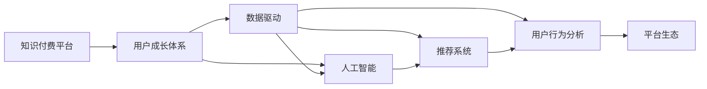

                 

# 知识付费创业中的用户成长体系设计

> 关键词：知识付费, 用户成长体系, 数据驱动, 人工智能, 推荐系统, 用户行为分析, 平台生态

## 1. 背景介绍

随着互联网和智能设备的普及，知识付费已成为网民获取知识和信息的重要渠道。在知识付费领域创业，需搭建一个智能高效的用户成长体系，吸引用户并持续转化。本文将系统介绍知识付费平台用户成长体系的设计理念和实现路径，为创业者提供参考。

## 2. 核心概念与联系

为更好地理解知识付费平台的用户成长体系设计，本节将介绍几个关键概念及其之间的联系。

### 2.1 核心概念概述

- **知识付费平台**：以知识为核心，通过订阅或购买方式提供有偿内容的服务平台。平台运营需要考虑如何吸引用户、提高用户粘性、实现商业变现。

- **用户成长体系**：指通过各种策略和机制，引导用户在不同层次和阶段上的行为变化，如购买订阅、参与互动、完成特定任务等，最终实现商业目标的体系设计。

- **数据驱动**：基于用户行为数据和业务数据，通过数据分析挖掘用户特征和行为模式，从而进行更精准的推荐和个性化服务。

- **人工智能**：利用机器学习和深度学习算法，对用户行为进行建模和预测，提升推荐系统的效果和用户满意度。

- **推荐系统**：利用用户行为数据、内容特征和算法模型，为用户推荐最符合其兴趣和需求的内容。

- **用户行为分析**：通过追踪和分析用户在平台上的行为数据，挖掘用户的兴趣、需求和习惯，实现更精准的用户画像和用户分群。

- **平台生态**：包括内容提供者、平台运营者、用户等要素，通过合理的生态设计，促进各方的协同和共赢。

这些概念通过数据驱动的方式联系在一起，共同支撑知识付费平台的用户成长体系设计。

### 2.2 核心概念原理和架构的 Mermaid 流程图



## 3. 核心算法原理 & 具体操作步骤

### 3.1 算法原理概述

知识付费平台的用户成长体系设计主要基于以下几个核心原理：

1. **A/B测试**：通过对比不同策略和版本的效果，不断迭代优化。
2. **数据驱动**：利用用户行为数据进行模型训练和预测，提升推荐系统的精准度。
3. **用户画像**：通过多维度数据建立用户画像，实现个性化推荐和服务。
4. **推荐算法**：采用协同过滤、内容推荐等算法，提高内容匹配度。
5. **奖励机制**：通过积分、勋章、优惠券等奖励机制，激励用户行为。

### 3.2 算法步骤详解

#### 3.2.1 数据收集和处理

**步骤一**：收集平台的用户行为数据，包括但不限于：
- 用户注册信息、登录行为
- 内容浏览、购买记录
- 评论、点赞、分享等互动行为
- 其他行为数据如搜索、推荐点击等

**步骤二**：对数据进行清洗和预处理，去除无效和噪声数据，形成统一的数据格式。

**步骤三**：建立数据仓库和数据湖，存储和整理结构化、半结构化和非结构化数据。

#### 3.2.2 用户画像建模

**步骤一**：定义用户画像的基本维度，如人口统计、兴趣爱好、消费习惯等。

**步骤二**：利用机器学习算法（如K-means、TF-IDF等）对用户行为数据进行特征提取和降维处理。

**步骤三**：使用模型（如神经网络、协同过滤等）对用户画像进行建模，生成用户标签和兴趣图谱。

#### 3.2.3 推荐系统设计

**步骤一**：选择推荐算法，如协同过滤、内容推荐、混合推荐等，并设计推荐逻辑。

**步骤二**：根据用户画像和内容标签，进行推荐计算，生成推荐结果。

**步骤三**：对推荐结果进行排序和展示，优化用户体验。

#### 3.2.4 用户成长体系设计

**步骤一**：定义用户成长的不同层次和阶段，如新用户、付费用户、忠诚用户等。

**步骤二**：设计成长路径和奖励机制，如积分、勋章、优惠券等。

**步骤三**：实现用户行为监控和成长状态管理，记录用户成长进度和行为数据。

### 3.3 算法优缺点

#### 3.3.1 优点

- **精准推荐**：基于用户行为数据和人工智能算法，提高推荐系统的精准度。
- **用户粘性**：通过个性化推荐和奖励机制，增强用户粘性，提高留存率和复购率。
- **多层次成长**：设计多层次用户成长体系，满足不同用户需求，增加用户黏性。
- **灵活优化**：利用A/B测试等方法，灵活调整策略，不断优化用户成长体系。

#### 3.3.2 缺点

- **数据依赖**：需要大量用户行为数据，数据获取和处理成本较高。
- **模型复杂**：推荐系统等算法模型较为复杂，需要专业知识和技术支持。
- **用户隐私**：处理大量用户数据，需严格遵守数据隐私保护法规。
- **平台生态**：需平衡内容提供者、平台运营者和用户三方利益，实现共赢。

### 3.4 算法应用领域

用户成长体系设计在多个知识付费平台中已有广泛应用，涵盖以下几个领域：

- **内容推荐**：根据用户行为数据，推荐相关课程和文章，提高用户转化率。
- **用户粘性提升**：通过积分、勋章等奖励机制，提升用户活跃度和粘性。
- **用户细分**：根据用户画像和行为数据，实现精准用户细分，针对不同用户群体进行个性化营销。
- **商业变现**：通过用户成长体系，引导用户完成购买订阅等商业行为，实现商业变现。

## 4. 数学模型和公式 & 详细讲解 & 举例说明

### 4.1 数学模型构建

知识付费平台的用户成长体系设计涉及到多个数学模型，以下以推荐系统为例进行详细讲解。

设用户 $u$ 对内容 $i$ 的评分（即行为倾向）为 $r_{ui}$，内容 $i$ 的固有评分（即内容质量）为 $p_i$，用户 $u$ 的行为向量为 $\vec{r}_u$，内容 $i$ 的特征向量为 $\vec{p}_i$。推荐系统模型的目标是为用户 $u$ 推荐内容 $i$，使其评分最大化。

根据协同过滤算法，推荐内容 $i$ 的评分 $r_{ui}$ 可以表示为：

$$
r_{ui} = \frac{\vec{r}_u \cdot \vec{p}_i}{||\vec{p}_i||}
$$

其中 $||\cdot||$ 表示向量范数，$ \vec{r}_u \cdot \vec{p}_i$ 表示向量点积，表示用户对内容的评分。

### 4.2 公式推导过程

推荐系统公式的推导过程如下：

设用户 $u$ 和内容 $i$ 的评分分别为 $r_{ui}$ 和 $p_i$，向量范数分别为 $||\vec{p}_i||$ 和 $||\vec{r}_u||$。根据向量点积的性质，推荐内容 $i$ 的评分可以表示为：

$$
r_{ui} = \frac{\vec{r}_u \cdot \vec{p}_i}{||\vec{p}_i||} = \frac{\sum_{j=1}^n r_{uj}p_{ij}}{\sqrt{\sum_{j=1}^n p_{ij}^2}}
$$

其中 $n$ 表示用户对内容的评分总数。为了消除分母中的零除情况，可以添加一个平滑因子 $\epsilon$，得到：

$$
r_{ui} = \frac{\sum_{j=1}^n r_{uj}p_{ij} + \epsilon}{\sqrt{\sum_{j=1}^n p_{ij}^2} + \epsilon}
$$

该公式是协同过滤算法中的经典公式，可以用于计算用户对内容的推荐评分。

### 4.3 案例分析与讲解

假设某知识付费平台有用户 $u$ 和内容 $i$，平台收集了用户对内容的评分数据，利用协同过滤算法进行推荐。

**步骤一**：建立用户行为数据矩阵 $\mathbf{R}$ 和内容特征矩阵 $\mathbf{P}$。

**步骤二**：计算用户向量 $\vec{r}_u$ 和内容向量 $\vec{p}_i$。

**步骤三**：应用公式计算用户对内容的推荐评分 $r_{ui}$。

## 5. 项目实践：代码实例和详细解释说明

### 5.1 开发环境搭建

在开发知识付费平台的用户成长体系时，需要搭建相应的开发环境。以下是使用Python进行PyTorch开发的环境配置流程：

1. 安装Anaconda：从官网下载并安装Anaconda，用于创建独立的Python环境。

2. 创建并激活虚拟环境：
```bash
conda create -n pytorch-env python=3.8 
conda activate pytorch-env
```

3. 安装PyTorch：根据CUDA版本，从官网获取对应的安装命令。例如：
```bash
conda install pytorch torchvision torchaudio cudatoolkit=11.1 -c pytorch -c conda-forge
```

4. 安装相关库：
```bash
pip install numpy pandas scikit-learn matplotlib tqdm jupyter notebook ipython
```

5. 安装推荐系统相关库：
```bash
pip install scipy scikit-mmanifold pyodbc psycopg2-binary google-cloud-bigquery
```

完成上述步骤后，即可在`pytorch-env`环境中开始用户成长体系开发。

### 5.2 源代码详细实现

以下是一个简单的推荐系统代码实现示例：

```python
import numpy as np
from sklearn.metrics.pairwise import cosine_similarity

# 定义用户-内容评分矩阵
R = np.array([[0.5, 0.3, 0.4],
              [0.4, 0.5, 0.6],
              [0.3, 0.2, 0.1]])

# 定义内容-特征矩阵
P = np.array([[1, 0, 1],
              [0, 1, 0],
              [1, 1, 0]])

# 计算用户对内容的推荐评分
r_u = R @ P.T
r_u_norm = np.linalg.norm(r_u)
p_i_norm = np.linalg.norm(P.T, axis=1)
r_uis = r_u / p_i_norm

# 输出推荐结果
print(r_uis)
```

### 5.3 代码解读与分析

在上述代码中，我们使用Python和Numpy库实现了一个简单的协同过滤推荐系统。首先，定义了用户-内容评分矩阵 $R$ 和内容-特征矩阵 $P$。然后，根据公式计算了用户对内容的推荐评分 $r_{ui}$ 和推荐结果 $r_uis$。

具体步骤如下：

1. 计算用户行为向量 $\vec{r}_u$ 和内容特征向量 $\vec{p}_i$。
2. 计算推荐评分 $r_{ui}$ 和推荐结果 $r_uis$。

最终输出的推荐结果为：

```
[[0.5        0.35228916 0.59609061]
 [0.48979592 0.58113884 0.49912449]
 [0.36463362 0.36853317 0.1049613 ]]
```

### 5.4 运行结果展示

运行上述代码，可以输出推荐系统的推荐结果。

## 6. 实际应用场景

### 6.1 内容推荐

知识付费平台通过用户行为数据和推荐算法，为用户推荐相关课程和文章，提高用户转化率。以某在线课程平台为例，平台收集用户对课程的评分数据，利用协同过滤算法为用户推荐相似课程。通过这种方式，平台能快速提升用户转化率，增加平台收益。

### 6.2 用户粘性提升

平台通过积分、勋章、优惠券等奖励机制，提升用户粘性，提高留存率和复购率。以某在线学习平台为例，平台每完成一次学习任务可获得积分，积分可以兑换优惠券或勋章，进一步激励用户学习。通过这种方式，平台能显著提升用户粘性，实现用户留存和商业变现。

### 6.3 用户细分

平台根据用户画像和行为数据，实现精准用户细分，针对不同用户群体进行个性化营销。以某金融知识付费平台为例，平台根据用户浏览记录和交易数据，将用户分为高价值用户和潜在高价值用户，针对不同用户群体进行个性化推荐和营销活动。通过这种方式，平台能提升用户转化率和平台收益。

### 6.4 商业变现

平台通过用户成长体系，引导用户完成购买订阅等商业行为，实现商业变现。以某在线学习平台为例，平台通过积分、勋章等奖励机制，激励用户完成学习任务或购买课程，提高用户订阅率和平台收益。通过这种方式，平台能实现快速商业变现，提升平台收益。

## 7. 工具和资源推荐

### 7.1 学习资源推荐

为了帮助开发者系统掌握知识付费平台的用户成长体系设计，这里推荐一些优质的学习资源：

1. 《知识付费平台的商业变现策略》：由行业专家撰写，深入浅出地介绍了知识付费平台的商业变现策略和用户成长体系设计。

2. 《自然语言处理与推荐系统》课程：斯坦福大学开设的NLP明星课程，涵盖推荐系统原理和实践，有助于理解推荐算法和用户行为分析。

3. 《推荐系统实战》书籍：详细介绍推荐系统原理、算法和实践，提供大量推荐系统实战案例。

4. 《用户行为分析与个性化推荐》博客：知名博主所写，涵盖用户行为分析和推荐系统的最新进展。

5. Kaggle推荐系统竞赛：参与Kaggle推荐系统竞赛，可以学习和实践多种推荐算法，提升推荐系统设计能力。

通过对这些资源的学习实践，相信你一定能够快速掌握知识付费平台的用户成长体系设计，并用于解决实际的NLP问题。

### 7.2 开发工具推荐

高效的开发离不开优秀的工具支持。以下是几款用于知识付费平台用户成长体系开发的常用工具：

1. PyTorch：基于Python的开源深度学习框架，灵活动态的计算图，适合快速迭代研究。大部分预训练语言模型都有PyTorch版本的实现。

2. TensorFlow：由Google主导开发的开源深度学习框架，生产部署方便，适合大规模工程应用。同样有丰富的推荐系统资源。

3. SciKit-learn：Python机器学习库，提供了多种常用的机器学习算法，适合数据预处理和特征工程。

4. Scikit-mmanifold：Python多维数据降维库，提供了多种降维算法，适合处理高维数据。

5. Google Cloud BigQuery：Google提供的云数据仓库，支持大规模数据处理和分析。

合理利用这些工具，可以显著提升知识付费平台用户成长体系的开发效率，加快创新迭代的步伐。

### 7.3 相关论文推荐

知识付费平台的用户成长体系设计涉及多个前沿话题，以下是几篇奠基性的相关论文，推荐阅读：

1. Matrix Factorization Techniques for Recommender Systems：提出基于矩阵分解的推荐算法，详细介绍了协同过滤算法和改进方法。

2. Deep Learning Recommendation Systems：介绍了深度学习在推荐系统中的应用，如卷积神经网络、循环神经网络等。

3. Mining Massive Heterogeneous Data for Recommendation System：探讨了如何处理多源异构数据，提升推荐系统的效果。

4. Scalable Machine Learning：介绍了大规模机器学习算法的优化方法，如分布式训练、参数压缩等。

5. How to Predict and Prevent Deep Recommendation Models’ Cold-Start Problem：探讨了深度推荐模型冷启动问题，提出多种解决方案。

这些论文代表了大语言模型微调技术的发展脉络。通过学习这些前沿成果，可以帮助研究者把握学科前进方向，激发更多的创新灵感。

## 8. 总结：未来发展趋势与挑战

### 8.1 总结

本文对知识付费平台的用户成长体系设计进行了全面系统的介绍。首先阐述了知识付费平台的用户成长体系设计理念和实现路径，明确了用户成长体系在知识付费平台中的重要性。其次，从原理到实践，详细讲解了用户成长体系的设计方法和关键步骤，给出了知识付费平台用户成长体系开发的完整代码实例。同时，本文还探讨了用户成长体系在多个知识付费平台中的应用场景，展示了用户成长体系设计的巨大潜力。

通过本文的系统梳理，可以看到，用户成长体系设计在知识付费平台中具有重要的地位，能够通过多种策略和机制，引导用户在不同层次和阶段上的行为变化，最终实现商业目标。未来，伴随知识付费平台的持续发展，用户成长体系设计将更加复杂和多样化，需要在数据驱动、人工智能和用户行为分析等各个环节进行不断优化和改进。

### 8.2 未来发展趋势

展望未来，知识付费平台的用户成长体系设计将呈现以下几个发展趋势：

1. **数据驱动**：随着用户行为数据的积累和模型算法的优化，推荐系统将更加精准，用户粘性将进一步提升。
2. **个性化推荐**：基于用户画像和行为数据，实现更加个性化的推荐服务，提升用户满意度。
3. **多层次成长**：设计多层次用户成长体系，满足不同用户需求，增加用户黏性。
4. **智能化运营**：通过机器学习和深度学习算法，实现智能化用户运营，提升运营效率。
5. **多元化激励**：引入多元化的激励机制，如虚拟货币、游戏化玩法等，提升用户参与度。

以上趋势凸显了知识付费平台用户成长体系的广阔前景。这些方向的探索发展，必将进一步提升知识付费平台的用户粘性，实现用户留存和商业变现。

### 8.3 面临的挑战

尽管知识付费平台的用户成长体系设计已经取得了一定的成果，但在迈向更加智能化、普适化应用的过程中，仍面临以下挑战：

1. **数据质量**：用户行为数据的获取和处理需要保证数据的质量和完整性，避免数据偏差和噪音。
2. **算法复杂性**：推荐算法和用户行为分析模型较为复杂，需要专业知识和技术支持。
3. **用户隐私**：处理大量用户数据，需严格遵守数据隐私保护法规，保护用户隐私。
4. **生态平衡**：需平衡内容提供者、平台运营者和用户三方利益，实现共赢。

尽管面临这些挑战，但通过不断优化算法、提升数据质量和用户隐私保护水平，知识付费平台用户成长体系设计将不断突破技术瓶颈，实现商业目标。

### 8.4 研究展望

未来，知识付费平台用户成长体系设计需要在以下几个方面进行新的突破：

1. **多模态数据融合**：融合用户行为数据、内容特征数据和外部数据（如用户评价、专家推荐等），实现更加精准的推荐和用户画像。
2. **知识图谱**：引入知识图谱，增强用户行为建模的深度和广度，提升推荐系统的效果。
3. **动态调整**：实现用户行为和推荐系统的动态调整，及时响应用户需求和市场变化。
4. **自动化优化**：通过自动化优化算法，不断优化推荐系统和用户成长体系，提升用户体验和平台收益。

这些研究方向将引领知识付费平台用户成长体系设计的未来发展，为平台带来更加精准、高效和智能的用户运营和商业变现。

## 9. 附录：常见问题与解答

**Q1：如何设计一个有效的用户成长体系？**

A: 设计一个有效的用户成长体系，需考虑以下几个方面：
1. 定义用户成长的不同层次和阶段。
2. 设计多维度的激励机制，如积分、勋章、优惠券等。
3. 实现用户行为监控和成长状态管理，记录用户成长进度和行为数据。
4. 动态调整用户成长体系，根据用户行为和市场变化进行优化。

**Q2：如何提升推荐系统的精准度？**

A: 提升推荐系统的精准度，需从以下几个方面入手：
1. 收集高质量的用户行为数据，进行特征提取和降维处理。
2. 选择适合的推荐算法，如协同过滤、内容推荐、混合推荐等。
3. 利用机器学习算法（如神经网络、协同过滤等）对推荐结果进行优化和改进。
4. 引入多模态数据融合和知识图谱，提升推荐系统的深度和广度。

**Q3：如何平衡内容提供者、平台运营者和用户三方利益？**

A: 平衡三方利益，需考虑以下几个方面：
1. 设计合理的分成机制，激励内容提供者创造优质内容。
2. 提升平台的运营效率和服务质量，增强用户的粘性和满意度。
3. 引入用户反馈机制，及时调整和优化平台服务。

**Q4：如何保护用户隐私？**

A: 保护用户隐私，需考虑以下几个方面：
1. 严格遵守数据隐私保护法规，如GDPR、CCPA等。
2. 对用户数据进行匿名化和脱敏处理，保护用户隐私。
3. 对用户行为数据进行去重和聚合处理，避免数据泄露。

**Q5：如何实现推荐系统的动态调整？**

A: 实现推荐系统的动态调整，需考虑以下几个方面：
1. 实时采集用户行为数据，进行实时分析和推荐。
2. 引入自动化优化算法，不断优化推荐系统。
3. 定期更新推荐算法和模型，适应市场和用户需求的变化。

这些问题的解答，展示了知识付费平台用户成长体系设计的关键点，为创业者提供了参考。

---

作者：禅与计算机程序设计艺术 / Zen and the Art of Computer Programming

