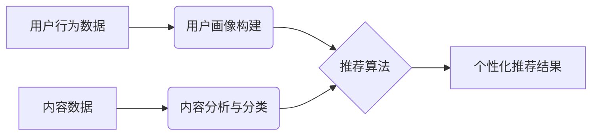

> 信息过载，个性化推荐，协同过滤，内容过滤，机器学习，推荐系统，用户行为分析

## 1. 背景介绍

在当今信息爆炸的时代，我们每天接触的海量信息呈指数级增长。从新闻资讯、社交媒体到电商平台，无处不在的信息流让人难以消化，造成信息过载的现象日益严重。信息过载不仅影响我们的工作效率和学习效率，还会导致心理压力和认知疲劳。

个性化推荐作为一种有效的解决方案，旨在根据用户的兴趣、偏好和行为，精准地推送相关信息，帮助用户过滤掉无关信息，提高信息获取效率和用户体验。

## 2. 核心概念与联系

个性化推荐的核心是理解用户的需求和偏好，并根据这些信息提供定制化的服务。它涉及到多个领域，包括：

* **用户行为分析:** 通过分析用户的浏览记录、购买历史、点赞行为等数据，挖掘用户的兴趣和偏好。
* **内容分析:** 对信息内容进行分类、标签化和语义分析，识别内容的主题、类别和相关性。
* **推荐算法:** 基于用户行为和内容分析的结果，设计算法生成个性化推荐列表。

**个性化推荐系统架构**



## 3. 核心算法原理 & 具体操作步骤

### 3.1  算法原理概述

个性化推荐算法主要分为两大类：

* **协同过滤:** 基于用户的相似性或物品的相似性进行推荐。
* **内容过滤:** 基于物品的特征和用户对特征的偏好进行推荐。

### 3.2  算法步骤详解

**协同过滤算法**

1. **构建用户-物品交互矩阵:** 将用户和物品作为矩阵的行和列，用户对物品的交互行为（例如评分、购买）作为矩阵元素。
2. **计算用户相似度:** 使用余弦相似度、皮尔逊相关系数等方法计算用户之间的相似度。
3. **寻找邻居用户:** 根据用户相似度，找到与目标用户相似的邻居用户。
4. **生成推荐列表:** 从邻居用户的交互行为中，提取目标用户未交互过的物品，并根据物品的评分或购买频率进行排序，生成推荐列表。

**内容过滤算法**

1. **提取物品特征:** 对物品进行特征提取，例如电影的类型、演员、导演等。
2. **构建用户-特征偏好矩阵:** 将用户和特征作为矩阵的行和列，用户对特征的偏好程度作为矩阵元素。
3. **计算物品与用户偏好匹配度:** 使用余弦相似度、点积等方法计算物品的特征与用户的偏好匹配度。
4. **生成推荐列表:** 根据物品与用户偏好匹配度排序，生成推荐列表。

### 3.3  算法优缺点

**协同过滤算法**

* **优点:** 可以发现用户隐性偏好，推荐更精准的物品。
* **缺点:** 数据稀疏性问题，当用户交互数据较少时，难以准确计算相似度。

**内容过滤算法**

* **优点:** 不需要大量用户交互数据，可以推荐新物品。
* **缺点:** 难以捕捉用户隐性偏好，推荐结果可能过于单一。

### 3.4  算法应用领域

个性化推荐算法广泛应用于以下领域：

* **电商平台:** 推荐商品、优惠券、促销活动。
* **视频网站:** 推荐视频、电视剧、电影。
* **音乐平台:** 推荐歌曲、专辑、音乐人。
* **社交媒体:** 推荐好友、群组、话题。
* **新闻资讯:** 推荐新闻文章、博客、论坛帖子。

## 4. 数学模型和公式 & 详细讲解 & 举例说明

### 4.1  数学模型构建

协同过滤算法的数学模型通常基于用户-物品交互矩阵，其中每个元素表示用户对物品的评分或交互行为。

**用户-物品交互矩阵:**

```
| 用户1 | 用户2 | 用户3 |
|---|---|---|
| 物品1 | 5 | 3 | 2 |
| 物品2 | 4 | 2 | 5 |
| 物品3 | 3 | 5 | 4 |
```

### 4.2  公式推导过程

**余弦相似度:**

$$
\text{相似度}(u_i, u_j) = \frac{u_i \cdot u_j}{||u_i|| ||u_j||}
$$

其中:

* $u_i$ 和 $u_j$ 是两个用户的交互向量。
* $u_i \cdot u_j$ 是两个向量的点积。
* $||u_i||$ 和 $||u_j||$ 是两个向量的模长。

### 4.3  案例分析与讲解

假设有两个用户，用户1和用户2，他们的交互向量分别为:

* $u_1 = [5, 4, 3]$
* $u_2 = [3, 2, 5]$

则他们的余弦相似度为:

$$
\text{相似度}(u_1, u_2) = \frac{5 \cdot 3 + 4 \cdot 2 + 3 \cdot 5}{\sqrt{5^2 + 4^2 + 3^2} \sqrt{3^2 + 2^2 + 5^2}} = \frac{15 + 8 + 15}{\sqrt{50} \sqrt{38}} = \frac{38}{\sqrt{1900}}
$$

## 5. 项目实践：代码实例和详细解释说明

### 5.1  开发环境搭建

* Python 3.x
* scikit-learn
* pandas
* numpy

### 5.2  源代码详细实现

```python
import pandas as pd
from sklearn.metrics.pairwise import cosine_similarity

# 加载用户-物品交互数据
data = pd.read_csv('user_item_interactions.csv')

# 构建用户-物品交互矩阵
user_item_matrix = data.pivot_table(index='user_id', columns='item_id', values='rating')

# 计算用户相似度
user_similarity = cosine_similarity(user_item_matrix)

# 寻找邻居用户
target_user_id = 1
similar_users = user_similarity[target_user_id].argsort()[:-6:-1]  # 排除自身

# 生成推荐列表
recommended_items = []
for similar_user in similar_users:
    for item_id in user_item_matrix.columns:
        if user_item_matrix.loc[similar_user, item_id] > 0 and item_id not in user_item_matrix.loc[target_user_id].index:
            recommended_items.append(item_id)

# 打印推荐列表
print(f'推荐给用户 {target_user_id} 的物品：{recommended_items}')
```

### 5.3  代码解读与分析

* 首先，加载用户-物品交互数据，并构建用户-物品交互矩阵。
* 然后，使用余弦相似度计算用户之间的相似度。
* 接下来，根据相似度找到邻居用户，并生成推荐列表。
* 最后，打印推荐列表。

### 5.4  运行结果展示

运行代码后，将输出推荐给目标用户的物品列表。

## 6. 实际应用场景

个性化推荐在各个领域都有广泛的应用场景：

* **电商平台:** 根据用户的浏览历史、购买记录和评分，推荐相关的商品、优惠券和促销活动。
* **视频网站:** 根据用户的观看历史、点赞记录和评论，推荐相关的视频、电视剧和电影。
* **音乐平台:** 根据用户的播放历史、收藏记录和评论，推荐相关的歌曲、专辑和音乐人。
* **社交媒体:** 根据用户的关注者、好友和互动记录，推荐相关的用户、群组和话题。
* **新闻资讯:** 根据用户的阅读历史、点赞记录和分享记录，推荐相关的新闻文章、博客和论坛帖子。

### 6.4  未来应用展望

随着人工智能技术的不断发展，个性化推荐将更加智能化、精准化和个性化。未来，个性化推荐将应用于更多领域，例如：

* **教育:** 根据学生的学习进度、兴趣和能力，推荐相关的学习资源和课程。
* **医疗:** 根据患者的病史、症状和体征，推荐相关的医疗服务和药物。
* **金融:** 根据用户的投资目标、风险偏好和财务状况，推荐相关的投资产品和理财方案。

## 7. 工具和资源推荐

### 7.1  学习资源推荐

* **书籍:**
    * 《推荐系统》
    * 《机器学习》
    * 《数据挖掘》
* **在线课程:**
    * Coursera: Recommender Systems
    * edX: Machine Learning
    * Udacity: Data Science Nanodegree

### 7.2  开发工具推荐

* **Python:** 
    * scikit-learn
    * pandas
    * numpy
* **Spark:** 
    * MLlib

### 7.3  相关论文推荐

* **Collaborative Filtering for Implicit Feedback Datasets**
* **Matrix Factorization Techniques for Recommender Systems**
* **A Survey on Content-Based Recommendation Systems**

## 8. 总结：未来发展趋势与挑战

### 8.1  研究成果总结

个性化推荐技术取得了显著的进展，能够有效地解决信息过载问题，提升用户体验。协同过滤和内容过滤算法是两种主流的推荐算法，各有优缺点。

### 8.2  未来发展趋势

* **深度学习:** 将深度学习技术应用于个性化推荐，提高推荐的准确性和个性化程度。
* **多模态推荐:** 融合文本、图像、音频等多模态数据，构建更全面的用户画像，提供更精准的推荐。
* **解释性推荐:** 使推荐结果更加透明可解释，帮助用户理解推荐背后的逻辑。

### 8.3  面临的挑战

* **数据稀疏性:** 用户交互数据往往稀疏，难以准确计算相似度。
* **冷启动问题:** 新用户和新物品难以获得推荐，需要新的算法和策略解决。
* **公平性问题:** 个性化推荐可能导致信息茧房效应，需要保证推荐结果的公平性和多样性。

### 8.4  研究展望

未来，个性化推荐技术将继续朝着更智能化、精准化和个性化的方向发展，为用户提供更优质的体验。


## 9. 附录：常见问题与解答

**Q1: 协同过滤和内容过滤算法有什么区别？**

**A1:** 协同过滤算法基于用户的相似性或物品的相似性进行推荐，而内容过滤算法基于物品的特征和用户对特征的偏好进行推荐。

**Q2: 如何解决数据稀疏性问题？**

**A2:** 可以使用矩阵分解、隐语义模型等方法，从稀疏数据中挖掘潜在的模式。

**Q3: 如何应对冷启动问题？**

**A3:** 可以使用基于内容的推荐、基于用户的行为推荐等方法，为新用户和新物品提供初始推荐。

**Q4: 如何保证推荐结果的公平性和多样性？**

**A4:** 可以使用公平性约束、多样性优化等方法，避免信息茧房效应。


作者：禅与计算机程序设计艺术 / Zen and the Art of Computer Programming 
<end_of_turn>