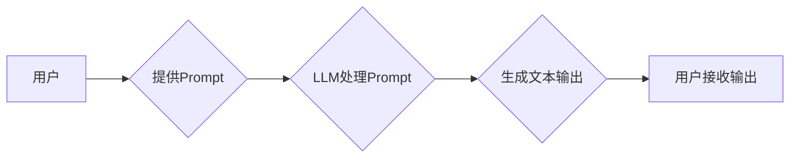

>  *  大语言模型
>  *  Prompt Engineering
>  *  Few-Shot Learning
>  *  Fine-Tuning
>  *  知识蒸馏
>  *  自监督学习
>  *  迁移学习

## 1. 背景介绍

近年来，大语言模型（LLM）在自然语言处理领域取得了令人瞩目的成就，其强大的文本生成、理解和翻译能力为各种应用场景提供了无限可能。然而，LLM的应用也面临着一个关键挑战：Prompt Engineering。

Prompt Engineering是指设计高质量的输入提示，以引导LLM生成准确、相关和符合预期结果的输出。然而，设计有效的Prompt往往需要大量的经验和技巧，并且对于不同的任务和模型，最佳的Prompt可能会有所不同。这使得Prompt Engineering成为LLM应用的一个瓶颈，限制了其更广泛的普及和应用。

## 2. 核心概念与联系

Prompt Engineering的核心在于理解LLM的工作机制，以及如何有效地与模型进行交互。LLM本质上是一个复杂的统计模型，它通过学习海量文本数据来预测下一个词的可能性。

当我们提供一个Prompt时，LLM会将其分解成一系列的词，并根据其训练数据和模型参数，预测每个词的下一个词。最终，LLM会生成一个完整的文本序列作为输出。

为了提高Prompt的有效性，我们需要考虑以下几个方面：

* **明确的任务目标:**  Prompt应该清晰地表达我们想要LLM完成的任务，例如文本生成、翻译、问答等。
* **上下文信息:**  提供足够的上下文信息可以帮助LLM更好地理解我们的意图，并生成更相关的输出。
* **示例数据:**  通过提供一些示例数据，我们可以引导LLM学习特定格式或风格的输出。
* **提示词:**  使用特定的提示词可以引导LLM朝着我们想要的方向生成文本。

**核心概念与联系流程图:**



## 3. 核心算法原理 & 具体操作步骤

为了减少对Prompt Engineering的依赖，研究者们提出了多种方法，例如Few-Shot Learning、Fine-Tuning、知识蒸馏和自监督学习等。

### 3.1  算法原理概述

* **Few-Shot Learning:**  Few-Shot Learning是指在少量示例数据下训练模型，使其能够学习新的任务。对于LLM来说，Few-Shot Learning可以通过在Prompt中添加少量示例数据来实现。

* **Fine-Tuning:**  Fine-Tuning是指在预训练模型的基础上，使用特定任务的数据进行微调，以提高模型在该任务上的性能。

* **知识蒸馏:**  知识蒸馏是指将知识从一个大型模型（教师模型）转移到一个小型模型（学生模型）中。

* **自监督学习:**  自监督学习是指利用无标签数据训练模型，通过预测缺失信息或标记数据中的错误来学习语言表示。

### 3.2  算法步骤详解

**Few-Shot Learning:**

1.  **准备示例数据:**  收集与目标任务相关的少量示例数据。
2.  **构建Prompt:**  将示例数据和目标输入一起添加到Prompt中。
3.  **输入LLM:**  将构建好的Prompt输入到LLM中。
4.  **生成输出:**  LLM根据Prompt和训练数据生成输出。

**Fine-Tuning:**

1.  **选择预训练模型:**  选择一个与目标任务相关的预训练模型。
2.  **准备训练数据:**  收集与目标任务相关的训练数据。
3.  **微调模型参数:**  使用训练数据对预训练模型进行微调，更新模型参数。
4.  **评估模型性能:**  使用验证数据评估模型的性能。

**知识蒸馏:**

1.  **选择教师模型和学生模型:**  选择一个大型预训练模型作为教师模型，选择一个小型模型作为学生模型。
2.  **训练教师模型:**  使用大量数据训练教师模型。
3.  **训练学生模型:**  使用教师模型的输出作为监督信号，训练学生模型。

**自监督学习:**

1.  **构建自监督任务:**  设计一个自监督任务，例如掩码语言模型（MLM）或下一个词预测（NWP）。
2.  **训练模型:**  使用无标签数据训练模型，通过预测缺失信息或标记数据中的错误来学习语言表示。

### 3.3  算法优缺点

| 算法 | 优点 | 缺点 |
|---|---|---|
| Few-Shot Learning |  数据需求低，易于部署 |  性能可能不如Fine-Tuning |
| Fine-Tuning |  性能高，可针对特定任务优化 |  数据需求高，训练时间长 |
| 知识蒸馏 |  可以将大型模型的知识转移到小型模型中，提高效率 |  需要一个强大的教师模型 |
| 自监督学习 |  可以利用无标签数据进行训练，数据需求低 |  训练过程复杂，性能可能不如Fine-Tuning |

### 3.4  算法应用领域

* **Few-Shot Learning:**  代码生成、文本分类、情感分析等。
* **Fine-Tuning:**  机器翻译、问答系统、对话系统等。
* **知识蒸馏:**  资源有限的设备上部署大型模型，降低计算成本。
* **自监督学习:**  预训练语言模型，为下游任务提供强大的基础。

## 4. 数学模型和公式 & 详细讲解 & 举例说明

### 4.1  数学模型构建

Few-Shot Learning的数学模型通常基于Transformer架构，其核心是注意力机制。注意力机制允许模型关注输入序列中与当前任务相关的部分，从而提高学习效率。

### 4.2  公式推导过程

注意力机制的计算公式如下：

$$
Attention(Q, K, V) = softmax(\frac{QK^T}{\sqrt{d_k}})V
$$

其中：

* $Q$：查询矩阵
* $K$：键矩阵
* $V$：值矩阵
* $d_k$：键向量的维度
* $softmax$：softmax函数

### 4.3  案例分析与讲解

假设我们有一个Few-Shot Learning任务，目标是根据少量示例数据，预测新的文本片段的类别。

* $Q$：表示每个词的查询向量。
* $K$：表示每个词的键向量。
* $V$：表示每个词的值向量。

通过计算注意力权重，模型可以关注与目标类别相关的词，并生成更准确的预测结果。

## 5. 项目实践：代码实例和详细解释说明

### 5.1  开发环境搭建

* Python 3.7+
* PyTorch 1.7+
* Transformers 4.10+

### 5.2  源代码详细实现

```python
from transformers import AutoModelForSequenceClassification, AutoTokenizer

# 加载预训练模型和分词器
model_name = "bert-base-uncased"
tokenizer = AutoTokenizer.from_pretrained(model_name)
model = AutoModelForSequenceClassification.from_pretrained(model_name, num_labels=2)

# 定义训练数据
train_data = [
    ("This is a positive sentence.", 1),
    ("This is a negative sentence.", 0),
]

# 构建Prompt
def build_prompt(text, label):
    prompt = f"Classify the following sentence: {text}
Label: {label}"
    return prompt

# Tokenize and encode the data
encoded_data = tokenizer(
    [build_prompt(text, label) for text, label in train_data],
    padding=True,
    truncation=True,
    return_tensors="pt",
)

# Train the model
model.train()
optimizer = torch.optim.AdamW(model.parameters(), lr=2e-5)
for epoch in range(3):
    for batch in encoded_data:
        inputs = batch["input_ids"]
        labels = batch["labels"]
        outputs = model(inputs, labels=labels)
        loss = outputs.loss
        loss.backward()
        optimizer.step()
        optimizer.zero_grad()

# Evaluate the model
model.eval()
```

### 5.3  代码解读与分析

* 代码首先加载预训练的BERT模型和分词器。
* 然后，定义训练数据和构建Prompt函数。
* 使用Tokenizer将数据转换为模型可理解的格式。
* 最后，训练模型并评估其性能。

### 5.4  运行结果展示

训练完成后，我们可以使用模型对新的文本进行分类。

## 6. 实际应用场景

* **聊天机器人:**  减少对Prompt Engineering的依赖，可以使聊天机器人更自然、更流畅地与用户进行对话。
* **文本生成:**  可以生成更符合用户意图的文本，例如新闻文章、故事、诗歌等。
* **代码生成:**  可以根据用户需求生成更准确、更有效的代码。

### 6.4  未来应用展望

随着研究的不断深入，减少对Prompt Engineering依赖的技术将得到更广泛的应用，例如：

* **个性化学习:**  根据用户的学习风格和需求，自动生成个性化的学习内容。
* **自动写作:**  帮助用户自动生成各种类型的文章，例如新闻报道、博客文章、学术论文等。
* **跨语言理解:**  突破语言障碍，实现更流畅的跨语言交流。

## 7. 工具和资源推荐

### 7.1  学习资源推荐

* **论文:**  
    * "Few-Shot Learning with Language Models"
    * "BERT: Pre-training of Deep Bidirectional Transformers for Language Understanding"
    * "Knowledge Distillation"
* **博客:**  
    * The Illustrated Transformer
    * Hugging Face Blog

### 7.2  开发工具推荐

* **Hugging Face Transformers:**  一个开源的工具库，提供各种预训练模型和训练脚本。
* **PyTorch:**  一个开源的深度学习框架。

### 7.3  相关论文推荐

* "BERT: Pre-training of Deep Bidirectional Transformers for Language Understanding"
* "XLNet: Generalized Autoregressive Pretraining for Language Understanding"
* "T5: Text-to-Text Transfer Transformer"

## 8. 总结：未来发展趋势与挑战

### 8.1  研究成果总结

近年来，减少对Prompt Engineering依赖的研究取得了显著进展，例如Few-Shot Learning、Fine-Tuning、知识蒸馏和自监督学习等方法，为LLM的应用提供了新的思路和方向。

### 8.2  未来发展趋势

* **更强大的预训练模型:**  随着计算资源的不断增加，预训练模型的规模和能力将不断提升，从而进一步减少对Prompt Engineering的依赖。
* **更有效的Prompt设计方法:**  研究者们将继续探索更有效的Prompt设计方法，例如使用强化学习、进化算法等技术。
* **跨模态Prompt Engineering:**  将Prompt扩展到多模态数据，例如文本、图像、音频等，实现更丰富的交互体验。

### 8.3  面临的挑战

* **数据标注成本:**  Fine-Tuning和知识蒸馏等方法需要大量的标注数据，这仍然是一个挑战。
* **模型解释性:**  LLM的决策过程往往难以解释，这限制了其在一些安全敏感领域中的应用。
* **公平性和偏见:**  LLM可能继承训练数据中的偏见，导致不公平的结果。

### 8.4  研究展望

未来，减少对Prompt Engineering依赖的研究将继续深入，探索更有效的模型架构、训练方法和应用场景，推动LLM技术向更智能、更通用、更安全的方向发展。

## 9. 附录：常见问题与解答

* **Q:  Few-Shot Learning和Fine-Tuning有什么区别？**

* **A:**  Few-Shot Learning是指在少量示例数据下训练模型，而Fine-Tuning是指在预训练模型的基础上，使用特定任务的数据进行微调。

* **Q:  知识蒸馏可以提高模型的效率吗？**

* **