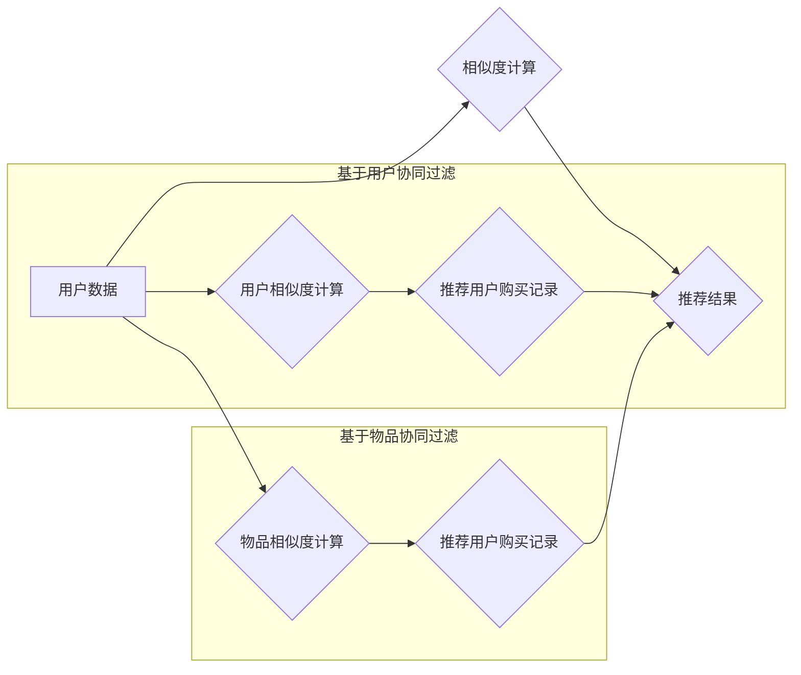

> 协同过滤，推荐系统，电商，算法原理，实践应用，矩阵分解，用户画像

## 1. 背景介绍

在当今数据爆炸的时代，电商平台面临着海量商品和用户，如何精准推荐用户感兴趣的商品，提升用户体验和转化率成为了一个关键问题。协同过滤算法作为一种强大的推荐技术，凭借其能够挖掘用户隐性偏好，提供个性化推荐的能力，在电商推荐系统中得到了广泛应用。

协同过滤算法的核心思想是：**基于用户的相似度或商品的相似度进行推荐**。例如，如果用户A和用户B都喜欢购买类似类型的商品，那么当用户A购买了某个商品后，系统就可以推测用户B也可能喜欢这个商品。

## 2. 核心概念与联系

协同过滤算法主要分为两种类型：**基于用户的协同过滤**和**基于物品的协同过滤**。

**2.1 基于用户的协同过滤**

基于用户的协同过滤算法，通过分析用户之间的购买行为相似度，推荐与用户兴趣相似的其他用户的购买记录。

**2.2 基于物品的协同过滤**

基于物品的协同过滤算法，通过分析商品之间的购买关联度，推荐与用户之前购买的商品相似的其他商品。

**2.3 协同过滤算法流程图**



## 3. 核心算法原理 & 具体操作步骤

### 3.1 算法原理概述

协同过滤算法的核心是计算用户或商品之间的相似度。常用的相似度度量方法包括余弦相似度、皮尔逊相关系数、马氏距离等。

### 3.2 算法步骤详解

1. **数据预处理**: 对用户购买数据进行清洗、去重、格式化等处理，构建用户-商品交互矩阵。
2. **相似度计算**: 根据选定的相似度度量方法，计算用户之间的相似度或商品之间的相似度。
3. **推荐结果生成**: 根据用户或商品的相似度，推荐与用户兴趣相似的商品或与用户购买的商品相似的商品。

### 3.3 算法优缺点

**优点**:

* 能够挖掘用户隐性偏好，提供个性化推荐。
* 不需要人工标注数据，算法本身能够学习用户兴趣。

**缺点**:

* **冷启动问题**: 对新用户或新商品的推荐效果较差。
* **数据稀疏性问题**: 用户-商品交互矩阵通常是稀疏的，会影响算法的准确性。
* **数据规模问题**: 随着用户和商品数量的增加，算法的计算复杂度会显著提高。

### 3.4 算法应用领域

协同过滤算法广泛应用于电商推荐、电影推荐、音乐推荐、新闻推荐等领域。

## 4. 数学模型和公式 & 详细讲解 & 举例说明

### 4.1 数学模型构建

协同过滤算法的核心是构建用户-商品交互矩阵，该矩阵的元素表示用户对商品的评分或购买行为。

**用户-商品交互矩阵**:

$$
R = \begin{bmatrix}
r_{11} & r_{12} & \cdots & r_{1m} \\
r_{21} & r_{22} & \cdots & r_{2m} \\
\vdots & \vdots & \ddots & \vdots \\
r_{n1} & r_{n2} & \cdots & r_{nm}
\end{bmatrix}
$$

其中，$r_{ij}$ 表示用户$i$对商品$j$的评分或购买行为，$n$表示用户数量，$m$表示商品数量。

### 4.2 公式推导过程

**余弦相似度**:

$$
\text{sim}(u_i, u_j) = \frac{u_i \cdot u_j}{||u_i|| ||u_j||}
$$

其中，$u_i$和$u_j$分别表示用户$i$和用户$j$的特征向量，$u_i \cdot u_j$表示两个向量之间的点积，$||u_i||$和$||u_j||$分别表示两个向量的模长。

**皮尔逊相关系数**:

$$
\text{corr}(u_i, u_j) = \frac{\sum_{k=1}^{m}(u_{ik} - \bar{u}_i)(u_{jk} - \bar{u}_j)}{\sqrt{\sum_{k=1}^{m}(u_{ik} - \bar{u}_i)^2} \sqrt{\sum_{k=1}^{m}(u_{jk} - \bar{u}_j)^2}}
$$

其中，$u_{ik}$表示用户$i$对商品$k$的评分，$\bar{u}_i$表示用户$i$的平均评分。

### 4.3 案例分析与讲解

假设有两个用户A和B，他们的购买记录如下：

| 商品 | 用户A | 用户B |
|---|---|---|
| 商品1 | 5 | 4 |
| 商品2 | 3 | 5 |
| 商品3 | 4 | 3 |
| 商品4 | 5 | 5 |

我们可以计算用户A和用户B之间的余弦相似度：

$$
\text{sim}(A, B) = \frac{(5 \cdot 4) + (3 \cdot 5) + (4 \cdot 3) + (5 \cdot 5)}{\sqrt{(5^2 + 3^2 + 4^2 + 5^2)} \sqrt{(4^2 + 5^2 + 3^2 + 5^2)}}
$$

计算结果表明，用户A和用户B之间的相似度较高，因此我们可以推荐用户B喜欢购买的商品给用户A。

## 5. 项目实践：代码实例和详细解释说明

### 5.1 开发环境搭建

* Python 3.x
* Pandas
* Scikit-learn

### 5.2 源代码详细实现

```python
import pandas as pd
from sklearn.metrics.pairwise import cosine_similarity

# 加载用户-商品交互数据
data = pd.read_csv('user_item_data.csv')

# 构建用户-商品交互矩阵
user_item_matrix = data.pivot_table(index='user_id', columns='item_id', values='rating')

# 计算用户之间的余弦相似度
user_similarity = cosine_similarity(user_item_matrix)

# 获取用户A的相似用户
user_A_id = 1
similar_users = user_similarity[user_A_id].argsort()[:-6:-1]  # 排序获取相似用户

# 推荐给用户A的商品
recommended_items = []
for similar_user in similar_users:
    # 获取相似用户购买的商品
    similar_user_items = user_item_matrix.loc[similar_user].index
    # 过滤掉用户A已经购买的商品
    new_items = set(similar_user_items) - set(user_item_matrix.loc[user_A_id].index)
    recommended_items.extend(new_items)

# 输出推荐结果
print(f'推荐给用户{user_A_id}的商品：{recommended_items}')
```

### 5.3 代码解读与分析

* 首先，我们加载用户-商品交互数据，并构建用户-商品交互矩阵。
* 然后，我们使用Scikit-learn库中的`cosine_similarity`函数计算用户之间的余弦相似度。
* 接着，我们获取用户A的相似用户，并推荐相似用户购买的商品给用户A。

### 5.4 运行结果展示

运行上述代码后，会输出用户A的推荐商品列表。

## 6. 实际应用场景

协同过滤算法在电商推荐系统中有着广泛的应用场景，例如：

* **商品推荐**: 根据用户的购买历史和兴趣，推荐用户可能感兴趣的商品。
* **个性化推荐**: 根据用户的个人特征和偏好，提供个性化的商品推荐。
* **新品推荐**: 推荐新上架的商品给用户。
* **关联推荐**: 根据用户购买的商品，推荐与之相关的商品。

### 6.4 未来应用展望

随着人工智能技术的不断发展，协同过滤算法在电商推荐系统中的应用将会更加智能化和个性化。例如，可以结合深度学习技术，构建更复杂的推荐模型，能够更好地理解用户的隐性需求。

## 7. 工具和资源推荐

### 7.1 学习资源推荐

* **书籍**:
    * 《推荐系统》
    * 《机器学习》
* **在线课程**:
    * Coursera: Recommender Systems
    * edX: Machine Learning

### 7.2 开发工具推荐

* **Python**: 
    * Pandas
    * Scikit-learn
    * TensorFlow
    * PyTorch

### 7.3 相关论文推荐

* **协同过滤算法**:
    * "Collaborative Filtering: A User-Based Approach"
    * "Collaborative Filtering: Item-Based Approach"
* **深度学习推荐**:
    * "Deep Learning for Recommender Systems"
    * "Neural Collaborative Filtering"

## 8. 总结：未来发展趋势与挑战

### 8.1 研究成果总结

协同过滤算法在电商推荐系统中取得了显著的成果，能够有效地挖掘用户隐性偏好，提供个性化推荐。

### 8.2 未来发展趋势

* **深度学习**: 将深度学习技术应用于协同过滤算法，构建更复杂的推荐模型。
* **多模态推荐**: 将文本、图像、视频等多模态数据融合到协同过滤算法中，提供更全面的用户体验。
* **联邦学习**: 利用联邦学习技术，在保护用户隐私的前提下进行协同过滤算法训练。

### 8.3 面临的挑战

* **数据稀疏性**: 用户-商品交互矩阵通常是稀疏的，会影响算法的准确性。
* **冷启动问题**: 对新用户或新商品的推荐效果较差。
* **公平性问题**: 算法可能会存在偏见，导致某些用户或商品得到不公平的推荐。

### 8.4 研究展望

未来，协同过滤算法的研究将更加注重解决数据稀疏性、冷启动问题和公平性问题，并探索更智能、更个性化的推荐方法。

## 9. 附录：常见问题与解答

**Q1: 协同过滤算法的冷启动问题如何解决？**

**A1:** 

* **利用用户画像**: 通过用户的其他信息，例如年龄、性别、兴趣爱好等，构建用户画像，进行推荐。
* **利用商品属性**: 通过商品的属性信息，例如类别、价格、品牌等，进行推荐。
* **使用混合推荐算法**: 将协同过滤算法与其他推荐算法结合，例如基于内容的推荐算法，来缓解冷启动问题。

**Q2: 协同过滤算法如何处理数据稀疏性问题？**

**A2:**

* **使用矩阵分解**: 将用户-商品交互矩阵分解成低维矩阵，降低数据稀疏性的影响。
* **使用概率模型**: 使用概率模型来估计用户对商品的评分，例如贝叶斯网络、隐马尔可夫模型等。
* **使用聚类算法**: 将用户或商品进行聚类，将相似用户或商品进行分组，提高数据密度。


作者：禅与计算机程序设计艺术 / Zen and the Art of Computer Programming 
<end_of_turn>