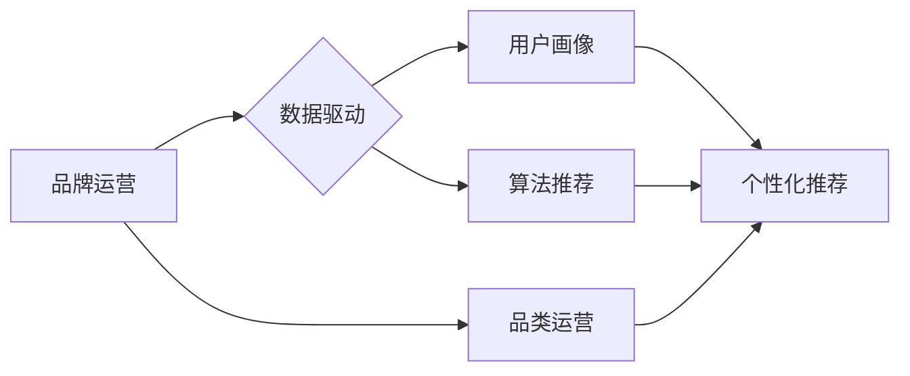

> 电商平台, 品牌运营, 品类运营, 供给能力, 数据驱动, 算法推荐, 用户画像, 个性化推荐

## 1. 背景介绍

在当今数字化时代，电商平台已成为商品流通的重要渠道，其发展速度惊人。然而，随着平台用户规模的不断扩大，供给能力的提升成为电商平台持续发展的关键。品牌和品类运营作为提升供给能力的重要手段，在电商平台的生态系统中扮演着至关重要的角色。

传统电商平台的供给侧主要依赖于品牌商和供应商的主动上架，存在着信息不对称、资源配置不合理等问题，难以满足用户日益增长的个性化需求。而数据驱动、算法推荐等新技术的发展为品牌和品类运营提供了新的思路和方法，能够有效提升平台的供给能力，打造更加高效、精准的商品推荐体系。

## 2. 核心概念与联系

**2.1 品牌运营**

品牌运营是指电商平台围绕品牌建设，通过一系列的策略和行动，提升品牌知名度、美誉度和用户粘性。

**2.2 品类运营**

品类运营是指电商平台对商品进行分类和管理，通过对不同品类的分析和运营，提升品类竞争力，促进商品销售。

**2.3 供给能力**

供给能力是指电商平台能够提供优质商品的总量和速度。

**2.4 数据驱动**

数据驱动是指利用数据分析和挖掘，为品牌和品类运营提供决策依据。

**2.5 算法推荐**

算法推荐是指利用机器学习算法，根据用户的行为数据和商品信息，推荐用户感兴趣的商品。

**2.6 用户画像**

用户画像是指对用户的行为、偏好、需求等进行分析和总结，形成用户画像模型。

**2.7 个性化推荐**

个性化推荐是指根据用户的不同特征和需求，提供个性化的商品推荐。

**2.8 核心概念联系**

品牌运营、品类运营、数据驱动、算法推荐、用户画像和个性化推荐相互关联，共同提升电商平台的供给能力。

**Mermaid 流程图**



## 3. 核心算法原理 & 具体操作步骤

### 3.1 算法原理概述

电商平台的商品推荐算法通常基于协同过滤、内容过滤和基于知识的推荐等方法。

* **协同过滤:** 根据用户的历史购买行为和商品评分数据，预测用户对其他商品的兴趣。
* **内容过滤:** 根据商品的属性和描述信息，推荐与用户兴趣相符的商品。
* **基于知识的推荐:** 利用商品之间的关系和用户偏好知识，推荐用户可能感兴趣的商品。

### 3.2 算法步骤详解

**协同过滤算法步骤:**

1. 收集用户历史购买行为和商品评分数据。
2. 计算用户之间的相似度和商品之间的相似度。
3. 基于用户相似度，推荐给用户相似用户购买过的商品。
4. 基于商品相似度，推荐给用户购买过相似商品的用户购买过的商品。

**内容过滤算法步骤:**

1. 收集商品的属性和描述信息。
2. 建立用户兴趣特征向量。
3. 计算商品和用户兴趣特征向量的相似度。
4. 推荐给用户相似度高的商品。

**基于知识的推荐算法步骤:**

1. 建立商品之间的关系知识图谱。
2. 建立用户偏好知识库。
3. 利用知识图谱和用户偏好知识库，推荐用户可能感兴趣的商品。

### 3.3 算法优缺点

**协同过滤算法:**

* **优点:** 可以发现用户隐性偏好，推荐个性化商品。
* **缺点:** 数据稀疏性问题，冷启动问题。

**内容过滤算法:**

* **优点:** 不需要用户历史数据，可以推荐新商品。
* **缺点:** 难以发现用户隐性偏好，推荐结果可能过于单一。

**基于知识的推荐算法:**

* **优点:** 可以利用商品之间的关系和用户偏好知识，推荐更精准的商品。
* **缺点:** 需要构建复杂的知识图谱和用户偏好知识库。

### 3.4 算法应用领域

电商平台的商品推荐算法广泛应用于以下领域:

* **商品推荐:** 推荐用户可能感兴趣的商品。
* **个性化营销:** 根据用户的兴趣和需求，进行个性化营销推广。
* **用户画像:** 建立用户画像模型，了解用户的兴趣和需求。
* **品类运营:** 分析不同品类的用户画像和购买行为，优化品类运营策略。

## 4. 数学模型和公式 & 详细讲解 & 举例说明

### 4.1 数学模型构建

**协同过滤算法的数学模型:**

用户-商品评分矩阵：

$$
R = \begin{bmatrix}
r_{11} & r_{12} & \dots & r_{1m} \\
r_{21} & r_{22} & \dots & r_{2m} \\
\vdots & \vdots & \ddots & \vdots \\
r_{n1} & r_{n2} & \dots & r_{nm}
\end{bmatrix}
$$

其中：

* $r_{ij}$ 表示用户 $i$ 对商品 $j$ 的评分。
* $n$ 表示用户数量。
* $m$ 表示商品数量。

**用户相似度计算公式:**

$$
sim(u_i, u_j) = \frac{\sum_{k=1}^{m} (r_{ik} - \bar{r}_i)(r_{jk} - \bar{r}_j)}{\sqrt{\sum_{k=1}^{m} (r_{ik} - \bar{r}_i)^2} \sqrt{\sum_{k=1}^{m} (r_{jk} - \bar{r}_j)^2}}
$$

其中：

* $sim(u_i, u_j)$ 表示用户 $i$ 和用户 $j$ 的相似度。
* $\bar{r}_i$ 表示用户 $i$ 的平均评分。

**商品相似度计算公式:**

$$
sim(i, j) = \frac{\sum_{u=1}^{n} (r_{ui} - \bar{r}_u)(r_{uj} - \bar{r}_u)}{\sqrt{\sum_{u=1}^{n} (r_{ui} - \bar{r}_u)^2} \sqrt{\sum_{u=1}^{n} (r_{uj} - \bar{r}_u)^2}}
$$

其中：

* $sim(i, j)$ 表示商品 $i$ 和商品 $j$ 的相似度。
* $\bar{r}_u$ 表示用户 $u$ 的平均评分。

### 4.2 公式推导过程

协同过滤算法的相似度计算公式基于余弦相似度，它衡量了两个向量的夹角大小。用户评分矩阵可以看作是用户和商品之间的关系矩阵，每个元素代表用户对商品的评分。

用户相似度和商品相似度计算公式分别利用用户评分矩阵和商品评分矩阵，计算用户之间和商品之间的相似度。

### 4.3 案例分析与讲解

假设有两个用户 $A$ 和 $B$，他们对以下三款商品进行了评分：

| 商品 | 用户 $A$ | 用户 $B$ |
|---|---|---|
| 商品 1 | 5 | 4 |
| 商品 2 | 3 | 2 |
| 商品 3 | 4 | 5 |

我们可以计算用户 $A$ 和用户 $B$ 的相似度：

$$
sim(A, B) = \frac{(5-3.33)(4-3.33) + (3-3.33)(2-3.33) + (4-3.33)(5-3.33)}{\sqrt{(5-3.33)^2 + (3-3.33)^2 + (4-3.33)^2} \sqrt{(4-3.33)^2 + (2-3.33)^2 + (5-3.33)^2}}
$$

计算结果为 $0.67$，表明用户 $A$ 和用户 $B$ 的相似度较高。

## 5. 项目实践：代码实例和详细解释说明

### 5.1 开发环境搭建

* 操作系统：Windows/macOS/Linux
* Python 版本：3.6+
* 依赖库：pandas, numpy, scikit-learn

### 5.2 源代码详细实现

```python
import pandas as pd
from sklearn.metrics.pairwise import cosine_similarity

# 加载用户评分数据
ratings_data = pd.read_csv('ratings.csv')

# 计算用户相似度
user_similarity = cosine_similarity(ratings_data.T)

# 获取用户 $A$ 的相似用户
user_A_id = 1
similar_users = user_similarity[user_A_id].argsort()[:-6:-1]  # 排序获取相似用户

# 推荐商品
recommended_items = ratings_data.iloc[similar_users].mean().sort_values(ascending=False)
```

### 5.3 代码解读与分析

* 首先，我们加载用户评分数据，并使用 `cosine_similarity` 函数计算用户之间的相似度。
* 然后，我们获取用户 $A$ 的相似用户，并使用这些用户的评分数据，计算出用户 $A$ 可能感兴趣的商品。
* 最后，我们对推荐的商品进行排序，并输出结果。

### 5.4 运行结果展示

运行代码后，我们可以得到用户 $A$ 可能感兴趣的商品推荐列表。

## 6. 实际应用场景

### 6.1 电商平台商品推荐

电商平台可以利用协同过滤、内容过滤和基于知识的推荐算法，为用户推荐个性化的商品。

### 6.2 个性化营销推广

电商平台可以根据用户的兴趣和需求，进行个性化营销推广，提高营销效果。

### 6.3 用户画像分析

电商平台可以利用用户购买行为和浏览记录，建立用户画像模型，了解用户的兴趣和需求。

### 6.4 未来应用展望

随着人工智能技术的不断发展，品牌和品类运营将更加智能化、个性化。未来，电商平台可以利用更先进的算法和技术，实现更精准的商品推荐、更有效的营销推广和更深入的用户画像分析。

## 7. 工具和资源推荐

### 7.1 学习资源推荐

* **书籍:**
    * 《推荐系统实践》
    * 《机器学习》
* **在线课程:**
    * Coursera: Recommender Systems
    * edX: Machine Learning

### 7.2 开发工具推荐

* **Python:** 
    * pandas
    * numpy
    * scikit-learn
* **Spark:** 
    * Apache Spark MLlib

### 7.3 相关论文推荐

* **协同过滤:**
    * "Collaborative Filtering for Implicit Feedback Datasets"
* **内容过滤:**
    * "Content-Based Recommendation Systems"
* **基于知识的推荐:**
    * "Knowledge-Based Recommender Systems"

## 8. 总结：未来发展趋势与挑战

### 8.1 研究成果总结

品牌和品类运营是提升电商平台供给能力的重要手段，数据驱动、算法推荐、用户画像等技术为其提供了新的思路和方法。

### 8.2 未来发展趋势

* **更精准的推荐:** 利用更先进的算法和技术，实现更精准的商品推荐。
* **更个性化的体验:** 提供更个性化的购物体验，满足用户的个性化需求。
* **更智能化的运营:** 利用人工智能技术，实现更智能化的品牌和品类运营。

### 8.3 面临的挑战

* **数据质量:** 数据质量是推荐系统成功的关键，需要不断提高数据质量。
* **算法复杂度:** 随着算法的复杂度增加，