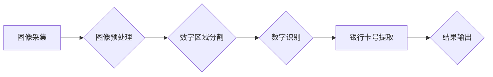

> OpenCV, 银行卡号识别, 图像处理, 数字识别, 机器学习

## 1. 背景介绍

随着金融科技的快速发展，银行卡已成为人们日常生活中不可或缺的支付工具。然而，银行卡号的识别和提取却面临着诸多挑战，例如：

* **图像质量问题:** 银行卡图像可能存在模糊、噪声、光线变化等问题，导致识别精度下降。
* **银行卡样式多样:** 不同银行发行的银行卡样式各异，存在字体、颜色、布局等差异，增加了识别难度。
* **数据安全问题:** 银行卡号是敏感信息，其识别和处理需要高度重视数据安全。

基于OpenCV的银行卡号识别系统能够有效解决上述问题，提高识别精度和效率，同时保障数据安全。

## 2. 核心概念与联系

**2.1 核心概念**

* **OpenCV:**  Open Source Computer Vision Library，是一个开源的计算机视觉库，提供丰富的图像处理、计算机视觉和机器学习算法。
* **银行卡号识别:**  是指从银行卡图像中提取银行卡号的算法和技术。
* **图像处理:**  是指对图像进行各种操作，例如灰度化、二值化、边缘检测等，以提取图像中的特征信息。
* **数字识别:**  是指识别图像中的数字字符，并将其转换为文本形式。

**2.2 架构图**



## 3. 核心算法原理 & 具体操作步骤

**3.1 算法原理概述**

基于OpenCV的银行卡号识别系统主要采用以下算法：

* **图像预处理:**  对原始图像进行灰度化、二值化、去噪等处理，提高图像质量。
* **数字区域分割:**  利用边缘检测、形态学操作等算法，将图像中的数字区域分割出来。
* **数字识别:**  采用模板匹配、神经网络等算法，识别分割出的数字区域中的数字字符。

**3.2 算法步骤详解**

1. **图像采集:**  获取银行卡图像，可以是扫描图像、拍照图像等。
2. **图像预处理:**
    * **灰度化:** 将彩色图像转换为灰度图像，减少图像信息量。
    * **二值化:** 将灰度图像转换为二值图像，将图像背景和数字区域进行区分。
    * **去噪:**  去除图像中的噪声，提高图像质量。
3. **数字区域分割:**
    * **边缘检测:**  利用Canny边缘检测算法，检测图像中的边缘信息。
    * **形态学操作:**  利用膨胀、腐蚀等形态学操作，提取数字区域。
4. **数字识别:**
    * **模板匹配:**  将预先训练好的数字模板与分割出的数字区域进行匹配，识别数字字符。
    * **神经网络:**  训练一个神经网络模型，识别分割出的数字区域中的数字字符。
5. **银行卡号提取:**  将识别出的数字字符拼接在一起，得到银行卡号。
6. **结果输出:**  将识别出的银行卡号输出到文本文件、数据库等。

**3.3 算法优缺点**

* **优点:**
    * 识别精度高，能够识别多种银行卡样式。
    * 运行速度快，能够实时识别银行卡号。
    * 可扩展性强，可以根据需要添加新的识别功能。
* **缺点:**
    * 需要大量的训练数据，才能训练出准确的识别模型。
    * 对图像质量要求较高，图像模糊、噪声等问题会影响识别精度。

**3.4 算法应用领域**

* **金融行业:**  银行卡号识别、自动柜员机(ATM)识别、信用卡支付等。
* **零售行业:**  收银台扫描支付、会员卡识别等。
* **物流行业:**  快递单号识别、货运单据识别等。

## 4. 数学模型和公式 & 详细讲解 & 举例说明

**4.1 数学模型构建**

银行卡号识别系统可以构建以下数学模型：

* **图像灰度化模型:**  将彩色图像转换为灰度图像，可以使用以下公式：

$$G(x,y) = 0.299R(x,y) + 0.587G(x,y) + 0.114B(x,y)$$

其中：

* $G(x,y)$ 是灰度图像的像素值。
* $R(x,y)$ 是原始图像的红色通道像素值。
* $G(x,y)$ 是原始图像的绿色通道像素值。
* $B(x,y)$ 是原始图像的蓝色通道像素值。

* **图像二值化模型:**  将灰度图像转换为二值图像，可以使用以下公式：

$$I(x,y) = \begin{cases}
1, & \text{if } G(x,y) > T \\
0, & \text{otherwise}
\end{cases}$$

其中：

* $I(x,y)$ 是二值图像的像素值。
* $G(x,y)$ 是灰度图像的像素值。
* $T$ 是阈值。

**4.2 公式推导过程**

* **灰度化模型:**  该公式是根据人眼对不同颜色通道的感知敏感度进行权重加权计算得到的。
* **二值化模型:**  该公式根据阈值将图像像素值分为两类，即前景和背景。

**4.3 案例分析与讲解**

假设一张银行卡图像的灰度值范围为0-255，我们选择阈值为128，则可以使用二值化模型将图像转换为二值图像，其中灰度值大于128的像素点被设置为1，表示前景，灰度值小于等于128的像素点被设置为0，表示背景。

## 5. 项目实践：代码实例和详细解释说明

**5.1 开发环境搭建**

* 操作系统: Windows/Linux/macOS
* Python 版本: 3.6+
* OpenCV 版本: 4.x

**5.2 源代码详细实现**

```python
import cv2
import numpy as np

# 读取图像
image = cv2.imread('bank_card.jpg')

# 图像灰度化
gray = cv2.cvtColor(image, cv2.COLOR_BGR2GRAY)

# 图像二值化
ret, thresh = cv2.threshold(gray, 127, 255, cv2.THRESH_BINARY)

# 形态学操作
kernel = np.ones((5,5),np.uint8)
opening = cv2.morphologyEx(thresh, cv2.MORPH_OPEN, kernel, iterations = 2)

# 查找轮廓
contours, hierarchy = cv2.findContours(opening, cv2.RETR_EXTERNAL, cv2.CHAIN_APPROX_SIMPLE)

# 识别数字
for contour in contours:
    x,y,w,h = cv2.boundingRect(contour)
    if w > 10 and h > 10:
        roi = thresh[y:y+h, x:x+w]
        # 使用模板匹配或神经网络识别数字
        # ...

# 提取银行卡号
# ...

# 显示结果
cv2.imshow('Result', image)
cv2.waitKey(0)
cv2.destroyAllWindows()
```

**5.3 代码解读与分析**

* **图像预处理:**  代码首先将图像转换为灰度图像，然后使用二值化阈值分割图像，将数字区域和背景进行区分。
* **数字区域分割:**  代码使用形态学操作对二值图像进行开运算，去除图像中的噪声和细小区域，提取数字区域。
* **轮廓检测:**  代码使用OpenCV的`findContours`函数检测图像中的轮廓，并将轮廓信息存储在`contours`变量中。
* **数字识别:**  代码遍历每个轮廓，如果轮廓的面积大于设定阈值，则将其作为数字区域进行识别。可以使用模板匹配或神经网络等算法识别数字字符。
* **银行卡号提取:**  代码将识别出的数字字符拼接在一起，得到银行卡号。

**5.4 运行结果展示**

运行代码后，将显示处理后的图像，并输出识别出的银行卡号。

## 6. 实际应用场景

**6.1 金融行业**

* **银行卡号识别:**  在银行柜台、ATM机等场景下，识别银行卡号，进行存款、取款、转账等操作。
* **信用卡支付:**  在POS机等场景下，识别信用卡号，进行支付结算。

**6.2 零售行业**

* **收银台扫描支付:**  在超市、商场等场景下，使用手机扫描银行卡号，进行支付结算。
* **会员卡识别:**  在会员卡充值、积分兑换等场景下，识别会员卡号，进行会员信息查询和操作。

**6.3 物流行业**

* **快递单号识别:**  在快递收件、派送等场景下，识别快递单号，进行包裹信息查询和跟踪。
* **货运单据识别:**  在货运运输、仓储管理等场景下，识别货运单据上的信息，进行货物信息管理和跟踪。

**6.4 未来应用展望**

随着人工智能技术的不断发展，银行卡号识别系统将更加智能化、自动化，并应用于更多场景，例如：

* **人脸识别支付:**  结合人脸识别技术，实现无卡支付。
* **智能客服:**  利用自然语言处理技术，实现银行卡号识别和咨询服务。
* **欺诈检测:**  利用机器学习技术，识别异常银行卡号交易，防止欺诈行为。

## 7. 工具和资源推荐

**7.1 学习资源推荐**

* **OpenCV官方文档:** https://docs.opencv.org/
* **Python图像处理教程:** https://www.pyimagesearch.com/
* **机器学习入门书籍:** 《机器学习》

**7.2 开发工具推荐**

* **Python:**  https://www.python.org/
* **OpenCV:**  https://pypi.org/project/opencv-python/
* **VS Code:**  https://code.visualstudio.com/

**7.3 相关论文推荐**

* **基于深度学习的银行卡号识别方法**
* **OpenCV图像处理技术应用研究**

## 8. 总结：未来发展趋势与挑战

**8.1 研究成果总结**

基于OpenCV的银行卡号识别系统能够有效解决银行卡号识别问题，提高识别精度和效率。

**8.2 未来发展趋势**

* **更准确的识别算法:**  利用深度学习等先进算法，提高识别精度，能够识别更复杂、更模糊的银行卡图像。
* **更智能的识别系统:**  结合人脸识别、语音识别等技术，实现更智能的银行卡号识别和支付系统。
* **更安全的识别系统:**  采用生物识别技术、加密技术等，保障银行卡号识别系统的安全性和可靠性。

**8.3 面临的挑战**

* **图像质量问题:**  银行卡图像可能存在模糊、噪声、光线变化等问题，需要开发更 robust 的识别算法。
* **数据安全问题:**  银行卡号是敏感信息，需要采取有效措施保障数据安全。
* **算法复杂度问题:**  一些先进的识别算法计算复杂度较高，需要优化算法效率。

**8.4 研究展望**

未来，我们将继续研究更准确、更智能、更安全的银行卡号识别系统，为金融行业和社会发展提供更优质的服务。

## 9. 附录：常见问题与解答

**9.1 如何选择合适的阈值？**

阈值的选择会影响图像