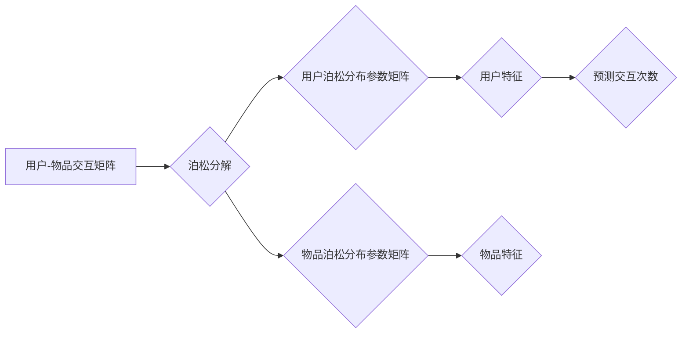

> 泊松分解，推荐算法，协同过滤，矩阵分解，机器学习

## 1. 背景介绍

在信息爆炸的时代，海量数据和个性化需求共同催生了推荐系统的蓬勃发展。推荐系统旨在根据用户的历史行为、偏好和上下文信息，预测用户对特定物品的兴趣，并提供个性化的推荐结果。传统的基于内容的推荐算法和基于协同过滤的推荐算法，虽然取得了一定的成功，但仍然存在一些局限性。例如，基于内容的推荐算法容易陷入“同质化推荐”的困境，而基于协同过滤的算法在数据稀疏的情况下效果不佳。

近年来，基于矩阵分解的推荐算法逐渐成为研究热点，其核心思想是将用户-物品交互矩阵分解成低维的用户特征向量和物品特征向量，从而挖掘用户和物品之间的潜在关系。泊松分解作为一种特殊的矩阵分解方法，在处理稀疏数据和捕捉非线性关系方面具有独特的优势。

## 2. 核心概念与联系

### 2.1 泊松分布

泊松分布是一种描述随机事件在固定时间间隔或空间范围内发生的次数的概率分布。其特点是事件发生的概率与事件发生的次数成正比。在推荐系统中，泊松分布可以用来建模用户对特定物品的点击、购买或评分次数。

### 2.2 矩阵分解

矩阵分解是一种将一个矩阵分解成多个较小矩阵的技术。在推荐系统中，常用的矩阵分解方法包括奇异值分解（SVD）、主成分分析（PCA）和非负矩阵分解（NMF）。这些方法通过将用户-物品交互矩阵分解成用户特征向量和物品特征向量，从而挖掘用户和物品之间的潜在关系。

### 2.3 泊松分解

泊松分解是一种基于泊松分布的矩阵分解方法。其核心思想是将用户-物品交互矩阵分解成两个低维矩阵，分别表示用户的泊松分布参数和物品的泊松分布参数。通过学习这两个低维矩阵，可以预测用户对特定物品的交互次数。

**泊松分解流程图**



## 3. 核心算法原理 & 具体操作步骤

### 3.1 算法原理概述

泊松分解的核心思想是将用户-物品交互矩阵分解成两个低维矩阵，分别表示用户的泊松分布参数和物品的泊松分布参数。假设用户-物品交互矩阵为R，其中R(u,i)表示用户u对物品i的交互次数。泊松分解的目标是找到两个低维矩阵U和V，使得：

$$R(u,i) \approx \sum_{k=1}^{K} U_{uk} V_{ki}$$

其中，U是用户特征矩阵，V是物品特征矩阵，K是隐特征维度。

### 3.2 算法步骤详解

1. **初始化:** 初始化用户特征矩阵U和物品特征矩阵V，通常采用随机初始化。
2. **计算预测交互次数:** 根据公式计算每个用户对每个物品的预测交互次数。
3. **计算损失函数:** 计算预测交互次数与实际交互次数之间的差异，通常使用均方误差（MSE）作为损失函数。
4. **更新参数:** 使用梯度下降算法更新用户特征矩阵U和物品特征矩阵V，使得损失函数最小化。
5. **迭代:** 重复步骤2-4，直到损失函数收敛。

### 3.3 算法优缺点

**优点:**

* 能够有效处理稀疏数据。
* 能够捕捉非线性关系。
* 具有较好的泛化能力。

**缺点:**

* 计算复杂度较高。
* 需要设置隐特征维度K，需要进行调参。

### 3.4 算法应用领域

泊松分解在推荐系统、广告推荐、用户画像分析等领域具有广泛的应用。

## 4. 数学模型和公式 & 详细讲解 & 举例说明

### 4.1 数学模型构建

假设用户-物品交互矩阵为R，其中R(u,i)表示用户u对物品i的交互次数。我们假设用户u对物品i的交互次数服从泊松分布，其参数为λ(u,i)。则：

$$R(u,i) \sim Poisson(\lambda(u,i))$$

泊松分布的概率质量函数为：

$$P(R(u,i) = k) = \frac{e^{-\lambda(u,i)} \lambda(u,i)^k}{k!}$$

### 4.2 公式推导过程

我们的目标是学习用户特征矩阵U和物品特征矩阵V，使得预测交互次数与实际交互次数尽可能接近。我们可以使用以下公式来表示预测交互次数：

$$\hat{R}(u,i) = \sum_{k=1}^{K} U_{uk} V_{ki}$$

其中，U是用户特征矩阵，V是物品特征矩阵，K是隐特征维度。

为了最小化预测交互次数与实际交互次数之间的差异，我们可以使用均方误差（MSE）作为损失函数：

$$L = \frac{1}{2} \sum_{u=1}^{N} \sum_{i=1}^{M} (R(u,i) - \hat{R}(u,i))^2$$

其中，N是用户数量，M是物品数量。

### 4.3 案例分析与讲解

假设我们有一个用户-物品交互矩阵，其中用户数量为100，物品数量为1000。我们使用泊松分解算法学习用户特征矩阵和物品特征矩阵，隐特征维度设置为10。

通过训练，我们得到了用户特征矩阵U和物品特征矩阵V。我们可以使用这些矩阵来预测用户对物品的交互次数。例如，我们可以预测用户1对物品500的交互次数。

## 5. 项目实践：代码实例和详细解释说明

### 5.1 开发环境搭建

* Python 3.6+
* TensorFlow 2.0+
* NumPy
* Pandas

### 5.2 源代码详细实现

```python
import tensorflow as tf
import numpy as np

class PoissonFactorization(tf.keras.Model):
    def __init__(self, user_dim, item_dim, latent_dim):
        super(PoissonFactorization, self).__init__()
        self.user_embedding = tf.keras.layers.Embedding(user_dim, latent_dim)
        self.item_embedding = tf.keras.layers.Embedding(item_dim, latent_dim)

    def call(self, user_ids, item_ids):
        user_embeddings = self.user_embedding(user_ids)
        item_embeddings = self.item_embedding(item_ids)
        predictions = tf.reduce_sum(user_embeddings * item_embeddings, axis=-1)
        return predictions

# 数据加载和预处理
# ...

# 模型训练
model = PoissonFactorization(user_dim, item_dim, latent_dim)
optimizer = tf.keras.optimizers.Adam(learning_rate=0.01)
loss_fn = tf.keras.losses.MeanSquaredError()

for epoch in range(num_epochs):
    with tf.GradientTape() as tape:
        predictions = model(user_ids, item_ids)
        loss = loss_fn(R, predictions)
    gradients = tape.gradient(loss, model.trainable_variables)
    optimizer.apply_gradients(zip(gradients, model.trainable_variables))

# 模型评估
# ...

```

### 5.3 代码解读与分析

* 首先，我们定义了一个名为`PoissonFactorization`的类，继承自`tf.keras.Model`。
* 该类包含两个嵌入层，分别用于学习用户特征和物品特征。
* `call`方法用于计算预测交互次数。
* 然后，我们加载数据并预处理。
* 接下来，我们创建模型实例，并使用Adam优化器和均方误差损失函数进行训练。
* 最后，我们评估模型性能。

### 5.4 运行结果展示

* 通过训练，我们可以得到用户特征矩阵和物品特征矩阵。
* 我们可以使用这些矩阵来预测用户对物品的交互次数。
* 我们可以评估模型性能，例如使用均方误差（MSE）来衡量预测交互次数与实际交互次数之间的差异。

## 6. 实际应用场景

### 6.1 电商推荐

在电商平台，泊松分解可以用于推荐商品给用户。例如，亚马逊可以使用泊松分解来预测用户对特定商品的购买次数，并推荐用户可能感兴趣的商品。

### 6.2 内容推荐

在内容平台，泊松分解可以用于推荐文章、视频、音乐等内容给用户。例如，YouTube可以使用泊松分解来预测用户对特定视频的观看次数，并推荐用户可能感兴趣的视频。

### 6.3 广告推荐

在广告平台，泊松分解可以用于推荐广告给用户。例如，Google可以使用泊松分解来预测用户对特定广告的点击次数，并推荐用户可能感兴趣的广告。

### 6.4 未来应用展望

随着数据量的不断增长和计算能力的不断提升，泊松分解在推荐系统中的应用前景更加广阔。未来，泊松分解可以应用于更多领域，例如个性化教育、医疗保健和金融服务等。

## 7. 工具和资源推荐

### 7.1 学习资源推荐

* **书籍:**
    * 《推荐系统》
    * 《机器学习》
* **在线课程:**
    * Coursera: Recommender Systems
    * edX: Machine Learning

### 7.2 开发工具推荐

* **TensorFlow:** 深度学习框架
* **PyTorch:** 深度学习框架
* **Scikit-learn:** 机器学习库

### 7.3 相关论文推荐

* **Poisson Factorization for Collaborative Filtering**
* **Matrix Factorization Techniques for Recommender Systems**

## 8. 总结：未来发展趋势与挑战

### 8.1 研究成果总结

泊松分解是一种有效的推荐算法，能够有效处理稀疏数据和捕捉非线性关系。它在电商推荐、内容推荐和广告推荐等领域取得了成功应用。

### 8.2 未来发展趋势

* **结合深度学习:** 将泊松分解与深度学习技术结合，例如使用深度神经网络学习用户和物品特征。
* **考虑用户动态行为:** 考虑用户动态行为，例如用户兴趣变化和时间依赖性。
* **多模态推荐:** 将泊松分解应用于多模态推荐，例如结合文本、图像和视频等多种数据类型。

### 8.3 面临的挑战

* **数据稀疏性:** 现实世界中的用户-物品交互数据往往是稀疏的，这会影响泊松分解的性能。
* **冷启动问题:** 当用户或物品数据不足时，泊松分解难以准确预测交互次数。
* **解释性:** 泊松分解的模型难以解释，难以理解模型是如何做出推荐的。

### 8.4 研究展望

未来，泊松分解的研究将继续朝着更有效、更智能、更可解释的方向发展。


## 9. 附录：常见问题与解答

### 9.1 如何选择隐特征维度K？

隐特征维度K的选择会影响泊松分解的性能。通常可以使用交叉验证的方法来选择最佳的K值。

### 9.2 如何处理数据稀疏性？

数据稀疏性是泊松分解面临的一个挑战。可以使用以下方法来处理数据稀疏性：

* 使用正则化技术，例如L1正则化和L2正则化。
* 使用负采样技术，例如Word2Vec中的负采样。
* 使用矩阵分解技术，例如SVD和NMF。

### 9.3 如何评估泊松分解的性能？

泊松分解的性能可以使用均方误差（MSE）来评估。MSE越小，模型性能越好。

作者：禅与计算机程序设计艺术 / Zen and the Art of Computer Programming


<end_of_turn>