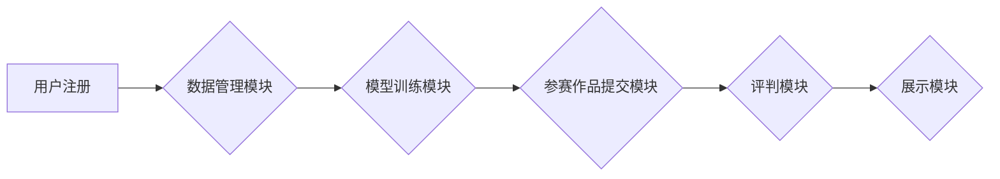

> 生成对抗网络(GAN)，图像风格迁移，竞赛平台，深度学习，图像处理

## 1. 背景介绍

图像风格迁移技术近年来备受关注，它能够将一种图像的风格应用到另一幅图像上，创造出具有独特艺术效果的图像。这种技术在艺术创作、图像编辑、电影特效等领域有着广泛的应用前景。

传统的图像风格迁移方法通常依赖于手工设计的特征提取和风格转换算法，效率较低，效果也难以达到理想状态。随着深度学习技术的快速发展，基于生成对抗网络(GAN)的图像风格迁移方法逐渐成为主流，其能够学习图像的复杂特征和风格，生成更加逼真的风格迁移结果。

为了促进图像风格迁移技术的创新和发展，搭建一个基于GAN的图像风格迁移竞赛平台具有重要意义。竞赛平台可以为研究者和开发者提供一个开放、公平、透明的平台，激发他们的创作热情，推动技术进步。

## 2. 核心概念与联系

### 2.1 生成对抗网络 (GAN)

生成对抗网络 (GAN) 是一种由两个神经网络组成的对抗性学习框架，由 Ian Goodfellow 等人于 2014 年提出。GAN 由一个生成器 (Generator) 和一个鉴别器 (Discriminator) 组成。

* **生成器 (Generator):** 负责生成新的数据样本，例如图像、文本等。
* **鉴别器 (Discriminator):** 负责判断数据样本是真实数据还是由生成器生成的伪造数据。

生成器和鉴别器在对抗性的博弈中相互学习，生成器不断改进生成的数据质量，以欺骗鉴别器；鉴别器则不断提高识别真实和伪造数据的能力。最终，生成器能够生成与真实数据几乎 indistinguishable 的数据样本。

### 2.2 图像风格迁移

图像风格迁移是指将一幅图像的风格应用到另一幅图像上，生成具有相同内容但不同风格的图像。

**风格迁移的步骤通常包括：**

1. **提取内容图像和风格图像的特征:** 使用卷积神经网络提取图像的内容和风格特征。
2. **将风格特征应用到内容图像上:** 使用特定的算法将风格特征应用到内容图像上，生成具有新风格的图像。

### 2.3 竞赛平台架构

基于GAN的图像风格迁移竞赛平台通常包含以下几个模块：

* **数据管理模块:** 用于存储和管理竞赛数据，包括训练数据、测试数据和参赛作品。
* **模型训练模块:** 用于训练GAN模型，并评估模型性能。
* **参赛作品提交模块:** 用于参赛者提交他们的风格迁移作品。
* **评判模块:** 用于对参赛作品进行评判，并确定最终的获奖者。
* **展示模块:** 用于展示竞赛结果和获奖作品。

**Mermaid 流程图:**



## 3. 核心算法原理 & 具体操作步骤

### 3.1 算法原理概述

基于GAN的图像风格迁移算法的核心思想是利用生成器网络生成具有目标风格的图像，并通过鉴别器网络的反馈来不断优化生成器的性能。

具体来说，算法通常会使用两个GAN模型：

* **风格迁移GAN:** 用于将目标风格应用到内容图像上，生成具有新风格的图像。
* **内容保持GAN:** 用于确保生成的图像保留原始内容图像的内容信息。

### 3.2 算法步骤详解

1. **预处理:** 对输入图像进行预处理，例如调整尺寸、归一化像素值等。
2. **特征提取:** 使用预训练的卷积神经网络提取内容图像和风格图像的特征。
3. **风格迁移:** 将风格图像的特征应用到内容图像的特征上，生成具有新风格的特征。
4. **图像重建:** 将风格迁移后的特征重建成图像。
5. **训练GAN模型:** 使用风格迁移GAN和内容保持GAN进行训练，优化生成器的性能。

### 3.3 算法优缺点

**优点:**

* **效果逼真:** 基于GAN的图像风格迁移算法能够生成更加逼真的风格迁移结果。
* **灵活多样:** 可以应用于多种风格的迁移，例如油画风格、水彩风格、卡通风格等。
* **自动化程度高:** 算法自动化程度高，可以自动完成风格迁移过程。

**缺点:**

* **训练复杂:** GAN模型的训练过程比较复杂，需要大量的训练数据和计算资源。
* **模式崩溃:** GAN模型容易出现模式崩溃问题，导致生成的图像缺乏多样性。
* **训练不稳定:** GAN模型的训练过程不稳定，需要精心调参才能获得理想的结果。

### 3.4 算法应用领域

* **艺术创作:** 生成具有独特艺术风格的图像。
* **图像编辑:** 将图像风格进行转换，例如将黑白照片变成彩色照片。
* **电影特效:** 生成具有特定风格的场景和人物。
* **游戏开发:** 生成具有不同风格的游戏场景和角色。

## 4. 数学模型和公式 & 详细讲解 & 举例说明

### 4.1 数学模型构建

**生成器网络 (G):**

* 输入: 随机噪声向量 z
* 输出: 伪造图像 G(z)

**鉴别器网络 (D):**

* 输入: 图像 x
* 输出: 判别结果 D(x) (0 或 1，表示真实或伪造)

### 4.2 公式推导过程

**生成器损失函数:**

$$L_G = -E_{z \sim p_z(z)}[log(D(G(z)))]$$

**鉴别器损失函数:**

$$L_D = -E_{x \sim p_{data}(x)}[log(D(x))] - E_{z \sim p_z(z)}[log(1 - D(G(z)))]$$

**解释:**

* 生成器损失函数旨在最大化鉴别器对生成图像的判别结果。
* 鉴别器损失函数旨在最小化对真实图像和生成图像的判别错误。

### 4.3 案例分析与讲解

**举例说明:**

假设我们使用GAN进行图像风格迁移，目标是将梵高的风格应用到一张风景照片上。

* **内容图像:** 风景照片
* **风格图像:** 梵高的作品

训练过程中，生成器会尝试生成具有梵高风格的风景图像，而鉴别器则会尝试区分真实图像和生成图像。

通过不断训练，生成器能够学习到梵高的绘画风格，并将其应用到风景照片上，生成具有梵高风格的风景图像。

## 5. 项目实践：代码实例和详细解释说明

### 5.1 开发环境搭建

* **操作系统:** Ubuntu 18.04
* **深度学习框架:** TensorFlow 2.0
* **编程语言:** Python 3.7

### 5.2 源代码详细实现

```python
# 生成器网络
class Generator(tf.keras.Model):
    def __init__(self):
        super(Generator, self).__init__()
        # ...

    def call(self, z):
        # ...

# 鉴别器网络
class Discriminator(tf.keras.Model):
    def __init__(self):
        super(Discriminator, self).__init__()
        # ...

    def call(self, x):
        # ...

# 训练GAN模型
def train_gan(generator, discriminator, dataset):
    # ...

# 评估GAN模型性能
def evaluate_gan(generator, dataset):
    # ...

# 风格迁移
def style_transfer(content_image, style_image):
    # ...
```

### 5.3 代码解读与分析

* **生成器网络:** 负责生成具有目标风格的图像。
* **鉴别器网络:** 负责判断图像是否为真实图像或生成图像。
* **训练GAN模型:** 使用生成器和鉴别器损失函数进行训练。
* **评估GAN模型性能:** 使用指标如Inception Score (IS) 或 Fréchet Inception Distance (FID) 评估模型性能。
* **风格迁移:** 使用训练好的生成器网络将目标风格应用到内容图像上。

### 5.4 运行结果展示

* 展示风格迁移后的图像，并与原始图像进行对比。
* 使用指标如IS 或 FID 评估风格迁移结果的质量。

## 6. 实际应用场景

### 6.1 艺术创作

* 使用GAN进行艺术风格迁移，创作具有独特艺术风格的图像。
* 生成具有特定艺术风格的绘画、雕塑、音乐等艺术作品。

### 6.2 图像编辑

* 将图像风格进行转换，例如将黑白照片变成彩色照片。
* 将图像风格应用到照片上，例如将照片风格化成油画风格。

### 6.3 电影特效

* 生成具有特定风格的场景和人物，例如将场景风格化成科幻风格。
* 生成具有特定风格的特效，例如将火焰特效风格化成水墨风格。

### 6.4 未来应用展望

* **个性化风格迁移:** 根据用户的喜好生成个性化的风格迁移结果。
* **跨模态风格迁移:** 将风格迁移应用到不同模态的数据上，例如将图像风格迁移到音频或文本上。
* **实时风格迁移:** 实现实时风格迁移，例如在视频游戏中实时改变角色的风格。

## 7. 工具和资源推荐

### 7.1 学习资源推荐

* **论文:**
    * Goodfellow, I., Pouget-Abadie, J., Mirza, M., Xu, B., Warde-Farley, D., Ozair, S., ... & Bengio, Y. (2014). Generative adversarial nets. In Advances in neural information processing systems (pp. 2672-2680).
    * Gatys, L. A., Ecker, A. S., & Bethge, M. (2015). Texture synthesis using convolutional neural networks. In Proceedings of the IEEE conference on computer vision and pattern recognition (pp. 2423-2431).
* **博客:**
    * https://blog.openai.com/
    * https://towardsdatascience.com/

### 7.2 开发工具推荐

* **深度学习框架:** TensorFlow, PyTorch
* **图像处理库:** OpenCV, Pillow
* **云计算平台:** Google Cloud Platform, Amazon Web Services

### 7.3 相关论文推荐

* **风格迁移:**
    * Gatys, L. A., Ecker, A. S., & Bethge, M. (2015). Texture synthesis using convolutional neural networks.
    * Johnson, J., Alahi, A., & Fei-Fei, L. (2016). Perceptual losses for real-time style transfer and super-resolution.
* **GAN:**
    * Goodfellow, I., Pouget-Abadie, J., Mirza, M., Xu, B., Warde-Farley, D., Ozair, S., ... & Bengio, Y. (2014). Generative adversarial nets.
    * Radford, A., Metz, L., & Chintala, S. (2015). Unsupervised representation learning with deep convolutional generative adversarial networks.

## 8. 总结：未来发展趋势与挑战

### 8.1 研究成果总结

基于GAN的图像风格迁移技术取得了显著进展，能够生成逼真的风格迁移结果，并应用于多个领域。

### 8.2 未来发展趋势

* **更逼真的风格迁移:** 研究更先进的GAN模型和算法，生成更加逼真的风格迁移结果。
* **更灵活的风格迁移:** 研究能够支持多种风格迁移方式的算法，例如局部风格迁移、动态风格迁移等。
* **更个性化的风格迁移:** 研究能够根据用户的喜好生成个性化的风格迁移结果的算法。

### 8.3 面临的挑战

* **训练复杂度:** GAN模型的训练过程复杂，需要大量的训练数据和计算资源。
* **模式崩溃:** GAN模型容易出现模式崩溃问题，导致生成的图像