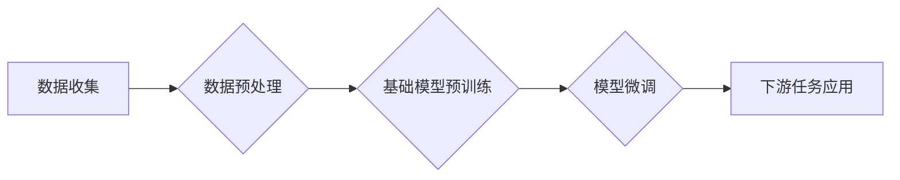

> 基础模型、深度学习、迁移学习、参数效率、泛化能力、应用场景

## 1. 背景介绍

深度学习近年来取得了令人瞩目的成就，在图像识别、自然语言处理、语音识别等领域取得了突破性的进展。这些成就很大程度上得益于基础模型的出现。基础模型是指在海量数据上预训练的大规模深度学习模型，它们拥有强大的表示能力和泛化能力，可以应用于各种下游任务。

传统的深度学习方法通常需要针对每个特定任务进行专门的训练，这需要大量的标注数据和计算资源。而基础模型的出现改变了这一现状，它可以先在通用数据集上进行预训练，然后通过微调的方式将其应用于不同的下游任务。这种迁移学习的策略大大提高了模型的效率和泛化能力。

## 2. 核心概念与联系

**2.1 深度学习**

深度学习是一种机器学习的子领域，它利用多层神经网络来模拟人类大脑的学习过程。深度学习模型通过学习数据中的特征表示，能够自动提取复杂模式和关系。

**2.2 基础模型**

基础模型是指在海量数据上预训练的大规模深度学习模型。它们通常具有以下特点：

* **规模庞大:** 基础模型拥有大量的参数，例如数十亿甚至千亿个参数。
* **通用性强:** 基础模型在通用数据集上进行预训练，能够学习到通用的特征表示。
* **迁移学习能力强:** 基础模型可以应用于各种下游任务，通过微调的方式快速适应新的任务。

**2.3 迁移学习**

迁移学习是一种机器学习的范式，它利用已训练好的模型在新的任务上进行学习。迁移学习的核心思想是将从源任务中学习到的知识迁移到目标任务中。

**2.4 流程图**



## 3. 核心算法原理 & 具体操作步骤

**3.1 算法原理概述**

基础模型的训练主要基于深度学习的监督学习算法，例如反向传播算法。

**3.2 算法步骤详解**

1. **数据收集和预处理:** 收集大量的数据，并进行预处理，例如数据清洗、数据增强、数据归一化等。
2. **模型架构设计:** 设计一个合适的深度学习模型架构，例如 Transformer、CNN、RNN 等。
3. **模型预训练:** 在预处理好的数据上进行模型预训练，使用交叉熵损失函数和梯度下降算法进行优化。
4. **模型微调:** 将预训练好的模型应用于具体的下游任务，根据任务特点进行微调，例如调整模型参数、添加新的层、修改损失函数等。
5. **模型评估和优化:** 对微调后的模型进行评估，并根据评估结果进行进一步的优化。

**3.3 算法优缺点**

**优点:**

* **参数效率:** 基于预训练的模型可以利用已有知识，减少训练数据和计算资源的需求。
* **泛化能力强:** 预训练模型在通用数据集上学习到的特征表示能够更好地泛化到新的任务。
* **快速部署:** 微调后的模型可以快速部署到实际应用场景中。

**缺点:**

* **数据依赖:** 基础模型的性能依赖于预训练数据的质量和规模。
* **计算资源需求:** 预训练大型模型需要大量的计算资源。
* **可解释性差:** 深度学习模型的内部机制复杂，难以解释其决策过程。

**3.4 算法应用领域**

基础模型在各个领域都有广泛的应用，例如：

* **自然语言处理:** 文本分类、情感分析、机器翻译、问答系统等。
* **计算机视觉:** 图像识别、目标检测、图像分割、视频分析等。
* **语音识别:** 语音转文本、语音合成、语音助手等。
* **推荐系统:** 商品推荐、内容推荐、用户画像等。

## 4. 数学模型和公式 & 详细讲解 & 举例说明

**4.1 数学模型构建**

基础模型通常采用多层神经网络结构，每个神经元接收多个输入，并通过激活函数进行非线性变换，输出到下一层神经元。

**4.2 公式推导过程**

深度学习模型的训练基于反向传播算法，其核心思想是通过计算损失函数的梯度，更新模型参数，使得模型的预测结果与真实值之间的误差最小化。

**损失函数:**

$$L = \sum_{i=1}^{N} \mathcal{L}(y_i, \hat{y}_i)$$

其中，$N$ 是样本数量，$\mathcal{L}$ 是单个样本的损失函数，$y_i$ 是真实值，$\hat{y}_i$ 是模型预测值。

**梯度下降算法:**

$$\theta = \theta - \eta \nabla L$$

其中，$\theta$ 是模型参数，$\eta$ 是学习率，$\nabla L$ 是损失函数的梯度。

**4.3 案例分析与讲解**

例如，在图像分类任务中，可以使用交叉熵损失函数来衡量模型预测结果与真实标签之间的差异。

**交叉熵损失函数:**

$$
\mathcal{L}(y, \hat{y}) = - \sum_{i=1}^{C} y_i \log(\hat{y}_i)
$$

其中，$C$ 是类别数量，$y_i$ 是真实标签的 one-hot 编码，$\hat{y}_i$ 是模型预测的概率分布。

## 5. 项目实践：代码实例和详细解释说明

**5.1 开发环境搭建**

使用 Python 语言和深度学习框架，例如 TensorFlow 或 PyTorch，搭建开发环境。

**5.2 源代码详细实现**

```python
import tensorflow as tf

# 定义模型架构
model = tf.keras.models.Sequential([
    tf.keras.layers.Conv2D(32, (3, 3), activation='relu', input_shape=(28, 28, 1)),
    tf.keras.layers.MaxPooling2D((2, 2)),
    tf.keras.layers.Conv2D(64, (3, 3), activation='relu'),
    tf.keras.layers.MaxPooling2D((2, 2)),
    tf.keras.layers.Flatten(),
    tf.keras.layers.Dense(10, activation='softmax')
])

# 编译模型
model.compile(optimizer='adam',
              loss='sparse_categorical_crossentropy',
              metrics=['accuracy'])

# 加载数据
(x_train, y_train), (x_test, y_test) = tf.keras.datasets.mnist.load_data()

# 预处理数据
x_train = x_train.astype('float32') / 255.0
x_test = x_test.astype('float32') / 255.0
x_train = x_train.reshape((x_train.shape[0], 28, 28, 1))
x_test = x_test.reshape((x_test.shape[0], 28, 28, 1))

# 训练模型
model.fit(x_train, y_train, epochs=5)

# 评估模型
loss, accuracy = model.evaluate(x_test, y_test)
print('Test loss:', loss)
print('Test accuracy:', accuracy)
```

**5.3 代码解读与分析**

这段代码实现了基于 TensorFlow 的 MNIST 手写数字识别模型的训练。

* 首先定义了模型架构，包括卷积层、池化层和全连接层。
* 然后编译模型，指定优化器、损失函数和评估指标。
* 加载 MNIST 数据集并进行预处理。
* 训练模型，并评估模型在测试集上的性能。

**5.4 运行结果展示**

训练完成后，模型能够准确识别 MNIST 手写数字。

## 6. 实际应用场景

基础模型在各个领域都有广泛的应用，例如：

**6.1 自然语言处理**

* **文本分类:** 基于预训练的语言模型可以用于分类文本，例如情感分析、主题分类、垃圾邮件过滤等。
* **机器翻译:** 预训练的语言模型可以用于机器翻译，例如将英文翻译成中文、法语翻译成西班牙语等。
* **问答系统:** 基于预训练的语言模型可以用于构建问答系统，例如回答用户提出的问题、提供相关信息等。

**6.2 计算机视觉**

* **图像识别:** 预训练的图像模型可以用于识别图像中的物体，例如人脸识别、物体检测、场景理解等。
* **图像分割:** 预训练的图像模型可以用于分割图像中的不同区域，例如分割图像中的前景和背景、分割图像中的不同物体等。
* **视频分析:** 预训练的视频模型可以用于分析视频内容，例如视频摘要、动作识别、事件检测等。

**6.3 其他领域**

* **语音识别:** 预训练的语音模型可以用于语音识别，例如将语音转文本、语音合成等。
* **推荐系统:** 预训练的模型可以用于推荐系统，例如商品推荐、内容推荐、用户画像等。
* **药物发现:** 预训练的模型可以用于药物发现，例如预测药物的活性、识别药物的靶点等。

**6.4 未来应用展望**

基础模型的应用场景还在不断扩展，未来将有更多新的应用场景出现。例如：

* **个性化学习:** 基于用户的学习风格和知识背景，提供个性化的学习内容和学习路径。
* **自动代码生成:** 基于代码库和自然语言描述，自动生成代码。
* **智能写作辅助:** 基于预训练的语言模型，辅助用户写作，例如语法检查、风格调整、内容生成等。

## 7. 工具和资源推荐

**7.1 学习资源推荐**

* **书籍:**
    * 深度学习
    * 自然语言处理
    * 计算机视觉
* **在线课程:**
    * Coursera
    * edX
    * Udacity
* **博客和论坛:**
    * TensorFlow Blog
    * PyTorch Blog
    * Stack Overflow

**7.2 开发工具推荐**

* **深度学习框架:**
    * TensorFlow
    * PyTorch
    * Keras
* **编程语言:**
    * Python
* **云计算平台:**
    * Google Cloud Platform
    * Amazon Web Services
    * Microsoft Azure

**7.3 相关论文推荐**

* **BERT:** Pre-training of Deep Bidirectional Transformers for Language Understanding
* **GPT-3:** Language Models are Few-Shot Learners
* **DALL-E:** DALL-E: Creating Images from Text

## 8. 总结：未来发展趋势与挑战

**8.1 研究成果总结**

基础模型在深度学习领域取得了显著的进展，其强大的表示能力和泛化能力推动了深度学习在各个领域的应用。

**8.2 未来发展趋势**

* **模型规模更大:** 未来基础模型的规模将继续扩大，拥有更多的参数和更强的能力。
* **多模态学习:** 基础模型将融合多模态数据，例如文本、图像、音频等，实现更全面的理解和表示。
* **可解释性增强:** 研究人员将致力于提高基础模型的可解释性，使其决策过程更加透明和可理解。

**8.3 面临的挑战**

* **数据获取和隐私保护:** 基础模型的训练需要大量数据，如何获取高质量数据并保护用户隐私是一个挑战。
* **计算资源需求:** 训练大型基础模型需要大量的计算资源，如何降低计算成本是一个关键问题。
* **模型安全性和鲁棒性:** 基础模型可能存在安全漏洞和鲁棒性问题，需要进一步研究和改进。

**8.4 研究展望**

未来基础模型的研究将继续深入，探索更强大的模型架构、更有效的训练方法和更广泛的应用场景。基础模型将成为人工智能领域的重要发展方向，推动人工智能技术向更智能、更安全、更可持续的方向发展。

## 9. 附录：常见问题与解答

**9.