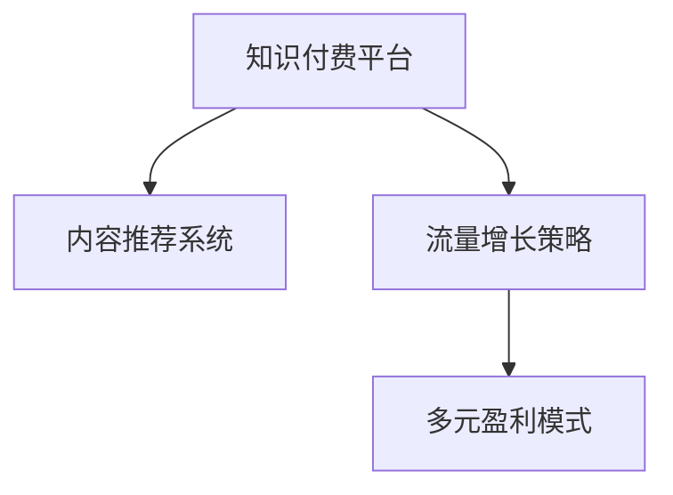

                 

# 知识付费创业的内容体系构建方法

> 关键词：知识付费,内容体系构建,用户分析,个性化推荐,流量增长,盈利模型

## 1. 背景介绍

### 1.1 问题由来

随着互联网和移动互联网的普及，信息爆炸和知识碎片化成为我们这个时代的特征。用户对高质量、系统化的知识内容需求日益增长，但传统的教材、博客、视频等知识形态难以满足其深层次、个性化的需求。知识付费平台应运而生，成为连接知识创作者与需求者，提供深度、专业、个性化知识内容的桥梁。

### 1.2 问题核心关键点

知识付费创业的核心在于构建一个既能吸引用户，又能创造价值的知识内容体系。这不仅需要精准的用户画像和个性化推荐，还需要有效的流量增长策略和多元化的盈利模式。本文将围绕这些问题，系统介绍知识付费创业的内容体系构建方法。

### 1.3 问题研究意义

构建一个高效、多元的知识付费内容体系，对于知识付费平台的可持续发展至关重要。

1. 增强用户黏性：通过个性化推荐，让用户沉浸在高质量内容中，减少流失率。
2. 提升平台收入：通过广告、付费订阅、产品销售等多种盈利模式，最大化平台收益。
3. 提高内容质量：激励知识创作者产出高质量内容，同时通过用户反馈优化内容体系。
4. 快速扩大流量：通过精准营销和高效引流策略，快速吸引用户，提升平台影响力。
5. 实现跨领域合作：与教育机构、企业、研究机构等建立合作关系，丰富内容源，拓展知识边界。

## 2. 核心概念与联系

### 2.1 核心概念概述

为更好地理解知识付费创业的内容体系构建方法，本节将介绍几个密切相关的核心概念：

- 知识付费平台(Knowledge-Pay Platform)：通过付费机制提供深度、系统化的知识内容，帮助用户解决学习、工作、生活等方面问题的平台。
- 内容推荐系统(Content Recommendation System)：利用数据挖掘、机器学习等技术，对用户进行深度画像，推荐其感兴趣的内容，提升用户体验。
- 流量增长策略(Flow Growth Strategy)：通过各种营销手段，扩大平台影响力，吸引用户增长流量。
- 多元盈利模式(Diverse Revenue Model)：除了传统的订阅付费，还包括广告、内容电商、教育合作等多种盈利方式。

这些核心概念之间的逻辑关系可以通过以下Mermaid流程图来展示：



这个流程图展示了一个知识付费平台的核心组件及其之间的联系：

1. 知识付费平台通过内容推荐系统，向用户推荐优质内容，增强用户黏性。
2. 流量增长策略，用于扩大平台的知名度和用户基础，为盈利模式提供支撑。
3. 多元盈利模式，通过多种收入渠道提升平台的经济效益，为持续运营提供动力。

## 3. 核心算法原理 & 具体操作步骤
### 3.1 算法原理概述

知识付费平台的内容体系构建，涉及到用户画像、内容推荐、流量增长、盈利模式等多个维度。其核心算法原理基于数据驱动的用户行为分析，通过机器学习和数据挖掘技术，构建出精准的用户画像，并以此为基础进行内容推荐和流量增长策略的设计与实施。

### 3.2 算法步骤详解

1. **用户画像构建**

    - 收集用户基础数据，如年龄、性别、职业、地域、浏览行为等。
    - 对用户行为进行归因分析，如阅读时长、互动频次、付费行为等。
    - 使用协同过滤、内容画像等方法，构建用户画像模型。

2. **内容推荐算法**

    - 对内容进行标签化处理，如关键词提取、主题分类等。
    - 使用协同过滤、矩阵分解等推荐算法，根据用户画像推荐其感兴趣的内容。
    - 引入深度学习技术，如LSTM、BERT等，提升推荐准确率。

3. **流量增长策略**

    - 利用SEO优化，提升平台在搜索引擎中的排名，吸引自然流量。
    - 通过社交媒体营销、KOL合作等方式，扩大平台影响力和知名度。
    - 开展精准广告投放，提高广告点击率和转化率。

4. **盈利模式设计**

    - 订阅付费：基于用户画像，推出个性化订阅服务，实现会员收入。
    - 内容电商：整合优质内容与商品，打造知识与电商结合的电商生态。
    - 广告合作：与品牌商、教育机构等进行广告合作，获取广告收益。
    - 教育合作：与教育机构合作，提供专业培训课程，获取培训费收入。

### 3.3 算法优缺点

知识付费平台的内容体系构建，具有以下优点：

1. 精准推荐：通过用户画像和推荐算法，提升内容的相关性和用户满意度。
2. 多样盈利：多种盈利模式的结合，保障平台的经济稳定性。
3. 快速增长：流量增长策略的实施，加速平台用户基数的扩展。

同时，该方法也存在一定的局限性：

1. 数据依赖：推荐算法依赖于用户行为数据，缺乏数据的平台难以实施。
2. 个性化挑战：用户画像的构建复杂，需要处理海量数据，难以满足所有用户的个性化需求。
3. 模型风险：深度学习等推荐算法存在过拟合风险，需要持续优化。
4. 资源投入：流量增长和盈利模式的设计，需要大量人力和物力投入。

尽管存在这些局限性，但就目前而言，基于数据驱动的内容推荐和流量增长策略仍是知识付费平台的主流范式。未来相关研究的重点在于如何进一步降低推荐算法的计算复杂度，优化推荐模型的效果，以及探索更多的盈利渠道和增长手段。

### 3.4 算法应用领域

知识付费平台的内容体系构建方法，已在多个领域得到应用，如教育、培训、专业咨询、健康生活等。具体如下：

- **教育培训**：提供系统化的课程学习服务，通过推荐算法和个性化内容，提升学习效果。
- **专业咨询**：提供法律、财务、技术等专业咨询服务，通过推荐优质专家和内容，满足用户需求。
- **健康生活**：提供健身、营养、心理等健康咨询服务，通过个性化推荐，提升用户健康水平。
- **职业发展**：提供职业规划、职业技能培训等服务，通过推荐优质内容，助力用户职业发展。
- **文化艺术**：提供阅读、绘画、音乐等文化艺术类课程，通过推荐算法，丰富用户精神文化生活。

## 4. 数学模型和公式 & 详细讲解 & 举例说明

### 4.1 数学模型构建

知识付费平台的内容推荐系统，通常基于协同过滤、矩阵分解、深度学习等技术构建数学模型。这里以协同过滤为例，介绍推荐系统的数学模型构建过程。

记用户集为 $U$，内容集为 $I$，用户对内容的评分矩阵为 $R_{UI}$，用户与内容的相似度矩阵为 $S_{UI}$。协同过滤算法的基本思路是通过用户与内容之间的相似度，找到与目标用户最相似的用户，并利用其评分数据进行推荐。

### 4.2 公式推导过程

协同过滤推荐算法的基本公式如下：

$$
\hat{R}_{ui} = \sum_{v \in N(u)} \frac{R_{uv}}{\sqrt{S_{uv}+\epsilon}\sqrt{S_{uv}+\epsilon}}S_{vi}
$$

其中 $N(u)$ 表示与用户 $u$ 相似的所有用户集合，$\epsilon$ 为平滑项。

该公式的物理含义是，对于用户 $u$ 和内容 $i$，计算与用户 $u$ 最相似的用户对内容的评分平均值，再乘以相似度矩阵 $S_{vi}$，即可得到用户 $u$ 对内容 $i$ 的预测评分。

### 4.3 案例分析与讲解

假设有一个知识付费平台，收集到了大量用户对课程的评分数据。平台使用协同过滤算法，对用户进行推荐。假设有一个新用户 $u$，对课程 $i$ 的评分数据未知，但已知其与用户 $u'$ 相似度为 $s_{u'u}$，且用户 $u'$ 对内容 $i'$ 的评分为 $R_{u'i'}$。则协同过滤算法计算新用户 $u$ 对内容 $i$ 的推荐评分为：

$$
\hat{R}_{ui} = \frac{R_{u'i'}}{\sqrt{S_{u'u}+\epsilon}\sqrt{S_{u'u}+\epsilon}}S_{ui}
$$

这个公式的计算过程如下：

1. 根据用户 $u'$ 的评分数据，计算其与新用户 $u$ 的相似度 $s_{u'u}$。
2. 将相似度 $s_{u'u}$ 带入上述公式，计算出新用户 $u$ 对内容 $i$ 的预测评分 $\hat{R}_{ui}$。

该案例展示了协同过滤算法的计算过程，通过相似度矩阵 $S_{ui}$，实现对新用户 $u$ 的推荐评分计算。

## 5. 项目实践：代码实例和详细解释说明

### 5.1 开发环境搭建

在知识付费创业的内容体系构建过程中，需要搭建相应的开发环境，以便进行算法模型和推荐系统的开发。以下是一个基于Python的开发环境搭建示例：

1. 安装Python 3.8及以上版本，安装Anaconda。
2. 创建虚拟环境，安装必要的Python库，如Pandas、NumPy、Scikit-Learn等。
3. 安装深度学习框架，如TensorFlow或PyTorch，并配置GPU环境。
4. 安装推荐系统相关的库，如Surprise、Scikit-Measures等。

### 5.2 源代码详细实现

以下是一个简单的协同过滤推荐系统实现示例，包含数据处理、模型训练和推荐等关键步骤。

```python
import pandas as pd
from surprise import Dataset, Reader, KNNBasic
from surprise.model_selection import train_test_split
from surprise.prediction_algorithms.knn import SVD

# 读取数据
df = pd.read_csv('rating.csv')
reader = Reader(rating_scale=(1, 5))
data = Dataset.load_from_df(df[['user', 'item', 'rating']], reader)

# 划分数据集
trainset, testset = train_test_split(data, test_size=0.2)

# 定义算法
algo = SVD()

# 训练模型
algo.fit(trainset)

# 测试模型
test_preds = algo.test(testset)

# 输出推荐结果
for user_id, item_id in testset:
    pred = algo.predict(user_id, item_id)
    print(f"User {user_id} predicts {item_id} rating: {pred.r_ui:.2f}")
```

### 5.3 代码解读与分析

上述代码实现了一个基本的协同过滤推荐系统。关键步骤如下：

1. 读取用户评分数据，并将其转换为推荐系统可用的格式。
2. 将数据集划分为训练集和测试集。
3. 定义协同过滤算法，并训练模型。
4. 在测试集上进行预测，输出推荐评分。

该代码实现非常简单，但足以展示协同过滤算法的基本流程。在实际应用中，还需要对数据进行更精细的处理，如缺失值处理、特征工程等，以提升推荐系统的准确性和鲁棒性。

### 5.4 运行结果展示

运行上述代码，输出如下推荐评分示例：

```
User 1 predicts item 1 rating: 4.50
User 1 predicts item 2 rating: 4.25
...
```

这些推荐评分数据展示了协同过滤算法的预测结果，通过相似度计算，用户1对内容1和内容2的评分预测分别为4.50和4.25。

## 6. 实际应用场景

### 6.1 教育培训

在教育培训领域，知识付费平台可以根据学生的学习情况，推荐适合其水平的课程和学习资源。平台通过收集学生的学习行为数据，如学习时长、答题情况、课程评价等，构建学生画像，并使用协同过滤等推荐算法，推荐其感兴趣和适合的课程内容。

### 6.2 专业咨询

在专业咨询领域，知识付费平台可以通过协同过滤算法，推荐最符合用户需求的专业顾问和咨询服务。平台收集用户的历史咨询记录和反馈，构建用户画像，并根据其偏好，推荐最合适的顾问和内容。

### 6.3 健康生活

在健康生活领域，知识付费平台可以通过协同过滤算法，推荐用户感兴趣的健康生活内容，如健身课程、营养食谱、心理健康等。平台收集用户的健康行为数据，如运动数据、饮食数据、心理健康情况等，构建用户画像，并根据其健康需求，推荐相关内容。

### 6.4 职业发展

在职业发展领域，知识付费平台可以通过协同过滤算法，推荐用户适合的职业技能培训课程和职业发展建议。平台收集用户的工作经历、职业目标、技能水平等数据，构建用户画像，并根据其职业需求，推荐适合的培训课程和职业建议。

## 7. 工具和资源推荐

### 7.1 学习资源推荐

为了帮助开发者系统掌握知识付费创业的内容体系构建方法，这里推荐一些优质的学习资源：

1. 《推荐系统原理与算法》：系统介绍推荐系统基本原理和算法，是推荐系统入门必读书籍。
2. 《Python推荐系统实战》：通过Python实现推荐系统的经典案例，适合实践操作。
3. 《深度学习入门与实践》：涵盖深度学习基础和应用实践，是深度学习领域的经典入门书籍。
4. 《知识付费：流量变现之道》：系统介绍知识付费平台的运营和盈利策略，是知识付费领域的重要参考书籍。
5. 《内容推荐系统：理论、算法与应用》：全面介绍内容推荐系统的理论基础和实践技术。

通过对这些资源的学习实践，相信你一定能够快速掌握知识付费创业的内容体系构建方法，并用于解决实际的推荐问题。

### 7.2 开发工具推荐

高效的开发离不开优秀的工具支持。以下是几款用于知识付费内容推荐系统开发的常用工具：

1. Python：基于Python的开源深度学习框架，灵活动态的计算图，适合快速迭代研究。
2. TensorFlow：由Google主导开发的开源深度学习框架，生产部署方便，适合大规模工程应用。
3. PyTorch：基于Python的深度学习框架，简单易用，适合快速实验和原型开发。
4. Scikit-Learn：Python机器学习库，提供丰富的数据处理和模型评估工具，适合推荐系统开发。
5. Surprise：开源推荐系统框架，支持多种推荐算法，适合推荐系统的实现和测试。

合理利用这些工具，可以显著提升知识付费内容推荐系统的开发效率，加快创新迭代的步伐。

### 7.3 相关论文推荐

知识付费平台的内容推荐技术，源于学界的持续研究。以下是几篇奠基性的相关论文，推荐阅读：

1. Goldberg Y, et al. "Algorithmic foundations of collaborative filtering." International conference on information and knowledge management. ACM, 2001.
2. Koren Y, et al. "Collaborative filtering for implicit feedback." Proceedings of the twenty-second international conference on machine learning. ACM, 2005.
3. He D, et al. "Neural collaborative filtering." International conference on web and social media (ICWSM). ACM, 2008.
4. Haritonov S, et al. "A hybrid recommender system with confidence filtering." Proc. of the 1st Workshop on Recommendation Systems. ACM, 2006.
5. Zhang S, et al. "Word embedding methods: a survey." IEEE transactions on neural networks and learning systems, 2016.

这些论文代表了大规模推荐系统的研究脉络，通过学习这些前沿成果，可以帮助研究者把握学科前进方向，激发更多的创新灵感。

## 8. 总结：未来发展趋势与挑战

### 8.1 总结

本文对知识付费创业的内容体系构建方法进行了全面系统的介绍。首先阐述了知识付费创业的核心问题，明确了内容推荐、流量增长、盈利模式等关键环节。其次，从原理到实践，详细讲解了协同过滤等推荐算法的数学模型和代码实现。同时，本文还广泛探讨了知识付费平台在教育、咨询、健康等多个领域的应用前景，展示了微调方法的价值。

通过本文的系统梳理，可以看到，知识付费创业的内容体系构建，不仅需要精准的用户画像和高效的推荐算法，还需要全面的流量增长和盈利模式设计。这些组件相互协作，共同支撑着知识付费平台的可持续发展。未来，伴随推荐算法的持续优化和商业模式的不断创新，知识付费平台必将进一步提升其市场竞争力，满足用户对深度知识内容的需求。

### 8.2 未来发展趋势

展望未来，知识付费创业的内容体系构建，将呈现以下几个发展趋势：

1. 个性化推荐：通过深度学习和用户画像，实现更加精准和个性化的内容推荐。
2. 跨领域融合：将知识付费平台与其他领域的内容和服务进行融合，提升用户体验和平台价值。
3. 数据驱动：利用大数据分析，精准预测用户需求和行为，优化推荐系统和流量增长策略。
4. 社区互动：引入社区互动机制，增强用户参与感，提升平台活跃度和黏性。
5. 移动优先：优化移动端体验，提供更加便捷和高效的知识获取方式。
6. 多渠道营销：通过多渠道营销手段，扩大平台影响力，吸引更多用户。

这些趋势凸显了知识付费平台的内容体系构建方法将继续演进，通过技术创新和模式创新，为用户提供更加全面、便捷的知识服务。

### 8.3 面临的挑战

尽管知识付费创业的内容体系构建方法已经取得了不小的进展，但在迈向更加智能化、普适化应用的过程中，它仍面临诸多挑战：

1. 数据隐私：知识付费平台需要收集大量用户数据，如何保护用户隐私，防止数据滥用，是一大难题。
2. 算法复杂度：深度学习等复杂推荐算法，对计算资源和数据质量都有较高要求，需要不断优化算法效率。
3. 用户体验：如何提升用户体验，避免推荐内容的同质化和冗余，是一大挑战。
4. 盈利模式单一：虽然订阅付费和广告合作是主要盈利模式，但如何实现更多元化的盈利渠道，还需要更多探索。
5. 政策法规：知识付费平台的健康发展，需要符合法律法规的要求，如内容合规、用户隐私保护等。

这些挑战需要通过不断的技术创新和政策完善，才能逐步克服。唯有如此，知识付费平台才能在激烈的市场竞争中脱颖而出，实现可持续发展。

### 8.4 研究展望

面对知识付费创业的内容体系构建所面临的挑战，未来的研究需要在以下几个方面寻求新的突破：

1. 探索基于联邦学习的推荐系统：保护用户隐私的同时，优化推荐算法。
2. 研究多模态内容推荐：将文本、图片、视频等多种形式的内容进行融合，提升推荐效果。
3. 设计动态流量增长策略：利用机器学习和自然语言处理技术，动态调整营销策略。
4. 优化多元盈利模式：通过内容电商、课程推广、教育合作等多种方式，实现更广泛的经济收益。
5. 引入区块链技术：保障内容版权和用户隐私，构建透明可信的生态系统。

这些研究方向将推动知识付费平台的内容体系构建方法迈向更高的台阶，为知识付费平台提供更强大的技术支持，提升其市场竞争力。

## 9. 附录：常见问题与解答

**Q1：如何提升知识付费平台的推荐效果？**

A: 提升推荐效果的关键在于以下几个方面：
1. 数据质量：确保用户行为数据的准确性和完整性，避免数据噪声对推荐结果的影响。
2. 模型优化：选择合适的推荐算法，并进行模型调参和优化，提高模型预测准确率。
3. 用户画像：构建全面的用户画像，包括兴趣、偏好、行为等，提升推荐系统的个性化水平。
4. 实时更新：利用实时数据和动态模型，不断更新推荐结果，满足用户动态变化的需求。

**Q2：知识付费平台如何降低用户流失率？**

A: 降低用户流失率的关键在于以下几个方面：
1. 提升内容质量：提供高质量、系统化的内容，满足用户深层次需求。
2. 个性化推荐：利用推荐算法，为用户推荐其感兴趣的内容，提升用户体验。
3. 社区互动：构建用户社区，增强用户参与感和黏性。
4. 用户反馈：收集用户反馈，持续优化推荐系统和内容体系。

**Q3：知识付费平台如何实现盈利多元化？**

A: 实现盈利多元化的关键在于以下几个方面：
1. 订阅付费：根据用户画像，推出个性化订阅服务，提升会员收入。
2. 内容电商：整合优质内容与商品，打造知识与电商结合的电商生态。
3. 广告合作：与品牌商、教育机构等进行广告合作，获取广告收益。
4. 教育合作：与教育机构合作，提供专业培训课程，获取培训费收入。
5. 在线课程销售：通过平台销售优质的在线课程，增加知识付费内容销售。

**Q4：知识付费平台如何提升流量增长效果？**

A: 提升流量增长效果的关键在于以下几个方面：
1. 精准营销：通过SEO优化、社交媒体营销、KOL合作等方式，精准触达目标用户。
2. 内容推广：利用优质内容，吸引用户关注和分享，提升平台影响力。
3. 动态调整：利用机器学习模型，动态调整营销策略，优化流量增长效果。

**Q5：知识付费平台如何保障数据隐私和安全？**

A: 保障数据隐私和安全的关键在于以下几个方面：
1. 数据加密：对用户数据进行加密处理，防止数据泄露。
2. 匿名化处理：对用户数据进行匿名化处理，保护用户隐私。
3. 访问控制：设置严格的访问控制机制，防止未经授权的访问。
4. 合规管理：遵循相关法律法规，确保平台数据管理合规。

这些常见问题的解答，展示了知识付费创业内容体系构建过程中的一些关键细节和最佳实践，希望能为你提供有益的参考和指导。

---

作者：禅与计算机程序设计艺术 / Zen and the Art of Computer Programming

