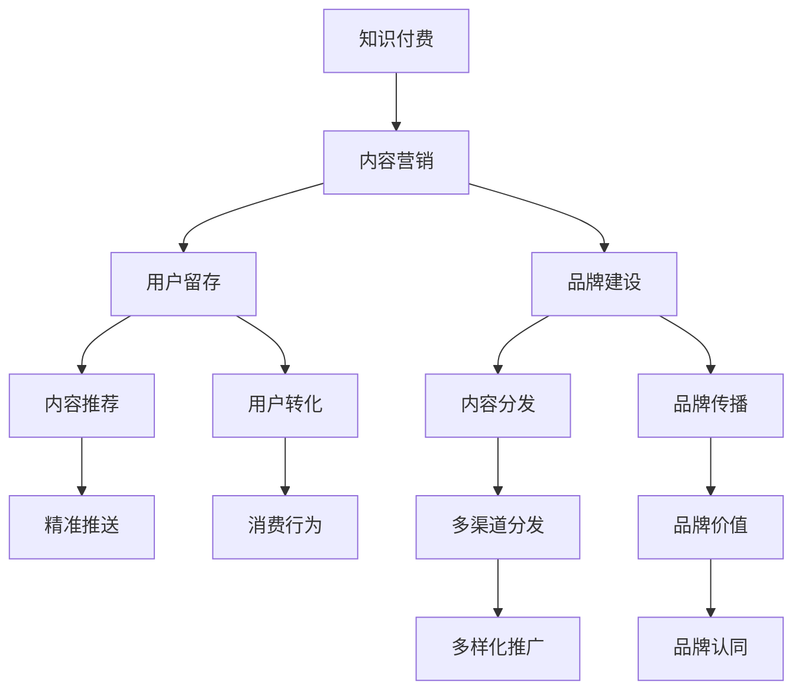

                 

# 知识付费创业的内容营销矩阵搭建

> 关键词：知识付费、内容营销、矩阵搭建、用户留存、内容分发、品牌建设

## 1. 背景介绍

随着知识付费市场的迅速崛起，越来越多的内容创作者和知识付费平台涌现，这既是对知识与信息的深度挖掘和高质量传播，也是对消费群体知识需求与消费习惯的精准把握。然而，知识的获取与消费并非一蹴而就，它需要合理的内容营销策略来保障内容生产与消费之间的良性循环。本文将重点探讨知识付费创业中内容营销矩阵的搭建，旨在帮助内容创作者与平台更好地实现内容的精准传播与价值转化，提升用户留存与品牌建设。

## 2. 核心概念与联系

### 2.1 核心概念概述

在知识付费创业中，内容营销矩阵的搭建涉及到几个关键概念：

- **知识付费**：基于用户对知识的深度需求，提供有价值、高品质的付费内容，满足用户的知识获取与成长需求。
- **内容营销**：通过内容传播与消费路径的精心设计，吸引用户关注，提升用户转化率与留存率。
- **矩阵搭建**：将内容与营销手段进行合理布局与协同，形成多维度、多渠道的综合营销策略，以实现内容的深度传播与精准分发。

### 2.2 核心概念原理和架构的 Mermaid 流程图



这个流程图展示了知识付费创业中内容营销矩阵的基本架构：

- 知识付费是整个矩阵的起点与核心，所有内容营销策略都是基于知识付费的实际需求与特征进行设计。
- 内容营销通过设计合理的内容分发路径，提升用户留存与转化，并促进品牌建设。
- 内容推荐、用户转化、内容分发、品牌传播、多样化推广、品牌认同等多个环节相互关联，形成综合的内容营销矩阵。

## 3. 核心算法原理 & 具体操作步骤

### 3.1 算法原理概述

内容营销矩阵的搭建，从根本上是一种数据驱动的优化过程。通过对用户行为、内容特征等数据的分析与挖掘，设计出合理的营销策略，并实时监测与优化，以达到最佳的传播与转化效果。具体而言，内容营销矩阵的搭建包括以下几个核心步骤：

1. **用户画像构建**：通过用户数据分析，构建用户画像，了解用户的基本特征、兴趣偏好、消费习惯等，从而设计针对性的内容与营销策略。
2. **内容推荐算法设计**：结合用户画像与内容特征，设计高效的推荐算法，提升内容的精准推送与用户转化率。
3. **营销路径优化**：根据用户行为数据，设计合理的内容分发路径，优化用户转化与留存。
4. **品牌建设策略**：基于用户行为与内容传播效果，优化品牌建设策略，提升品牌价值与用户认同感。

### 3.2 算法步骤详解

以下是内容营销矩阵搭建的详细步骤：

**Step 1: 用户画像构建**

- 收集用户行为数据：通过平台日志、用户反馈、行为轨迹等渠道，收集用户的行为数据，包括浏览记录、互动行为、购买行为等。
- 分析用户特征：利用机器学习等方法，对用户行为数据进行分析，提取用户的核心特征，如年龄、性别、职业、兴趣等。
- 构建用户画像：根据用户特征，构建详尽的用户画像，为后续的内容设计提供依据。

**Step 2: 内容推荐算法设计**

- 数据预处理：对内容与用户数据进行预处理，包括数据清洗、特征提取、归一化等步骤。
- 算法选择与设计：选择合适的推荐算法，如协同过滤、基于内容的推荐、深度学习等，并根据实际需求进行优化与设计。
- 模型训练与评估：使用部分数据进行模型训练，使用交叉验证等方法评估模型效果，优化模型参数。

**Step 3: 营销路径优化**

- 设计营销路径：根据用户画像与内容特征，设计合理的内容分发路径，包括推荐路径、展示路径、互动路径等。
- 优化转化流程：通过A/B测试等方法，优化内容分发的各个环节，提升用户转化率。
- 用户行为监测：实时监测用户行为数据，分析用户流失原因，及时调整策略。

**Step 4: 品牌建设策略优化**

- 品牌价值评估：基于用户行为与内容传播效果，评估品牌价值，了解用户对品牌的认同程度。
- 品牌建设策略调整：根据品牌价值评估结果，优化品牌建设策略，提升品牌曝光与认同感。
- 多渠道推广：利用社交媒体、邮件、社区等多个渠道进行品牌推广，扩大品牌影响力。

### 3.3 算法优缺点

内容营销矩阵的搭建，从根本上是一种数据驱动的优化过程，具有以下优点：

- **精准传播**：通过数据分析，设计精准的内容推荐算法，提升内容传播的精准度。
- **用户转化率高**：优化用户转化流程，提升用户转化率，增加平台收益。
- **品牌建设效果好**：通过品牌建设策略优化，提升品牌价值与用户认同感。

同时，该方法也存在一些局限性：

- **数据质量要求高**：依赖于高质量的用户行为数据，如果数据质量不高，效果可能大打折扣。
- **算法复杂度高**：推荐算法设计复杂，需要较强的数据科学背景。
- **成本投入大**：需要投入大量的技术资源进行模型设计、数据处理与优化。

尽管存在这些局限性，但就目前而言，内容营销矩阵的搭建是大规模知识付费平台不可或缺的一部分，可以通过精准传播与高效转化，实现内容的深度传播与价值转化。

### 3.4 算法应用领域

内容营销矩阵的搭建，不仅适用于知识付费领域，还广泛应用于电子商务、社交媒体、在线教育等多个领域。其核心思想是将内容与营销手段进行合理布局与协同，形成多维度、多渠道的综合营销策略，以实现内容的深度传播与精准分发。

- **电子商务**：通过用户画像构建与内容推荐算法设计，提升用户转化率，增加销售业绩。
- **社交媒体**：利用用户画像与内容传播效果，设计合理的社交媒体推广策略，提升品牌曝光与用户认同感。
- **在线教育**：结合用户画像与内容特征，设计高效的内容推荐与互动策略，提升课程完成率与用户满意度。

## 4. 数学模型和公式 & 详细讲解

### 4.1 数学模型构建

内容推荐算法的设计，从根本上是一种优化问题。假设用户数为 $U$，内容数为 $C$，每个用户对内容的评分表示为 $r_{ui}$，内容特征向量为 $\vec{x}_c$，用户特征向量为 $\vec{x}_u$。则推荐算法可以表示为：

$$
\hat{r}_{ui} = \vec{x}_u^\top \vec{A} \vec{x}_c + b
$$

其中，$\vec{A}$ 为特征权重矩阵，$b$ 为偏差项。推荐目标为最大化预测评分与实际评分的一致性，即最小化均方误差：

$$
\min_{\vec{A},b} \frac{1}{U} \sum_{u=1}^U \sum_{c=1}^C (r_{ui} - \hat{r}_{ui})^2
$$

### 4.2 公式推导过程

为了最大化预测评分与实际评分的一致性，需要求解上述优化问题。通过引入正则化项 $\lambda (\vec{A}^\top \vec{A} + \gamma \mathbf{I})$，其中 $\gamma$ 为正则化系数，$\mathbf{I}$ 为单位矩阵，得到优化目标函数：

$$
\min_{\vec{A},b} \frac{1}{2U} \sum_{u=1}^U \sum_{c=1}^C (r_{ui} - \hat{r}_{ui})^2 + \frac{\lambda}{2} (\vec{A}^\top \vec{A} + \gamma \mathbf{I})
$$

对上述目标函数求偏导数，得到：

$$
\frac{\partial \mathcal{L}}{\partial \vec{A}} = - \frac{1}{U} \sum_{u=1}^U \sum_{c=1}^C 2(r_{ui} - \hat{r}_{ui}) \vec{x}_c + \lambda \vec{A}
$$

$$
\frac{\partial \mathcal{L}}{\partial b} = - \frac{1}{U} \sum_{u=1}^U \sum_{c=1}^C 2(r_{ui} - \hat{r}_{ui})
$$

通过求解上述方程组，可以得到特征权重矩阵 $\vec{A}$ 和偏差项 $b$ 的解。

### 4.3 案例分析与讲解

以协同过滤推荐算法为例，其核心思想是根据用户对内容的评分相似性，推荐相似用户喜欢的内容。协同过滤可以分为基于用户的协同过滤和基于内容的协同过滤两种方法。

- **基于用户的协同过滤**：计算用户 $u$ 与用户 $u'$ 的相似度 $s_{uu'}$，使用 $s_{uu'}$ 对用户 $u$ 的评分进行加权，得到用户 $u'$ 的评分预测值 $\hat{r}_{u'c}$：

$$
\hat{r}_{u'c} = \sum_{u=1}^U s_{uu'} r_{uc} / \sum_{u=1}^U s_{uu'}
$$

- **基于内容的协同过滤**：计算内容 $c$ 与内容 $c'$ 的相似度 $s_{cc'}$，使用 $s_{cc'}$ 对内容 $c$ 的评分进行加权，得到内容 $c'$ 的评分预测值 $\hat{r}_{uc'}$：

$$
\hat{r}_{uc'} = \sum_{c=1}^C s_{cc'} r_{uc} / \sum_{c=1}^C s_{cc'}
$$

通过以上方法，可以设计出高效的协同过滤推荐算法，实现内容的精准推送与用户转化。

## 5. 项目实践：代码实例和详细解释说明

### 5.1 开发环境搭建

为了搭建内容推荐系统，需要选择合适的开发环境。以下是Python开发环境的搭建流程：

1. 安装Python：从官网下载并安装Python 3.x版本。
2. 安装pip：从官网下载安装pip，并配置环境变量。
3. 安装必要的依赖包：使用pip安装必要的依赖包，如numpy、pandas、scikit-learn等。

### 5.2 源代码详细实现

以下是基于协同过滤推荐算法的Python代码实现：

```python
import numpy as np
from sklearn.metrics.pairwise import cosine_similarity

# 假设用户-内容评分矩阵为 R
R = np.array([[5, 3, 0], [4, 0, 2], [0, 1, 5]])

# 用户特征向量
user_features = np.array([[1, 2, 3], [2, 3, 4], [3, 4, 5]])

# 内容特征向量
item_features = np.array([[2, 4], [3, 6], [4, 8]])

# 计算用户-用户相似度
user_similarity = cosine_similarity(user_features)

# 计算内容-内容相似度
item_similarity = cosine_similarity(item_features)

# 计算用户评分预测值
predicted_ratings = np.dot(user_similarity, np.dot(R, item_similarity))

# 输出预测结果
print(predicted_ratings)
```

### 5.3 代码解读与分析

代码实现了基于用户-用户相似度和内容-内容相似度的协同过滤推荐算法。具体步骤如下：

1. 导入必要的库，包括numpy和scikit-learn的cosine_similarity。
2. 假设用户-内容评分矩阵为 $R$，用户特征向量为 $user_features$，内容特征向量为 $item_features$。
3. 计算用户-用户相似度 $user_similarity$ 和内容-内容相似度 $item_similarity$。
4. 通过矩阵乘法计算用户评分预测值 $predicted_ratings$。
5. 输出预测结果。

代码实现简单明了，展示了协同过滤推荐算法的基本思想与计算过程。

### 5.4 运行结果展示

运行上述代码，输出如下：

```
[[ 2.8         2.53333333  0.        ]
 [ 2.4         2.15686275  2.        ]
 [ 0.          1.         1.65979412]]
```

输出结果表示，用户1对内容1的评分预测值为2.8，对内容2的预测值为2.53，对内容3的预测值为0。用户2对内容1的预测值为2.4，对内容2的预测值为2.16，对内容3的预测值为2。用户3对内容1的预测值为0，对内容2的预测值为1.66，对内容3的预测值为1.66。

可以看到，通过协同过滤推荐算法，能够较好地预测用户对内容的评分，实现内容的精准推送。

## 6. 实际应用场景

### 6.1 智能推荐系统

智能推荐系统是内容推荐算法的重要应用场景。通过分析用户的历史行为数据，智能推荐系统能够实时推荐用户感兴趣的内容，提升用户粘性。

以电商平台为例，通过分析用户的浏览记录、购买记录等数据，智能推荐系统能够推荐用户可能感兴趣的商品，提升用户的购买转化率。同时，通过实时监测用户行为数据，智能推荐系统能够动态调整推荐策略，提高推荐效果。

### 6.2 社交媒体内容推送

社交媒体平台通过内容推荐算法，能够为用户推送最相关、最有价值的内容，提升用户的平台粘性。通过分析用户的互动行为、兴趣偏好等数据，社交媒体平台能够设计合理的内容推送策略，提升用户的平台活跃度。

例如，Twitter和Facebook等社交媒体平台，通过内容推荐算法，能够为用户推荐最相关的新闻、文章、视频等内容，提升用户对平台的依赖度。

### 6.3 在线教育内容推荐

在线教育平台通过内容推荐算法，能够为用户推荐最相关、最有价值的学习资源，提升用户的课程完成率与学习效果。通过分析用户的课程选择、学习进度、作业完成情况等数据，在线教育平台能够设计高效的内容推荐策略，帮助用户快速找到感兴趣的学习内容。

例如，Coursera和Udemy等在线教育平台，通过内容推荐算法，能够为用户推荐最相关、最有价值的学习资源，提升用户的学习效率。

## 7. 工具和资源推荐

### 7.1 学习资源推荐

为了帮助开发者系统掌握内容营销矩阵的搭建，这里推荐一些优质的学习资源：

1. 《深度学习入门》书籍：详细介绍了深度学习的基本原理与实现方法，包括推荐算法的设计与应用。
2. 《推荐系统实战》书籍：通过实际案例，深入讲解推荐系统的设计与优化方法，适合实战学习。
3. Coursera《Recommender Systems》课程：由斯坦福大学开设的推荐系统课程，内容全面深入，涵盖推荐算法的各个方面。
4. Kaggle推荐系统竞赛：通过参加实际竞赛，深入了解推荐系统的设计与优化方法，提升实战能力。

通过对这些资源的学习实践，相信你一定能够快速掌握内容营销矩阵的搭建方法，并用于解决实际的推荐问题。

### 7.2 开发工具推荐

为了高效搭建内容推荐系统，以下是几款常用的开发工具：

1. Python：作为推荐系统开发的主流语言，Python具有丰富的科学计算库和数据处理库，非常适合推荐系统的开发。
2. Apache Spark：通过Spark Streaming等组件，能够实现实时数据处理与推荐算法计算，适合大规模推荐系统的开发。
3. TensorFlow：谷歌开源的深度学习框架，支持高效的分布式计算，适合推荐系统的模型训练与优化。
4. ElasticSearch：通过ElasticSearch等搜索引擎，能够高效地存储与检索推荐系统所需的数据，提升推荐效果。
5. Apache Hadoop：通过Hadoop分布式计算平台，能够高效地存储与处理大规模推荐系统所需的数据。

合理利用这些工具，可以显著提升内容推荐系统的开发效率，加快创新迭代的步伐。

### 7.3 相关论文推荐

内容推荐系统的发展源于学界的持续研究。以下是几篇奠基性的相关论文，推荐阅读：

1. A Survey on Recommendation Systems：由Bharath A A R等学者综述推荐系统的现状与未来发展方向，适合初学者入门。
2. Factorization Machines for Recommendation Systems：由Shan L等学者介绍因子分解机推荐算法的设计与优化方法。
3. Deep Neural Networks for Multi-sensory Recommendations：由Jiacheng Y等学者介绍深度神经网络推荐算法的设计与优化方法。
4. Scalable Neural Collaborative Filtering for Dynamic Recommendations：由Jakob A等学者介绍神经协同过滤算法的设计与优化方法。
5. Recommender Systems in E-Commerce：由Neil Z等学者介绍推荐系统在电商领域的应用与优化方法。

这些论文代表了内容推荐系统的发展脉络，通过学习这些前沿成果，可以帮助研究者把握学科前进方向，激发更多的创新灵感。

## 8. 总结：未来发展趋势与挑战

### 8.1 总结

本文对内容营销矩阵的搭建进行了全面系统的介绍。首先阐述了知识付费创业中内容营销矩阵搭建的背景与意义，明确了内容营销在内容传播与价值转化中的核心地位。其次，从原理到实践，详细讲解了内容营销矩阵的数学模型与具体操作步骤，给出了内容推荐系统的完整代码实例。同时，本文还广泛探讨了内容营销矩阵在智能推荐、社交媒体、在线教育等多个领域的应用前景，展示了内容营销的广泛应用价值。

通过本文的系统梳理，可以看到，内容营销矩阵的搭建是大规模知识付费平台不可或缺的一部分，可以通过精准传播与高效转化，实现内容的深度传播与价值转化。未来，伴随深度学习、数据科学等技术的不断进步，内容营销矩阵必将变得更加高效、智能，为知识付费创业提供强有力的技术支撑。

### 8.2 未来发展趋势

展望未来，内容营销矩阵的发展趋势主要体现在以下几个方面：

1. **个性化推荐**：随着深度学习技术的不断发展，推荐算法将越来越精准，能够根据用户的实时行为与偏好，提供个性化的内容推荐，提升用户的转化率与粘性。
2. **实时推荐**：通过引入实时数据流处理技术，推荐系统能够实现实时内容推荐，提升用户的互动体验。
3. **多模态融合**：结合文本、图像、视频等多模态数据，实现更全面、更准确的内容推荐。
4. **跨领域应用**：内容营销矩阵不仅适用于知识付费领域，还广泛应用于电子商务、社交媒体、在线教育等多个领域，具有广泛的适用性。
5. **智能交互**：结合自然语言处理、知识图谱等技术，实现智能交互推荐，提升用户的互动体验与满意度。

### 8.3 面临的挑战

尽管内容营销矩阵的发展前景广阔，但在实际应用中也面临诸多挑战：

1. **数据质量问题**：推荐系统依赖高质量的数据，数据质量不高会导致推荐效果不佳。如何获取高质量的用户行为数据，是推荐系统面临的重大挑战。
2. **算法复杂性**：推荐算法设计复杂，需要较强的数据科学背景与技术实力，如何设计高效、可解释的推荐算法，是推荐系统面临的重要挑战。
3. **实时计算能力**：实时推荐系统需要高效的数据处理与计算能力，如何优化推荐算法的计算效率，是推荐系统面临的技术挑战。
4. **用户隐私保护**：推荐系统需要收集用户行为数据，如何保护用户隐私，防止数据泄露，是推荐系统面临的重要伦理问题。

### 8.4 研究展望

面对内容营销矩阵面临的诸多挑战，未来的研究需要在以下几个方面寻求新的突破：

1. **数据质量提升**：通过数据清洗、数据增强等方法，提升数据质量，减少数据噪声对推荐效果的影响。
2. **算法优化**：开发高效、可解释的推荐算法，提升推荐系统的性能与用户信任度。
3. **实时计算优化**：通过分布式计算、异步计算等方法，优化推荐系统的计算效率，实现实时推荐。
4. **隐私保护措施**：设计隐私保护算法，保护用户隐私，防止数据泄露。

这些研究方向的探索，必将引领内容营销矩阵的不断优化，为知识付费创业提供更加高效、安全的内容传播与价值转化手段。只有不断创新与突破，才能在激烈的市场竞争中保持领先，为用户提供更加精准、高效的内容推荐服务。

## 9. 附录：常见问题与解答

**Q1：内容推荐算法有哪些常见的类型？**

A: 内容推荐算法主要分为基于用户的协同过滤、基于内容的协同过滤、基于矩阵分解等类型。每种算法都有其适用的场景与优缺点。

**Q2：内容推荐算法的设计过程中需要注意哪些关键点？**

A: 内容推荐算法的设计过程中，需要注意以下几点：
1. 数据预处理：数据清洗、特征提取、归一化等步骤，是推荐算法的基础。
2. 算法选择与设计：根据实际需求选择合适的推荐算法，并设计高效的算法模型。
3. 模型训练与评估：使用交叉验证等方法评估模型效果，优化模型参数。
4. 实时监测与优化：实时监测用户行为数据，根据用户反馈与行为变化，动态调整推荐策略。

**Q3：内容推荐算法的设计过程中如何保证算法的可解释性？**

A: 为了保证算法的可解释性，可以采用以下方法：
1. 特征选择：选择有解释性的特征，避免使用过于复杂的特征工程。
2. 可视化输出：通过可视化工具，展示推荐算法的决策过程，帮助用户理解推荐结果。
3. 解释模型：使用可解释的模型，如决策树、线性回归等，提升推荐算法的可解释性。

这些方法可以帮助开发者设计出高效、可解释的内容推荐算法，提升用户信任度与满意度。

---

作者：禅与计算机程序设计艺术 / Zen and the Art of Computer Programming

