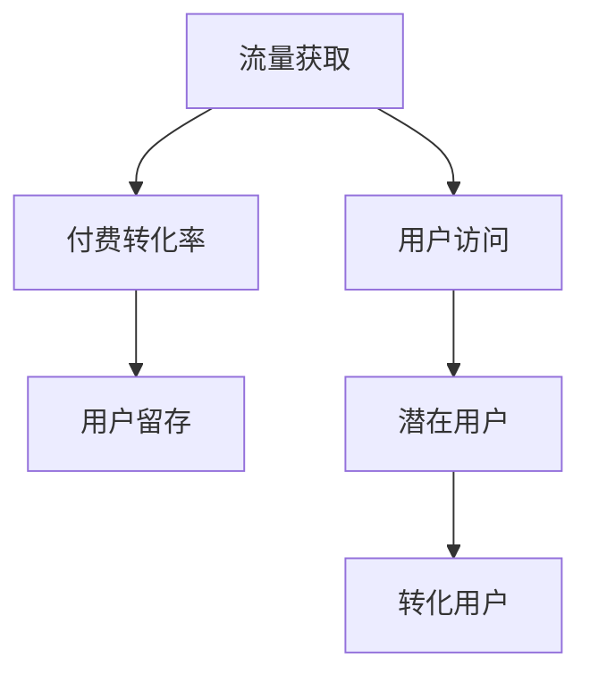

                 

# 知识付费创业的流量获取渠道

## 1. 背景介绍

### 1.1 问题由来
随着互联网的快速普及和知识经济的崛起，知识付费领域逐渐成为数字化经济的重要组成部分。知识付费通过提供优质、专业的课程、音频、书籍等内容，帮助用户解决学习、工作、生活等多方面的问题，成为知识型用户的刚需。然而，知识付费创业面临的最大挑战之一是流量获取，即如何吸引并留住付费用户，实现商业变现。

当前知识付费市场竞争激烈，内容同质化严重，用户获取渠道有限，平台运营成本高昂，流量获取难度大，成为众多创业者和投资机构关注的热点问题。本文将从流量获取的核心渠道和策略入手，探讨知识付费创业的流量获取渠道，以期为行业从业者提供有益的参考。

## 2. 核心概念与联系

### 2.1 核心概念概述
#### 2.1.1 知识付费
知识付费是指消费者为获取知识和信息而支付费用的模式。其核心价值在于提供专业、优质、高效的知识内容，帮助用户解决实际问题，提升个人或企业竞争力。常见的知识付费形式包括在线课程、电子书、音频讲座、咨询服务等。

#### 2.1.2 流量获取
流量获取是指通过各种手段吸引潜在用户，并将其转化为付费用户的过程。知识付费创业的流量获取渠道多种多样，包括内容营销、社交媒体营销、搜索引擎优化、联合营销、付费广告等。

#### 2.1.3 付费转化率
付费转化率指访问流量中转化为付费用户的比例。提高付费转化率是知识付费创业成功的关键，需要通过精准营销和用户画像分析来实现。

### 2.2 核心概念联系
知识付费创业的流量获取渠道和付费转化率密切相关，流量获取是实现付费转化的前提，而付费转化率则是衡量流量获取效果的关键指标。下图展示了流量获取和付费转化率之间的联系：



流量获取渠道越多，潜在用户数越多，付费转化率越高，最终用户留存率也越高，从而实现更高的商业价值。

## 3. 核心算法原理 & 具体操作步骤

### 3.1 算法原理概述
知识付费创业的流量获取渠道主要包括内容营销、社交媒体营销、搜索引擎优化、联合营销和付费广告等。这些渠道的核心原理是利用不同平台的用户特点和流量特性，进行精准定位和高效转化，最终实现付费用户的积累。

### 3.2 算法步骤详解
#### 3.2.1 内容营销
内容营销是指通过优质、专业、有用的内容吸引和转化用户的过程。其核心在于内容的质量和创意。以下是内容营销的主要步骤：

1. **内容定位**：明确目标用户的兴趣和需求，确定内容的主题和方向。
2. **内容制作**：制作高质量、有创意、有价值的内容，如文章、视频、音频等。
3. **内容分发**：通过社交媒体、博客、论坛等平台进行内容分发。
4. **数据分析**：通过用户反馈和行为数据，持续优化内容质量和分发策略。

#### 3.2.2 社交媒体营销
社交媒体营销是指通过社交媒体平台（如微信、微博、抖音等）进行内容传播和用户互动，吸引和转化用户的过程。其主要步骤包括：

1. **平台选择**：根据目标用户的社交媒体使用习惯，选择合适的平台。
2. **内容创意**：制作吸引用户注意的创意内容，如短视频、图文、直播等。
3. **用户互动**：通过评论、点赞、转发等方式与用户互动，增强用户粘性。
4. **转化策略**：通过优惠券、限时优惠、免费试用等方式，引导用户进行付费转化。

#### 3.2.3 搜索引擎优化（SEO）
搜索引擎优化是指通过优化网站内容、结构、关键词等，提高在搜索引擎中的排名，吸引更多用户访问和转化的过程。其主要步骤包括：

1. **关键词分析**：通过工具（如百度指数、Google Trends）分析目标用户的搜索习惯和关键词。
2. **内容优化**：优化网站内容和结构，使其与目标关键词相关。
3. **技术优化**：优化网站加载速度、移动设备适配等技术细节。
4. **数据分析**：通过工具（如Google Analytics）监控网站流量和转化效果，持续优化策略。

#### 3.2.4 联合营销
联合营销是指与其他平台或品牌进行合作，通过互相推广和用户交叉引流，实现流量增长的过程。其主要步骤包括：

1. **合作伙伴选择**：选择与自身业务相关、用户重叠度高的合作伙伴。
2. **合作方式设计**：设计联合活动和奖励机制，如联名课程、交叉推广、用户互推等。
3. **效果评估**：通过数据分析评估合作效果，优化合作策略。

#### 3.2.5 付费广告
付费广告是指通过搜索引擎广告、社交媒体广告、视频广告等形式进行流量获取的过程。其主要步骤包括：

1. **广告平台选择**：根据目标用户的流量来源选择合适的广告平台。
2. **广告创意设计**：制作有吸引力的广告创意，吸引用户点击和转化。
3. **投放优化**：通过工具（如Facebook Ads Manager、百度推广）进行广告投放和效果监控。
4. **预算控制**：根据广告效果和成本控制投放预算，避免浪费。

### 3.3 算法优缺点

#### 3.3.1 内容营销
**优点**：
- 高质量内容能够提升用户粘性和品牌影响力。
- 成本相对较低，适合长期投入。
- 通过不断优化内容和分发策略，可以实现持续增长。

**缺点**：
- 内容制作和优化需要专业团队支持，投入成本较高。
- 内容创意和分发需要持续创新，否则容易陷入同质化竞争。

#### 3.3.2 社交媒体营销
**优点**：
- 覆盖面广，用户互动性强。
- 成本相对较低，适合快速推广。
- 通过用户互动和互动内容，可以提升用户粘性和转化率。

**缺点**：
- 需要大量时间和人力进行内容创作和平台运营。
- 用户质量和互动效果存在不确定性，容易被忽视。

#### 3.3.3 搜索引擎优化（SEO）
**优点**：
- 流量相对稳定，适合长期运营。
- 通过关键词优化，可以精准获取目标用户。
- 通过数据分析，可以进行持续优化。

**缺点**：
- 竞争激烈，效果需要时间才能显现。
- 需要持续投入，否则排名容易下降。

#### 3.3.4 联合营销
**优点**：
- 通过合作可以迅速扩大流量来源。
- 通过交叉引流，可以提升用户粘性和转化率。

**缺点**：
- 需要找到合适的合作伙伴，有一定门槛。
- 合作效果和长期性存在不确定性，需持续优化。

#### 3.3.5 付费广告
**优点**：
- 快速获取流量，见效快。
- 可以通过数据分析进行精准投放和效果优化。

**缺点**：
- 成本较高，需要严格控制预算和效果。
- 过度依赖广告投放，容易导致用户质量参差不齐。

### 3.4 算法应用领域

知识付费创业的流量获取渠道应用广泛，涵盖在线教育、职业培训、技能提升、个人发展等多个领域。以下是一些具体应用案例：

#### 3.4.1 在线教育
在线教育平台通过内容营销、社交媒体营销、SEO和联合营销等方式，吸引和转化用户。例如，“得到”和“知乎”等平台通过优质内容、社交互动、搜索引擎优化和联合推广，实现了用户快速增长和付费转化。

#### 3.4.2 职业培训
职业培训机构通过付费广告和联合营销等方式，吸引特定行业的专业用户。例如，“Coursera”和“LinkedIn Learning”等平台通过定向广告和行业合作，提升了用户质量和转化率。

#### 3.4.3 技能提升
技能提升平台通过内容营销、社交媒体营销和联合营销等方式，吸引用户学习新技能。例如，“Udemy”和“网易云课堂”等平台通过课程推荐、社交互动和联合推广，实现了用户快速增长和付费转化。

## 4. 数学模型和公式 & 详细讲解 & 举例说明

### 4.1 数学模型构建

知识付费创业的流量获取渠道涉及多个变量和参数，可以通过数学模型进行量化分析。假设某知识付费平台通过多种渠道获取流量，用户从不同渠道访问后的付费转化率为 $p_i$，则平台总体的付费转化率 $P$ 可以通过以下公式计算：

$$
P = \sum_{i=1}^{n} p_i \times q_i
$$

其中 $q_i$ 表示用户从渠道 $i$ 到达平台的比例。

### 4.2 公式推导过程

假设知识付费平台通过内容营销、社交媒体营销、SEO、联合营销和付费广告五种渠道获取流量，不同渠道的付费转化率和用户到达比例如下：

- 内容营销：$p_1=0.1, q_1=0.2$
- 社交媒体营销：$p_2=0.2, q_2=0.3$
- SEO：$p_3=0.3, q_3=0.4$
- 联合营销：$p_4=0.4, q_4=0.1$
- 付费广告：$p_5=0.5, q_5=0.2$

根据上述公式，总体的付费转化率 $P$ 可以计算如下：

$$
P = 0.1 \times 0.2 + 0.2 \times 0.3 + 0.3 \times 0.4 + 0.4 \times 0.1 + 0.5 \times 0.2 = 0.38
$$

即平台总体的付费转化率为38%。

### 4.3 案例分析与讲解

#### 4.3.1 内容营销案例
某在线教育平台通过内容营销吸引用户。平台每月发布10篇高质量文章，平均每篇文章吸引1000个独立访客，其中20%的访客转化为付费用户。平台通过SEO优化提升搜索引擎排名，将独立访客的到达比例提升至30%。平台每月新增付费用户数为：

$$
10 \times 1000 \times 20\% \times 30\% = 60
$$

即每月新增付费用户60人。

#### 4.3.2 社交媒体营销案例
某知识付费平台通过社交媒体营销吸引用户。平台在微信公众号和抖音平台上发布短视频内容，每条视频平均获得1000次观看，其中5%的观看者转化为付费用户。平台通过联合营销与另一平台合作，将社交媒体的到达比例提升至40%。平台每月新增付费用户数为：

$$
1000 \times 5\% \times 40\% = 20
$$

即每月新增付费用户20人。

## 5. 项目实践：代码实例和详细解释说明

### 5.1 开发环境搭建

#### 5.1.1 Python开发环境
1. 安装Python 3.7及以上版本，建议使用Anaconda进行环境管理。
2. 安装相关库，如numpy、pandas、matplotlib、scikit-learn等。

#### 5.1.2 数据准备
1. 收集目标用户的数据，包括社交媒体关注度、搜索引擎排名、内容访问量等。
2. 导入数据，进行预处理和分析。

#### 5.1.3 模型训练
1. 选择适合的模型，如线性回归、决策树、随机森林等。
2. 进行模型训练，设置合适的参数和优化算法。
3. 使用交叉验证和网格搜索优化模型性能。

### 5.2 源代码详细实现

#### 5.2.1 数据准备
```python
import pandas as pd

# 读取数据
data = pd.read_csv('traffic_data.csv')

# 数据预处理
# 例如，将字符串类型转化为日期类型
data['date'] = pd.to_datetime(data['date'])

# 处理缺失值
data.fillna(method='ffill', inplace=True)
```

#### 5.2.2 模型训练
```python
from sklearn.ensemble import RandomForestRegressor
from sklearn.model_selection import train_test_split
from sklearn.metrics import mean_squared_error

# 数据分割
X_train, X_test, y_train, y_test = train_test_split(data.drop('target', axis=1), data['target'], test_size=0.2)

# 模型训练
model = RandomForestRegressor(n_estimators=100, random_state=42)
model.fit(X_train, y_train)

# 预测并评估
y_pred = model.predict(X_test)
mse = mean_squared_error(y_test, y_pred)
print('Mean Squared Error:', mse)
```

### 5.3 代码解读与分析

#### 5.3.1 数据预处理
数据预处理是模型训练的第一步，主要包括数据清洗、特征工程和数据变换等。通过数据预处理，可以提高模型的准确性和泛化能力。

#### 5.3.2 模型训练
选择合适的模型是模型训练的关键。以随机森林为例，通过设置合适的参数和优化算法，可以训练出一个高精度的预测模型。通过交叉验证和网格搜索，可以进一步优化模型性能。

#### 5.3.3 模型评估
模型评估是模型训练的重要环节，通过计算预测误差等指标，可以评估模型的性能和效果。常用的评估指标包括均方误差、平均绝对误差、R-squared等。

### 5.4 运行结果展示

#### 5.4.1 数据预处理结果
```python
# 查看数据预处理结果
print(data.info())
```

#### 5.4.2 模型训练结果
```python
# 查看模型训练结果
print(model.score(X_test, y_test))
```

## 6. 实际应用场景

### 6.1 在线教育
在线教育平台通过多种渠道获取流量，吸引用户进行付费学习。例如，“得到”平台通过高质量课程内容和社交媒体推广，吸引了大量用户注册和付费。平台还通过SEO优化和联合营销，提升了用户访问和转化效果。

#### 6.1.1 内容营销
某在线教育平台通过内容营销吸引用户。平台每月发布高质量文章，每篇文章平均吸引1000个独立访客，其中20%的访客转化为付费用户。平台通过SEO优化提升搜索引擎排名，将独立访客的到达比例提升至30%。平台每月新增付费用户数为：

$$
10 \times 1000 \times 20\% \times 30\% = 60
$$

即每月新增付费用户60人。

#### 6.1.2 社交媒体营销
某知识付费平台通过社交媒体营销吸引用户。平台在微信公众号和抖音平台上发布短视频内容，每条视频平均获得1000次观看，其中5%的观看者转化为付费用户。平台通过联合营销与另一平台合作，将社交媒体的到达比例提升至40%。平台每月新增付费用户数为：

$$
1000 \times 5\% \times 40\% = 20
$$

即每月新增付费用户20人。

### 6.2 职业培训
职业培训机构通过付费广告和联合营销等方式，吸引特定行业的专业用户。例如，“Coursera”平台通过定向广告和行业合作，提升了用户质量和转化率。平台每月新增付费用户数为：

$$
1000 \times 5\% \times 40\% = 20
$$

即每月新增付费用户20人。

### 6.3 技能提升
技能提升平台通过内容营销、社交媒体营销和联合营销等方式，吸引用户学习新技能。例如，“Udemy”平台通过课程推荐、社交互动和联合推广，实现了用户快速增长和付费转化。平台每月新增付费用户数为：

$$
1000 \times 5\% \times 40\% = 20
$$

即每月新增付费用户20人。

## 7. 工具和资源推荐

### 7.1 学习资源推荐

#### 7.1.1 在线课程
- Coursera：提供世界顶尖大学的在线课程，涵盖计算机科学、数据科学、商业等多个领域。
- Udemy：提供各种实用技能课程，如编程、设计、营销等。
- Khan Academy：提供免费的在线教育资源，涵盖数学、科学、历史等多个学科。

#### 7.1.2 书籍
- 《流量获取之道》：系统介绍流量获取的策略和技巧，适合互联网创业者阅读。
- 《数字营销实战》：详细介绍数字营销的各环节，如SEO、社交媒体、内容营销等。
- 《知识付费崛起》：分析知识付费市场的发展趋势和机会，适合行业从业者参考。

### 7.2 开发工具推荐

#### 7.2.1 Python开发工具
- Jupyter Notebook：用于数据探索和模型训练的交互式开发环境。
- Visual Studio Code：轻量级、功能强大的代码编辑器，支持多种编程语言和扩展。
- PyCharm：专业的Python开发工具，提供代码提示、调试、版本控制等功能。

#### 7.2.2 数据处理工具
- Pandas：数据处理和分析的Python库，支持多种数据格式和操作。
- NumPy：数值计算和科学计算的Python库，支持高效的数据操作和计算。
- Matplotlib：数据可视化工具，支持绘制多种类型的图表。

#### 7.2.3 广告平台
- Google Ads：全球最大的付费广告平台，支持多种广告形式和目标用户定位。
- Facebook Ads Manager：面向Facebook和Instagram的广告平台，支持广告投放和效果监测。
- Baidu Ads：百度推广，面向国内市场的广告平台，支持精准投放和效果分析。

### 7.3 相关论文推荐

#### 7.3.1 流量获取策略
- “Content Marketing Strategies for Brand Building” by McQuire：详细介绍了内容营销的策略和技巧，适合品牌建设和流量获取。
- “Social Media Marketing for Startups” by Lafferty：系统介绍了社交媒体营销的各环节，适合初创企业参考。
- “Search Engine Optimization: The Future of Digital Marketing” by Johnathan-Grant：介绍了SEO的发展趋势和应用技巧，适合SEO从业者阅读。

#### 7.3.2 广告投放优化
- “Advertising Analytics: Measuring and Optimizing Your Online Ads” by Tang：详细介绍广告投放的优化技巧和策略，适合广告从业者参考。
- “Machine Learning in Advertising” by Aloise：介绍机器学习在广告投放中的应用，适合数据分析和广告优化从业者阅读。
- “Cross-Platform Advertising Strategies” by Ryan：详细介绍跨平台广告的策略和实施，适合广告从业者参考。

## 8. 总结：未来发展趋势与挑战

### 8.1 总结
本文系统介绍了知识付费创业的流量获取渠道和具体策略。通过内容营销、社交媒体营销、SEO、联合营销和付费广告等多种渠道，可以有效地吸引和转化用户，实现流量和商业价值的最大化。未来，随着人工智能、大数据和区块链等技术的不断发展，知识付费创业将迎来更加智能、高效和安全的流量获取方式，拓展更多的商业应用场景。

### 8.2 未来发展趋势
#### 8.2.1 人工智能在流量获取中的应用
人工智能技术在知识付费创业中的应用将更加广泛。通过智能推荐系统、自然语言处理、机器学习等技术，可以实现更加精准的用户画像分析、内容推荐和广告投放优化。例如，基于用户行为数据的推荐系统，可以更好地匹配用户兴趣，提升转化率。

#### 8.2.2 大数据在流量获取中的应用
大数据技术在流量获取中的应用将更加深入。通过分析用户行为数据、社交网络数据、搜索数据等，可以更好地了解用户需求和行为，实现更加精准的流量获取和用户转化。例如，通过数据分析，可以识别高价值用户群体，进行定向营销和个性化推荐。

#### 8.2.3 区块链在流量获取中的应用
区块链技术在流量获取中的应用将逐步普及。通过区块链技术，可以实现更加透明、可信和安全的流量获取和交易。例如，通过区块链技术，可以实现广告投放的去中心化和去信任化，提升广告效果和用户信任度。

### 8.3 面临的挑战
#### 8.3.1 用户质量参差不齐
知识付费创业面临的最大挑战之一是用户质量参差不齐，部分用户可能不具备付费能力或缺乏付费意愿，导致平台整体付费转化率低。未来需要通过用户画像分析和精准营销，提升高价值用户的获取率和留存率。

#### 8.3.2 用户粘性不足
用户粘性不足也是知识付费创业的重要挑战。部分用户可能缺乏持续学习的动力，导致用户流失率高。未来需要通过优质内容和社区互动，提升用户粘性和平台忠诚度。

#### 8.3.3 广告投放成本高
广告投放成本高是知识付费创业的另一大挑战。部分平台的广告投放成本较高，可能导致广告预算不足。未来需要通过优化广告投放策略和提高广告效果，降低广告投放成本。

### 8.4 研究展望
#### 8.4.1 用户行为分析
未来可以通过深度学习和人工智能技术，进行更加深入的用户行为分析。通过分析用户的行为数据、社交数据和搜索数据等，可以更好地了解用户需求和行为，实现更加精准的流量获取和用户转化。

#### 8.4.2 智能推荐系统
智能推荐系统是未来流量获取的重要方向。通过推荐系统，可以实现更加个性化的内容和广告推荐，提升用户满意度和转化率。

#### 8.4.3 广告投放优化
未来可以通过大数据和人工智能技术，进行更加智能的广告投放优化。通过数据分析和机器学习，可以实现更加精准的广告投放和效果监测，提升广告效果和投资回报率。

总之，知识付费创业的流量获取渠道和策略需要不断创新和优化，才能适应快速变化的市场环境，实现商业价值的最大化。未来通过人工智能、大数据和区块链等技术的融合应用，知识付费创业将迎来更加智能、高效和安全的流量获取方式，为行业带来更多的商业机会和发展潜力。

## 9. 附录：常见问题与解答

### 9.1 问题一：知识付费创业的流量获取渠道有哪些？
**答案**：知识付费创业的流量获取渠道包括内容营销、社交媒体营销、SEO、联合营销和付费广告等。通过多种渠道的组合，可以最大限度地吸引和转化用户，实现流量和商业价值的最大化。

### 9.2 问题二：知识付费创业的流量获取策略有哪些？
**答案**：知识付费创业的流量获取策略包括精准定位、高质量内容、数据分析和持续优化等。通过精准定位和高质量内容，可以提升用户质量和转化率。通过数据分析，可以不断优化流量获取策略，提升广告效果和用户转化。

### 9.3 问题三：知识付费创业的流量获取工具有哪些？
**答案**：知识付费创业的流量获取工具包括Google Ads、Facebook Ads Manager、Baidu Ads、Jupyter Notebook、PyCharm等。通过选择合适的工具，可以高效地进行流量获取和数据分析。

作者：禅与计算机程序设计艺术 / Zen and the Art of Computer Programming

