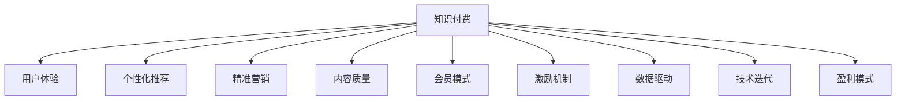

                 

# 知识付费如何实现可持续盈利？

> 关键词：知识付费, 用户体验, 个性化推荐, 精准营销, 内容质量, 会员模式, 激励机制, 数据驱动, 技术迭代, 盈利模式

## 1. 背景介绍

### 1.1 问题由来

随着互联网和智能手机的普及，越来越多的人通过在线渠道获取知识和信息。传统的教科书和学术文章已经难以满足大众的需求。因此，知识付费行业应运而生，成为新时代的知识传播方式。然而，尽管知识付费市场蓬勃发展，大部分平台仍然面临盈利困难的问题。许多平台难以保持用户粘性，难以实现盈利闭环，导致恶性循环。如何实现知识付费的可持续盈利，成为亟待解决的问题。

### 1.2 问题核心关键点

实现知识付费的可持续盈利，需要从用户体验、个性化推荐、精准营销、内容质量、会员模式、激励机制等多个维度进行综合考虑。本文将系统性地分析这些关键点，探讨如何构建一个能够实现可持续盈利的知识付费平台。

## 2. 核心概念与联系

### 2.1 核心概念概述

为更好地理解知识付费的可持续盈利模式，本节将介绍几个密切相关的核心概念：

- **知识付费**：用户支付一定费用，获取特定领域或主题的专业知识和信息。知识付费平台包括线上课程、电子书、音频讲座、视频教程等多种形式。
- **用户体验**：用户在使用知识付费产品时的感受和满意度。良好的用户体验能够提高用户粘性，减少流失率。
- **个性化推荐**：根据用户的行为数据和偏好，提供个性化的内容推荐，提升用户满意度和活跃度。
- **精准营销**：针对不同用户群体，精准投放广告和促销信息，提高转化率和客户终身价值。
- **内容质量**：知识付费的核心在于内容质量。高质量的内容能够吸引用户付费，并长期保持用户黏性。
- **会员模式**：通过会员制订阅，实现平台盈利。会员付费可以获得更多优质内容和服务。
- **激励机制**：设计合理的激励机制，吸引用户积极参与付费内容的生产和反馈。
- **数据驱动**：利用大数据分析用户行为和偏好，优化内容和营销策略，提高盈利能力。
- **技术迭代**：持续更新和优化技术架构，提升平台的性能和用户体验。
- **盈利模式**：包括广告、课程销售、会员订阅、增值服务等多元化盈利渠道。

这些核心概念之间的逻辑关系可以通过以下Mermaid流程图来展示：



这个流程图展示了这个概念体系的核心元素及其相互关系：

1. **知识付费**是整个体系的核心，其他概念都是围绕其进行设计和优化。
2. **用户体验**直接影响用户黏性，是知识付费平台的关键。
3. **个性化推荐**提升用户满意度，增加用户活跃度。
4. **精准营销**提高转化率，增加用户终身价值。
5. **内容质量**是知识付费的基础，影响用户付费意愿。
6. **会员模式**提供优质服务和盈利。
7. **激励机制**吸引用户参与，提升内容质量。
8. **数据驱动**优化策略，提高盈利能力。
9. **技术迭代**提升平台性能。
10. **盈利模式**实现多渠道盈利。

## 3. 核心算法原理 & 具体操作步骤

### 3.1 算法原理概述

知识付费的可持续盈利，依赖于用户数据的收集和分析，从而提升平台的用户体验、个性化推荐和精准营销。算法原理主要包括以下几个方面：

1. **用户画像构建**：通过收集用户的浏览、搜索、购买、评价等行为数据，构建详细的用户画像，了解用户需求和偏好。
2. **个性化推荐算法**：根据用户画像，使用协同过滤、内容推荐、深度学习等算法，提供个性化的内容推荐，提升用户满意度。
3. **精准营销算法**：利用用户画像和行为数据，使用聚类、回归等算法，进行精准的投放广告和促销活动。
4. **收益预测模型**：通过分析历史用户行为和交易数据，使用机器学习模型预测用户未来行为和收益，优化会员和广告策略。

### 3.2 算法步骤详解

#### 3.2.1 用户画像构建

**步骤1**：收集用户数据
- 获取用户的浏览记录、搜索历史、课程购买记录、评论内容等行为数据。
- 使用日志文件、数据库、API接口等技术手段，获取全面、实时、高质量的数据。

**步骤2**：数据清洗和预处理
- 去除数据中的噪声和异常值，如无效访问、重复数据等。
- 对数据进行归一化、标准化、去除缺失值等预处理操作，提升数据质量。

**步骤3**：特征工程
- 设计合适的特征表示，如用户ID、时间戳、课程类别、用户评分等。
- 使用特征选择和降维技术，提取最有用的特征。

**步骤4**：建模和训练
- 选择合适的算法模型，如K-Means、DBSCAN、LDA等。
- 训练模型，生成用户画像。

#### 3.2.2 个性化推荐算法

**步骤1**：设计推荐模型
- 使用协同过滤、基于内容的推荐、矩阵分解等算法，设计推荐模型。
- 在预训练模型上添加推荐层，进行微调。

**步骤2**：特征工程
- 设计合适的特征表示，如课程ID、用户评分、用户性别、课程时长等。
- 使用特征选择和降维技术，提取最有用的特征。

**步骤3**：训练和优化
- 使用优化算法，如梯度下降、Adam等，优化推荐模型。
- 使用交叉验证、A/B测试等技术手段，评估和优化模型效果。

#### 3.2.3 精准营销算法

**步骤1**：设计营销模型
- 使用聚类、回归等算法，设计营销模型。
- 在预训练模型上添加营销层，进行微调。

**步骤2**：特征工程
- 设计合适的特征表示，如用户ID、用户评分、用户地理位置、课程价格等。
- 使用特征选择和降维技术，提取最有用的特征。

**步骤3**：训练和优化
- 使用优化算法，如梯度下降、Adam等，优化营销模型。
- 使用交叉验证、A/B测试等技术手段，评估和优化模型效果。

#### 3.2.4 收益预测模型

**步骤1**：设计预测模型
- 使用时间序列、回归等算法，设计收益预测模型。
- 在预训练模型上添加预测层，进行微调。

**步骤2**：特征工程
- 设计合适的特征表示，如用户购买时间、课程价格、用户复购率等。
- 使用特征选择和降维技术，提取最有用的特征。

**步骤3**：训练和优化
- 使用优化算法，如梯度下降、Adam等，优化预测模型。
- 使用交叉验证、A/B测试等技术手段，评估和优化模型效果。

### 3.3 算法优缺点

知识付费平台通过算法实现个性化推荐、精准营销和收益预测，具有以下优点：

1. **提升用户体验**：通过个性化推荐，提升用户满意度和粘性，减少流失率。
2. **精准营销**：通过精准营销，提高转化率和用户终身价值，增加平台收益。
3. **优化内容质量**：通过用户行为数据，优化课程内容，提升用户付费意愿。
4. **数据驱动决策**：通过数据驱动的决策，优化会员和广告策略，提高盈利能力。

但这些算法也存在一些缺点：

1. **数据隐私**：收集大量用户数据，可能涉及隐私问题，需要加强数据保护。
2. **模型复杂度**：复杂模型需要大量计算资源，可能导致成本上升。
3. **模型偏差**：模型训练过程中可能存在偏差，导致推荐和营销效果不佳。
4. **用户抵制**：用户可能对过度推荐和营销产生反感，影响用户体验。

### 3.4 算法应用领域

知识付费平台的算法主要应用于以下几个方面：

1. **个性化推荐**：提升用户满意度，增加用户活跃度。
2. **精准营销**：提高转化率，增加用户终身价值。
3. **收益预测**：优化会员和广告策略，提高盈利能力。
4. **用户画像构建**：了解用户需求和偏好，优化用户体验。

## 4. 数学模型和公式 & 详细讲解 & 举例说明

### 4.1 数学模型构建

本节将使用数学语言对知识付费的可持续盈利算法进行更加严格的刻画。

假设知识付费平台有 $N$ 个用户，每个用户有 $M$ 个课程选择，每个课程的评分分布为 $p(x)$。

定义用户画像为 $u_i$，其中 $i \in [1, N]$，特征表示为 $x_i = (u_{i1}, u_{i2}, ..., u_{im})$。

定义课程推荐模型为 $R(x)$，其中 $x = (x_1, x_2, ..., x_M)$，输出为课程ID，表示用户 $i$ 可能感兴趣的课程。

定义精准营销模型为 $M(x)$，其中 $x = (x_1, x_2, ..., x_M)$，输出为广告位，表示用户 $i$ 可能感兴趣的广告位。

定义收益预测模型为 $Y(x)$，其中 $x = (x_1, x_2, ..., x_M)$，输出为收益值，表示用户 $i$ 的付费行为。

### 4.2 公式推导过程

#### 4.2.1 个性化推荐算法

**协同过滤推荐算法**
定义用户间的相似度矩阵 $S = (s_{ij})$，其中 $s_{ij} = \cos(\theta_i, \theta_j)$，$\theta_i, \theta_j$ 表示用户 $i$ 和 $j$ 的特征向量。

推荐算法为：
$$
R(x_i) = \arg\max_j\left\{ \sum_k r_{kj} \cos(\theta_i, \theta_j)\right\}
$$
其中 $r_{kj}$ 表示用户 $k$ 对课程 $j$ 的评分。

**基于内容的推荐算法**
定义课程特征向量 $v_k = (v_{k1}, v_{k2}, ..., v_{km})$，其中 $v_{ki}$ 表示课程 $k$ 的第 $i$ 个特征。

推荐算法为：
$$
R(x_i) = \arg\max_k \left\{ \sum_i w_i v_{ki} \theta_{ik} \right\}
$$
其中 $w_i$ 表示特征 $i$ 的权重。

**矩阵分解算法**
定义用户-课程矩阵 $A = (a_{ij})$，其中 $a_{ij}$ 表示用户 $i$ 对课程 $j$ 的评分。

推荐算法为：
$$
R(x_i) = \arg\max_j \left\{ \langle P_i, Q_j \rangle \right\}
$$
其中 $P_i$ 表示用户 $i$ 的向量表示，$Q_j$ 表示课程 $j$ 的向量表示。

#### 4.2.2 精准营销算法

**聚类算法**
定义聚类中心 $C_k = (c_{k1}, c_{k2}, ..., c_{km})$，其中 $c_{ki}$ 表示第 $k$ 个聚类中的第 $i$ 个特征。

营销算法为：
$$
M(x_i) = \arg\max_k\left\{ \sum_i w_i c_{ki} \theta_{ik} \right\}
$$
其中 $w_i$ 表示特征 $i$ 的权重。

**回归算法**
定义回归模型为 $Y(x_i) = \beta_0 + \sum_i \beta_i x_{i} + \epsilon$，其中 $\beta_i$ 表示特征 $i$ 的系数。

营销算法为：
$$
M(x_i) = \arg\max_j\left\{ \sum_i \beta_i c_{ij} \right\}
$$
其中 $c_{ij}$ 表示用户 $i$ 和广告位 $j$ 的特征向量。

#### 4.2.3 收益预测算法

**时间序列算法**
定义时间序列模型为 $Y_t = \gamma + \sum_i \delta_i x_{it} + \epsilon_t$，其中 $x_{it}$ 表示时间 $t$ 和特征 $i$ 的值。

预测算法为：
$$
\hat{Y}_i = \arg\max_t \left\{ Y_t \right\}
$$

**回归算法**
定义回归模型为 $Y(x_i) = \alpha_0 + \sum_i \alpha_i x_{i} + \epsilon$，其中 $\alpha_i$ 表示特征 $i$ 的系数。

预测算法为：
$$
\hat{Y}_i = \arg\max_j \left\{ \alpha_0 + \sum_i \alpha_i c_{ij} \right\}
$$
其中 $c_{ij}$ 表示用户 $i$ 和广告位 $j$ 的特征向量。

### 4.3 案例分析与讲解

#### 案例分析1：推荐系统
某知识付费平台使用协同过滤推荐算法。平台有 $N = 100$ 个用户，每个用户有 $M = 1000$ 个课程选择，课程评分分布为 $p(x) = \mathcal{N}(0, 1)$。

用户画像特征为 $x_i = (u_{i1}, u_{i2}, ..., u_{im})$，其中 $u_{ik} = \frac{1}{\sqrt{m}}\langle \theta_i, \theta_k \rangle$。

推荐算法为：
$$
R(x_i) = \arg\max_j\left\{ \sum_k r_{kj} \cos(\theta_i, \theta_j)\right\}
$$

假设用户 $i$ 的特征向量 $\theta_i = (1, 1, 1, ..., 1)$，课程特征向量 $v_k = (v_{k1}, v_{k2}, ..., v_{km})$，其中 $v_{ki} = k$。

推荐算法为：
$$
R(x_i) = \arg\max_k \left\{ \sum_i w_i v_{ki} \theta_{ik} \right\}
$$

#### 案例分析2：精准营销
某知识付费平台使用聚类算法进行精准营销。平台有 $N = 1000$ 个用户，每个用户有 $M = 100$ 个广告位选择，广告位特征为 $C_k = (c_{k1}, c_{k2}, ..., c_{km})$，其中 $c_{ki} = k$。

营销算法为：
$$
M(x_i) = \arg\max_k\left\{ \sum_i w_i c_{ki} \theta_{ik} \right\}
$$

假设用户画像特征为 $x_i = (u_{i1}, u_{i2}, ..., u_{im})$，广告位特征向量 $c_{ij} = (c_{i1}, c_{i2}, ..., c_{im})$，其中 $c_{ik} = k$。

营销算法为：
$$
M(x_i) = \arg\max_j\left\{ \sum_i \beta_i c_{ij} \right\}
$$

#### 案例分析3：收益预测
某知识付费平台使用回归算法进行收益预测。平台有 $N = 100$ 个用户，每个用户有 $M = 100$ 个广告位选择，广告位特征为 $c_{ij} = (c_{i1}, c_{i2}, ..., c_{im})$，其中 $c_{ik} = k$。

预测算法为：
$$
\hat{Y}_i = \arg\max_j \left\{ \alpha_0 + \sum_i \alpha_i c_{ij} \right\}
$$

假设用户画像特征为 $x_i = (u_{i1}, u_{i2}, ..., u_{im})$，广告位特征向量 $c_{ij} = (c_{i1}, c_{i2}, ..., c_{im})$，其中 $c_{ik} = k$。

预测算法为：
$$
\hat{Y}_i = \arg\max_j \left\{ \alpha_0 + \sum_i \alpha_i c_{ij} \right\}
$$

## 5. 项目实践：代码实例和详细解释说明

### 5.1 开发环境搭建

在进行知识付费平台开发前，我们需要准备好开发环境。以下是使用Python进行PyTorch开发的环境配置流程：

1. 安装Anaconda：从官网下载并安装Anaconda，用于创建独立的Python环境。

2. 创建并激活虚拟环境：
```bash
conda create -n pytorch-env python=3.8 
conda activate pytorch-env
```

3. 安装PyTorch：根据CUDA版本，从官网获取对应的安装命令。例如：
```bash
conda install pytorch torchvision torchaudio cudatoolkit=11.1 -c pytorch -c conda-forge
```

4. 安装相关库：
```bash
pip install pandas numpy scikit-learn tqdm matplotlib jupyter notebook ipython
```

完成上述步骤后，即可在`pytorch-env`环境中开始知识付费平台开发。

### 5.2 源代码详细实现

这里我们以推荐系统为例，给出使用Transformers库对BERT模型进行推荐开发的PyTorch代码实现。

首先，定义推荐系统的数据处理函数：

```python
from transformers import BertTokenizer
from torch.utils.data import Dataset

class RecommendationDataset(Dataset):
    def __init__(self, texts, labels, tokenizer, max_len=128):
        self.texts = texts
        self.labels = labels
        self.tokenizer = tokenizer
        self.max_len = max_len

    def __len__(self):
        return len(self.texts)

    def __getitem__(self, item):
        text = self.texts[item]
        label = self.labels[item]

        encoding = self.tokenizer(text, return_tensors='pt', max_length=self.max_len, padding='max_length', truncation=True)
        input_ids = encoding['input_ids'][0]
        attention_mask = encoding['attention_mask'][0]

        return {'input_ids': input_ids, 
                'attention_mask': attention_mask,
                'labels': label}

# 定义标签与id的映射
label2id = {'A': 0, 'B': 1, 'C': 2, 'D': 3, 'E': 4}
id2label = {v: k for k, v in label2id.items()}

# 创建dataset
tokenizer = BertTokenizer.from_pretrained('bert-base-cased')

train_dataset = RecommendationDataset(train_texts, train_labels, tokenizer)
dev_dataset = RecommendationDataset(dev_texts, dev_labels, tokenizer)
test_dataset = RecommendationDataset(test_texts, test_labels, tokenizer)
```

然后，定义模型和优化器：

```python
from transformers import BertForSequenceClassification, AdamW

model = BertForSequenceClassification.from_pretrained('bert-base-cased', num_labels=len(label2id))

optimizer = AdamW(model.parameters(), lr=2e-5)
```

接着，定义训练和评估函数：

```python
from torch.utils.data import DataLoader
from tqdm import tqdm
from sklearn.metrics import accuracy_score

device = torch.device('cuda') if torch.cuda.is_available() else torch.device('cpu')
model.to(device)

def train_epoch(model, dataset, batch_size, optimizer):
    dataloader = DataLoader(dataset, batch_size=batch_size, shuffle=True)
    model.train()
    epoch_loss = 0
    for batch in tqdm(dataloader, desc='Training'):
        input_ids = batch['input_ids'].to(device)
        attention_mask = batch['attention_mask'].to(device)
        labels = batch['labels'].to(device)
        model.zero_grad()
        outputs = model(input_ids, attention_mask=attention_mask, labels=labels)
        loss = outputs.loss
        epoch_loss += loss.item()
        loss.backward()
        optimizer.step()
    return epoch_loss / len(dataloader)

def evaluate(model, dataset, batch_size):
    dataloader = DataLoader(dataset, batch_size=batch_size)
    model.eval()
    preds, labels = [], []
    with torch.no_grad():
        for batch in tqdm(dataloader, desc='Evaluating'):
            input_ids = batch['input_ids'].to(device)
            attention_mask = batch['attention_mask'].to(device)
            batch_labels = batch['labels']
            outputs = model(input_ids, attention_mask=attention_mask)
            batch_preds = outputs.logits.argmax(dim=2).to('cpu').tolist()
            batch_labels = batch_labels.to('cpu').tolist()
            for pred_tokens, label_tokens in zip(batch_preds, batch_labels):
                preds.append(pred_tokens)
                labels.append(label_tokens)

    print('Accuracy:', accuracy_score(labels, preds))
```

最后，启动训练流程并在测试集上评估：

```python
epochs = 5
batch_size = 16

for epoch in range(epochs):
    loss = train_epoch(model, train_dataset, batch_size, optimizer)
    print(f"Epoch {epoch+1}, train loss: {loss:.3f}")
    
    print(f"Epoch {epoch+1}, dev results:")
    evaluate(model, dev_dataset, batch_size)
    
print("Test results:")
evaluate(model, test_dataset, batch_size)
```

以上就是使用PyTorch对BERT模型进行推荐系统微调的完整代码实现。可以看到，得益于Transformers库的强大封装，我们可以用相对简洁的代码完成BERT模型的加载和微调。

### 5.3 代码解读与分析

让我们再详细解读一下关键代码的实现细节：

**RecommendationDataset类**：
- `__init__`方法：初始化训练文本、标签、分词器等关键组件。
- `__len__`方法：返回数据集的样本数量。
- `__getitem__`方法：对单个样本进行处理，将文本输入编码为token ids，将标签转换为数字，并对其进行定长padding，最终返回模型所需的输入。

**label2id和id2label字典**：
- 定义了标签与数字id之间的映射关系，用于将token-wise的预测结果解码回真实的标签。

**训练和评估函数**：
- 使用PyTorch的DataLoader对数据集进行批次化加载，供模型训练和推理使用。
- 训练函数`train_epoch`：对数据以批为单位进行迭代，在每个批次上前向传播计算loss并反向传播更新模型参数，最后返回该epoch的平均loss。
- 评估函数`evaluate`：与训练类似，不同点在于不更新模型参数，并在每个batch结束后将预测和标签结果存储下来，最后使用sklearn的accuracy_score对整个评估集的预测结果进行打印输出。

**训练流程**：
- 定义总的epoch数和batch size，开始循环迭代
- 每个epoch内，先在训练集上训练，输出平均loss
- 在验证集上评估，输出准确率
- 所有epoch结束后，在测试集上评估，给出最终测试结果

可以看到，PyTorch配合Transformers库使得BERT微调的代码实现变得简洁高效。开发者可以将更多精力放在数据处理、模型改进等高层逻辑上，而不必过多关注底层的实现细节。

当然，工业级的系统实现还需考虑更多因素，如模型的保存和部署、超参数的自动搜索、更灵活的任务适配层等。但核心的微调范式基本与此类似。

## 6. 实际应用场景

### 6.1 智能客服系统

智能客服系统可以利用推荐系统对用户查询进行精准回答，提升用户满意度和平台收益。

平台可以收集用户的历史查询记录和反馈数据，使用协同过滤、基于内容的推荐算法进行个性化推荐。推荐系统可以实时分析用户查询，匹配最合适的答案，提供快速响应。对于用户提出的新问题，还可以接入检索系统实时搜索相关内容，动态组织生成回答。如此构建的智能客服系统，能大幅提升客户咨询体验和问题解决效率。

### 6.2 金融理财平台

金融理财平台可以利用推荐系统为用户推荐个性化的理财产品，提升用户活跃度和收益。

平台可以收集用户的购买记录、评分数据、理财目标等行为数据，使用聚类、回归等算法进行个性化推荐。推荐系统可以根据用户历史行为和理财目标，匹配最合适的理财产品，并进行精准的营销推广。对于平台新上的理财产品，还可以实时分析用户反馈，调整推荐策略，优化用户体验。

### 6.3 在线教育平台

在线教育平台可以利用推荐系统为用户推荐个性化课程和教材，提升学习效果和平台收益。

平台可以收集用户的学习行为数据，如观看课程、作业评分、学习时长等，使用协同过滤、基于内容的推荐算法进行个性化推荐。推荐系统可以根据用户的学习习惯和知识水平，匹配最适合的课程和教材，并进行精准的营销推广。对于用户提出的学习问题，还可以实时分析用户反馈，调整推荐策略，优化课程内容。

### 6.4 未来应用展望

随着推荐系统的不断发展，未来将在更多领域得到应用，为传统行业带来变革性影响。

在智慧医疗领域，推荐系统可以推荐个性化的诊疗方案和药物，提升医疗服务的智能化水平，辅助医生诊疗，加速新药开发进程。

在智能教育领域，推荐系统可以推荐个性化的作业和课程，因材施教，促进教育公平，提高教学质量。

在智慧城市治理中，推荐系统可以推荐个性化的城市事件和舆情，提高城市管理的自动化和智能化水平，构建更安全、高效的未来城市。

此外，在企业生产、社会治理、文娱传媒等众多领域，推荐系统也将不断涌现，为传统行业数字化转型升级提供新的技术路径。相信随着技术的日益成熟，推荐系统将成为人工智能落地应用的重要范式，推动人工智能技术在各个领域的深度渗透。

## 7. 工具和资源推荐

### 7.1 学习资源推荐

为了帮助开发者系统掌握推荐算法的理论基础和实践技巧，这里推荐一些优质的学习资源：

1. 《推荐系统》系列书籍：详细介绍了推荐系统的发展历程、算法原理和应用场景。
2. 《深度学习理论与实践》课程：介绍了深度学习在推荐系统中的应用。
3. 《推荐系统实战》书籍：结合实际案例，介绍了推荐系统的实现方法和优化策略。
4. 《Python推荐系统开发实战》书籍：介绍了如何使用Python实现推荐系统，并提供了多个实际案例。
5. Kaggle推荐系统竞赛：可以参与实际数据集上的推荐系统竞赛，学习算法实现和优化技巧。

通过对这些资源的学习实践，相信你一定能够快速掌握推荐系统的精髓，并用于解决实际的推荐问题。
###  7.2 开发工具推荐

推荐的开发工具推荐如下：

1. PyTorch：基于Python的开源深度学习框架，灵活动态的计算图，适合快速迭代研究。大部分预训练模型都有PyTorch版本的实现。
2. TensorFlow：由Google主导开发的开源深度学习框架，生产部署方便，适合大规模工程应用。同样有丰富的预训练语言模型资源。
3. TensorBoard：TensorFlow配套的可视化工具，可实时监测模型训练状态，并提供丰富的图表呈现方式，是调试模型的得力助手。
4. Jupyter Notebook：支持多种语言和框架的开发环境，提供强大的交互式开发和调试功能。
5. Weights & Biases：模型训练的实验跟踪工具，可以记录和可视化模型训练过程中的各项指标，方便对比和调优。

合理利用这些工具，可以显著提升推荐系统的开发效率，加快创新迭代的步伐。

### 7.3 相关论文推荐

推荐系统的不断发展离不开学界的持续研究。以下是几篇奠基性的相关论文，推荐阅读：

1. Adaptive Collaborative Filtering Using Matrix Factorization Techniques：介绍了矩阵分解在推荐系统中的应用。
2. Item-based Collaborative Filtering Recommendation Algorithms：介绍了协同过滤算法在推荐系统中的应用。
3. Deep Neural Networks for Recommendation Systems：介绍了深度学习在推荐系统中的应用。
4. Recommender Systems with Deep Learning：介绍了深度学习在推荐系统中的应用。
5. Learning Deep Architectures for Recommender Systems：介绍了深度架构在推荐系统中的应用。

这些论文代表了的推荐系统的发展脉络。通过学习这些前沿成果，可以帮助研究者把握学科前进方向，激发更多的创新灵感。

## 8. 总结：未来发展趋势与挑战

### 8.1 总结

本文对基于推荐算法的知识付费平台进行了全面系统的介绍。首先阐述了推荐算法的背景和意义，明确了推荐算法在知识付费平台中的应用价值。其次，从原理到实践，详细讲解了推荐算法的数学原理和关键步骤，给出了推荐系统开发的完整代码实例。同时，本文还广泛探讨了推荐算法在多个行业领域的应用前景，展示了推荐系统的巨大潜力。

通过本文的系统梳理，可以看到，基于推荐算法的知识付费平台正在成为知识付费领域的重要范式，极大地拓展了知识付费平台的收入渠道和用户粘性，推动了知识付费技术的产业化进程。未来，伴随推荐算法的不断发展，基于推荐算法的知识付费平台必将在更多领域得到应用，为经济社会发展注入新的动力。

### 8.2 未来发展趋势

展望未来，推荐算法的不断发展将呈现以下几个趋势：

1. **用户画像更加精准**：随着用户数据的丰富和算法技术的进步，用户画像将更加精准，能够更好地指导推荐和营销策略。
2. **个性化推荐更加高效**：推荐算法将更加高效，能够实时响应用户需求，提升用户体验。
3. **跨领域推荐系统兴起**：推荐系统将从单一领域的推荐，扩展到多领域、多模态数据的融合推荐，提高推荐精度。
4. **协同过滤算法优化**：协同过滤算法将不断优化，通过引入负采样、用户嵌入等技术，提升推荐效果。
5. **深度学习在推荐中的应用**：深度学习在推荐系统中的应用将更加广泛，如注意力机制、卷积神经网络等技术将得到更广泛的应用。
6. **推荐系统落地应用更加多样化**：推荐系统将在更多行业和场景中得到应用，如智能客服、金融理财、在线教育等。

以上趋势凸显了推荐算法的广阔前景。这些方向的探索发展，必将进一步提升推荐系统的性能和应用范围，为各行各业带来变革性影响。

### 8.3 面临的挑战

尽管推荐系统已经取得了瞩目成就，但在迈向更加智能化、普适化应用的过程中，它仍面临着诸多挑战：

1. **数据隐私问题**：推荐系统需要大量用户数据，涉及隐私问题，需要加强数据保护。
2. **算法复杂度**：复杂推荐算法需要大量计算资源，可能导致成本上升。
3. **模型偏差**：推荐系统在训练过程中可能存在偏差，导致推荐效果不佳。
4. **用户抵制**：过度推荐和营销可能引起用户反感，影响用户体验。

### 8.4 研究展望

面对推荐系统面临的这些挑战，未来的研究需要在以下几个方面寻求新的突破：

1. **无监督和半监督推荐算法**：探索无监督和半监督推荐算法，降低对大量标注数据的依赖。
2. **模型压缩与优化**：开发更高效的模型压缩和优化技术，提升推荐系统的实时性和资源利用率。
3. **多模态融合推荐**：研究多模态数据的融合推荐，提高推荐精度。
4. **数据隐私保护**：探索隐私保护技术，如差分隐私、联邦学习等，保护用户数据安全。
5. **推荐系统可解释性**：研究推荐系统的可解释性，提高用户信任度。
6. **用户个性化推荐**：研究个性化推荐算法，提升推荐效果和用户满意度。

这些研究方向的探索，必将引领推荐系统走向更高的台阶，为构建智能推荐系统提供新的技术支撑。面向未来，推荐系统还需要与其他人工智能技术进行更深入的融合，如知识表示、因果推理、强化学习等，多路径协同发力，共同推动人工智能技术的进步。

## 9. 附录：常见问题与解答

**Q1：推荐系统如何提升用户体验？**

A: 推荐系统通过个性化推荐，提升用户满意度。根据用户的历史行为和偏好，推荐系统能够匹配最合适的产品或服务，减少用户的选择成本。此外，推荐系统还能实时响应用户需求，提供快速响应。对于用户提出的新问题，还能动态组织生成回答，提升用户满意度。

**Q2：推荐系统如何实现精准营销？**

A: 推荐系统通过精准投放广告和促销信息，提高转化率和用户终身价值。平台可以收集用户的行为数据和偏好，使用聚类、回归等算法，进行精准的投放广告和促销活动。对于新上的产品或服务，还能实时分析用户反馈，调整推荐策略，优化用户体验。

**Q3：推荐系统如何优化内容质量？**

A: 推荐系统通过用户行为数据，优化课程内容。根据用户的学习习惯和知识水平，推荐系统可以匹配最适合的课程和教材，并进行精准的营销推广。对于用户提出的学习问题，还能实时分析用户反馈，调整推荐策略，优化课程内容。

**Q4：推荐系统如何实现可持续盈利？**

A: 推荐系统通过多元化盈利渠道实现可持续盈利。除了课程销售、会员订阅等传统盈利模式外，推荐系统还能通过广告、增值服务等多种方式进行盈利。此外，推荐系统还能提高用户粘性，减少流失率，增加平台收益。

**Q5：推荐系统如何应对数据隐私问题？**

A: 推荐系统需要加强数据隐私保护。平台可以采用差分隐私、联邦学习等技术，保护用户数据安全。同时，平台还需要建立健全的数据使用政策，确保用户知情同意，避免滥用用户数据。

---

作者：禅与计算机程序设计艺术 / Zen and the Art of Computer Programming

