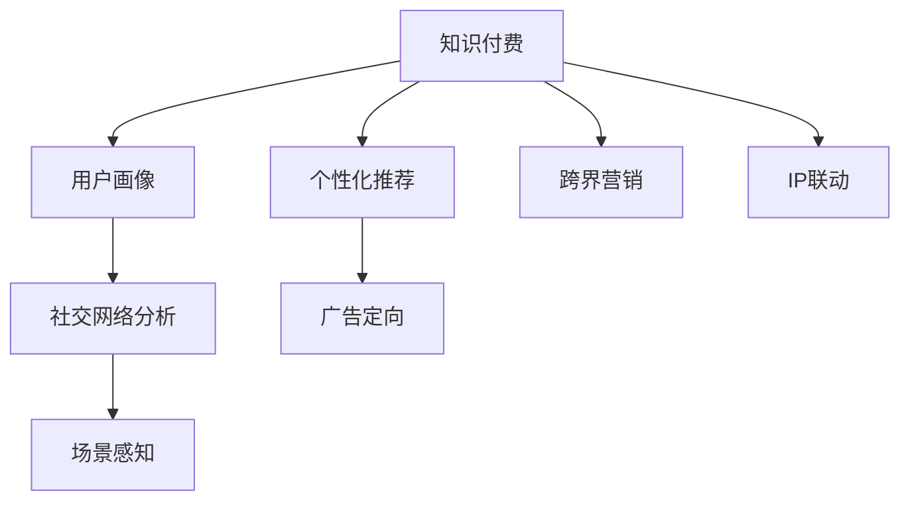

                 

# 知识付费如何实现跨界营销与IP联动？

> 关键词：知识付费, 跨界营销, IP联动, 数据驱动, 个性化推荐, 用户画像, 社交网络, 广告定向, 场景感知

## 1. 背景介绍

### 1.1 问题由来

在互联网和数字经济蓬勃发展的今天，知识付费市场正成为新的增长点。知识付费平台通过优质的内容付费服务，满足了用户对于知识和信息的深层需求，同时也为创作者提供了变现的渠道。然而，知识付费的单一营销模式和有限的IP资源，在一定程度上限制了其市场扩展和用户粘性提升。

面对这一挑战，平台需要通过跨界营销和IP联动，打破内容边界，挖掘用户的多元需求，实现更加精准的用户增长和留存。在这一过程中，数据分析和算法驱动起到了关键作用，为跨界营销与IP联动提供了数据支撑和智能策略。

### 1.2 问题核心关键点

跨界营销和IP联动涉及的关键点包括：
1. **用户画像构建**：通过数据分析，构建详细的用户画像，了解用户兴趣和行为。
2. **个性化推荐**：利用推荐算法，提供个性化的内容推荐，提升用户体验和转化率。
3. **社交网络利用**：通过社交网络数据，洞察用户之间的互动关系和社交网络结构，进行精准的社交网络营销。
4. **广告定向优化**：基于用户画像和行为数据，进行精准的广告定向，提高广告的点击率和转化率。
5. **场景感知能力**：利用场景感知技术，分析用户在特定场景下的需求和行为，提供更具针对性的内容和服务。

## 2. 核心概念与联系

### 2.1 核心概念概述

为更好地理解跨界营销与IP联动，本节将介绍几个密切相关的核心概念：

- **知识付费**：指用户通过付费购买、订阅优质内容，满足自身学习和知识需求的一种新型消费模式。知识付费市场包括电子书、在线课程、专家讲座、专栏文章等多种形式。

- **跨界营销**：指跨越行业界限，通过合作或联合推广的方式，将不同领域的产品、服务、品牌等资源进行整合和协同营销。

- **IP联动**：指通过知识产权的授权、合作或联名等方式，将知名IP与商品、服务、活动等进行深度融合，提升品牌价值和用户粘性。

- **用户画像**：基于用户的历史行为数据，构建详细的用户兴趣和行为特征，用于指导个性化推荐和精准营销。

- **个性化推荐**：通过分析用户行为数据，推荐个性化的内容、商品或服务，提升用户体验和满意度。

- **社交网络分析**：利用社交网络数据，分析用户之间的互动关系和社交网络结构，进行针对性的社交网络营销。

- **广告定向**：通过数据分析和机器学习，实现精准的广告定向，提升广告的投放效果。

- **场景感知**：通过场景分析技术，识别用户在不同场景下的需求和行为，提供更具针对性的服务。

这些核心概念之间的逻辑关系可以通过以下Mermaid流程图来展示：



这个流程图展示了这个框架中的主要概念及其之间的关系：

1. 知识付费通过内容吸引用户，用户画像基于内容消费行为构建，个性化推荐提升用户体验。
2. 社交网络分析和广告定向进一步细化营销策略，跨界营销和IP联动拓展市场边界。
3. 场景感知能力，确保服务在不同场景下满足用户需求。

## 3. 核心算法原理 & 具体操作步骤
### 3.1 算法原理概述

跨界营销与IP联动的核心在于通过数据分析和算法驱动，构建详细的用户画像，进行个性化的内容推荐和精准的广告定向，同时结合社交网络和场景感知，拓展市场边界，提升用户粘性和满意度。

在实际应用中，以下算法和技术方法扮演了关键角色：

- **协同过滤算法**：基于用户行为数据，推荐用户可能感兴趣的相似内容。
- **基于内容的推荐算法**：通过分析内容特征，推荐与用户兴趣匹配度高的内容。
- **深度学习模型**：如神经网络、强化学习等，用于用户画像构建、广告定向等。
- **社交网络分析**：通过网络图模型，分析用户之间的互动关系和社交网络结构。
- **场景感知技术**：利用上下文感知算法，识别用户在不同场景下的需求和行为。

### 3.2 算法步骤详解

跨界营销与IP联动的具体操作流程如下：

**Step 1: 数据准备与特征工程**

- 收集用户行为数据，包括浏览记录、购买记录、评价记录等。
- 对数据进行清洗和预处理，去除噪声和异常值。
- 进行特征工程，提取用户画像构建所需的关键特征。

**Step 2: 用户画像构建**

- 利用协同过滤和基于内容的推荐算法，构建初步的用户画像。
- 结合深度学习模型，通过学习用户行为数据，进一步细化和完善用户画像。

**Step 3: 个性化推荐**

- 通过协同过滤和基于内容的推荐算法，提供个性化的内容推荐。
- 利用场景感知技术，根据用户当前场景，提供更具针对性的内容推荐。

**Step 4: 社交网络分析**

- 利用社交网络分析算法，构建用户之间的互动关系网络。
- 分析用户之间的社交网络结构，识别关键节点和潜在的用户群体。

**Step 5: 广告定向与优化**

- 基于用户画像和社交网络分析结果，进行精准的广告定向。
- 利用深度学习模型，实时调整广告投放策略，提升广告效果。

**Step 6: 跨界营销与IP联动**

- 结合社交网络和广告定向结果，设计跨界营销活动。
- 通过IP授权、联名合作等方式，与相关领域的品牌和活动进行深度融合。

### 3.3 算法优缺点

跨界营销与IP联动方法具有以下优点：
1. **提升用户体验**：通过个性化推荐，提供精准的内容和服务，提升用户满意度和粘性。
2. **扩大市场边界**：通过跨界营销，引入更多潜在用户，拓展市场规模。
3. **增强品牌价值**：通过IP联动，提升品牌知名度和美誉度。
4. **提升广告效果**：通过精准的广告定向，提高广告点击率和转化率。

同时，该方法也存在以下局限性：
1. **数据隐私问题**：用户行为数据的收集和使用需要严格遵守隐私保护法规。
2. **模型复杂度**：深度学习模型的构建和训练需要大量计算资源。
3. **场景感知难度**：场景感知技术的准确性和实用性取决于场景数据的丰富性和多样性。
4. **社交网络复杂性**：社交网络分析需要处理海量用户互动数据，算法复杂度较高。

### 3.4 算法应用领域

跨界营销与IP联动方法在多个领域得到了广泛应用，例如：

- **在线教育**：利用用户画像和个性化推荐，提升课程购买率和用户满意度。
- **电子商务**：通过社交网络分析和广告定向，提高商品推荐效果和销售额。
- **旅游行业**：结合社交网络数据和场景感知，推荐个性化旅游目的地和活动。
- **文化娱乐**：通过IP联动和跨界营销，提升文化产品的知名度和市场影响力。
- **健康医疗**：利用用户画像和推荐算法，推荐个性化的健康管理方案。

## 4. 数学模型和公式 & 详细讲解 & 举例说明

### 4.1 数学模型构建

基于协同过滤算法的推荐模型可以表示为：

$$
\hat{r}_{ui} = \frac{1}{\sum_{j=1}^{N}a_{uj}b_{ji}} \sum_{j=1}^{N} a_{uj}c_{ji}
$$

其中，$a_{uj}$表示用户 $u$ 对项目 $j$ 的评分，$b_{ji}$ 表示项目 $j$ 的评分，$c_{ji}$ 表示项目 $j$ 与项目 $i$ 的相似度。

利用用户画像和深度学习模型，可以进行更为复杂的推荐算法。例如，基于用户行为数据的深度学习推荐模型，可以表示为：

$$
\hat{r}_{ui} = w^T \phi(x_i, u)
$$

其中，$w$ 为模型参数，$\phi$ 为特征映射函数，$x_i$ 和 $u$ 分别表示项目和用户的特征向量。

### 4.2 公式推导过程

对于基于协同过滤的推荐模型，首先需要对用户和项目数据进行预处理和特征提取。设用户集为 $U=\{u_1, u_2, \ldots, u_M\}$，项目集为 $I=\{i_1, i_2, \ldots, i_N\}$，用户 $u$ 对项目 $i$ 的评分记为 $r_{ui}$。

设用户 $u$ 对项目 $j$ 的评分矩阵为 $R=\{r_{u_1i_1}, r_{u_1i_2}, \ldots, r_{u_Mi_N}\}$，项目 $j$ 的评分矩阵为 $B=\{b_{i_1j}, b_{i_2j}, \ldots, b_{i_Nj}\}$，项目 $j$ 与项目 $i$ 的相似度矩阵为 $C=\{c_{i_1j}, c_{i_2j}, \ldots, c_{i_Nj}\}$。

基于协同过滤的推荐算法可以表示为：

$$
\hat{r}_{ui} = \frac{1}{\sum_{j=1}^{N}a_{uj}b_{ji}} \sum_{j=1}^{N} a_{uj}c_{ji}
$$

其中，$a_{uj}$ 表示用户 $u$ 对项目 $j$ 的评分，$b_{ji}$ 表示项目 $j$ 的评分，$c_{ji}$ 表示项目 $j$ 与项目 $i$ 的相似度。

利用用户画像和深度学习模型，可以进行更为复杂的推荐算法。例如，基于用户行为数据的深度学习推荐模型，可以表示为：

$$
\hat{r}_{ui} = w^T \phi(x_i, u)
$$

其中，$w$ 为模型参数，$\phi$ 为特征映射函数，$x_i$ 和 $u$ 分别表示项目和用户的特征向量。

### 4.3 案例分析与讲解

以在线教育平台为例，分析用户画像和个性化推荐的应用。

**数据准备**：
- 收集用户的学习记录、购买记录、评价记录等。
- 对数据进行清洗和预处理，去除噪声和异常值。
- 提取用户的学习偏好、时间安排等关键特征。

**用户画像构建**：
- 利用协同过滤算法，构建初步的用户画像。
- 结合深度学习模型，通过学习用户行为数据，进一步细化和完善用户画像。

**个性化推荐**：
- 通过协同过滤和基于内容的推荐算法，提供个性化的学习内容推荐。
- 利用场景感知技术，根据用户当前学习时间和地点，提供更具针对性的学习内容推荐。

**社交网络分析**：
- 利用社交网络分析算法，构建用户之间的互动关系网络。
- 分析用户之间的社交网络结构，识别关键节点和潜在的用户群体。

**广告定向与优化**：
- 基于用户画像和社交网络分析结果，进行精准的广告定向。
- 利用深度学习模型，实时调整广告投放策略，提升广告效果。

**跨界营销与IP联动**：
- 结合社交网络和广告定向结果，设计跨界营销活动。
- 通过IP授权、联名合作等方式，与相关领域的品牌和活动进行深度融合。

## 5. 项目实践：代码实例和详细解释说明

### 5.1 开发环境搭建

在进行跨界营销与IP联动实践前，我们需要准备好开发环境。以下是使用Python进行TensorFlow和Keras开发的Python环境配置流程：

1. 安装Anaconda：从官网下载并安装Anaconda，用于创建独立的Python环境。

2. 创建并激活虚拟环境：
```bash
conda create -n tf-env python=3.8 
conda activate tf-env
```

3. 安装TensorFlow和Keras：
```bash
pip install tensorflow==2.4.1 keras==2.4.3
```

4. 安装各类工具包：
```bash
pip install numpy pandas scikit-learn matplotlib tqdm jupyter notebook ipython
```

完成上述步骤后，即可在`tf-env`环境中开始跨界营销与IP联动实践。

### 5.2 源代码详细实现

这里我们以在线教育平台的个性化推荐系统为例，给出使用TensorFlow和Keras进行深度学习推荐模型的代码实现。

首先，定义推荐模型的输入输出：

```python
from tensorflow.keras.layers import Input, Embedding, Dense, Dot, Add, Flatten, RepeatVector, Reshape
from tensorflow.keras.models import Model

user_input = Input(shape=(max_user_features,))
project_input = Input(shape=(max_project_features,))
user_seq_input = Input(shape=(max_seq_length,))

# 用户和项目嵌入层
user_emb = Embedding(input_dim=num_users, output_dim=embedding_dim, input_length=max_user_features)(user_input)
project_emb = Embedding(input_dim=num_projects, output_dim=embedding_dim, input_length=max_project_features)(project_input)

# 用户序列嵌入层
user_seq_emb = Embedding(input_dim=num_seq_items, output_dim=embedding_dim, input_length=max_seq_length)(user_seq_input)

# 用户和项目嵌入拼接
user_project_emb = Add()([user_emb, project_emb])
user_project_seq_emb = Add()([user_seq_emb, user_project_emb])

# 相似度计算
similarity = Dot(axes=1, normalize=True)([user_project_seq_emb, user_project_seq_emb])

# 加权平均
weighted_avg = Add()([similarity, user_project_seq_emb])
weighted_avg = Flatten()(weighted_avg)

# 输出层
output = Dense(1, activation='sigmoid')(weighted_avg)

# 构建模型
model = Model(inputs=[user_input, project_input, user_seq_input], outputs=output)
```

然后，定义损失函数和优化器：

```python
from tensorflow.keras.optimizers import Adam

# 损失函数
loss = 'binary_crossentropy'

# 优化器
optimizer = Adam(lr=0.001)
```

接着，定义训练和评估函数：

```python
from tensorflow.keras.preprocessing.sequence import pad_sequences
from sklearn.model_selection import train_test_split

# 数据处理函数
def prepare_data(user_data, project_data, seq_data):
    # 用户和项目数据填充和one-hot编码
    user_seq = pad_sequences(user_seq_data, maxlen=max_seq_length, padding='post')
    user = pad_sequences(user_data, maxlen=max_user_features, padding='post')
    project = pad_sequences(project_data, maxlen=max_project_features, padding='post')
    
    # 构造输入和输出
    inputs = [user, project, user_seq]
    outputs = user_project_seq_emb
    
    return inputs, outputs

# 训练函数
def train_model(model, inputs, outputs, epochs, batch_size):
    # 划分训练集和验证集
    train_inputs, train_outputs, dev_inputs, dev_outputs = train_test_split(inputs, outputs, test_size=0.2, random_state=42)
    
    # 编译模型
    model.compile(optimizer=optimizer, loss=loss)
    
    # 训练模型
    model.fit(train_inputs, train_outputs, validation_data=(dev_inputs, dev_outputs), epochs=epochs, batch_size=batch_size)
    
    return model

# 评估函数
def evaluate_model(model, inputs, outputs, batch_size):
    # 评估模型性能
    loss = model.evaluate(inputs, outputs, batch_size=batch_size)
    print(f'Test loss: {loss:.3f}')
```

最后，启动训练流程并在测试集上评估：

```python
# 数据集准备
user_data = ...  # 用户行为数据
project_data = ...  # 项目评分数据
seq_data = ...  # 用户序列数据

# 数据处理
inputs, outputs = prepare_data(user_data, project_data, seq_data)

# 模型训练
model = train_model(model, inputs, outputs, epochs=10, batch_size=32)

# 模型评估
evaluate_model(model, inputs, outputs, batch_size=32)
```

以上就是使用TensorFlow和Keras对在线教育平台个性化推荐系统进行深度学习模型训练的完整代码实现。可以看到，利用TensorFlow和Keras，可以快速实现复杂的深度学习推荐模型，并进行高效的训练和评估。

### 5.3 代码解读与分析

让我们再详细解读一下关键代码的实现细节：

**prepare_data函数**：
- 对用户、项目和序列数据进行填充和one-hot编码，确保输入数据的格式一致。
- 构造输入和输出的数据集。

**train_model函数**：
- 划分训练集和验证集，进行交叉验证。
- 编译模型，设置损失函数和优化器。
- 训练模型，并在验证集上监控性能。

**evaluate_model函数**：
- 使用测试集评估模型性能。

**训练流程**：
- 准备数据集，进行填充和处理。
- 定义模型架构和训练参数。
- 训练模型，并进行交叉验证。
- 在测试集上评估模型性能。

通过以上代码实现，可以看出，TensorFlow和Keras提供了高度灵活的模型定义和训练接口，能够轻松应对复杂的深度学习推荐模型。

## 6. 实际应用场景

### 6.1 智能推荐系统

在线教育平台的智能推荐系统通过用户画像和个性化推荐，提升学习效果和用户满意度。系统通过分析用户的学习行为、偏好和反馈，生成个性化的课程推荐，帮助用户发现适合自己的学习资源，从而提升学习效率和体验。

在技术实现上，智能推荐系统可以通过协同过滤、基于内容的推荐和深度学习模型，结合用户画像和场景感知，实现更精准的推荐。例如，根据用户当前的学习进度、时间和地点，推荐适合的课程和资源。

### 6.2 跨界营销活动

在线教育平台可以通过与文化娱乐、出版物等领域的品牌和活动进行跨界合作，实现共赢。例如，与知名作家合作，推出签名课程；与出版社合作，推出限定版教材；与博物馆合作，推出虚拟现实课程等。

在跨界营销活动中，平台可以利用社交网络分析，识别关键节点和潜在的用户群体，进行精准的定向推广。通过IP联动，提升品牌知名度和用户粘性，拓展市场边界。

### 6.3 个性化广告投放

在线教育平台可以通过广告定向，提升广告效果和投放效率。平台可以利用用户画像和社交网络分析，进行精准的广告定向，提高广告点击率和转化率。例如，通过分析用户的学习行为和社交网络结构，推送相关的课程广告。

### 6.4 未来应用展望

随着人工智能和数据分析技术的不断进步，跨界营销与IP联动将具备更大的潜力和空间。未来，平台可以通过更多元化的数据源和先进的算法模型，实现更精准的个性化推荐和广告定向，提升用户满意度和市场竞争力。

## 7. 工具和资源推荐
### 7.1 学习资源推荐

为了帮助开发者系统掌握跨界营销与IP联动的理论基础和实践技巧，这里推荐一些优质的学习资源：

1. 《深度学习实战》：全面介绍深度学习理论和实践，涵盖推荐系统、广告定向等前沿话题。
2. 《Python数据科学手册》：详细讲解Python数据处理和科学计算，提供丰富的数据集和代码示例。
3. Kaggle：提供大规模的数据集和竞赛平台，练习数据处理和算法优化。
4 Udacity《深度学习专项课程》：提供系统的深度学习课程，涵盖推荐系统、广告定向等主题。

通过这些资源的学习实践，相信你一定能够快速掌握跨界营销与IP联动的精髓，并用于解决实际的业务问题。

### 7.2 开发工具推荐

高效的开发离不开优秀的工具支持。以下是几款用于跨界营销与IP联动开发的常用工具：

1. TensorFlow：基于Python的开源深度学习框架，支持复杂的深度学习模型。
2. Keras：基于TensorFlow的高层API，提供简单易用的模型定义和训练接口。
3. PyTorch：基于Python的开源深度学习框架，灵活的动态计算图设计。
4. Jupyter Notebook：交互式笔记本，方便模型开发和调试。
5. Tableau：数据可视化工具，提供丰富的图表展示方式。
6. Google Colab：谷歌推出的在线Jupyter Notebook环境，免费提供GPU算力，方便快速实验。

合理利用这些工具，可以显著提升跨界营销与IP联动的开发效率，加快创新迭代的步伐。

### 7.3 相关论文推荐

跨界营销与IP联动技术的发展源于学界的持续研究。以下是几篇奠基性的相关论文，推荐阅读：

1. 《推荐系统》：全面介绍推荐算法和技术，涵盖协同过滤、基于内容的推荐、深度学习等前沿话题。
2. 《深度学习与推荐系统》：讲解深度学习在推荐系统中的应用，涵盖深度神经网络、稀疏表示、协同过滤等技术。
3. 《广告定向》：介绍广告定向算法和技术，涵盖点击率预测、广告效果评估等前沿话题。
4. 《跨界营销》：介绍跨界营销理论和方法，涵盖品牌联合、社交媒体营销等前沿话题。
5. 《IP联动》：介绍知识产权授权和联名的法律和市场策略，涵盖品牌合作、法律保护等前沿话题。

这些论文代表了大数据和机器学习在跨界营销与IP联动领域的最新进展，通过学习这些前沿成果，可以帮助研究者把握学科前进方向，激发更多的创新灵感。

## 8. 总结：未来发展趋势与挑战

### 8.1 总结

本文对跨界营销与IP联动的实现方法进行了全面系统的介绍。首先阐述了跨界营销与IP联动在知识付费平台的应用背景和意义，明确了个性化推荐、社交网络分析和广告定向等关键技术在其中的重要作用。其次，从原理到实践，详细讲解了跨界营销与IP联动的操作流程，给出了微调模型和推荐算法的完整代码实例。同时，本文还广泛探讨了跨界营销与IP联动在在线教育、电子商务、文化娱乐等领域的广泛应用，展示了其巨大的市场潜力。此外，本文精选了相关领域的经典学习资源和开发工具，力求为读者提供全方位的技术指引。

通过本文的系统梳理，可以看到，跨界营销与IP联动技术正在成为知识付费平台的重要驱动力，极大地拓展了平台的市场边界，提高了用户满意度和市场竞争力。未来，伴随技术的不断进步，跨界营销与IP联动必将在更多领域得到应用，为数字经济的发展注入新的活力。

### 8.2 未来发展趋势

展望未来，跨界营销与IP联动技术将呈现以下几个发展趋势：

1. **数据融合与治理**：随着数据来源的多元化，平台需要构建更加严格的数据治理体系，确保数据安全和隐私保护。同时，利用多源数据融合，提升推荐和定向的准确性。
2. **深度学习和AI优化**：深度学习模型将进一步提升推荐和定向的精度，AI技术将引入更多智能决策和自适应机制，实现更个性化的服务。
3. **场景感知与互动**：场景感知技术将更加丰富和精细，平台能够更准确地识别用户需求和行为变化，提供实时互动和定制化服务。
4. **跨界合作与创新**：跨界合作将更加深入和多样化，平台可以通过更多元化的合作模式，引入更多资源和能力，实现互利共赢。
5. **用户激励与参与**：平台将引入更多激励机制和参与方式，鼓励用户参与推荐和定向策略的设计，提升用户粘性和满意度。
6. **智能营销与广告**：广告定向和优化将更加智能和精细，通过AI技术实现更精准的广告投放和效果评估。

以上趋势凸显了跨界营销与IP联动的广阔前景。这些方向的探索发展，必将进一步提升平台的用户体验和市场竞争力，为数字经济的发展注入新的动力。

### 8.3 面临的挑战

尽管跨界营销与IP联动技术已经取得了瞩目成就，但在迈向更加智能化、普适化应用的过程中，它仍面临诸多挑战：

1. **数据隐私保护**：用户行为数据的收集和使用需要严格遵守隐私保护法规，防止数据泄露和滥用。
2. **模型复杂度**：深度学习模型的构建和训练需要大量计算资源，平台需要具备强大的算力支持。
3. **场景感知难度**：场景感知技术的准确性和实用性取决于场景数据的丰富性和多样性，场景复杂度较高。
4. **跨界合作难度**：跨界合作需要多方协同，协调复杂，且存在合作利益不均等问题。
5. **用户粘性提升**：平台需要不断创新和优化推荐和定向策略，提升用户粘性和满意度。
6. **市场竞争加剧**：知识付费市场竞争激烈，平台需要不断提升技术和运营能力，保持竞争优势。

正视跨界营销与IP联动面临的这些挑战，积极应对并寻求突破，将使平台在激烈的市场竞争中占据优势。

### 8.4 研究展望

面对跨界营销与IP联动所面临的种种挑战，未来的研究需要在以下几个方面寻求新的突破：

1. **多源数据融合与治理**：通过数据联邦、区块链等技术，实现跨平台和多源数据的安全共享和融合，提升推荐和定向的准确性。
2. **高效智能推荐**：引入更多先进的推荐算法和AI技术，如强化学习、协同过滤等，提升推荐和定向的精度和效率。
3. **实时场景感知**：利用实时数据流和大规模分布式计算，实现更精准的场景感知和实时推荐。
4. **跨界合作平台**：构建跨界合作平台，提供智能决策和协作机制，促进多方协同创新。
5. **用户激励机制**：引入更多元化的用户激励机制和参与方式，提升用户粘性和满意度。
6. **智能广告系统**：开发智能广告系统，利用AI技术实现更精准的广告投放和效果评估。

这些研究方向的探索，必将引领跨界营销与IP联动技术迈向更高的台阶，为数字经济的发展注入新的活力。面向未来，跨界营销与IP联动技术还需要与其他人工智能技术进行更深入的融合，如知识表示、因果推理、强化学习等，多路径协同发力，共同推动数字经济的进步。只有勇于创新、敢于突破，才能不断拓展跨界营销与IP联动的边界，实现技术的更大突破。

## 9. 附录：常见问题与解答

**Q1：跨界营销与IP联动是否适用于所有知识付费平台？**

A: 跨界营销与IP联动方法适用于多种知识付费平台，但需要根据平台的特色和用户需求进行定制化设计和优化。例如，在线教育平台和出版物平台的跨界营销策略可能有所不同。

**Q2：如何进行多源数据融合与治理？**

A: 多源数据融合与治理需要引入数据联邦、区块链等技术，确保数据安全和隐私保护。平台可以构建统一的数据治理体系，实现数据共享和协作。

**Q3：如何提升跨界合作的效率和成效？**

A: 通过构建跨界合作平台，引入智能决策和协作机制，可以有效提升跨界合作的效率和成效。平台需要明确合作目标和利益分配机制，促进多方协同创新。

**Q4：如何提升广告定向的精度和效果？**

A: 利用深度学习模型和AI技术，可以实现更精准的广告定向。平台需要不断优化广告投放策略，实时调整广告参数，提升广告效果。

**Q5：如何构建详细的用户画像？**

A: 构建详细的用户画像需要收集和分析用户的多元数据，包括行为数据、社交网络数据、兴趣标签等。平台可以利用协同过滤和基于内容的推荐算法，结合深度学习模型，逐步细化和完善用户画像。

通过以上回答，相信你对跨界营销与IP联动的实现方法有了更深入的理解，可以更好地应用于实际业务中，提升平台的市场竞争力和用户满意度。

---

作者：禅与计算机程序设计艺术 / Zen and the Art of Computer Programming

