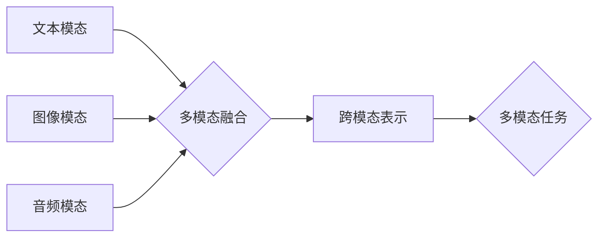

> 多模态大模型，自然语言处理，计算机视觉，语音识别，知识图谱，Transformer，BERT，GPT，DALL-E，图像生成，文本摘要，对话系统

## 1. 背景介绍

近年来，人工智能（AI）技术取得了飞速发展，其中大模型在自然语言处理（NLP）、计算机视觉（CV）等领域展现出强大的能力。然而，传统的单模态大模型仅处理一种数据类型（如文本或图像），难以捕捉现实世界中多模态信息的复杂关系。

多模态大模型（Multimodal Large Models，MLMs）应运而生，旨在融合多种模态数据（如文本、图像、音频、视频等），学习跨模态的表示和理解能力。MLMs 能够更好地理解和生成人类语言、图像、音频等多模态信息，为智能助手、自动驾驶、医疗诊断等领域提供更强大的支持。

## 2. 核心概念与联系

多模态大模型的核心概念是融合不同模态数据，学习跨模态的表示和理解能力。

**2.1  模态数据类型**

* **文本模态:** 包括文字、句子、段落等，主要用于语言理解和生成。
* **图像模态:** 包括图片、视频帧等，主要用于视觉理解和生成。
* **音频模态:** 包括语音、音乐等，主要用于语音识别和音乐生成。
* **视频模态:** 包括视频序列，融合了图像和音频信息，用于视频理解和生成。

**2.2  跨模态表示学习**

MLMs 通过学习跨模态的表示，将不同模态数据映射到同一个语义空间，从而实现跨模态的理解和交互。

**2.3  多模态融合策略**

MLMs 使用多种融合策略将不同模态数据进行融合，例如：

* **早期融合:** 在模型输入阶段将不同模态数据进行拼接或融合。
* **晚期融合:** 在模型输出阶段将不同模态数据进行融合。
* **注意力机制:** 利用注意力机制学习不同模态数据之间的关系，动态地权重不同模态信息。

**2.4  多模态任务**

MLMs 可以用于多种多模态任务，例如：

* **图像字幕生成:** 将图像转换为文本描述。
* **文本到图像生成:** 将文本描述生成图像。
* **视频问答:** 根据视频内容回答问题。
* **多模态对话系统:** 基于文本、图像、音频等多模态信息进行对话。

**Mermaid 流程图**



## 3. 核心算法原理 & 具体操作步骤

### 3.1  算法原理概述

多模态大模型的训练主要基于深度学习算法，其中 Transformer 架构在 NLP 领域取得了巨大成功，并被广泛应用于多模态任务。

Transformer 架构的核心是注意力机制，它能够学习不同模态数据之间的关系，并赋予不同模态信息不同的权重。

### 3.2  算法步骤详解

1. **数据预处理:** 将不同模态数据进行预处理，例如文本分词、图像裁剪、音频降噪等。
2. **特征提取:** 使用预训练的模型提取不同模态数据的特征，例如 BERT 用于文本特征提取，ResNet 用于图像特征提取。
3. **多模态融合:** 将不同模态数据的特征进行融合，可以使用早期融合、晚期融合或注意力机制等策略。
4. **跨模态表示学习:** 使用 Transformer 架构学习跨模态的表示，将不同模态数据映射到同一个语义空间。
5. **任务特定训练:** 使用任务特定的损失函数对模型进行训练，例如图像字幕生成任务使用交叉熵损失函数。

### 3.3  算法优缺点

**优点:**

* 能够学习跨模态的表示，更好地理解和生成多模态信息。
* 性能优于单模态模型，在多模态任务中取得了显著的成果。

**缺点:**

* 训练成本高，需要大量的多模态数据和计算资源。
* 模型复杂度高，难以解释和调试。

### 3.4  算法应用领域

* **智能助手:** 基于文本、图像、语音等多模态信息提供更智能的交互体验。
* **自动驾驶:** 理解道路场景、识别交通标志和行人等，提高自动驾驶系统的安全性。
* **医疗诊断:** 分析医学图像、识别病症、辅助医生进行诊断。
* **教育:** 提供个性化的学习体验，例如根据学生的学习情况生成个性化的学习内容。

## 4. 数学模型和公式 & 详细讲解 & 举例说明

### 4.1  数学模型构建

多模态大模型的数学模型通常基于深度神经网络，例如 Transformer 架构。

Transformer 架构的核心是注意力机制，它能够学习不同模态数据之间的关系，并赋予不同模态信息不同的权重。

**注意力机制公式:**

$$
Attention(Q, K, V) = \frac{exp(Q \cdot K^T / \sqrt{d_k})}{exp(Q \cdot K^T / \sqrt{d_k})} \cdot V
$$

其中：

* $Q$：查询矩阵
* $K$：键矩阵
* $V$：值矩阵
* $d_k$：键向量的维度

### 4.2  公式推导过程

注意力机制的公式通过计算查询矩阵 $Q$ 与键矩阵 $K$ 的点积，并使用 softmax 函数归一化，得到每个键的权重。然后将权重与值矩阵 $V$ 进行加权求和，得到最终的注意力输出。

### 4.3  案例分析与讲解

例如，在图像字幕生成任务中，Transformer 模型会将图像特征作为查询矩阵 $Q$，文本词嵌入作为键矩阵 $K$，文本词嵌入作为值矩阵 $V$。

注意力机制会学习图像中不同区域与文本词之间的关系，并赋予不同的权重。例如，如果图像中有一个猫，注意力机制会将猫的特征与“猫”这个词的嵌入进行更高的权重匹配。

## 5. 项目实践：代码实例和详细解释说明

### 5.1  开发环境搭建

* Python 3.7+
* PyTorch 1.7+
* CUDA 10.2+

### 5.2  源代码详细实现

```python
import torch
import torch.nn as nn

class MultimodalTransformer(nn.Module):
    def __init__(self, text_vocab_size, image_feature_dim, hidden_dim, num_layers):
        super(MultimodalTransformer, self).__init__()
        # ...

    def forward(self, text_input, image_input):
        # ...
```

### 5.3  代码解读与分析

* `MultimodalTransformer` 类定义了多模态 Transformer 模型的结构。
* `__init__` 方法初始化模型参数，包括文本词汇表大小、图像特征维度、隐藏维度和 Transformer 层数。
* `forward` 方法定义了模型的输入和输出，并执行了多模态融合和 Transformer 编码过程。

### 5.4  运行结果展示

运行代码并使用训练数据进行训练，可以评估模型在多模态任务上的性能，例如图像字幕生成任务的 BLEU 分数。

## 6. 实际应用场景

### 6.1  智能助手

多模态大模型可以为智能助手提供更丰富的交互体验，例如：

* 通过语音识别理解用户的请求。
* 通过图像识别理解用户的意图。
* 通过文本生成回复用户的请求。

### 6.2  自动驾驶

多模态大模型可以帮助自动驾驶系统更好地理解道路场景，例如：

* 通过图像识别识别交通标志和行人。
* 通过语音识别理解语音导航指令。
* 通过文本生成生成驾驶日志。

### 6.3  医疗诊断

多模态大模型可以辅助医生进行医疗诊断，例如：

* 通过图像识别识别病灶。
* 通过文本分析理解病历信息。
* 通过语音识别记录患者的症状。

### 6.4  未来应用展望

多模态大模型在未来将有更广泛的应用场景，例如：

* 个性化教育
* 增强现实
* 虚拟现实
* 人机交互

## 7. 工具和资源推荐

### 7.1  学习资源推荐

* **书籍:**
    * 《深度学习》
    * 《Transformer 详解》
* **课程:**
    * Coursera: 深度学习
    * fast.ai: 深度学习课程
* **博客:**
    * The Gradient
    * Towards Data Science

### 7.2  开发工具推荐

* **框架:**
    * PyTorch
    * TensorFlow
* **库:**
    * Hugging Face Transformers
    * OpenAI API

### 7.3  相关论文推荐

* **BERT:** Devlin et al. (2018)
* **GPT:** Radford et al. (2019)
* **DALL-E:** Ramesh et al. (2021)

## 8. 总结：未来发展趋势与挑战

### 8.1  研究成果总结

多模态大模型在 NLP、CV 等领域取得了显著的成果，为智能化应用提供了强大的支持。

### 8.2  未来发展趋势

* **模型规模和能力提升:** 随着计算资源的不断发展，多模态大模型的规模和能力将进一步提升。
* **跨模态理解和生成能力增强:** 研究者将继续探索更有效的跨模态融合和表示学习方法，提升模型的跨模态理解和生成能力。
* **应用场景拓展:** 多模态大模型将应用于更多领域，例如教育、医疗、娱乐等。

### 8.3  面临的挑战

* **数据获取和标注:** 多模态数据的获取和标注成本高，是模型训练的瓶颈。
* **模型解释性和可控性:** 多模态大模型的复杂性使得其解释性和可控性成为挑战。
* **伦理和安全问题:** 多模态大模型的应用可能带来伦理和安全问题，需要引起重视。

### 8.4  研究展望

未来研究将重点关注以下方面:

* **高效的跨模态数据标注方法**
* **可解释性和可控性更高的多模态模型**
* **多模态大模型的伦理和安全问题研究**

## 9. 附录：常见问题与解答

### 9.1  Q: 多模态大模型的训练成本很高吗？

**A:** 是的，多模态大模型的训练成本很高，需要大量的计算资源和数据。

### 9.2  Q: 多模态大模型的应用场景有哪些？

**A:** 多模态大模型的应用场景非常广泛，例如智能助手、自动驾驶、医疗诊断等。

### 9.3  Q: 多模态大模型的未来发展趋势是什么？

**A:** 未来多模态大模型的规模和能力将进一步提升，应用场景也将更加广泛。

作者：禅与计算机程序设计艺术 / Zen and the Art of Computer Programming


<end_of_turn>