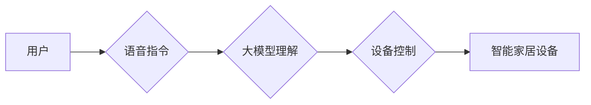

> 大模型，智能家居，自然语言处理，计算机视觉，机器学习，深度学习，预训练模型

## 1. 背景介绍

智能家居作为未来家居生活的趋势，正在以惊人的速度发展。它利用物联网、人工智能等技术，将家居设备与网络连接，实现智能化控制、自动化管理和个性化服务。大模型作为人工智能领域的新兴技术，凭借其强大的学习能力和泛化能力，在智能家居领域展现出巨大的潜力。

近年来，大模型在自然语言处理、计算机视觉等领域取得了突破性进展。例如，GPT-3、BERT、DALL-E等模型在文本生成、语言理解、图像识别等任务上表现出色，为智能家居的智能化交互、场景感知和个性化定制提供了技术支撑。

## 2. 核心概念与联系

### 2.1 智能家居

智能家居是指利用网络、传感器、人工智能等技术，将家居设备和系统进行互联互通，实现智能化控制、自动化管理和个性化服务的家居环境。

### 2.2 大模型

大模型是指参数量巨大、训练数据海量的人工智能模型。它通过学习海量数据，掌握了丰富的知识和技能，能够在各种任务上表现出强大的泛化能力。

### 2.3 核心概念联系

大模型可以为智能家居提供以下核心功能：

* **自然语言交互:** 大模型可以理解和生成自然语言，实现人机语音交互，让用户用自然语言控制智能家居设备。
* **场景感知:** 大模型可以分析传感器数据，识别用户行为和家居环境，例如识别用户是否在家、是否需要调节温度等，并自动执行相应的操作。
* **个性化定制:** 大模型可以学习用户的喜好和习惯，提供个性化的家居服务，例如推荐合适的音乐、灯光、温度等。

**Mermaid 流程图**



## 3. 核心算法原理 & 具体操作步骤

### 3.1 算法原理概述

大模型的训练主要基于深度学习算法，例如Transformer、BERT等。这些算法通过多层神经网络结构，学习数据中的复杂模式和关系，从而实现对语言、图像等数据的理解和生成。

### 3.2 算法步骤详解

1. **数据收集和预处理:** 收集大量文本、图像等数据，并进行清洗、格式化等预处理操作。
2. **模型构建:** 选择合适的深度学习模型架构，例如Transformer、BERT等，并根据任务需求进行调整。
3. **模型训练:** 使用训练数据训练模型，通过反向传播算法不断优化模型参数，使其能够准确地完成任务。
4. **模型评估:** 使用测试数据评估模型的性能，例如准确率、召回率等指标。
5. **模型部署:** 将训练好的模型部署到智能家居设备上，使其能够实时处理用户请求。

### 3.3 算法优缺点

**优点:**

* **强大的学习能力:** 大模型能够学习海量数据，掌握丰富的知识和技能。
* **优秀的泛化能力:** 大模型能够在不同场景下表现出良好的性能。
* **可扩展性强:** 大模型可以根据需要进行扩展，增加模型参数和训练数据。

**缺点:**

* **训练成本高:** 大模型的训练需要大量的计算资源和时间。
* **模型复杂度高:** 大模型的结构复杂，调试和维护难度较大。
* **数据依赖性强:** 大模型的性能取决于训练数据的质量和数量。

### 3.4 算法应用领域

大模型在智能家居领域有广泛的应用场景，例如：

* **语音助手:** 实现人机语音交互，控制智能家居设备。
* **场景感知:** 识别用户行为和家居环境，自动调节灯光、温度等。
* **个性化定制:** 根据用户的喜好和习惯，提供个性化的家居服务。
* **安全监控:** 检测异常行为，提高家居安全。

## 4. 数学模型和公式 & 详细讲解 & 举例说明

### 4.1 数学模型构建

大模型的训练通常基于深度学习框架，例如TensorFlow、PyTorch等。这些框架提供了一系列数学模型和算法，用于处理文本、图像等数据。

例如，Transformer模型的核心是自注意力机制，它通过计算词之间的相关性，学习语言的语义关系。

**自注意力机制公式:**

$$
Attention(Q, K, V) = \frac{exp(Q \cdot K^T / \sqrt{d_k})}{exp(Q \cdot K^T / \sqrt{d_k})} \cdot V
$$

其中：

* $Q$：查询矩阵
* $K$：键矩阵
* $V$：值矩阵
* $d_k$：键向量的维度

### 4.2 公式推导过程

自注意力机制的公式推导过程比较复杂，涉及到矩阵运算、softmax函数等。

简而言之，自注意力机制通过计算查询向量与键向量的点积，得到每个词对的相似度。然后通过softmax函数将相似度转换为概率分布，表示每个词对的重要性。最后，将概率分布与值向量相乘，得到每个词的加权和，作为最终的输出。

### 4.3 案例分析与讲解

例如，在翻译任务中，自注意力机制可以帮助模型理解句子中的每个词与其他词之间的关系，从而更准确地翻译句子。

## 5. 项目实践：代码实例和详细解释说明

### 5.1 开发环境搭建

* 操作系统：Ubuntu 20.04
* Python 版本：3.8
* 深度学习框架：TensorFlow 2.0

### 5.2 源代码详细实现

```python
import tensorflow as tf

# 定义 Transformer 模型
class Transformer(tf.keras.Model):
    def __init__(self, vocab_size, embedding_dim, num_heads, num_layers):
        super(Transformer, self).__init__()
        self.embedding = tf.keras.layers.Embedding(vocab_size, embedding_dim)
        self.transformer_layers = tf.keras.layers.StackedRNNCells([
            tf.keras.layers.Attention(num_heads=num_heads)
            for _ in range(num_layers)
        ])

    def call(self, inputs):
        embeddings = self.embedding(inputs)
        outputs = self.transformer_layers(embeddings)
        return outputs

# 实例化 Transformer 模型
model = Transformer(vocab_size=10000, embedding_dim=128, num_heads=8, num_layers=6)

# 编译模型
model.compile(optimizer='adam', loss='mse')

# 训练模型
model.fit(x_train, y_train, epochs=10)
```

### 5.3 代码解读与分析

* **模型定义:** 定义了一个 Transformer 模型，包含嵌入层、多层 Transformer 层。
* **嵌入层:** 将输入词转换为词向量。
* **Transformer 层:** 包含自注意力机制和前馈神经网络，用于学习语言的语义关系。
* **模型编译:** 使用 Adam 优化器和均方误差损失函数编译模型。
* **模型训练:** 使用训练数据训练模型。

### 5.4 运行结果展示

训练完成后，可以将模型应用于智能家居场景，例如控制智能灯光、调节温度等。

## 6. 实际应用场景

### 6.1 语音控制

大模型可以理解用户的语音指令，控制智能家居设备。例如，用户可以用语音指令打开电视、调节灯光亮度等。

### 6.2 场景感知

大模型可以分析传感器数据，识别用户的行为和家居环境。例如，当用户离开房间时，大模型可以自动关闭灯光、调节温度等。

### 6.3 个性化定制

大模型可以学习用户的喜好和习惯，提供个性化的家居服务。例如，根据用户的睡眠习惯，大模型可以自动调节灯光、温度等。

### 6.4 未来应用展望

大模型在智能家居领域还有很大的发展潜力，未来可能应用于以下场景：

* **智能家居安全:** 利用大模型识别异常行为，提高家居安全。
* **智能家居健康:** 利用大模型监测用户的健康状况，提供个性化的健康建议。
* **智能家居娱乐:** 利用大模型提供更智能的娱乐体验，例如个性化推荐音乐、电影等。

## 7. 工具和资源推荐

### 7.1 学习资源推荐

* **书籍:**
    * 深度学习
    * 自然语言处理
* **在线课程:**
    * Coursera
    * edX
* **开源项目:**
    * TensorFlow
    * PyTorch

### 7.2 开发工具推荐

* **深度学习框架:** TensorFlow、PyTorch
* **编程语言:** Python
* **云平台:** AWS、Azure、GCP

### 7.3 相关论文推荐

* **Attention Is All You Need**
* **BERT: Pre-training of Deep Bidirectional Transformers for Language Understanding**
* **GPT-3: Language Models are Few-Shot Learners**

## 8. 总结：未来发展趋势与挑战

### 8.1 研究成果总结

大模型在智能家居领域取得了显著的进展，为智能家居的智能化交互、场景感知和个性化定制提供了技术支撑。

### 8.2 未来发展趋势

* **模型规模更大:** 未来大模型的规模将进一步扩大，学习能力和泛化能力将得到提升。
* **多模态融合:** 大模型将融合文本、图像、语音等多模态数据，实现更全面的智能家居体验。
* **边缘计算:** 大模型将部署到智能家居设备的边缘端，实现更低延迟、更高效率的智能家居服务。

### 8.3 面临的挑战

* **数据安全:** 大模型的训练需要大量数据，如何保证数据的安全和隐私是一个重要挑战。
* **模型可解释性:** 大模型的决策过程比较复杂，如何提高模型的可解释性是一个重要的研究方向。
* **计算资源:** 大模型的训练和部署需要大量的计算资源，如何降低计算成本是一个重要的挑战。

### 8.4 研究展望

未来，大模型在智能家居领域将继续发挥重要作用，为用户提供更智能、更便捷、更安全的居家生活体验。


## 9. 附录：常见问题与解答

### 9.1 如何选择合适的深度学习框架？

选择深度学习框架需要根据具体任务和需求进行考虑。

* **TensorFlow:** 

TensorFlow 是 Google 开发的开源深度学习框架，拥有丰富的功能和强大的社区支持。

* **PyTorch:** PyTorch 是 Facebook 开发的开源深度学习框架，以其灵活性和易用性而闻名。

### 9.2 如何训练大模型？

训练大模型需要大量的计算资源和时间。

* **硬件:** 使用 GPU 加速训练。
* **数据:** 收集大量高质量的数据进行训练。
* **算法:** 选择合适的深度学习算法和模型架构。
* **资源:** 利用云平台的计算资源进行训练。

### 9.3 如何部署大模型到智能家居设备？

部署大模型到智能家居设备需要考虑设备的资源限制和网络环境。

* **模型压缩:** 使用模型压缩技术，减小模型的大小。
* **边缘计算:** 将模型部署到设备的边缘端，实现更低延迟的响应。
* **云端推理:** 将模型部署到云端，利用云端的计算资源进行推理。


作者：禅与计算机程序设计艺术 / Zen and the Art of Computer Programming 
<end_of_turn>