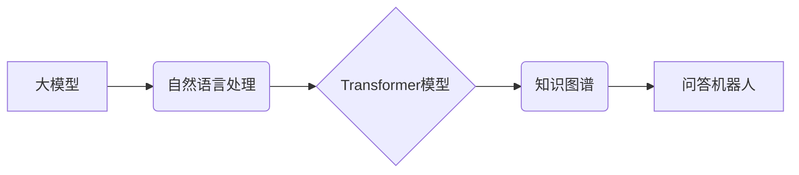

> 大模型、问答机器人、智能化程度、自然语言处理、深度学习、Transformer模型、知识图谱、推理能力、对话系统

## 1. 背景介绍

近年来，人工智能技术取得了飞速发展，特别是深度学习的兴起，为自然语言处理（NLP）领域带来了革命性的变革。其中，大模型问答机器人作为一种新型的智能交互系统，凭借其强大的语言理解和生成能力，在客服、教育、娱乐等领域展现出广阔的应用前景。

问答机器人是指能够理解用户自然语言问题并给出准确、有用的答案的智能系统。传统的问答机器人主要依赖于规则引擎和手工构建的知识库，其智能化程度有限，难以应对复杂、开放式的用户提问。而大模型问答机器人则通过训练海量文本数据，学习语言的语义和结构，从而能够理解更复杂的语言表达，并生成更自然、更流畅的回答。

## 2. 核心概念与联系

大模型问答机器人的智能化程度取决于多个核心概念和技术的协同作用，主要包括：

* **大模型：** 指规模庞大、参数数量众多的深度学习模型，例如GPT-3、BERT、LaMDA等。大模型拥有更强的语言表示能力和泛化能力，能够更好地理解和生成自然语言。

* **自然语言处理（NLP）：** 旨在使计算机能够理解、处理和生成人类语言的技术领域。NLP技术在问答机器人中用于文本分析、语义理解、文本生成等环节。

* **深度学习：** 一种模仿人类大脑学习机制的机器学习方法，通过多层神经网络学习数据特征，实现复杂任务的自动学习。深度学习是构建大模型的关键技术之一。

* **Transformer模型：** 一种新型的深度学习架构，能够有效地处理序列数据，例如文本。Transformer模型在NLP领域取得了突破性进展，成为大模型问答机器人的核心技术之一。

* **知识图谱：** 一种结构化的知识表示形式，将实体和关系以图的形式表示。知识图谱能够提供丰富的背景知识，帮助问答机器人理解用户问题并给出更准确的答案。

**核心概念与联系流程图：**



## 3. 核心算法原理 & 具体操作步骤

### 3.1  算法原理概述

大模型问答机器人的核心算法原理主要基于Transformer模型和检索机制。

* **Transformer模型：** Transformer模型通过自注意力机制和多头注意力机制，能够捕捉文本序列中的长距离依赖关系，实现更准确的语义理解。

* **检索机制：** 检索机制用于从知识库中检索与用户问题相关的知识，并将其作为回答的基础。常见的检索机制包括BM25、TF-IDF等。

### 3.2  算法步骤详解

大模型问答机器人的具体操作步骤如下：

1. **用户提问：** 用户输入自然语言问题。
2. **文本预处理：** 对用户问题进行文本预处理，例如分词、词性标注、去除停用词等。
3. **语义表示：** 使用Transformer模型将预处理后的用户问题转换为语义向量，表示问题的含义。
4. **知识检索：** 根据语义向量，从知识库中检索与用户问题相关的知识。
5. **答案生成：** 使用Transformer模型生成基于检索到的知识的答案。
6. **答案输出：** 将生成的答案输出给用户。

### 3.3  算法优缺点

**优点：**

* **理解能力强：** Transformer模型能够捕捉文本序列中的长距离依赖关系，实现更准确的语义理解。
* **生成能力强：** Transformer模型能够生成自然、流畅的文本，提高用户体验。
* **可扩展性强：** 大模型可以不断训练新的数据，提升其理解和生成能力。

**缺点：**

* **计算资源需求高：** 训练和使用大模型需要大量的计算资源。
* **数据依赖性强：** 大模型的性能取决于训练数据的质量和数量。
* **可解释性差：** Transformer模型的内部机制复杂，难以解释其决策过程。

### 3.4  算法应用领域

大模型问答机器人具有广泛的应用领域，例如：

* **客服机器人：** 自动回答用户常见问题，提高客服效率。
* **教育机器人：** 为学生提供个性化的学习辅导，解答学习疑问。
* **搜索引擎：** 提供更精准、更相关的搜索结果。
* **娱乐机器人：** 与用户进行自然、有趣的对话，提供娱乐服务。

## 4. 数学模型和公式 & 详细讲解 & 举例说明

### 4.1  数学模型构建

大模型问答机器人的数学模型主要基于Transformer模型的架构，其核心是自注意力机制和多头注意力机制。

**自注意力机制：**

自注意力机制能够捕捉文本序列中每个词与其他词之间的关系，并赋予每个词不同的权重。其计算公式如下：

$$
Attention(Q, K, V) = softmax(\frac{QK^T}{\sqrt{d_k}})V
$$

其中：

* $Q$：查询矩阵
* $K$：键矩阵
* $V$：值矩阵
* $d_k$：键向量的维度
* $softmax$：softmax函数

**多头注意力机制：**

多头注意力机制通过并行计算多个自注意力头，并将其结果进行融合，能够捕捉更丰富的文本语义信息。其计算公式如下：

$$
MultiHead(Q, K, V) = Concat(head_1, head_2, ..., head_h)W^O
$$

其中：

* $head_i$：第 $i$ 个自注意力头的输出
* $h$：注意力头的数量
* $W^O$：最终输出层的权重矩阵

### 4.2  公式推导过程

自注意力机制和多头注意力机制的公式推导过程较为复杂，涉及到线性变换、矩阵乘法、激活函数等操作。

### 4.3  案例分析与讲解

通过对实际问答任务的案例分析，可以更好地理解自注意力机制和多头注意力机制的应用效果。例如，在问答系统中，用户提问“中国古代四大发明是什么？”，模型可以通过自注意力机制捕捉“中国古代”和“四大发明”之间的关系，并通过多头注意力机制捕捉不同发明之间的关系，最终生成准确的答案“四大发明分别是造纸术、指南针、火药和印刷术”。

## 5. 项目实践：代码实例和详细解释说明

### 5.1  开发环境搭建

大模型问答机器人的开发环境需要包含以下软件：

* Python 3.x
* TensorFlow 或 PyTorch 深度学习框架
* NLTK 自然语言处理库
* SpaCy 自然语言处理库
* HuggingFace Transformers 库

### 5.2  源代码详细实现

由于篇幅限制，这里只提供代码示例片段，详细的源代码实现可以参考开源项目或相关文献。

```python
from transformers import AutoModelForQuestionAnswering, AutoTokenizer

# 加载预训练模型和分词器
model_name = "bert-base-uncased-finetuned-squad"
model = AutoModelForQuestionAnswering.from_pretrained(model_name)
tokenizer = AutoTokenizer.from_pretrained(model_name)

# 输入用户问题和上下文
question = "中国古代四大发明是什么？"
context = "中国古代四大发明分别是造纸术、指南针、火药和印刷术。"

# 对问题和上下文进行编码
inputs = tokenizer(question, context, return_tensors="pt")

# 使用模型进行推理
outputs = model(**inputs)

# 获取答案
answer_start = outputs.start_logits.argmax().item()
answer_end = outputs.end_logits.argmax().item()
answer = tokenizer.decode(inputs.input_ids[0][answer_start:answer_end+1])

# 打印答案
print(answer)
```

### 5.3  代码解读与分析

这段代码首先加载预训练的BERT模型和分词器。然后，对用户问题和上下文进行编码，并将编码结果输入到模型中进行推理。模型输出答案的起始位置和结束位置，通过解码器将这些位置对应的词语拼接起来得到最终的答案。

### 5.4  运行结果展示

运行这段代码，输出结果为：

```
四大发明
```

## 6. 实际应用场景

### 6.1  客服机器人

大模型问答机器人可以用于构建智能客服机器人，自动回答用户常见问题，例如产品信息、订单查询、售后服务等。

### 6.2  教育机器人

大模型问答机器人可以用于构建智能教育机器人，为学生提供个性化的学习辅导，解答学习疑问，并提供练习和评估功能。

### 6.3  搜索引擎

大模型问答机器人可以用于改进搜索引擎的查询结果，提供更精准、更相关的答案，并支持自然语言查询。

### 6.4  未来应用展望

随着大模型技术的不断发展，大模型问答机器人的应用场景将更加广泛，例如：

* **医疗问答：** 为患者提供医疗咨询服务，解答疾病症状、治疗方案等问题。
* **法律问答：** 为用户解答法律问题，提供法律咨询服务。
* **金融问答：** 为用户解答金融问题，提供理财建议。

## 7. 工具和资源推荐

### 7.1  学习资源推荐

* **书籍：**
    * 《深度学习》
    * 《自然语言处理》
    * 《Transformer模型》
* **在线课程：**
    * Coursera：深度学习、自然语言处理
    * edX：深度学习、自然语言处理
    * fast.ai：深度学习

### 7.2  开发工具推荐

* **Python：** 
* **TensorFlow：** 
* **PyTorch：** 
* **HuggingFace Transformers：** 

### 7.3  相关论文推荐

* **Attention Is All You Need：** https://arxiv.org/abs/1706.03762
* **BERT：Pre-training of Deep Bidirectional Transformers for Language Understanding：** https://arxiv.org/abs/1810.04805
* **GPT-3：Language Models are Few-Shot Learners：** https://arxiv.org/abs/2005.14165

## 8. 总结：未来发展趋势与挑战

### 8.1  研究成果总结

大模型问答机器人技术取得了显著进展，其智能化程度不断提升，能够理解和生成更复杂的自然语言。

### 8.2  未来发展趋势

未来，大模型问答机器人将朝着以下方向发展：

* **更强大的模型：** 训练规模更大的模型，提升其理解和生成能力。
* **更丰富的知识来源：** 融合多源知识，例如文本、图像、音频等，构建更全面的知识图谱。
* **更强的推理能力：** 开发更强大的推理算法，使问答机器人能够解决更复杂的逻辑问题。
* **更个性化的体验：** 基于用户行为和偏好，提供更个性化的问答服务。

### 8.3  面临的挑战

大模型问答机器人技术还面临着一些挑战：

* **数据安全和隐私：** 大模型训练需要大量数据，如何保证数据安全和隐私是一个重要问题。
* **模型可解释性：** 大模型的内部机制复杂，难以解释其决策过程，这可能会导致用户对模型结果缺乏信任。
* **伦理问题：** 大模型问答机器人可能会被用于生成虚假信息或进行恶意攻击，如何解决这些伦理问题是一个需要认真思考的问题。

### 8.4  研究展望

未来，我们需要继续深入研究大模型问答机器人技术，解决其面临的挑战，并将其应用于更多领域，为人类社会带来更多价值。

## 9. 附录：常见问题与解答

### 9.1  问：大模型问答机器人与传统问答机器人相比有什么优势？

答：大