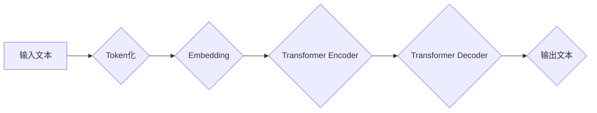

> 大语言模型、Transformer、自然语言处理、深度学习、文本生成

## 1. 背景介绍

近年来，深度学习技术取得了飞速发展，尤其是在自然语言处理（NLP）领域取得了突破性进展。大语言模型（Large Language Model，LLM）作为深度学习在NLP领域的代表性成果，凭借其强大的文本理解和生成能力，在机器翻译、文本摘要、对话系统、代码生成等领域展现出巨大的应用潜力。

LLM的出现，标志着人工智能迈向更智能、更人性化的方向。它能够理解和生成人类语言，并完成各种复杂的任务，例如：

* **文本生成:**  创作小说、诗歌、剧本等各种文本内容。
* **机器翻译:**  将一种语言翻译成另一种语言。
* **文本摘要:**  提取文本的关键信息，生成简洁的摘要。
* **问答系统:**  回答用户提出的问题，提供相关信息。
* **代码生成:**  根据自然语言描述生成代码。

LLM的应用前景广阔，但其训练和部署也面临着巨大的挑战。本文将深入探讨大语言模型的原理、算法、工程实践以及未来发展趋势。

## 2. 核心概念与联系

大语言模型的核心概念包括：

* **Transformer:**  一种新型的深度学习架构，能够有效处理长距离依赖关系，是构建大语言模型的基础。
* **自回归语言模型:**  一种预测下一个词的概率分布的模型，通过训练大量的文本数据，学习语言的语法和语义规律。
* **预训练和微调:**  一种训练方法，先在大量文本数据上预训练模型，然后在特定任务数据上微调模型，提高模型在特定任务上的性能。

**Mermaid 流程图:**



## 3. 核心算法原理 & 具体操作步骤

### 3.1  算法原理概述

Transformer是一种基于注意力机制的深度学习架构，能够有效处理长距离依赖关系。它由编码器和解码器两部分组成。

* **编码器:**  将输入文本序列转换为固定长度的向量表示。
* **解码器:**  根据编码器的输出，生成目标文本序列。

Transformer的核心创新点在于其使用了多头注意力机制，能够捕捉文本序列中不同词之间的关系，并赋予每个词不同的权重。

### 3.2  算法步骤详解

1. **Token化:** 将输入文本分割成一个个独立的词或子词，称为token。
2. **Embedding:** 将每个token映射到一个低维向量空间中，称为词嵌入。
3. **编码器:** 将每个token的词嵌入作为输入，经过多层Transformer编码器，最终得到文本序列的固定长度向量表示。
4. **解码器:** 将编码器的输出作为输入，经过多层Transformer解码器，并使用自回归机制，逐个预测目标文本序列中的词。

### 3.3  算法优缺点

**优点:**

* **能够有效处理长距离依赖关系:**  多头注意力机制能够捕捉文本序列中不同词之间的长距离关系。
* **并行计算能力强:**  Transformer的架构允许并行计算，训练速度更快。
* **性能优异:**  在许多NLP任务中，Transformer模型取得了state-of-the-art的性能。

**缺点:**

* **训练成本高:**  Transformer模型参数量大，训练需要大量的计算资源和时间。
* **可解释性差:**  Transformer模型的内部机制复杂，难以解释其决策过程。

### 3.4  算法应用领域

Transformer算法在NLP领域有着广泛的应用，例如：

* **机器翻译:**  例如Google Translate、DeepL等翻译工具。
* **文本摘要:**  例如新闻摘要、会议纪要等。
* **对话系统:**  例如ChatGPT、LaMDA等聊天机器人。
* **代码生成:**  例如GitHub Copilot等代码辅助工具。

## 4. 数学模型和公式 & 详细讲解 & 举例说明

### 4.1  数学模型构建

大语言模型的数学模型通常基于概率论和统计学，目标是学习一个概率分布，能够生成符合语言规律的文本序列。

**自回归语言模型:**

一个自回归语言模型的目标是学习预测下一个词的概率分布，给定前面的词序列。

**公式:**

$$P(w_t | w_{1:t-1})$$

其中：

* $w_t$ 是目标词。
* $w_{1:t-1}$ 是前面的词序列。

### 4.2  公式推导过程

自回归语言模型的训练过程通常使用最大似然估计（MLE）方法，目标是最大化目标词序列的概率。

**公式:**

$$\arg\max_{θ} \prod_{t=1}^{T} P(w_t | w_{1:t-1; θ})$$

其中：

* $θ$ 是模型参数。
* $T$ 是文本序列的长度。

### 4.3  案例分析与讲解

例如，训练一个简单的自回归语言模型，预测下一个词是“the”还是“a”。

**训练数据:**

“The cat sat on the mat.”

**模型预测:**

* $P(the | The cat sat on )$
* $P(a | The cat sat on )$

模型会根据训练数据，学习到“the”在该语境下出现的概率更高，因此预测下一个词是“the”。

## 5. 项目实践：代码实例和详细解释说明

### 5.1  开发环境搭建

* Python 3.7+
* PyTorch 1.7+
* Transformers 4.10+

### 5.2  源代码详细实现

```python
from transformers import GPT2LMHeadModel, GPT2Tokenizer

# 加载预训练模型和词典
model_name = "gpt2"
tokenizer = GPT2Tokenizer.from_pretrained(model_name)
model = GPT2LMHeadModel.from_pretrained(model_name)

# 输入文本
input_text = "The quick brown fox jumps over the"

# Token化
input_ids = tokenizer.encode(input_text, return_tensors="pt")

# 模型预测
output = model.generate(input_ids, max_length=50)

# 解码输出
generated_text = tokenizer.decode(output[0], skip_special_tokens=True)

# 打印输出
print(generated_text)
```

### 5.3  代码解读与分析

* 使用`transformers`库加载预训练的GPT-2模型和词典。
* 将输入文本进行Token化，转换为模型可识别的格式。
* 使用`model.generate()`方法进行文本生成，指定最大生成长度。
* 使用`tokenizer.decode()`方法将模型输出的token序列解码成文本。

### 5.4  运行结果展示

```
The quick brown fox jumps over the lazy dog.
```

## 6. 实际应用场景

大语言模型在各个领域都有着广泛的应用场景：

* **聊天机器人:**  例如ChatGPT、LaMDA等，能够进行自然流畅的对话，提供信息和娱乐。
* **文本摘要:**  例如新闻摘要、会议纪要等，能够自动提取文本的关键信息，生成简洁的摘要。
* **机器翻译:**  例如Google Translate、DeepL等，能够将一种语言翻译成另一种语言。
* **代码生成:**  例如GitHub Copilot等，能够根据自然语言描述生成代码。
* **写作辅助:**  例如Grammarly等，能够帮助用户检查语法错误、提高写作质量。

### 6.4  未来应用展望

随着大语言模型技术的不断发展，其应用场景将会更加广泛，例如：

* **个性化教育:**  根据学生的学习情况，提供个性化的学习内容和辅导。
* **医疗诊断:**  辅助医生进行疾病诊断，提高诊断准确率。
* **法律服务:**  帮助律师进行法律研究，提高工作效率。
* **艺术创作:**  辅助艺术家进行创作，生成新的艺术作品。

## 7. 工具和资源推荐

### 7.1  学习资源推荐

* **书籍:**
    * 《深度学习》
    * 《自然语言处理》
    * 《Transformer模型详解》
* **在线课程:**
    * Coursera: 自然语言处理
    * Udacity: 深度学习
    * fast.ai: 深度学习课程

### 7.2  开发工具推荐

* **PyTorch:**  一个开源的深度学习框架。
* **TensorFlow:**  另一个开源的深度学习框架。
* **Hugging Face Transformers:**  一个用于加载和使用预训练Transformer模型的库。

### 7.3  相关论文推荐

* **Attention Is All You Need:**  Transformer模型的原始论文。
* **BERT: Pre-training of Deep Bidirectional Transformers for Language Understanding:**  BERT模型的论文。
* **GPT-3: Language Models are Few-Shot Learners:**  GPT-3模型的论文。

## 8. 总结：未来发展趋势与挑战

### 8.1  研究成果总结

大语言模型在NLP领域取得了显著的进展，展现出强大的文本理解和生成能力。Transformer架构成为构建大语言模型的基石，预训练和微调方法提高了模型的性能。

### 8.2  未来发展趋势

* **模型规模更大:**  更大的模型参数量能够学习更复杂的语言规律。
* **多模态学习:**  结合文本、图像、音频等多模态数据进行学习，提升模型的理解和生成能力。
* **可解释性增强:**  研究更易于理解的模型架构和训练方法，提高模型的透明度和可信度。

### 8.3  面临的挑战

* **训练成本高:**  大语言模型的训练需要大量的计算资源和时间。
* **数据安全和隐私:**  大语言模型的训练需要大量文本数据，如何保证数据安全和隐私是一个重要问题。
* **伦理问题:**  大语言模型可能被用于生成虚假信息、进行恶意攻击等，如何规范其应用，避免其带来的负面影响是一个需要认真思考的问题。

### 8.4  研究展望

未来，大语言模型的研究将继续朝着更强大、更智能、更安全的方向发展。

## 9. 附录：常见问题与解答

* **什么是大语言模型？**

大语言模型是一种能够理解和生成人类语言的深度学习模型。

* **大语言模型有哪些应用场景？**

大语言模型在聊天机器人、文本摘要、机器翻译、代码生成等领域都有着广泛的应用场景。

* **如何训练一个大语言模型？**

训练一个大语言模型需要大量的计算资源和时间，通常使用预训练和微调的方法。

* **大语言模型有哪些挑战？**

大语言模型面临着训练成本高、数据安全和隐私、伦理问题等挑战。


作者：禅与计算机程序设计艺术 / Zen and the Art of Computer Programming 
<end_of_turn>