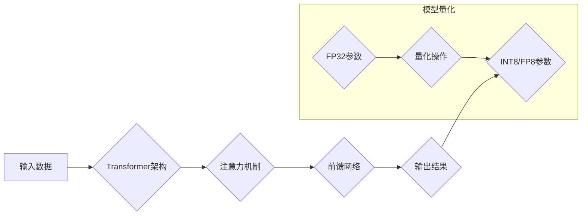

> 大语言模型，Transformer，FP8，INT8，量化，推理加速，高效训练

## 1. 背景介绍

近年来，大语言模型（LLM）在自然语言处理领域取得了令人瞩目的成就，例如文本生成、机器翻译、问答系统等。这些模型通常拥有数十亿甚至数千亿的参数，能够学习和理解复杂的语言模式。然而，这些庞大的模型也带来了巨大的计算成本和内存需求，限制了其在实际应用中的部署和推广。

为了解决这个问题，模型量化技术应运而生。模型量化是指将模型参数的精度降低，例如将32位浮点数（FP32）转换为8位整数（INT8），从而减少模型的存储空间和计算量。这使得大语言模型能够在更低功耗的设备上运行，并提高了其推理速度。

FP8和INT8是两种常用的量化方法，它们在模型精度和效率之间取得了良好的平衡。FP8是一种更精细的量化方法，可以进一步降低模型的存储空间和计算量，但同时也可能带来一定的精度损失。INT8则是一种更广泛应用的量化方法，在许多情况下能够满足模型性能和效率的需求。

## 2. 核心概念与联系

大语言模型的训练和推理过程涉及到许多核心概念，例如Transformer架构、注意力机制、梯度下降等。模型量化技术则通过改变模型参数的表示方式，来降低模型的计算成本和内存需求。

**Mermaid 流程图：**



## 3. 核心算法原理 & 具体操作步骤

### 3.1  算法原理概述

模型量化技术的基本原理是将模型参数的精度降低，例如将32位浮点数（FP32）转换为8位整数（INT8）。这可以通过以下两种主要方法实现：

* **静态量化:** 在训练阶段就将模型参数量化为INT8，并使用量化后的参数进行推理。
* **动态量化:** 在推理阶段根据输入数据动态地量化模型参数，从而提高模型的精度和效率。

### 3.2  算法步骤详解

**静态量化步骤:**

1. **训练模型:** 使用FP32精度训练模型，获得最佳的模型参数。
2. **量化转换:** 将训练好的FP32参数量化为INT8，可以使用线性量化或非线性量化方法。
3. **模型部署:** 使用量化后的INT8模型进行推理。

**动态量化步骤:**

1. **训练模型:** 使用FP32精度训练模型，获得最佳的模型参数。
2. **量化推理:** 在推理阶段，根据输入数据动态地量化模型参数，可以使用量化感知优化算法。
3. **模型部署:** 使用动态量化后的模型进行推理。

### 3.3  算法优缺点

**静态量化:**

* **优点:** 
    * 效率高，推理速度快。
    * 存储空间小，部署方便。
* **缺点:** 
    * 精度损失可能较大。
    * 难以适应不同输入数据的分布。

**动态量化:**

* **优点:** 
    * 精度损失较小。
    * 可以适应不同输入数据的分布。
* **缺点:** 
    * 复杂度高，推理速度相对较慢。
    * 需要额外的计算资源。

### 3.4  算法应用领域

模型量化技术广泛应用于各种领域，例如：

* **移动设备:** 将大语言模型部署在移动设备上，实现语音助手、机器翻译等功能。
* **物联网:** 将大语言模型部署在物联网设备上，实现智能家居、智能农业等应用。
* **边缘计算:** 将大语言模型部署在边缘设备上，实现实时语音识别、图像分类等任务。

## 4. 数学模型和公式 & 详细讲解 & 举例说明

### 4.1  数学模型构建

模型量化可以看作是一个映射关系，将高精度浮点数转换为低精度整数。

**线性量化:**

假设一个浮点数x，其范围为[min_val, max_val]，则可以使用以下公式将其量化为整数y：

$$y = \frac{x - min_val}{max_val - min_val} * 255$$

其中，255是INT8的取值范围。

**非线性量化:**

非线性量化可以更好地保留模型的精度，例如使用sigmoid函数或tanh函数进行量化。

### 4.2  公式推导过程

线性量化的公式推导过程如下：

1. 首先，将浮点数x映射到[0, 1]的区间内：

$$x' = \frac{x - min_val}{max_val - min_val}$$

2. 然后，将x'乘以255，得到整数y：

$$y = x' * 255$$

### 4.3  案例分析与讲解

假设一个浮点数x = 0.75，其范围为[0, 1]，则使用线性量化公式将其量化为整数y：

$$y = 0.75 * 255 = 191.25$$

由于y需要是整数，因此将其舍入为191。

## 5. 项目实践：代码实例和详细解释说明

### 5.1  开发环境搭建

* Python 3.7+
* TensorFlow 2.x
* PyTorch 1.x

### 5.2  源代码详细实现

```python
import tensorflow as tf

# 定义一个简单的线性模型
model = tf.keras.Sequential([
    tf.keras.layers.Dense(10, activation='relu', input_shape=(10,)),
    tf.keras.layers.Dense(1)
])

# 使用FP32精度训练模型
model.compile(optimizer='adam', loss='mse')
model.fit(x_train, y_train, epochs=10)

# 将模型参数量化为INT8
converter = tf.lite.TFLiteConverter.from_keras_model(model)
tflite_model = converter.convert()

# 保存量化后的模型
with open('quantized_model.tflite', 'wb') as f:
    f.write(tflite_model)
```

### 5.3  代码解读与分析

* 使用TensorFlow框架定义了一个简单的线性模型。
* 使用FP32精度训练模型，并使用均方误差损失函数。
* 使用`tf.lite.TFLiteConverter`将模型转换为TFLite格式，并使用`convert()`方法进行量化。
* 将量化后的模型保存为`quantized_model.tflite`文件。

### 5.4  运行结果展示

量化后的模型可以部署在各种设备上，例如移动设备、嵌入式设备等，并实现更低的功耗和更高的推理速度。

## 6. 实际应用场景

### 6.1  移动语音助手

将大语言模型部署在移动设备上，实现语音识别、自然语言理解和文本生成等功能，例如Siri、Google Assistant等。

### 6.2  智能客服机器人

使用大语言模型构建智能客服机器人，能够理解用户的自然语言问题，并提供准确的答案，例如在线聊天机器人、虚拟客服等。

### 6.3  机器翻译

使用大语言模型进行机器翻译，能够实现不同语言之间的文本翻译，例如Google Translate、DeepL等。

### 6.4  未来应用展望

随着模型量化技术的不断发展，大语言模型将在更多领域得到应用，例如：

* **个性化教育:** 根据学生的学习情况，提供个性化的学习内容和辅导。
* **医疗诊断:** 辅助医生进行疾病诊断，提高诊断准确率。
* **科学研究:** 帮助科学家进行数据分析和模型构建，加速科学研究的进程。

## 7. 工具和资源推荐

### 7.1  学习资源推荐

* **论文:**
    * "Quantization and Training of Neural Networks for Efficient Integer-Arithmetic-Only Inference"
    * "Mixed Precision Training"
* **博客:**
    * TensorFlow Blog: https://blog.tensorflow.org/
    * PyTorch Blog: https://pytorch.org/blog/

### 7.2  开发工具推荐

* **TensorFlow Lite:** https://www.tensorflow.org/lite
* **PyTorch Mobile:** https://pytorch.org/mobile/

### 7.3  相关论文推荐

* "Quantization and Training of Neural Networks for Efficient Integer-Arithmetic-Only Inference"
* "Mixed Precision Training"
* "Dynamic Quantization for Deep Learning"

## 8. 总结：未来发展趋势与挑战

### 8.1  研究成果总结

模型量化技术取得了显著的成果，能够有效降低大语言模型的计算成本和内存需求，使其能够在更多设备上部署和应用。

### 8.2  未来发展趋势

* **更精细的量化方法:** 探索更精细的量化方法，例如FP4、FP2等，以进一步降低模型的存储空间和计算量。
* **自适应量化:** 研究自适应量化方法，能够根据输入数据的分布动态地调整量化参数，提高模型的精度和效率。
* **硬件加速:** 与硬件厂商合作，开发专门用于模型量化推理的硬件加速器，进一步提高模型的推理速度。

### 8.3  面临的挑战

* **精度损失:** 模型量化可能会导致精度损失，需要找到平衡精度和效率的方法。
* **复杂性:** 动态量化方法的复杂度较高，需要进一步优化算法和实现。
* **硬件支持:** 并非所有硬件设备都支持模型量化，需要硬件厂商提供更广泛的支持。

### 8.4  研究展望

未来，模型量化技术将继续发展，并与其他人工智能技术相结合，例如联邦学习、知识蒸馏等，推动大语言模型在更多领域得到应用。

## 9. 附录：常见问题与解答

### 9.1  模型量化会降低模型精度吗？

是的，模型量化可能会导致精度损失，这是因为将高精度浮点数转换为低精度整数会丢失一些信息。

### 9.2  如何选择合适的量化方法？

选择合适的量化方法需要根据模型的结构、任务类型和硬件平台等因素进行考虑。

### 9.3  模型量化需要哪些工具和资源？

常用的模型量化工具包括TensorFlow Lite、PyTorch Mobile等。

### 9.4  模型量化后的模型如何部署？

量化后的模型可以部署在各种设备上，例如移动设备、嵌入式设备等。

### 9.5  模型量化有哪些应用场景？

模型量化技术广泛应用于各种领域，例如移动语音助手、智能客服机器人、机器翻译等。


作者：禅与计算机程序设计艺术 / Zen and the Art of Computer Programming 
<end_of_turn>