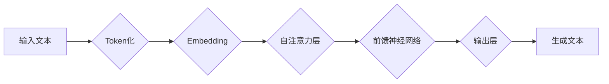

> 大语言模型、Transformer、自注意力机制、预训练、微调、生成式模型、自然语言处理

## 1. 背景介绍

近年来，人工智能领域取得了令人瞩目的进展，其中大语言模型（Large Language Models，LLMs）作为一种重要的代表，展现出强大的文本理解和生成能力，在自然语言处理（NLP）领域掀起了一场革命。从早期基于循环神经网络（RNN）的语言模型，到如今以Transformer为核心的LLMs，模型规模不断扩大，性能持续提升，为我们提供了更智能、更便捷的文本交互体验。

大语言模型的出现，标志着人工智能迈向更智能、更通用化的方向。它们能够理解和生成人类语言，并完成各种复杂的任务，例如文本摘要、机器翻译、对话系统、代码生成等。这些能力的突破，为我们带来了无限的可能性，也引发了人们对人工智能未来发展趋势的思考。

## 2. 核心概念与联系

大语言模型的核心概念包括：

* **Transformer:**  一种新型的深度学习架构，能够有效处理长序列数据，是构建大语言模型的基础。
* **自注意力机制:**  Transformer的核心组件，能够捕捉文本中单词之间的上下文关系，提升模型的理解能力。
* **预训练:**  在大量文本数据上进行训练，学习语言的通用知识和模式，为后续任务提供强大的基础。
* **微调:**  在特定任务数据上进行训练，进一步优化模型性能。
* **生成式模型:**  能够根据输入信息生成新的文本内容，是LLMs的重要应用场景。

**Mermaid 流程图:**



## 3. 核心算法原理 & 具体操作步骤

### 3.1  算法原理概述

Transformer模型的核心是自注意力机制和多头注意力机制。自注意力机制能够捕捉文本中单词之间的上下文关系，即使单词之间相隔很远，也能理解它们之间的关联。多头注意力机制则通过多个注意力头，从不同的角度捕捉文本信息，提升模型的理解能力。

### 3.2  算法步骤详解

1. **Token化:** 将输入文本分割成一个个独立的单词或子词，称为Token。
2. **Embedding:** 将每个Token映射到一个低维向量空间，称为Embedding向量。
3. **自注意力层:**  计算每个Token与所有其他Token之间的注意力权重，并根据权重进行加权求和，得到每个Token的上下文表示。
4. **前馈神经网络:** 对每个Token的上下文表示进行进一步处理，提取更深层的语义信息。
5. **输出层:** 将处理后的信息映射到输出空间，生成最终的文本内容。

### 3.3  算法优缺点

**优点:**

* 能够有效处理长序列数据，克服了RNN模型的梯度消失问题。
* 自注意力机制能够捕捉文本中单词之间的长距离依赖关系，提升模型的理解能力。
* 多头注意力机制能够从不同的角度捕捉文本信息，提升模型的表达能力。

**缺点:**

* 计算复杂度较高，训练和推理成本较高。
* 参数量较大，需要大量的计算资源和数据进行训练。

### 3.4  算法应用领域

* **自然语言理解:** 文本分类、情感分析、问答系统、文本摘要等。
* **自然语言生成:** 机器翻译、对话系统、文本创作、代码生成等。
* **其他领域:**  语音识别、图像识别、推荐系统等。

## 4. 数学模型和公式 & 详细讲解 & 举例说明

### 4.1  数学模型构建

大语言模型通常采用Transformer架构，其核心是自注意力机制和多头注意力机制。

**自注意力机制:**

给定一个序列 X = (x1, x2, ..., xn)，自注意力机制计算每个单词 xi 与所有其他单词之间的注意力权重，公式如下：

$$
Attention(Q, K, V) = softmax(\frac{QK^T}{\sqrt{d_k}})V
$$

其中：

* Q, K, V 分别是查询矩阵、键矩阵和值矩阵，维度为 (n, d_k)。
* d_k 是键向量的维度。
* softmax 函数将注意力权重归一化到 [0, 1] 之间。

**多头注意力机制:**

多头注意力机制通过多个注意力头，从不同的角度捕捉文本信息，公式如下：

$$
MultiHead(Q, K, V) = Concat(head_1, head_2, ..., head_h)W^O
$$

其中：

* head_i 是第 i 个注意力头的输出。
* h 是注意力头的数量。
* W^O 是一个线性变换矩阵。

### 4.2  公式推导过程

自注意力机制的公式推导过程如下：

1. 将输入序列 X 映射到查询矩阵 Q、键矩阵 K 和值矩阵 V。
2. 计算每个单词 xi 与所有其他单词之间的注意力权重，公式为：

$$
Attention(xi, X) = softmax(\frac{Q_i K^T}{\sqrt{d_k}})V
$$

3. 根据注意力权重对值矩阵 V 进行加权求和，得到每个单词 xi 的上下文表示。

### 4.3  案例分析与讲解

假设我们有一个句子 "The cat sat on the mat"，使用自注意力机制计算每个单词与所有其他单词之间的注意力权重，可以发现：

* "cat" 与 "sat" 之间的注意力权重较高，因为它们是动作和主语的关系。
* "sat" 与 "on" 之间的注意力权重较高，因为它们是动作和地点的关系。

通过自注意力机制，模型能够捕捉句子中单词之间的上下文关系，理解句子的语义。

## 5. 项目实践：代码实例和详细解释说明

### 5.1  开发环境搭建

* Python 3.7+
* PyTorch 1.7+
* CUDA 10.2+

### 5.2  源代码详细实现

```python
import torch
import torch.nn as nn

class Transformer(nn.Module):
    def __init__(self, vocab_size, embedding_dim, num_heads, num_layers):
        super(Transformer, self).__init__()
        self.embedding = nn.Embedding(vocab_size, embedding_dim)
        self.transformer_layers = nn.ModuleList([
            nn.TransformerEncoderLayer(embedding_dim, num_heads)
            for _ in range(num_layers)
        ])
        self.linear = nn.Linear(embedding_dim, vocab_size)

    def forward(self, x):
        x = self.embedding(x)
        for layer in self.transformer_layers:
            x = layer(x)
        x = self.linear(x)
        return x
```

### 5.3  代码解读与分析

* `__init__` 方法初始化模型参数，包括词嵌入层、Transformer编码器层和输出层。
* `forward` 方法定义模型的正向传播过程，将输入序列 x 映射到输出序列。
* 词嵌入层将每个单词映射到低维向量空间。
* Transformer编码器层通过多头注意力机制和前馈神经网络，捕捉文本中单词之间的上下文关系。
* 输出层将处理后的信息映射到输出空间，生成最终的文本内容。

### 5.4  运行结果展示

通过训练和测试，可以评估模型的性能，例如准确率、困惑度等。

## 6. 实际应用场景

### 6.1  文本生成

* **机器翻译:** 将一种语言的文本翻译成另一种语言。
* **对话系统:**  与用户进行自然语言交互，例如聊天机器人、虚拟助手。
* **文本创作:**  生成诗歌、小说、剧本等创意文本。

### 6.2  文本理解

* **文本分类:**  将文本归类到不同的类别，例如情感分析、主题分类。
* **问答系统:**  根据给定的文本回答问题。
* **文本摘要:**  生成文本的简短摘要。

### 6.3  代码生成

* **代码补全:**  根据上下文自动补全代码。
* **代码生成:**  根据自然语言描述生成代码。

### 6.4  未来应用展望

大语言模型在未来将应用于更广泛的领域，例如：

* **教育:**  个性化学习、智能辅导。
* **医疗:**  疾病诊断、医疗记录分析。
* **法律:**  法律文本分析、合同审查。

## 7. 工具和资源推荐

### 7.1  学习资源推荐

* **书籍:**
    * 《深度学习》
    * 《自然语言处理》
* **在线课程:**
    * Coursera: 自然语言处理
    * Udacity: 深度学习

### 7.2  开发工具推荐

* **PyTorch:**  一个开源的深度学习框架。
* **TensorFlow:**  另一个开源的深度学习框架。
* **Hugging Face Transformers:**  一个用于加载和使用预训练 Transformer 模型的库。

### 7.3  相关论文推荐

* **Attention Is All You Need:**  提出了 Transformer 架构。
* **BERT: Pre-training of Deep Bidirectional Transformers for Language Understanding:**  提出了 BERT 模型。
* **GPT-3: Language Models are Few-Shot Learners:**  提出了 GPT-3 模型。

## 8. 总结：未来发展趋势与挑战

### 8.1  研究成果总结

大语言模型在自然语言处理领域取得了显著的进展，展现出强大的文本理解和生成能力。Transformer架构、自注意力机制和预训练技术是推动大语言模型发展的重要因素。

### 8.2  未来发展趋势

* **模型规模进一步扩大:**  更大的模型规模能够带来更强的性能。
* **多模态学习:**  将文本与其他模态（例如图像、音频）进行融合，提升模型的理解和生成能力。
* **可解释性增强:**  提高模型的透明度和可解释性，帮助人们理解模型的决策过程。

### 8.3  面临的挑战

* **计算资源需求:**  训练和推理大语言模型需要大量的计算资源。
* **数据偏见:**  大语言模型的训练数据可能存在偏见，导致模型输出存在偏差。
* **安全风险:**  大语言模型可能被用于生成虚假信息、进行恶意攻击等。

### 8.4  研究展望

未来，大语言模型的研究将继续朝着更强大、更安全、更可解释的方向发展。


## 9. 附录：常见问题与解答

**Q1:  大语言模型的训练数据是什么？**

**A1:**  大语言模型的训练数据通常是公开的文本数据集，例如维基百科、书籍、新闻文章等。

**Q2:  大语言模型的训练需要多长时间？**

**A2:**  大语言模型的训练时间取决于模型规模、训练数据量和计算资源等因素，通常需要数天到数周的时间。

**Q3:  大语言模型的应用场景有哪些？**

**A3:**  大语言模型的应用场景非常广泛，例如文本生成、文本理解、代码生成等。

**Q4:  如何评估大语言模型的性能？**

**A4:**  大语言模型的性能通常通过准确率、困惑度等指标进行评估。

**Q5:  大语言模型存在哪些风险？**

**A5:**  大语言模型可能存在数据偏见、生成虚假信息、进行恶意攻击等风险。


作者：禅与计算机程序设计艺术 / Zen and the Art of Computer Programming 
<end_of_turn>