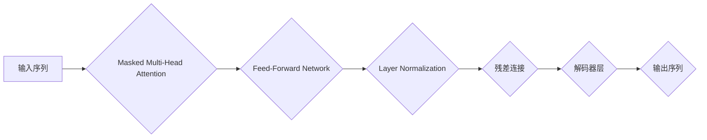

> Transformer, 解码器, 大语言模型, 自然语言处理, 序列生成, Attention机制, BERT, GPT

## 1. 背景介绍

近年来，深度学习在自然语言处理（NLP）领域取得了突破性进展，其中大语言模型（LLM）作为其重要组成部分，展现出强大的文本理解和生成能力。LLM的训练通常基于Transformer架构，而Transformer解码器是其核心组件之一，负责将模型的隐藏状态转换为可预测的文本序列。

传统的循环神经网络（RNN）在处理长文本序列时存在梯度消失和爆炸问题，难以捕捉长距离依赖关系。Transformer的出现则彻底改变了NLP领域，其基于注意力机制的结构能够有效解决RNN的缺陷，并实现更强大的文本表示能力。

## 2. 核心概念与联系

Transformer解码器是基于Transformer架构的序列生成模型，其主要功能是根据输入序列生成目标序列。

**2.1 Transformer架构概述**

Transformer架构由编码器和解码器两部分组成。编码器负责将输入序列转换为隐藏状态表示，解码器则根据编码器的输出和自身状态生成目标序列。

**2.2 解码器结构**

解码器由多个解码器层组成，每个解码器层包含以下组件：

* **Masked Multi-Head Attention:** 允许解码器关注输入序列中的前一部分信息，防止泄露未来信息。
* **Feed-Forward Network:** 对每个位置的隐藏状态进行非线性变换。
* **Layer Normalization:** 对每个层的输出进行归一化处理。

**2.3 解码器流程图**



## 3. 核心算法原理 & 具体操作步骤

### 3.1 算法原理概述

Transformer解码器的核心算法是基于注意力机制的序列生成模型。注意力机制能够学习到输入序列中不同位置之间的相关性，并根据相关性权重分配资源，从而更好地捕捉长距离依赖关系。

### 3.2 算法步骤详解

1. **输入嵌入:** 将输入序列中的每个单词转换为词向量表示。
2. **Masked Multi-Head Attention:** 对输入序列的词向量进行多头注意力机制处理，生成每个位置的上下文表示。
3. **Feed-Forward Network:** 对每个位置的上下文表示进行非线性变换，生成新的隐藏状态表示。
4. **Layer Normalization:** 对每个层的输出进行归一化处理。
5. **残差连接:** 将当前层的输出与前一层输出相加，防止梯度消失。
6. **重复步骤2-5:** 对解码器层进行多次堆叠，进一步提升模型的表达能力。
7. **输出层:** 将解码器层的最终隐藏状态转换为目标序列的概率分布，并使用采样方法生成目标序列。

### 3.3 算法优缺点

**优点:**

* 能够有效捕捉长距离依赖关系。
* 并行计算能力强，训练速度快。
* 表现能力强，在各种NLP任务中取得了优异的成绩。

**缺点:**

* 计算复杂度高，参数量大。
* 训练数据量要求高。

### 3.4 算法应用领域

Transformer解码器在以下领域具有广泛的应用：

* 机器翻译
* 文本摘要
* 问答系统
* 代码生成
* 文本风格转换

## 4. 数学模型和公式 & 详细讲解 & 举例说明

### 4.1 数学模型构建

Transformer解码器的数学模型主要基于以下几个核心组件：

* **多头注意力机制:** 用于学习输入序列中不同位置之间的相关性。
* **前馈神经网络:** 用于对每个位置的隐藏状态进行非线性变换。
* **残差连接:** 用于防止梯度消失。

### 4.2 公式推导过程

**4.2.1 多头注意力机制**

多头注意力机制可以看作是多个单头注意力机制的并行组合。每个单头注意力机制计算一个注意力权重矩阵，然后将这些权重矩阵进行线性组合，得到最终的注意力输出。

公式推导过程如下：

1. **查询、键、值矩阵:** 将输入序列的词向量分别转换为查询矩阵（Q）、键矩阵（K）和值矩阵（V）。

$$
Q = XW_Q, \ K = XW_K, \ V = XW_V
$$

2. **注意力权重计算:** 计算每个位置的注意力权重，公式如下：

$$
Attention(Q, K, V) = softmax(\frac{QK^T}{\sqrt{d_k}})V
$$

其中，$d_k$ 是键向量的维度。

3. **多头注意力输出:** 将多个单头注意力机制的输出进行线性组合，得到最终的多头注意力输出。

$$
MultiHead(Q, K, V) = Concat(head_1, head_2, ..., head_h)W_O
$$

其中，$h$ 是多头数量，$W_O$ 是一个线性变换矩阵。

**4.2.2 前馈神经网络**

前馈神经网络是一个简单的多层感知机，用于对每个位置的隐藏状态进行非线性变换。

公式推导过程如下：

1. **线性变换:** 对每个位置的隐藏状态进行线性变换。

$$
x' = Wx + b
$$

其中，$W$ 是权重矩阵，$b$ 是偏置项。

2. **非线性激活函数:** 对线性变换的结果应用非线性激活函数，例如ReLU函数。

$$
x'' = ReLU(x')
$$

3. **输出:** 将非线性激活函数的结果作为前馈神经网络的输出。

### 4.3 案例分析与讲解

**4.3.1 机器翻译案例**

在机器翻译任务中，Transformer解码器可以将源语言的句子转换为目标语言的句子。

例如，将英文句子“The cat sat on the mat”翻译成中文句子“猫坐在垫子上”。

Transformer解码器会首先将英文句子转换为词向量表示，然后使用多头注意力机制学习到每个词与其他词之间的相关性。

接着，使用前馈神经网络对每个位置的隐藏状态进行非线性变换，最终将隐藏状态转换为目标语言的词向量表示，并使用采样方法生成目标语言的句子。

## 5. 项目实践：代码实例和详细解释说明

### 5.1 开发环境搭建

* Python 3.6+
* PyTorch 1.0+
* CUDA 10.0+

### 5.2 源代码详细实现

```python
import torch
import torch.nn as nn

class DecoderLayer(nn.Module):
    def __init__(self, d_model, nhead, dim_feedforward=2048, dropout=0.1):
        super(DecoderLayer, self).__init__()
        self.self_attn = nn.MultiheadAttention(d_model, nhead, dropout=dropout)
        self.feed_forward = nn.Sequential(
            nn.Linear(d_model, dim_feedforward),
            nn.ReLU(),
            nn.Linear(dim_feedforward, d_model)
        )
        self.norm1 = nn.LayerNorm(d_model)
        self.norm2 = nn.LayerNorm(d_model)
        self.dropout = nn.Dropout(dropout)

    def forward(self, x, src_mask=None, src_key_padding_mask=None):
        # Self-attention
        attn_output, _ = self.self_attn(x, x, x, attn_mask=src_mask,
                                       key_padding_mask=src_key_padding_mask)
        x = x + self.dropout(attn_output)
        x = self.norm1(x)

        # Feed-forward network
        ffn_output = self.feed_forward(x)
        x = x + self.dropout(ffn_output)
        x = self.norm2(x)
        return x

class Decoder(nn.Module):
    def __init__(self, layers, d_model, nhead, dim_feedforward=2048, dropout=0.1):
        super(Decoder, self).__init__()
        self.layers = nn.ModuleList([DecoderLayer(d_model, nhead, dim_feedforward, dropout) for _ in range(layers)])

    def forward(self, x, src_mask=None, src_key_padding_mask=None):
        for layer in self.layers:
            x = layer(x, src_mask, src_key_padding_mask)
        return x
```

### 5.3 代码解读与分析

* `DecoderLayer`类定义了解码器中的一个层，包含自注意力机制、前馈神经网络、层归一化和Dropout。
* `Decoder`类定义了解码器，由多个`DecoderLayer`层组成。
* `forward`方法定义了解码器的前向传播过程，输入为目标序列的隐藏状态，输出为解码器层的最终隐藏状态。

### 5.4 运行结果展示

运行上述代码可以训练一个简单的Transformer解码器模型，并进行文本生成任务。

## 6. 实际应用场景

### 6.1 机器翻译

Transformer解码器在机器翻译领域取得了显著的成果，例如Google Translate和DeepL等翻译工具都采用了Transformer架构。

### 6.2 文本摘要

Transformer解码器可以用于生成文本摘要，例如将长篇文档压缩成简短的摘要。

### 6.3 问答系统

Transformer解码器可以用于构建问答系统，例如根据给定的问题生成相应的答案。

### 6.4 代码生成

Transformer解码器可以用于生成代码，例如根据自然语言描述生成相应的代码片段。

### 6.5 文本风格转换

Transformer解码器可以用于转换文本风格，例如将正式的文本转换为非正式的文本。

## 7. 工具和资源推荐

### 7.1 学习资源推荐

* **论文:**
    * Vaswani, A., Shazeer, N., Parmar, N., Uszkoreit, J., Jones, L., Gomez, A. N., ... & Polosukhin, I. (2017). Attention is all you need. In Advances in neural information processing systems (pp. 5998-6008).
* **书籍:**
    * Deep Learning with PyTorch by Eli Stevens, Luca Antiga, and Thomas Viehmann
* **在线课程:**
    * Stanford CS224N: Natural Language Processing with Deep Learning
    * fast.ai: Practical Deep Learning for Coders

### 7.2 开发工具推荐

* **PyTorch:** 深度学习框架
* **TensorFlow:** 深度学习框架
* **Hugging Face Transformers:** 预训练Transformer模型库

### 7.3 相关论文推荐

* BERT: Pre-training of Deep Bidirectional Transformers for Language Understanding
* GPT: Generative Pre-trained Transformer
* T5: Text-to-Text Transfer Transformer

## 8. 总结：未来发展趋势与挑战

### 8.1 研究成果总结

Transformer解码器在NLP领域取得了突破性进展，其强大的文本表示能力和序列生成能力在各种任务中展现出优异的性能。

### 8.2 未来发展趋势

* **模型规模和效率:** 探索更大型的Transformer模型，并研究提高模型效率的方法，例如模型压缩和量化。
* **多模态学习:** 将Transformer解码器与其他模态数据（例如图像、音频）相结合，构建多模态理解和生成模型。
* **可解释性:** 研究Transformer解码器的可解释性，以便更好地理解模型的决策过程。

### 8.3 面临的挑战

* **训练成本:** 大型Transformer模型的训练成本很高，需要大量的计算资源和数据。
* **数据偏见:** Transformer模型容易受到训练数据中的偏见影响，需要研究