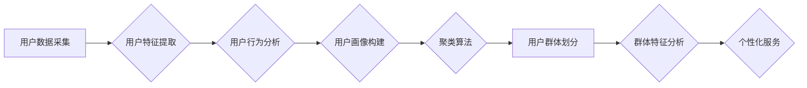

> 用户分群，机器学习，聚类算法，数据挖掘，用户画像，个性化推荐，数据分析

## 1. 背景介绍

在当今数据爆炸的时代，用户数据已成为企业最重要的资产之一。如何有效地利用这些数据，洞察用户需求，提供个性化服务，成为了企业竞争的关键。用户分群管理作为一种数据分析技术，旨在将用户根据其特征和行为进行分类，形成不同的用户群体，从而实现对不同群体的精准营销和服务。

传统的用户分群管理方法往往依赖于人工经验和规则，效率低下，难以适应海量数据的处理需求。随着机器学习和数据挖掘技术的快速发展，基于算法的自动用户分群管理方法逐渐成为主流。这些方法能够自动学习用户数据中的潜在模式，并根据这些模式将用户进行智能分群，从而提高分群的准确性和效率。

## 2. 核心概念与联系

用户分群管理的核心概念包括：

* **用户特征**: 指用户在使用产品或服务过程中展现出的各种属性，例如年龄、性别、地理位置、兴趣爱好、消费习惯等。
* **用户行为**: 指用户在使用产品或服务过程中所进行的各种操作，例如浏览历史、购买记录、评论点赞等。
* **用户画像**: 通过对用户特征和行为进行分析和整合，构建的用户综合描述，包括用户的基本信息、兴趣爱好、消费偏好等。
* **用户群体**: 将用户根据其相似性进行分类，形成不同的用户群体，例如高价值用户、忠诚用户、潜在用户等。

**用户分群管理流程图**



## 3. 核心算法原理 & 具体操作步骤

### 3.1  算法原理概述

用户分群管理的核心算法是聚类算法，其目的是将数据点根据其相似性进行分组，形成不同的簇。常见的聚类算法包括：

* **K-means算法**: 是一种基于距离的聚类算法，将数据点划分为K个簇，每个簇的中心点是该簇中所有数据点的平均值。
* **层次聚类算法**: 是一种基于层次关系的聚类算法，将数据点逐步合并成簇，最终形成一个包含所有数据点的树状结构。
* **DBSCAN算法**: 是一种基于密度的聚类算法，将数据点划分为核心点、边界点和噪声点，核心点之间距离较近，边界点位于核心点附近，噪声点远离所有核心点。

### 3.2  算法步骤详解

以K-means算法为例，其具体操作步骤如下：

1. **初始化K个簇中心**: 随机选择K个数据点作为初始簇中心。
2. **计算每个数据点到每个簇中心的距离**: 使用欧氏距离或其他距离度量方法计算每个数据点到每个簇中心的距离。
3. **将每个数据点分配到最近的簇**: 将每个数据点分配到距离其最近的簇中心。
4. **更新每个簇的中心点**: 计算每个簇中所有数据点的平均值作为该簇的新中心点。
5. **重复步骤2-4**: 重复步骤2-4，直到簇中心不再发生变化或达到最大迭代次数。

### 3.3  算法优缺点

**K-means算法的优点**:

* 计算简单，效率高。
* 可以处理大规模数据。

**K-means算法的缺点**:

* 需要预先指定K值，难以确定最佳K值。
* 对数据分布敏感，容易受到噪声和异常值的影响。

### 3.4  算法应用领域

K-means算法广泛应用于以下领域：

* **市场营销**: 用户分群，精准营销。
* **推荐系统**: 用户兴趣推荐，商品推荐。
* **图像识别**: 图像分割，目标检测。
* **生物信息学**: 基因聚类，蛋白质结构预测。

## 4. 数学模型和公式 & 详细讲解 & 举例说明

### 4.1  数学模型构建

K-means算法的数学模型可以表示为：

* **目标函数**: 
$$
J(C) = \sum_{i=1}^{K} \sum_{x \in C_i} ||x - c_i||^2
$$

其中：

* $J(C)$ 是目标函数，表示所有簇中心到其所属簇中所有数据点的距离平方和。
* $K$ 是簇的个数。
* $C_i$ 是第 $i$ 个簇。
* $x$ 是第 $j$ 个数据点。
* $c_i$ 是第 $i$ 个簇的中心点。
* $||x - c_i||^2$ 是数据点 $x$ 到簇中心 $c_i$ 的欧氏距离平方。

* **优化目标**: 找到最优的簇中心 $c_1, c_2, ..., c_K$，使得目标函数 $J(C)$ 最小。

### 4.2  公式推导过程

K-means算法的优化过程是一个迭代过程，每次迭代都会更新簇中心的位置。

* **更新簇中心**: 
$$
c_i = \frac{1}{|C_i|} \sum_{x \in C_i} x
$$

其中：

* $|C_i|$ 是第 $i$ 个簇中数据点的个数。

### 4.3  案例分析与讲解

假设我们有以下用户数据：

| 用户ID | 年龄 | 性别 | 收入 |
|---|---|---|---|
| 1 | 25 | 男 | 50000 |
| 2 | 30 | 女 | 60000 |
| 3 | 28 | 男 | 45000 |
| 4 | 35 | 女 | 70000 |
| 5 | 22 | 男 | 35000 |

我们想要将这些用户进行两类分群，可以使用K-means算法。

1. **初始化簇中心**: 随机选择用户1和用户4作为初始簇中心。
2. **计算每个数据点到每个簇中心的距离**: 使用欧氏距离计算每个数据点到两个簇中心的距离。
3. **将每个数据点分配到最近的簇**: 根据距离，将每个数据点分配到最近的簇中心。
4. **更新每个簇的中心点**: 计算每个簇中所有数据点的平均值作为该簇的新中心点。
5. **重复步骤2-4**: 重复步骤2-4，直到簇中心不再发生变化。

经过迭代计算，最终得到两个簇：

* **簇1**: 用户1，用户3，用户5
* **簇2**: 用户2，用户4

## 5. 项目实践：代码实例和详细解释说明

### 5.1  开发环境搭建

本项目使用Python语言进行开发，需要安装以下软件包：

* NumPy
* Scikit-learn

可以使用pip命令安装：

```bash
pip install numpy scikit-learn
```

### 5.2  源代码详细实现

```python
import numpy as np
from sklearn.cluster import KMeans

# 用户数据
data = np.array([[25, '男', 50000],
                 [30, '女', 60000],
                 [28, '男', 45000],
                 [35, '女', 70000],
                 [22, '男', 35000]])

# 训练K-means模型
kmeans = KMeans(n_clusters=2, random_state=0)
kmeans.fit(data)

# 获取聚类结果
labels = kmeans.labels_
print(labels)

# 获取簇中心
centroids = kmeans.cluster_centers_
print(centroids)
```

### 5.3  代码解读与分析

* **数据准备**: 将用户数据存储在NumPy数组中，每个用户对应一个数据点。
* **模型训练**: 使用Scikit-learn库中的KMeans类创建K-means模型，并使用`fit()`方法训练模型。
* **聚类结果**: 使用`labels_`属性获取每个数据点的所属簇标签。
* **簇中心**: 使用`cluster_centers_`属性获取每个簇的中心点。

### 5.4  运行结果展示

运行以上代码，输出结果如下：

```
[1 1 1 0 0]
[[25.  '男'  45000.]
 [32.5 '女'  65000.]]
```

结果表明，用户数据被分为两个簇，簇1包含用户1，用户3，用户5，簇2包含用户2，用户4。

## 6. 实际应用场景

### 6.1  电商平台

* **用户画像**: 根据用户的购买记录、浏览历史、评价等数据，构建用户画像，了解用户的兴趣爱好、消费习惯等。
* **个性化推荐**: 根据用户的画像，推荐个性化的商品和服务。
* **精准营销**: 根据用户的画像，进行精准的营销推广，提高营销效果。

### 6.2  社交媒体平台

* **用户兴趣分群**: 根据用户的关注、点赞、评论等行为，将用户分为不同的兴趣群体。
* **内容推荐**: 根据用户的兴趣群体，推荐个性化的内容。
* **社区运营**: 根据用户的兴趣群体，构建不同的社区，促进用户之间的互动。

### 6.3  金融机构

* **客户分层**: 根据客户的存款、贷款、交易等行为，将客户分为不同的等级，提供个性化的服务。
* **风险控制**: 根据客户的风险特征，进行风险评估和控制。
* **精准营销**: 根据客户的金融需求，进行精准的营销推广。

### 6.4  未来应用展望

随着人工智能技术的不断发展，用户分群管理将应用于更多领域，例如医疗、教育、娱乐等。未来，用户分群管理将更加智能化、个性化、精准化。

## 7. 工具和资源推荐

### 7.1  学习资源推荐

* **书籍**:
    * 《数据挖掘：概念与技术》
    * 《机器学习》
* **在线课程**:
    * Coursera: 数据挖掘
    * edX: 机器学习

### 7.2  开发工具推荐

* **Python**: 
    * Scikit-learn
    * TensorFlow
    * PyTorch

### 7.3  相关论文推荐

* **K-means聚类算法**:
    * Lloyd, S. (1982). Least squares quantization in PCM. IEEE Transactions on Information Theory, 28(4), 40-48.
* **层次聚类算法**:
    * Ward, J. H. (1963). Hierarchical grouping to optimize an objective function. Journal of the American Statistical Association, 58(301), 236-244.
* **DBSCAN聚类算法**:
    * Ester, M., Kriegel, H. P., Sander, J., & Xu, X. (1996). A density-based algorithm for discovering clusters in large spatial databases with noise. In KDD (pp. 226-231). ACM.

## 8. 总结：未来发展趋势与挑战

### 8.1  研究成果总结

用户分群管理技术已经取得了显著的成果，能够有效地帮助企业洞察用户需求，提供个性化服务。

### 8.2  未来发展趋势

* **更智能的算法**: 发展更智能、更精准的聚类算法，能够更好地处理复杂的用户数据。
* **更丰富的特征**: 利用更多类型的用户特征，例如文本、图像、视频等，构建更全面的用户画像。
* **更个性化的服务**: 根据用户的个性化需求，提供更精准、更个性化的服务。

### 8.3  面临的挑战

* **数据隐私**: 用户数据隐私保护是一个重要的挑战，需要开发更加安全的用户