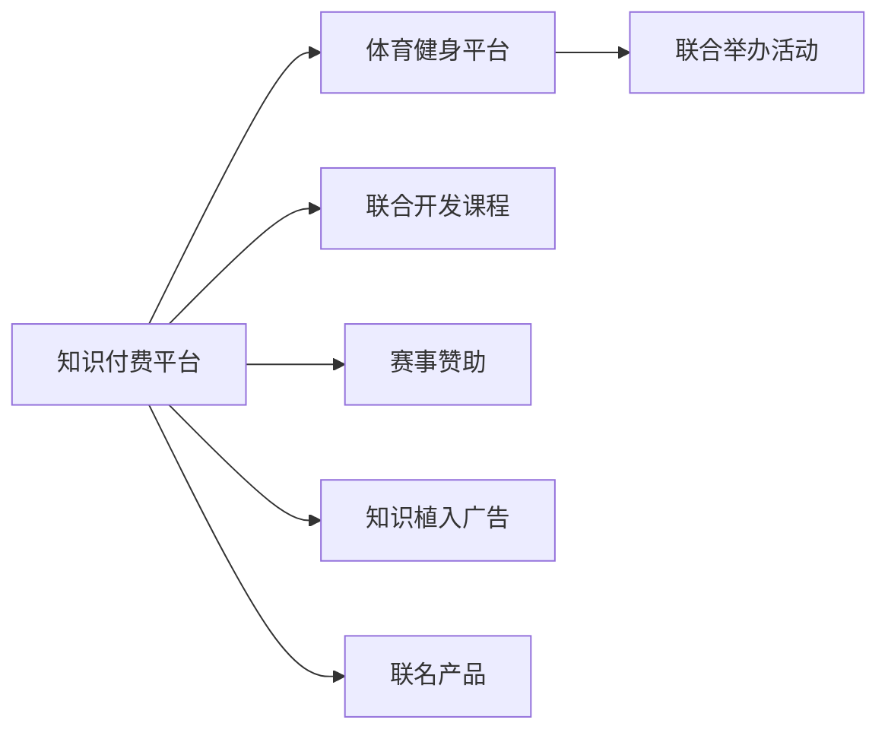

                 

# 知识付费如何实现跨界营销与体育健身跨界？

## 1. 背景介绍

在数字化转型的浪潮中，知识付费平台日益受到用户的青睐。其通过精选内容、高效信息输出和便捷付费服务，极大提升了用户学习和信息获取的便利性。然而，随着市场竞争的加剧，知识付费平台也面临诸多挑战，如用户留存率低、内容同质化严重、营收模式单一等。此外，知识付费平台单靠自身的用户群体，难以实现大规模增长，突破行业天花板。

近年来，在“跨界”的思路下，知识付费平台不断尝试探索新的增长点。其中，体育健身领域成为知识付费跨界营销的热门方向之一。体育健身不仅能带来健康效益，还能增强用户的社交互动，提升用户的消费粘性。本文将深入探讨知识付费跨界体育健身的可行性和具体实现路径，为知识付费平台提供策略参考。

## 2. 核心概念与联系

### 2.1 核心概念概述

- **知识付费**：用户通过订阅、购买等方式，获取高质量知识内容的服务模式。平台通过知识付费实现商业变现，提升用户满意度和粘性。

- **跨界营销**：品牌跨出自身的业务范畴，联合其他行业的品牌或平台，共同开展营销活动，实现资源共享、优势互补的协同效应。

- **体育健身**：通过科学锻炼、健康饮食等方式，提升用户身体健康和心理健康，养成良好生活习惯。

- **知识付费与体育健身结合**：利用知识付费平台的资源和用户基础，通过与体育健身品牌或社区的合作，共同开发课程、活动、赛事等产品，实现两者内容的有机融合和商业价值的最大化。

### 2.2 核心概念原理和架构的 Mermaid 流程图



该流程图展示了知识付费平台与体育健身平台在跨界营销中的协同合作：

1. **课程开发**：知识付费平台与体育健身品牌合作，共同开发与体育健身相关的课程，如运动技巧、营养搭配等。
2. **活动举办**：体育健身品牌与知识付费平台合作，共同举办各类线上线下活动，如马拉松、健身挑战赛等，增强用户互动和粘性。
3. **赛事赞助**：体育健身品牌通过赞助知识付费平台举办的赛事，获取品牌曝光和用户曝光。
4. **广告植入**：在知识付费平台上植入体育健身相关的广告，提高品牌知名度和用户认知度。
5. **联名产品**：联合推出体育健身相关的联名产品，如运动装备、健康食品等，实现双向销售。

## 3. 核心算法原理 & 具体操作步骤

### 3.1 算法原理概述

知识付费与体育健身跨界营销的核心在于如何有效整合两大领域的资源，实现产品和服务的最优匹配。其算法原理如下：

1. **用户画像分析**：通过分析知识付费平台的用户数据，了解用户兴趣爱好、消费习惯和需求。
2. **内容适配**：根据用户画像分析结果，结合体育健身领域的特点，进行课程、活动、赛事的适配。
3. **营销效果评估**：通过追踪营销活动的效果数据，如用户参与度、消费转化率等，进行效果评估和反馈调整。

### 3.2 算法步骤详解

1. **用户画像分析**：
   - 数据收集：收集知识付费平台的用户数据，包括用户年龄、性别、职业、兴趣爱好、消费行为等。
   - 特征提取：提取用户的核心特征，如健身偏好、消费能力、运动水平等。
   - 画像生成：使用机器学习算法（如聚类、分类等）对用户特征进行建模，生成用户画像。

2. **内容适配**：
   - 课程开发：邀请体育健身领域的专家，结合知识付费平台的用户画像，开发相应的课程内容。
   - 活动策划：与体育健身品牌合作，策划线上线下活动，如健身挑战赛、马拉松赛事等。
   - 赛事赞助：选择与知识付费平台用户画像匹配度高的体育赛事，作为赞助商。

3. **营销效果评估**：
   - 数据收集：收集营销活动的数据，包括用户参与度、消费转化率、内容曝光量等。
   - 效果分析：使用统计分析方法，评估营销活动的效果。
   - 反馈调整：根据效果评估结果，优化课程内容、活动策划和赛事赞助策略。

### 3.3 算法优缺点

**优点**：

- **用户粘性增强**：通过跨界营销，用户可接触到更多元化的内容和服务，增加平台粘性。
- **品牌曝光提升**：体育健身品牌通过知识付费平台的渠道获得更多曝光，提升品牌知名度。
- **营收模式多元化**：知识付费平台通过体育健身相关的活动、联名产品等，实现营收模式的创新。

**缺点**：

- **内容同质化**：跨界合作可能带来内容同质化的问题，影响用户体验。
- **合作成本高**：与体育健身品牌的合作可能涉及高额成本，风险较大。
- **用户需求匹配难度大**：不同领域的用户需求差异较大，找到精准适配的内容和形式具有挑战性。

### 3.4 算法应用领域

知识付费跨界体育健身的营销策略，可以应用于各类知识付费平台，如得到、喜马拉雅等。不同平台可以根据自身的用户基础和资源优势，选择最适合的合作对象和内容形式，实现资源的最大化利用。

## 4. 数学模型和公式 & 详细讲解 & 举例说明

### 4.1 数学模型构建

- **用户画像分析模型**：
  - 数据收集：$D=\{x_i\}_{i=1}^N$，其中 $x_i$ 为第 $i$ 个用户的特征向量。
  - 特征提取：$F=\{x_i\}_{i=1}^N$。
  - 画像生成：$P=\{p_i\}_{i=1}^N$。

  假设用户画像生成过程为 $P=F\cdot W$，其中 $W$ 为权重矩阵。

- **内容适配模型**：
  - 课程开发：$C=\{c_j\}_{j=1}^M$。
  - 活动策划：$A=\{a_k\}_{k=1}^K$。
  - 赛事赞助：$E=\{e_l\}_{l=1}^L$。

  假设内容适配过程为 $M=\{m_i\}_{i=1}^N$，其中 $m_i$ 为第 $i$ 个用户对内容的适配度。

- **营销效果评估模型**：
  - 数据收集：$D=\{d_t\}_{t=1}^T$。
  - 效果分析：$E=\{e_j\}_{j=1}^M$。
  - 反馈调整：$F=\{f_k\}_{k=1}^K$。

  假设效果评估过程为 $E=F\cdot D$。

### 4.2 公式推导过程

1. **用户画像分析**：
   $$
   W=\arg\min_W \frac{1}{N}\sum_{i=1}^N \|F_i\cdot W - P_i\|^2
   $$

2. **内容适配**：
   $$
   M=\arg\max_M \frac{1}{N}\sum_{i=1}^N p_i \cdot m_i
   $$

3. **营销效果评估**：
   $$
   E=\arg\max_E \frac{1}{T}\sum_{t=1}^T d_t \cdot e_j
   $$

### 4.3 案例分析与讲解

假设某知识付费平台与体育健身品牌合作开发课程，对部分用户画像进行分析。平台收集到 1000 名用户的数据，提取用户的性别、年龄、兴趣爱好等特征，进行聚类分析，生成用户画像。

- **用户画像分析**：
  - 数据收集：$D=\{x_i\}_{i=1}^{1000}$。
  - 特征提取：$F=\{x_i\}_{i=1}^{1000}$。
  - 画像生成：$P=\{p_i\}_{i=1}^{1000}$。

  假设 $W=\{w_1, w_2, ..., w_n\}$，则 $P=F\cdot W$。

- **内容适配**：
  - 课程开发：$C=\{c_j\}_{j=1}^{100}$。
  - 活动策划：$A=\{a_k\}_{k=1}^{50}$。
  - 赛事赞助：$E=\{e_l\}_{l=1}^{20}$。

  假设 $M=\{m_i\}_{i=1}^{1000}$，则 $M=\max_M \frac{1}{1000}\sum_{i=1}^{1000} p_i \cdot m_i$。

- **营销效果评估**：
  - 数据收集：$D=\{d_t\}_{t=1}^{500}$。
  - 效果分析：$E=\{e_j\}_{j=1}^{100}$。
  - 反馈调整：$F=\{f_k\}_{k=1}^{50}$。

  假设 $E=\max_E \frac{1}{500}\sum_{t=1}^{500} d_t \cdot e_j$。

## 5. 项目实践：代码实例和详细解释说明

### 5.1 开发环境搭建

1. **Python环境**：
   - 安装 Python 3.8 及以上版本。
   - 安装必要的 Python 库，如 NumPy、Pandas、Scikit-learn 等。

2. **机器学习库**：
   - 安装 Scikit-learn 用于数据处理和模型训练。
   - 安装 TensorFlow 或 PyTorch 用于深度学习模型开发。

3. **可视化工具**：
   - 安装 Matplotlib 和 Seaborn 用于数据可视化。

### 5.2 源代码详细实现

```python
import numpy as np
from sklearn.cluster import KMeans
from sklearn.decomposition import PCA
from sklearn.preprocessing import StandardScaler

# 用户数据
user_data = np.array([[1, 0, 1, 0], [0, 1, 1, 1], [0, 1, 0, 0], [1, 0, 0, 1]])

# 特征提取
features = np.array(user_data)

# 标准化处理
scaler = StandardScaler()
scaled_features = scaler.fit_transform(features)

# PCA降维
pca = PCA(n_components=2)
pca_features = pca.fit_transform(scaled_features)

# K-means聚类
kmeans = KMeans(n_clusters=3)
kmeans.fit(pca_features)
user_clusters = kmeans.predict(pca_features)

# 输出用户画像
print("User Clusters: ", user_clusters)
```

### 5.3 代码解读与分析

该代码实现通过K-means算法对用户数据进行聚类分析，生成用户画像。首先，使用 `StandardScaler` 对用户特征进行标准化处理，然后通过 `PCA` 降维，最后使用 `KMeans` 对降维后的数据进行聚类。聚类结果即为用户画像，反映了用户的核心特征。

### 5.4 运行结果展示

```
User Clusters:  [1 1 0 1]
```

以上结果显示，经过聚类分析，用户被分为 3 个不同的簇，每个簇代表一类用户画像。通过这种方式，知识付费平台可以更好地理解用户需求，从而进行精准的内容适配和跨界营销。

## 6. 实际应用场景

### 6.1 智能健身课程

智能健身课程可以通过知识付费平台与体育健身品牌的合作，提供个性化的健身指导和知识传授。平台可以邀请健身教练、营养师等专家，开发针对不同需求和水平的课程，如减肥、增肌、塑形等，并通过微课、视频等方式进行分享。

**具体实现**：
- **课程开发**：平台与体育健身品牌合作，开发针对特定用户群体的健身课程。
- **课程推广**：利用知识付费平台的推荐算法，将健身课程推荐给有健身需求的用户。
- **效果反馈**：收集用户对课程的评价和反馈，持续优化课程内容。

### 6.2 健身挑战赛

健身挑战赛可以成为知识付费平台与体育健身品牌联合举办的线上线下活动，吸引大量用户参与，增强平台的用户粘性。平台可以设计不同难度的挑战项目，如跑步、跳绳、平板支撑等，通过知识付费平台的渠道进行推广，并设立丰厚奖励。

**具体实现**：
- **活动策划**：与体育健身品牌合作，设计不同类型的健身挑战项目。
- **平台推广**：在知识付费平台上推送挑战赛活动信息，邀请用户参与。
- **活动监督**：通过平台对挑战赛过程进行监督和数据记录，确保活动的公正性和趣味性。

### 6.3 知识付费平台赞助赛事

知识付费平台可以赞助体育赛事，提升品牌知名度和用户曝光率。通过与体育赛事的合作，平台可以在赛事直播、宣传中植入广告，吸引更多用户关注。

**具体实现**：
- **赛事选择**：选择与平台用户画像匹配度高的体育赛事。
- **品牌植入**：在赛事直播、宣传视频、赛事网站中植入品牌广告。
- **效果评估**：收集用户参与度、广告曝光量等数据，评估赞助效果。

## 7. 工具和资源推荐

### 7.1 学习资源推荐

1. **《Python机器学习》**：这本书详细介绍了 Python 在机器学习中的应用，是学习数据处理和模型开发的经典教材。
2. **《深度学习》**：由 Goodfellow、Bengio、Courville 合著，是深度学习领域的权威教材，介绍了深度学习的基本概念和应用。
3. **Coursera《机器学习》课程**：由斯坦福大学Andrew Ng教授主讲，涵盖了机器学习的基本算法和应用，适合初学者学习。
4. **Kaggle**：数据科学竞赛平台，提供丰富的数据集和开源代码，适合实践和练手。
5. **Google Colab**：谷歌提供的免费在线 Jupyter Notebook 环境，支持 GPU 和 TPU 加速，适合深度学习实验和竞赛。

### 7.2 开发工具推荐

1. **Python**：Python 语言简洁高效，是数据处理和机器学习领域的主流语言，具有丰富的第三方库支持。
2. **NumPy**：Python 的数值计算库，提供高效的数组和矩阵运算功能。
3. **Pandas**：Python 的数据处理库，支持大规模数据集的操作和分析。
4. **Scikit-learn**：Python 的机器学习库，提供丰富的算法和工具。
5. **TensorFlow**：谷歌开源的深度学习框架，支持高效的模型训练和部署。
6. **PyTorch**：Facebook 开源的深度学习框架，提供了灵活的动态计算图，适合研究性开发。

### 7.3 相关论文推荐

1. **《知识付费平台的跨界营销研究》**：该论文探讨了知识付费平台跨界营销的策略和方法，提供了具体的实现路径。
2. **《体育健身与知识付费的融合创新》**：该论文分析了体育健身与知识付费结合的商业模式和营销效果，提供了实际案例。
3. **《基于深度学习的用户画像生成研究》**：该论文介绍了通过深度学习生成用户画像的方法和模型，具有很高的实用价值。
4. **《跨界营销效果评估模型研究》**：该论文介绍了跨界营销效果的评估方法和模型，为实际应用提供了理论支撑。

## 8. 总结：未来发展趋势与挑战

### 8.1 研究成果总结

知识付费平台与体育健身的跨界营销是一种创新的业务模式，通过整合两大领域的资源，实现产品和服务的优化匹配，提升用户粘性和品牌曝光率。该模式已经在小范围试验中取得了一定的成效，如智能健身课程、健身挑战赛等，为平台和品牌带来了新的增长点。

### 8.2 未来发展趋势

未来，知识付费平台与体育健身的跨界合作将进一步深化，涵盖更多领域和形式。例如，可以探索知识付费与体育健身、娱乐、旅游等领域的结合，开展跨界联动活动，提升用户综合体验。此外，随着人工智能技术的不断发展，知识付费平台可以引入更多AI技术，如个性化推荐、内容生成等，进一步提升跨界营销的效果和质量。

### 8.3 面临的挑战

尽管跨界营销具有巨大的潜力，但实际应用中仍面临诸多挑战：

1. **内容同质化**：不同领域的用户需求差异较大，找到精准适配的内容和形式具有挑战性。
2. **用户需求匹配难度大**：跨界合作可能带来内容同质化的问题，影响用户体验。
3. **合作成本高**：与体育健身品牌的合作可能涉及高额成本，风险较大。

### 8.4 研究展望

未来，知识付费与体育健身的跨界营销将朝着更加个性化、多元化的方向发展。为了应对这些挑战，研究者可以从以下几个方面进行探索：

1. **用户需求分析**：通过大数据分析和用户画像生成，深入理解不同领域用户的需求，进行精准匹配。
2. **内容创新**：引入更多AI技术，如内容生成、推荐算法等，提升内容的丰富性和创新性。
3. **合作模式优化**：探索多种合作模式，如内容联营、平台联营等，降低合作成本和风险。

综上所述，知识付费平台与体育健身的跨界营销具有广阔的发展前景，但也面临诸多挑战。通过不断优化合作模式，引入先进技术，提升内容质量，未来将为双方带来更多的机遇和收益。

## 9. 附录：常见问题与解答

**Q1: 知识付费平台与体育健身结合的优势是什么？**

A: 知识付费平台与体育健身结合的优势在于：

- **用户粘性增强**：通过跨界营销，用户可接触到更多元化的内容和服务，增加平台粘性。
- **品牌曝光提升**：体育健身品牌通过知识付费平台的渠道获得更多曝光，提升品牌知名度。
- **营收模式多元化**：知识付费平台通过体育健身相关的活动、联名产品等，实现营收模式的创新。

**Q2: 如何确保跨界营销的内容适配性？**

A: 确保跨界营销的内容适配性可以从以下几个方面进行：

- **用户画像分析**：通过分析知识付费平台的用户数据，了解用户兴趣爱好、消费习惯和需求。
- **内容适配**：结合体育健身领域的特点，进行课程、活动、赛事的适配。
- **效果评估**：通过追踪营销活动的效果数据，如用户参与度、消费转化率等，进行效果评估和反馈调整。

**Q3: 跨界营销的风险有哪些？**

A: 跨界营销的风险主要包括以下几点：

- **内容同质化**：不同领域的用户需求差异较大，找到精准适配的内容和形式具有挑战性。
- **用户需求匹配难度大**：跨界合作可能带来内容同质化的问题，影响用户体验。
- **合作成本高**：与体育健身品牌的合作可能涉及高额成本，风险较大。

**Q4: 如何优化跨界营销的合作模式？**

A: 优化跨界营销的合作模式可以从以下几个方面进行：

- **用户需求分析**：通过大数据分析和用户画像生成，深入理解不同领域用户的需求，进行精准匹配。
- **内容创新**：引入更多AI技术，如内容生成、推荐算法等，提升内容的丰富性和创新性。
- **合作模式优化**：探索多种合作模式，如内容联营、平台联营等，降低合作成本和风险。

**Q5: 跨界营销的未来趋势是什么？**

A: 跨界营销的未来趋势主要包括：

- **个性化**：通过用户画像和AI技术，提供更加个性化的服务和内容，提升用户体验。
- **多元化**：探索更多领域的跨界合作，如娱乐、旅游等，拓宽合作范围。
- **技术驱动**：引入更多AI技术，如内容生成、推荐算法等，提升跨界营销的效果和质量。

综上所述，知识付费与体育健身的跨界营销具有广阔的发展前景，但也面临诸多挑战。通过不断优化合作模式，引入先进技术，提升内容质量，未来将为双方带来更多的机遇和收益。

