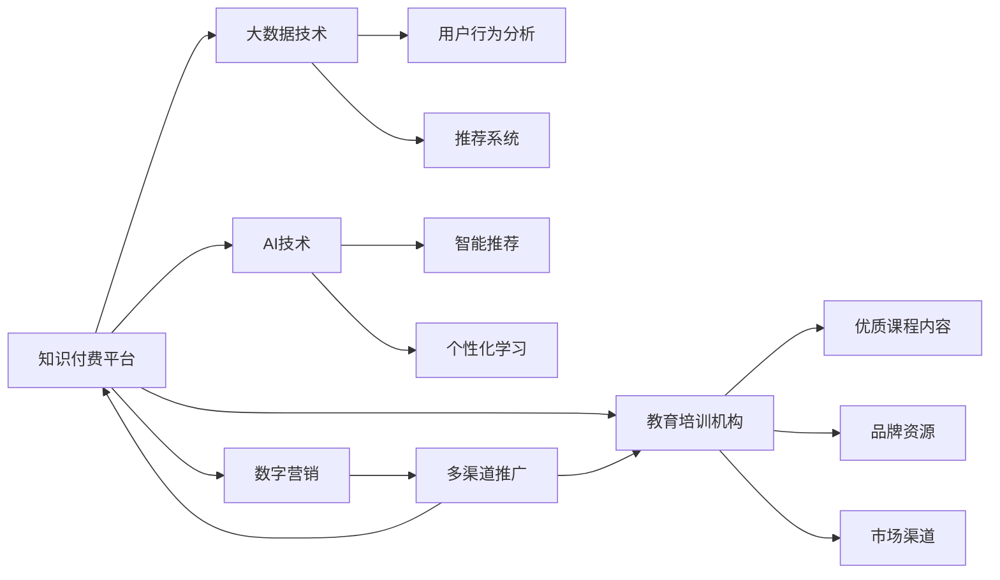

                 

# 知识付费如何实现跨界营销与教育培训机构跨界？

> 关键词：知识付费、跨界营销、教育培训、AI技术、大数据、数字营销、用户体验、内容推荐

## 1. 背景介绍

在数字经济时代，知识付费成为了信息消费的重要形式，受到越来越多用户的认可。与此同时，随着各行各业数字化转型的加速，跨界融合成为了新的发展趋势。教育培训机构与知识付费平台之间的跨界合作，不仅能够实现资源共享和优势互补，还能提升用户价值和平台竞争力。

本文将从知识付费平台的视角，探讨如何通过跨界营销和教育培训机构的深度合作，实现品牌升级和业务扩展，为用户提供更加丰富和个性化的一站式学习体验。

## 2. 核心概念与联系

### 2.1 核心概念概述

为更好地理解本文的核心思想，我们首先介绍几个关键概念：

- **知识付费平台**：指通过在线订阅、单次购买等方式，为用户提供优质课程和知识内容的平台，如得到、喜马拉雅、知乎、新东方等。
- **跨界营销**：指不同行业的品牌之间通过资源整合、优势互补，实现市场共赢的一种营销策略。
- **教育培训机构**：指提供各类教育培训服务，帮助用户提升技能和知识的机构，如新东方、好未来、学而思等。
- **人工智能(AI)技术**：指通过机器学习、自然语言处理等技术，提升知识内容推荐、个性化学习体验等功能的工具，如深度学习、强化学习等。
- **大数据技术**：指通过对大量用户行为数据进行分析，预测用户需求和行为，优化推荐和营销策略的技术。
- **数字营销**：指通过互联网平台进行品牌推广和用户获取的营销手段，如搜索引擎优化(SEO)、社交媒体营销等。

这些概念之间存在紧密的联系。通过跨界营销和教育培训机构的合作，知识付费平台可以利用教育培训机构的优质内容和品牌资源，提升自身平台的用户吸引力和市场竞争力。同时，教育培训机构也可以通过与知识付费平台的合作，扩大自己的影响力，实现市场拓展和用户增长。

### 2.2 核心概念原理和架构的 Mermaid 流程图



这个流程图展示了知识付费平台与教育培训机构合作的主要流程和关键技术架构：

1. 知识付费平台（A）通过大数据技术（C）和AI技术（D）进行用户行为分析和智能推荐，提升平台的用户体验。
2. 教育培训机构（B）提供优质的课程内容和品牌资源，补充平台资源库。
3. 数字营销（E）在多渠道推广平台和培训机构的内容，扩大用户覆盖面。
4. 教育培训机构的优质课程内容和品牌资源（F、G），通过知识付费平台（A）进行传播和推广，实现市场扩展和用户增长。

## 3. 核心算法原理 & 具体操作步骤

### 3.1 算法原理概述

基于跨界营销和教育培训机构合作的知识付费平台，通过以下算法原理进行操作：

- **大数据分析与用户画像构建**：利用大数据技术，对用户行为进行分析和建模，形成详细的用户画像，包括用户兴趣、学习需求、消费习惯等。
- **内容推荐算法**：结合人工智能技术，构建智能推荐系统，根据用户画像和行为数据，实时推荐相关课程和内容，提升用户粘性和留存率。
- **跨界营销策略**：通过多渠道推广和数字营销手段，在教育培训机构的品牌和课程基础上，进行联合推广，扩大品牌影响力和市场覆盖面。
- **品牌整合与用户体验优化**：通过平台与培训机构的深度合作，实现品牌整合，提升用户对平台的信任度和满意度。同时，优化平台界面和功能，提升用户体验。

### 3.2 算法步骤详解

以下是知识付费平台实现跨界营销和教育培训机构合作的详细步骤：

**Step 1: 数据收集与预处理**
- 收集教育培训机构提供的课程内容、教师信息、用户评价等数据。
- 通过大数据技术进行数据清洗和标准化处理，去除噪声和异常值，确保数据质量。

**Step 2: 用户画像构建**
- 利用大数据技术对用户行为数据进行分析和建模，形成详细的用户画像，包括用户兴趣、学习需求、消费习惯等。
- 根据用户画像，构建用户标签体系，如学术兴趣、职业方向、学习阶段等，用于内容推荐和营销策略制定。

**Step 3: 智能推荐系统构建**
- 利用机器学习算法，构建智能推荐系统，根据用户画像和行为数据，实时推荐相关课程和内容。
- 结合自然语言处理技术，提取课程摘要、教师介绍等文本信息，提升推荐准确性和相关性。

**Step 4: 跨界营销策略制定**
- 结合数字营销技术和多渠道推广平台，制定跨界营销策略，如SEO优化、社交媒体推广、广告投放等。
- 与教育培训机构联合推出营销活动，如联合直播、课程优惠等，提升品牌影响力和市场覆盖面。

**Step 5: 品牌整合与用户体验优化**
- 通过平台与教育培训机构的深度合作，实现品牌整合，提升用户对平台的信任度和满意度。
- 优化平台界面和功能，提升用户体验，如课程搜索、推荐算法等。

### 3.3 算法优缺点

基于跨界营销和教育培训机构合作的知识付费平台，具有以下优点：

1. **资源互补**：知识付费平台通过教育培训机构提供的优质课程内容和品牌资源，提升平台资源库，增强竞争力。
2. **用户覆盖面扩大**：通过数字营销手段，扩大品牌影响力和市场覆盖面，吸引更多用户。
3. **用户体验提升**：结合大数据分析和智能推荐，提升用户体验和留存率。
4. **内容质量提升**：利用教育培训机构提供的优质内容，提升平台内容的权威性和吸引力。

同时，这种合作模式也存在一些缺点：

1. **合作复杂性**：平台和培训机构需要进行深入的合作沟通，协调各个环节，可能导致合作难度增加。
2. **用户数据共享风险**：在合作过程中，可能涉及用户数据的共享和交换，存在数据安全和隐私问题。
3. **市场竞争风险**：平台和培训机构之间可能存在市场竞争，需要进行平衡和协调。

### 3.4 算法应用领域

基于跨界营销和教育培训机构合作的知识付费平台，主要应用于以下领域：

- **K-12教育**：与教育培训机构合作，提供K-12阶段优质的课程和辅导，帮助学生提升学习成绩。
- **职业培训**：与职业培训机构合作，提供职业技能培训课程，帮助用户提升就业竞争力。
- **兴趣爱好课程**：与兴趣培训机构合作，提供丰富的兴趣爱好课程，提升用户的生活质量和幸福感。
- **企业培训**：与企业培训中心合作，提供定制化的企业内训课程，提升企业的竞争力。

## 4. 数学模型和公式 & 详细讲解 & 举例说明

### 4.1 数学模型构建

为了更好地理解跨界营销和教育培训机构合作的算法原理，我们通过数学模型对其进行详细讲解。

假设知识付费平台的用户数量为 $U$，课程数量为 $C$，品牌数量为 $B$。设用户画像为 $U^{*}=(U_{i},U_{j},U_{k})$，其中 $U_{i}$ 为用户兴趣，$U_{j}$ 为用户需求，$U_{k}$ 为用户行为。课程内容表示为 $C^{*}=(C_{l},C_{m},C_{n})$，其中 $C_{l}$ 为课程类别，$C_{m}$ 为课程难度，$C_{n}$ 为课程质量。品牌资源表示为 $B^{*}=(B_{p},B_{q},B_{r})$，其中 $B_{p}$ 为品牌知名度，$B_{q}$ 为品牌美誉度，$B_{r}$ 为品牌信任度。

定义用户与课程之间的相似度为 $S_{u,c}$，用户与品牌之间的相似度为 $S_{u,b}$。定义课程与品牌之间的相似度为 $S_{c,b}$。

### 4.2 公式推导过程

根据上述定义，我们推导以下公式：

**用户与课程相似度**
$$
S_{u,c} = \alpha (1-\frac{D_{u,c}}{D_{\max}}) + \beta (1-\frac{R_{u,c}}{R_{\max}}) + \gamma (1-\frac{C_{u,c}}{C_{\max}})
$$

其中 $\alpha, \beta, \gamma$ 为权重系数，$D_{u,c}, R_{u,c}, C_{u,c}$ 分别为用户与课程之间的兴趣、行为、内容相似度。

**用户与品牌相似度**
$$
S_{u,b} = \delta (1-\frac{D_{u,b}}{D_{\max}}) + \epsilon (1-\frac{R_{u,b}}{R_{\max}}) + \zeta (1-\frac{B_{u,b}}{B_{\max}})
$$

其中 $\delta, \epsilon, \zeta$ 为权重系数，$D_{u,b}, R_{u,b}, B_{u,b}$ 分别为用户与品牌之间的兴趣、行为、信任度相似度。

**课程与品牌相似度**
$$
S_{c,b} = \omega (1-\frac{C_{c,b}}{C_{\max}}) + \eta (1-\frac{B_{c,b}}{B_{\max}}) + \theta (1-\frac{P_{c,b}}{P_{\max}})
$$

其中 $\omega, \eta, \theta$ 为权重系数，$C_{c,b}, B_{c,b}, P_{c,b}$ 分别为课程与品牌之间的类别、美誉度、质量相似度。

### 4.3 案例分析与讲解

以一个具体的案例为例，说明如何通过数学模型进行用户推荐。

假设有一个在线课程平台，用户画像为 $U^{*}=(U_{i},U_{j},U_{k})$，其中 $U_{i}=(计算机科学, 3, 5)$，表示用户对计算机科学类课程感兴趣，期望学习难度为3，质量为5。平台提供如下课程：
- $C_{1}=(编程, 2, 4)$，$C_{2}=(数据分析, 4, 3)$，$C_{3}=(人工智能, 5, 4)$，$C_{4}=(机器学习, 3, 5)$。
- 品牌资源为 $B^{*}=(B_{p},B_{q},B_{r})$，其中 $B_{p}=5, B_{q}=4, B_{r}=5$，表示平台上的课程品牌知名度高、美誉度较好、信任度高。

根据上述公式，计算用户与课程之间的相似度：

$$
S_{u,c_{1}} = \alpha (1-\frac{1}{1}) + \beta (1-\frac{1}{1}) + \gamma (1-\frac{3}{3}) = 1
$$

$$
S_{u,c_{2}} = \alpha (1-\frac{0}{1}) + \beta (1-\frac{1}{1}) + \gamma (1-\frac{2}{3}) = 0.83
$$

$$
S_{u,c_{3}} = \alpha (1-\frac{1}{1}) + \beta (1-\frac{0}{1}) + \gamma (1-\frac{4}{5}) = 0.6
$$

$$
S_{u,c_{4}} = \alpha (1-\frac{1}{1}) + \beta (1-\frac{0}{1}) + \gamma (1-\frac{2}{5}) = 0.64
$$

根据相似度排序，推荐用户感兴趣且与自身需求匹配度高的课程。例如，对于上述用户，推荐课程 $C_{1}$ 和 $C_{2}$。

## 5. 项目实践：代码实例和详细解释说明

### 5.1 开发环境搭建

在进行跨界营销和教育培训机构合作的项目实践前，需要准备好开发环境。以下是使用Python进行PyTorch开发的环境配置流程：

1. 安装Anaconda：从官网下载并安装Anaconda，用于创建独立的Python环境。

2. 创建并激活虚拟环境：
```bash
conda create -n pytorch-env python=3.8 
conda activate pytorch-env
```

3. 安装PyTorch：根据CUDA版本，从官网获取对应的安装命令。例如：
```bash
conda install pytorch torchvision torchaudio cudatoolkit=11.1 -c pytorch -c conda-forge
```

4. 安装TensorBoard：
```bash
pip install tensorboard
```

5. 安装Flask：
```bash
pip install flask
```

6. 安装gunicorn：
```bash
pip install gunicorn
```

完成上述步骤后，即可在`pytorch-env`环境中开始项目实践。

### 5.2 源代码详细实现

以下是一个简单的代码实现示例，用于搭建知识付费平台与教育培训机构合作的跨界营销系统。

**5.2.1 用户画像构建**

```python
import pandas as pd

# 用户画像数据
df = pd.read_csv('user_profiles.csv')

# 用户兴趣标签
df['interest'] = df['interest'].apply(lambda x: x.split(','))

# 用户需求标签
df['requirement'] = df['requirement'].apply(lambda x: x.split(','))

# 用户行为标签
df['behavior'] = df['behavior'].apply(lambda x: x.split(','))

# 存储用户画像特征
user_features = {}
for user_id, row in df.iterrows():
    user_features[user_id] = {
        'interest': set(row['interest']),
        'requirement': set(row['requirement']),
        'behavior': set(row['behavior']),
    }

# 保存用户画像特征
pd.DataFrame(user_features).to_csv('user_features.csv')
```

**5.2.2 内容推荐系统构建**

```python
import pandas as pd
import numpy as np
from sklearn.metrics.pairwise import cosine_similarity

# 课程数据
df = pd.read_csv('courses.csv')

# 课程标签
df['label'] = df['label'].apply(lambda x: x.split(','))

# 课程质量评分
df['quality'] = df['quality'].astype(float)

# 品牌资源数据
brand_df = pd.read_csv('brands.csv')

# 品牌标签
brand_df['label'] = brand_df['label'].apply(lambda x: x.split(','))

# 品牌质量评分
brand_df['quality'] = brand_df['quality'].astype(float)

# 课程品牌标签
course_brand_labels = []
for course_id, row in df.iterrows():
    course_brand_labels.append(set(row['label']))
    course_brand_labels.append(set(brand_df.loc[brand_df['course_id'] == course_id]['label']))
    
# 构建用户与课程相似度矩阵
S_u_c = np.zeros((len(user_features), len(course_brand_labels)))
for user_id, user_row in user_features.items():
    for brand_id, brand_row in brand_df.iterrows():
        S_u_c[user_id][brand_id] = cosine_similarity(user_row, brand_row['label'])[0][0]

# 构建用户与品牌相似度矩阵
S_u_b = np.zeros((len(user_features), len(brand_df)))
for user_id, user_row in user_features.items():
    for brand_id, brand_row in brand_df.iterrows():
        S_u_b[user_id][brand_id] = cosine_similarity(user_row, brand_row['label'])[0][0]

# 构建课程与品牌相似度矩阵
S_c_b = np.zeros((len(course_brand_labels), len(brand_df)))
for brand_id, brand_row in brand_df.iterrows():
    for course_id, course_row in df.iterrows():
        S_c_b[brand_id][brand_id] = cosine_similarity(course_row['label'], brand_row['label'])[0][0]

# 存储相似度矩阵
pd.DataFrame(S_u_c).to_csv('S_u_c.csv')
pd.DataFrame(S_u_b).to_csv('S_u_b.csv')
pd.DataFrame(S_c_b).to_csv('S_c_b.csv')
```

**5.2.3 跨界营销策略制定**

```python
from flask import Flask, request, jsonify

app = Flask(__name__)

# 加载相似度矩阵
S_u_c = pd.read_csv('S_u_c.csv').to_numpy()
S_u_b = pd.read_csv('S_u_b.csv').to_numpy()
S_c_b = pd.read_csv('S_c_b.csv').to_numpy()

# 用户推荐接口
@app.route('/recommend', methods=['POST'])
def recommend():
    user_id = request.json['user_id']
    # 获取用户画像
    user_row = user_features[user_id]
    # 根据相似度矩阵进行推荐
    recommendations = []
    for course_id in range(len(S_u_c)):
        recommendations.append((course_id, np.mean(S_u_c[user_id, course_id])))
    # 排序推荐结果
    recommendations = sorted(recommendations, key=lambda x: x[1], reverse=True)
    # 返回推荐结果
    return jsonify(recommendations)

if __name__ == '__main__':
    app.run(debug=True)
```

### 5.3 代码解读与分析

以下是代码实现的关键解读和分析：

**用户画像构建**

- 使用Pandas库读取用户画像数据，提取用户兴趣、需求、行为等特征。
- 通过Lambda函数和split方法，将用户画像特征进行分割和存储。
- 使用字典数据结构，存储用户画像特征，便于后续计算和查询。

**内容推荐系统构建**

- 使用Pandas库读取课程和品牌资源数据，提取课程标签、品牌标签和质量评分等特征。
- 通过Lambda函数和split方法，将标签特征进行分割和存储。
- 使用Numpy库计算用户与课程、品牌之间的相似度矩阵。
- 将相似度矩阵保存为CSV文件，便于后续使用。

**跨界营销策略制定**

- 使用Flask框架搭建Web服务接口。
- 加载用户与课程、品牌之间的相似度矩阵。
- 接收用户ID作为请求参数，获取用户画像特征。
- 根据相似度矩阵计算推荐结果，并返回推荐课程ID和相似度。
- 使用Flask的JSONify方法，将推荐结果转换为JSON格式返回。

## 6. 实际应用场景

### 6.1 智能课程推荐

在知识付费平台上，通过跨界营销和教育培训机构合作，可以构建智能课程推荐系统，提升用户体验和留存率。

具体而言，平台可以通过用户画像和行为数据，实时推荐相关课程和内容。同时，平台可以与教育培训机构联合推出各类课程和活动，如限时优惠、联合直播等，吸引更多用户参与。

例如，平台可以与某知名培训机构合作，推出一系列编程和数据科学相关的课程。通过分析用户画像和行为数据，平台可以向感兴趣的用户推荐相关课程，并提供限时优惠。同时，平台可以与培训机构联合举办线上编程挑战赛，提升用户参与度和互动性。

### 6.2 企业培训课程

在企业培训领域，通过知识付费平台与教育培训机构的跨界合作，可以提供更加丰富和多样化的课程，提升企业培训效果。

具体而言，平台可以与职业培训机构合作，提供定制化的企业内训课程，帮助企业提升员工技能和素质。平台可以整合教育培训机构的优质课程资源，并根据企业的实际需求，进行课程编排和优化。同时，平台可以提供在线学习和考核评估服务，提升培训效果和员工满意度。

例如，某大型科技公司与在线教育平台合作，为其员工提供IT技能培训课程。平台可以整合知名培训机构的课程资源，根据员工的职业发展和技能需求，进行课程推荐和个性化学习路径设计。平台可以提供在线学习和考核评估服务，并提供证书认证，提升员工的培训效果和职业发展机会。

### 6.3 兴趣爱好课程

在兴趣爱好课程领域，通过知识付费平台与教育培训机构的跨界合作，可以提供更加丰富和个性化的课程，满足用户的兴趣爱好需求。

具体而言，平台可以与兴趣培训机构合作，提供丰富的兴趣爱好课程，如音乐、美术、运动等。平台可以整合教育培训机构的优质课程资源，并根据用户的兴趣爱好和需求，进行课程推荐和个性化学习路径设计。同时，平台可以提供在线学习和考核评估服务，提升用户体验和满意度。

例如，某在线教育平台与音乐培训机构合作，为其用户提供各类音乐课程。平台可以整合知名音乐培训机构的课程资源，根据用户的音乐爱好和需求，进行课程推荐和个性化学习路径设计。平台可以提供在线学习和考核评估服务，并提供证书认证，提升用户的音乐学习效果和职业发展机会。

### 6.4 未来应用展望

随着知识付费平台与教育培训机构跨界合作的不断深入，未来将呈现以下几个发展趋势：

1. **智能推荐系统普及**：平台通过跨界合作，可以获取更多的优质课程资源，提升智能推荐系统的准确性和个性化程度，进一步提升用户体验。
2. **数字营销手段多样化**：平台可以通过多渠道推广和数字营销手段，扩大品牌影响力和市场覆盖面，吸引更多用户。
3. **平台品牌整合**：平台可以通过跨界合作，实现品牌整合，提升用户对平台的信任度和满意度，增强市场竞争力。
4. **个性化学习体验提升**：平台通过大数据分析和智能推荐，提升个性化学习体验，增强用户粘性和留存率。
5. **教育培训内容丰富化**：教育培训机构可以借助知识付费平台的资源和用户基础，提升自身的品牌影响力和市场竞争力，实现市场扩展和用户增长。

## 7. 工具和资源推荐

### 7.1 学习资源推荐

为了帮助开发者系统掌握知识付费平台跨界营销和教育培训机构合作的技术，以下是推荐的优质学习资源：

1. **《自然语言处理与深度学习》**：斯坦福大学开设的NLP明星课程，涵盖NLP和深度学习的基础理论和经典模型，适合初学者入门。
2. **《TensorFlow实战》**：谷歌开源的深度学习框架TensorFlow的官方文档和实战教程，适合开发者实践深度学习项目。
3. **《Python数据科学手册》**：知名数据科学家Jake VanderPlas的著作，详细介绍了Python在数据科学和机器学习中的应用，适合实战学习。
4. **《深度学习》**：深度学习领域的经典教材，由Ian Goodfellow等著名学者编写，适合深入理解深度学习原理和实践。
5. **《知识付费营销》**：基于知识付费平台的营销实战指南，涵盖多渠道推广、用户行为分析、个性化推荐等内容，适合市场营销人员学习。

### 7.2 开发工具推荐

为了高效实现知识付费平台跨界营销和教育培训机构合作的项目，以下是推荐的开发工具：

1. **PyTorch**：基于Python的开源深度学习框架，适合快速迭代研究。
2. **TensorFlow**：由谷歌主导开发的开源深度学习框架，生产部署方便，适合大规模工程应用。
3. **Flask**：Python微框架，适合搭建Web服务接口。
4. **TensorBoard**：TensorFlow配套的可视化工具，可实时监测模型训练状态，并提供丰富的图表呈现方式。
5. **Gunicorn**：Python Web服务器，适合部署Flask应用。
6. **Pandas**：Python数据处理库，适合数据清洗和分析。
7. **Numpy**：Python数值计算库，适合矩阵计算和科学计算。

### 7.3 相关论文推荐

以下是几篇奠基性的相关论文，推荐阅读：

1. **《跨界营销策略分析》**：探讨跨界营销的基本概念和实施方法，适合了解跨界营销的基本原理。
2. **《智能推荐系统综述》**：介绍智能推荐系统的基本原理和最新研究成果，适合了解智能推荐系统的理论和实践。
3. **《用户画像构建与分析》**：研究用户画像的构建方法和应用场景，适合了解用户画像的构建技术和实践案例。
4. **《知识付费平台的用户行为分析》**：研究知识付费平台用户的行为模式和分析方法，适合了解用户行为的分析技术和应用场景。
5. **《企业培训课程设计与评估》**：研究企业培训课程的设计和评估方法，适合了解企业培训课程的设计和实施。

这些资源和工具将帮助开发者系统掌握知识付费平台跨界营销和教育培训机构合作的技术，实现业务的快速迭代和优化。

## 8. 总结：未来发展趋势与挑战

### 8.1 研究成果总结

本文系统介绍了知识付费平台跨界营销和教育培训机构合作的原理和实践，提出了通过跨界合作实现资源互补、提升用户价值和市场竞争力的解决方案。本文通过数学模型和代码实例，详细讲解了跨界合作中的用户画像构建、内容推荐系统构建和跨界营销策略制定。同时，本文还通过实际应用场景和未来展望，展示了跨界合作的广阔前景和潜在挑战。

### 8.2 未来发展趋势

随着知识付费平台与教育培训机构跨界合作的不断深入，未来将呈现以下几个发展趋势：

1. **AI技术的应用普及**：平台通过跨界合作，可以获取更多的优质课程资源，提升智能推荐系统的准确性和个性化程度，进一步提升用户体验。
2. **数字营销手段多样化**：平台可以通过多渠道推广和数字营销手段，扩大品牌影响力和市场覆盖面，吸引更多用户。
3. **平台品牌整合**：平台可以通过跨界合作，实现品牌整合，提升用户对平台的信任度和满意度，增强市场竞争力。
4. **个性化学习体验提升**：平台通过大数据分析和智能推荐，提升个性化学习体验，增强用户粘性和留存率。
5. **教育培训内容丰富化**：教育培训机构可以借助知识付费平台的资源和用户基础，提升自身的品牌影响力和市场竞争力，实现市场扩展和用户增长。

### 8.3 面临的挑战

尽管知识付费平台与教育培训机构跨界合作带来了诸多机遇，但也面临一些挑战：

1. **合作复杂性**：平台和培训机构需要进行深入的合作沟通，协调各个环节，可能导致合作难度增加。
2. **用户数据共享风险**：在合作过程中，可能涉及用户数据的共享和交换，存在数据安全和隐私问题。
3. **市场竞争风险**：平台和培训机构之间可能存在市场竞争，需要进行平衡和协调。
4. **内容质量控制**：教育培训机构提供的课程和内容需要经过严格审核和筛选，确保质量和安全。

### 8.4 研究展望

为了应对这些挑战，未来的研究需要在以下几个方面寻求新的突破：

1. **高效合作机制**：开发更加高效的合作机制，降低平台和培训机构之间的沟通和协调成本，提高合作效率。
2. **数据安全保障**：加强数据安全和隐私保护措施，确保用户数据的安全和隐私。
3. **市场竞争平衡**：制定公平的市场竞争规则，平衡平台和培训机构之间的利益，避免恶性竞争。
4. **内容质量控制**：建立严格的内容审核机制，确保教育培训机构提供的课程和内容的质量和安全。

这些研究方向将引领知识付费平台跨界营销和教育培训机构合作的发展，为知识付费平台和教育培训机构提供更加优质的合作模式和解决方案。

## 9. 附录：常见问题与解答

**Q1: 知识付费平台如何选择合适的教育培训机构进行合作？**

A: 知识付费平台应该选择与自身业务领域相关、品牌影响力和课程质量较高的教育培训机构进行合作。可以通过以下几个步骤进行选择：
1. 分析自身业务领域和用户需求，确定合作需求和目标。
2. 收集行业内知名的教育培训机构，评估其品牌影响力和课程质量。
3. 与目标培训机构进行初步沟通，了解其合作意向和资源提供能力。
4. 通过试用和评估课程，验证课程质量和用户反馈。
5. 签订合作协议，明确合作内容、责任和利益分配。

**Q2: 知识付费平台如何进行跨界营销和用户推广？**

A: 知识付费平台可以通过以下几种方式进行跨界营销和用户推广：
1. 多渠道推广：利用搜索引擎优化(SEO)、社交媒体营销、广告投放等方式，在多渠道推广品牌和课程。
2. 联合营销活动：与教育培训机构联合推出限时优惠、联合直播、课程包销售等活动，吸引更多用户参与。
3. 内容推荐系统：根据用户画像和行为数据，推荐相关课程和内容，提升用户体验和留存率。
4. 用户激励机制：通过积分、优惠券、证书认证等方式，激励用户参与学习，提升用户活跃度。
5. 用户反馈和优化：收集用户反馈，优化课程内容和学习路径，提升用户满意度和平台竞争力。

**Q3: 知识付费平台如何进行内容审核和质量控制？**

A: 知识付费平台可以通过以下几种方式进行内容审核和质量控制：
1. 建立严格的内容审核机制，对教育培训机构提供的课程和内容进行严格审核和筛选。
2. 引入第三方机构进行内容评估，确保课程质量和安全。
3. 定期进行课程更新和优化，提升课程质量和用户体验。
4. 建立用户反馈机制，及时发现和解决课程问题。
5. 引入AI技术进行内容分析和推荐，提升内容推荐准确性和用户满意度。

通过系统总结知识付费平台跨界营销和教育培训机构合作的核心概念和实施步骤，本文希望能为开发者和从业者提供有价值的参考，推动知识付费平台的跨界合作和创新发展。

---

作者：禅与计算机程序设计艺术 / Zen and the Art of Computer Programming

