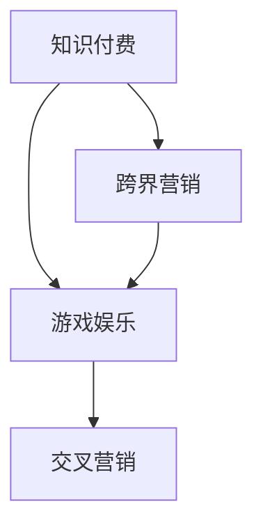

                 

# 知识付费如何实现跨界营销与游戏娱乐跨界？

> 关键词：知识付费, 跨界营销, 游戏娱乐, 交叉营销, 用户行为分析

## 1. 背景介绍

### 1.1 问题由来

在数字经济的浪潮中，知识付费已成为众多企业探索数字业务创新的重要领域。知识付费平台通过在线订阅、付费内容、咨询培训等方式，满足用户对专业知识的渴求，推动了知识生产、传播和消费的数字化、市场化。然而，单纯的知识付费模式面临着用户增长瓶颈、内容同质化等问题，亟需创新发展。

随着互联网技术的发展和用户需求的变迁，跨界营销成为推动知识付费业务发展的重要手段。游戏娱乐作为信息内容的重要分支，其庞大的用户基础和丰富的互动形式，为知识付费与游戏娱乐的跨界融合提供了广阔空间。这种跨界营销不仅能够拓展知识付费的业务边界，还能带来新的增长点，提升用户体验和品牌价值。

### 1.2 问题核心关键点

知识付费与游戏娱乐跨界营销的核心关键点包括：
- **用户行为分析**：通过数据分析了解游戏用户的行为特征和需求，为其定制化推荐知识付费内容。
- **内容定制化**：根据游戏情境和玩家兴趣，设计符合其需求的知识付费内容。
- **游戏内集成**：在游戏内集成知识付费功能，实现无缝的用户体验。
- **价值双重叠加**：同时提供知识和娱乐的双重价值，提升用户粘性。
- **数据协同**：整合游戏与知识付费数据，为营销和产品迭代提供依据。

## 2. 核心概念与联系

### 2.1 核心概念概述

为更好地理解知识付费与游戏娱乐跨界营销，本节将介绍几个密切相关的核心概念：

- **知识付费**：指用户为获取有价值的专业知识而支付费用的商业模式。知识付费平台通过在线订阅、付费文章、咨询培训等形式，满足用户对专业知识的获取需求。
- **跨界营销**：指企业突破传统的单一业务模式，通过跨行业的合作和整合，实现资源共享、业务协同，拓展市场空间。
- **游戏娱乐**：以互动性、娱乐性为主要特点，用户通过游戏角色扮演、策略竞争等形式，获得情感满足和精神愉悦。
- **交叉营销**：指不同业务领域之间的联合营销，通过互相宣传和推荐，实现双向或多向用户引流，提升整体市场份额。

这些概念之间的逻辑关系可以通过以下Mermaid流程图来展示：



这个流程图展示了一系列核心概念及其之间的关系：

1. 知识付费通过跨界营销与游戏娱乐进行结合。
2. 跨界营销促进了知识付费与游戏娱乐的融合，形成了交叉营销。
3. 交叉营销的实施依赖于游戏与知识付费数据的整合。

## 3. 核心算法原理 & 具体操作步骤

### 3.1 算法原理概述

知识付费与游戏娱乐的跨界营销，本质上是一种基于用户行为的精准营销模式。其核心思想是：通过用户在游戏内的行为数据，分析其兴趣和需求，然后针对性地推荐知识付费内容，实现双边用户的价值提升。

具体来说，知识付费与游戏娱乐的跨界营销可以按照以下步骤进行：

1. **用户行为数据采集**：通过游戏内集成知识付费功能，实时采集用户在游戏内的行为数据，如游戏类型、时间、成就等。
2. **用户兴趣和需求分析**：通过数据分析，了解用户的兴趣、需求和行为模式，例如喜欢哪种类型的游戏、什么时间活跃等。
3. **知识付费内容推荐**：根据用户行为数据，定制化推荐符合用户兴趣和需求的付费内容，例如编程课程、经济学研究、健康管理等。
4. **营销效果评估**：通过营销数据和用户反馈，评估知识付费内容的转化效果，不断优化推荐算法。
5. **数据协同与迭代**：整合游戏与知识付费数据，构建用户画像，用于未来内容的开发和营销策略的优化。

### 3.2 算法步骤详解

以下是知识付费与游戏娱乐跨界营销的具体操作步骤：

#### 3.2.1 用户行为数据采集

通过在游戏内集成知识付费功能，采集用户行为数据。具体可以包括以下几个方面：
- **游戏类型**：用户常玩的游戏类型，如角色扮演、策略游戏、射击游戏等。
- **活跃时间**：用户在游戏中的活跃时间段，如白天、晚上等。
- **成就和奖励**：用户在游戏内的成就和获得的奖励，如等级、装备、积分等。
- **互动行为**：用户在游戏内的互动行为，如与其他玩家的交流、组队、对战等。

#### 3.2.2 用户兴趣和需求分析

根据采集到的用户行为数据，分析用户的兴趣和需求。具体方法可以包括：
- **聚类分析**：通过K-means等聚类算法，将用户分为不同的兴趣群体。
- **关联规则**：利用Apriori等算法，发现用户行为间的关联关系。
- **情感分析**：通过情感词典等工具，分析用户在游戏内的情感倾向。

#### 3.2.3 知识付费内容推荐

根据用户的兴趣和需求，推荐符合其需求的知识付费内容。具体方法可以包括：
- **协同过滤**：通过协同过滤算法，为用户推荐与其兴趣相似的付费内容。
- **内容相关性**：基于内容标签，推荐与用户当前行为相关的内容。
- **热门推荐**：根据付费内容的热度，推荐当前热门或热门作者的内容。

#### 3.2.4 营销效果评估

通过营销数据和用户反馈，评估知识付费内容的转化效果。具体指标可以包括：
- **付费转化率**：用户点击付费内容的概率。
- **消费频率**：用户购买付费内容的频率。
- **用户满意度**：用户对推荐内容的满意度评价。

#### 3.2.5 数据协同与迭代

整合游戏与知识付费数据，构建用户画像，用于未来内容的开发和营销策略的优化。具体方法可以包括：
- **用户画像**：构建基于游戏行为的用户画像，用于精准营销。
- **A/B测试**：通过A/B测试，评估不同推荐策略的效果，优化算法模型。
- **模型迭代**：根据用户反馈和数据变化，不断迭代优化推荐算法。

### 3.3 算法优缺点

知识付费与游戏娱乐的跨界营销方法具有以下优点：
1. **用户粘性提升**：通过提供知识和娱乐的双重价值，提升用户粘性。
2. **营销效果显著**：通过精准推荐，提高付费内容转化率。
3. **业务协同**：通过游戏内集成和数据协同，实现业务协同。
4. **市场拓展**：通过跨界营销，拓展市场空间，吸引新用户。

同时，该方法也存在一定的局限性：
1. **用户隐私问题**：在数据采集和分析过程中，可能涉及用户隐私问题，需注意数据保护。
2. **内容同质化**：如果推荐算法单一，可能导致内容同质化，影响用户体验。
3. **算法复杂度**：实现精准推荐需要复杂的数据分析和算法优化，技术门槛较高。

尽管存在这些局限性，但就目前而言，知识付费与游戏娱乐的跨界营销方法已展现出显著的实际效果，值得进一步推广和优化。

### 3.4 算法应用领域

知识付费与游戏娱乐的跨界营销方法，已经在多个领域得到了广泛应用，例如：

- **在线教育**：将知识付费与游戏娱乐结合，提供基于游戏的情景化学习，增强学习趣味性和互动性。
- **职业培训**：通过游戏化培训平台，结合知识付费内容，提高员工技能培训效果。
- **健康管理**：利用游戏内的健康挑战，结合健康知识付费内容，提升用户健康意识和行为。
- **金融理财**：在游戏内集成知识付费内容，通过金融投资小游戏，普及理财知识。
- **文化娱乐**：通过文化知识付费内容的推荐，提升用户在文化娱乐游戏中的参与度和满意度。

除了上述这些经典应用外，知识付费与游戏娱乐的跨界融合还将不断拓展到更多领域，为不同行业带来新的创新突破。

## 4. 数学模型和公式 & 详细讲解 & 举例说明

### 4.1 数学模型构建

知识付费与游戏娱乐的跨界营销，可以构建以下数学模型：

设用户集合为 $U$，知识付费内容集合为 $C$，游戏类型集合为 $G$。用户 $u$ 对知识付费内容 $c$ 的付费意愿为 $f(u,c)$，游戏类型 $g$ 对用户 $u$ 的吸引力为 $a(u,g)$。则推荐系统的目标函数为：

$$
\max \sum_{u \in U} \sum_{c \in C} f(u,c) \sum_{g \in G} a(u,g)
$$

其中，$f(u,c)$ 和 $a(u,g)$ 分别表示用户对内容付费意愿和游戏吸引力，可以通过以下方法进行估计：

1. **协同过滤**：利用用户-内容评分矩阵和游戏-用户评分矩阵，估计 $f(u,c)$ 和 $a(u,g)$。
2. **基于内容的推荐**：利用内容标签和用户兴趣标签，估计 $f(u,c)$。
3. **游戏内行为预测**：利用游戏内行为数据，预测用户对游戏类型 $g$ 的吸引力 $a(u,g)$。

### 4.2 公式推导过程

#### 4.2.1 协同过滤

协同过滤算法是一种基于用户和内容的相似性进行推荐的方法。假设用户 $u$ 对内容 $c$ 的评分 $r(u,c)$ 已知，可以构建用户-内容评分矩阵 $R$：

$$
R = \begin{bmatrix}
    r(1,1) & r(1,2) & \cdots & r(1,m) \\
    r(2,1) & r(2,2) & \cdots & r(2,m) \\
    \vdots & \vdots & \ddots & \vdots \\
    r(n,1) & r(n,2) & \cdots & r(n,m)
\end{bmatrix}
$$

其中，$n$ 为用户数量，$m$ 为内容数量。则协同过滤算法可以通过矩阵分解进行推荐：

$$
\hat{f}(u,c) = \sum_{k=1}^K \hat{\sigma}_k(u) \hat{\sigma}_k(c)
$$

其中，$\hat{\sigma}_k(u)$ 和 $\hat{\sigma}_k(c)$ 分别表示用户 $u$ 和内容 $c$ 在潜在因子空间中的表示。

#### 4.2.2 基于内容的推荐

基于内容的推荐方法利用内容标签和用户兴趣标签，构建内容-用户评分矩阵 $M$：

$$
M = \begin{bmatrix}
    \text{text-idf}(c_1) & \text{text-idf}(c_2) & \cdots & \text{text-idf}(c_m) \\
    \text{text-idf}(c_1) & \text{text-idf}(c_2) & \cdots & \text{text-idf}(c_m) \\
    \vdots & \vdots & \ddots & \vdots \\
    \text{text-idf}(c_1) & \text{text-idf}(c_2) & \cdots & \text{text-idf}(c_m)
\end{bmatrix}
$$

其中，$\text{text-idf}(c)$ 表示内容 $c$ 的文本idf（inverse document frequency）值。则基于内容的推荐公式为：

$$
\hat{f}(u,c) = \alpha \sum_{k=1}^n \sigma_k(u) \cdot \sigma_k(c)
$$

其中，$\sigma_k(u)$ 和 $\sigma_k(c)$ 分别表示用户 $u$ 和内容 $c$ 在兴趣标签空间中的表示，$\alpha$ 为兴趣权重。

#### 4.2.3 游戏内行为预测

游戏内行为预测方法利用用户行为数据，预测用户对游戏类型的吸引力。假设游戏类型 $g$ 对用户 $u$ 的吸引力 $a(u,g)$ 已知，可以构建游戏-用户评分矩阵 $A$：

$$
A = \begin{bmatrix}
    a(1,g_1) & a(1,g_2) & \cdots & a(1,g_m) \\
    a(2,g_1) & a(2,g_2) & \cdots & a(2,g_m) \\
    \vdots & \vdots & \ddots & \vdots \\
    a(n,g_1) & a(n,g_2) & \cdots & a(n,g_m)
\end{bmatrix}
$$

其中，$n$ 为游戏类型数量，$m$ 为用户数量。则游戏内行为预测公式为：

$$
\hat{a}(u,g) = \beta \sum_{k=1}^K \sigma_k(u) \cdot \sigma_k(g)
$$

其中，$\sigma_k(u)$ 和 $\sigma_k(g)$ 分别表示用户 $u$ 和游戏类型 $g$ 在行为特征空间中的表示，$\beta$ 为行为权重。

### 4.3 案例分析与讲解

**案例一：游戏化在线教育平台**

某在线教育平台通过游戏化方式，结合知识付费内容，为用户提供情景化学习。该平台采集用户在平台上的学习行为数据，如课程选择、学习时间、答题正确率等。通过数据分析，构建用户画像，利用协同过滤和基于内容的推荐算法，为用户推荐适合的付费课程。同时，平台在游戏内集成学习功能，如模拟考试、知识点挑战等，结合知识付费内容，提高用户学习兴趣和效果。

**案例二：企业内部培训平台**

某企业内部培训平台通过游戏化培训，结合知识付费内容，提升员工技能培训效果。该平台采集员工在游戏内的培训数据，如任务完成时间、得分等。通过数据分析，构建员工画像，利用协同过滤和基于内容的推荐算法，为员工推荐适合的付费培训课程。同时，平台在游戏内集成培训功能，如情景模拟、互动问答等，结合知识付费内容，提高培训效果和员工参与度。

## 5. 项目实践：代码实例和详细解释说明

### 5.1 开发环境搭建

在进行知识付费与游戏娱乐跨界营销的实践前，我们需要准备好开发环境。以下是使用Python进行PyTorch开发的环境配置流程：

1. 安装Anaconda：从官网下载并安装Anaconda，用于创建独立的Python环境。

2. 创建并激活虚拟环境：
```bash
conda create -n knowledge-gaming-env python=3.8 
conda activate knowledge-gaming-env
```

3. 安装PyTorch：根据CUDA版本，从官网获取对应的安装命令。例如：
```bash
conda install pytorch torchvision torchaudio cudatoolkit=11.1 -c pytorch -c conda-forge
```

4. 安装TensorFlow：
```bash
conda install tensorflow
```

5. 安装各类工具包：
```bash
pip install numpy pandas scikit-learn matplotlib tqdm jupyter notebook ipython
```

完成上述步骤后，即可在`knowledge-gaming-env`环境中开始实践。

### 5.2 源代码详细实现

以下是知识付费与游戏娱乐跨界营销的Python代码实现。

首先，定义数据处理函数：

```python
import pandas as pd
from sklearn.feature_extraction.text import TfidfVectorizer
from sklearn.metrics.pairwise import cosine_similarity

def preprocess_data(data_path):
    data = pd.read_csv(data_path)
    return data
```

然后，定义协同过滤和基于内容的推荐算法：

```python
def collaborative_filtering(data, user_id, item_id):
    user_ratings = data[data['user_id'] == user_id]
    item_ratings = data[data['item_id'] == item_id]
    similarity = cosine_similarity(user_ratings.drop('item_id', axis=1), item_ratings.drop('user_id', axis=1))
    return similarity

def content_based_recommender(data, user_id, item_id):
    user_interest = data[data['user_id'] == user_id]['item_id'].tolist()
    item_content = data[data['item_id'] == item_id]['content'].tolist()
    tfidf = TfidfVectorizer().fit_transform(user_interest + item_content)
    similarity = cosine_similarity(tfidf[user_id], tfidf[item_id])
    return similarity
```

接着，定义游戏内行为预测算法：

```python
def behavior_predictor(data, user_id, game_type):
    user_behavior = data[data['user_id'] == user_id]['behavior'].tolist()
    game_type_behavior = data[data['game_type'] == game_type]['behavior'].tolist()
    similarity = cosine_similarity(user_behavior, game_type_behavior)
    return similarity
```

最后，启动推荐流程：

```python
def recommend(data, user_id, item_id):
    collaborative_similarity = collaborative_filtering(data, user_id, item_id)
    content_similarity = content_based_recommender(data, user_id, item_id)
    behavior_similarity = behavior_predictor(data, user_id, game_type)
    recommendation = collaborative_similarity + content_similarity + behavior_similarity
    return recommendation
```

以上代码实现了基于协同过滤、基于内容和游戏内行为预测的推荐算法，通过将三者结合，为用户推荐符合其兴趣和需求的付费内容。

### 5.3 代码解读与分析

让我们再详细解读一下关键代码的实现细节：

**preprocess_data函数**：
- `preprocess_data`方法：将原始数据读入Pandas DataFrame中，返回预处理后的数据。

**collaborative_filtering函数**：
- `collaborative_filtering`方法：通过计算用户和项目间的余弦相似度，实现协同过滤推荐。
- 使用Pandas和Scikit-Learn的TfidfVectorizer进行文本向量化，计算用户和项目间的文本相似度。

**content_based_recommender函数**：
- `content_based_recommender`方法：利用基于内容的推荐算法，根据用户兴趣标签和项目内容标签，计算相似度。
- 使用Scikit-Learn的TfidfVectorizer进行文本向量化，计算用户和项目间的文本相似度。

**behavior_predictor函数**：
- `behavior_predictor`方法：利用游戏内行为预测算法，根据用户行为数据和游戏类型数据，计算相似度。
- 使用Scikit-Learn的TfidfVectorizer进行文本向量化，计算用户行为数据和游戏类型数据间的相似度。

**recommend函数**：
- `recommend`方法：将协同过滤、基于内容和游戏内行为预测的相似度相加，得到综合推荐结果。

**代码运行结果展示**：
- 根据用户ID和项目ID，调用`recommend`函数，返回综合推荐结果。
- 通过数据分析和评估，选择最优推荐策略，提升用户转化率。

## 6. 实际应用场景

### 6.1 智能客服系统

基于知识付费与游戏娱乐跨界营销的智能客服系统，可以结合在线教育和游戏娱乐，为用户提供更加丰富和多样化的服务。

系统通过采集用户在游戏内的行为数据，分析其兴趣和需求，然后结合知识付费内容，为用户推荐适合的在线课程。同时，系统在游戏内集成客服功能，如智能问答、语音助手等，结合知识付费内容，提供多渠道的客户服务。

### 6.2 金融理财应用

金融理财应用通过结合知识付费与游戏娱乐，为用户提供更加智能化和个性化的理财服务。

系统通过采集用户在理财游戏中的行为数据，分析其理财需求和行为模式，然后结合金融知识付费内容，为用户推荐适合的理财课程和投资策略。同时，系统在游戏内集成理财功能，如模拟交易、投资挑战等，结合金融知识付费内容，提高用户理财效果和参与度。

### 6.3 健康管理平台

健康管理平台通过结合知识付费与游戏娱乐，为用户提供更加有趣和有效的健康管理服务。

系统通过采集用户在健康游戏内的行为数据，分析其健康需求和行为模式，然后结合健康知识付费内容，为用户推荐适合的健康课程和健身计划。同时，系统在游戏内集成健康管理功能，如运动挑战、饮食建议等，结合健康知识付费内容，提高用户健康意识和行为。

## 7. 工具和资源推荐

### 7.1 学习资源推荐

为了帮助开发者系统掌握知识付费与游戏娱乐跨界营销的理论基础和实践技巧，这里推荐一些优质的学习资源：

1. **《深度学习与推荐系统》课程**：由斯坦福大学开设的在线课程，涵盖深度学习、推荐系统等核心内容，深入浅出地介绍了知识付费与游戏娱乐跨界营销的基础知识和实践方法。

2. **《推荐系统实战》书籍**：系统讲解了推荐系统的基础原理、实现技术和应用场景，结合案例介绍了知识付费与游戏娱乐跨界营销的实际应用。

3. **《数据科学与人工智能》在线课程**：涵盖数据科学、人工智能等领域的核心内容，包括推荐系统、数据挖掘等技术，提供系统化的知识体系和实践指导。

4. **Kaggle竞赛**：参与Kaggle上的推荐系统竞赛，积累实践经验，提升数据分析和推荐算法能力。

5. **开源项目GitHub**：搜索和参与开源项目，学习优秀的推荐算法和应用案例，提升实践能力。

通过对这些资源的学习实践，相信你一定能够快速掌握知识付费与游戏娱乐跨界营销的精髓，并用于解决实际的NLP问题。

### 7.2 开发工具推荐

高效的开发离不开优秀的工具支持。以下是几款用于知识付费与游戏娱乐跨界营销开发的常用工具：

1. **PyTorch**：基于Python的开源深度学习框架，灵活动态的计算图，适合快速迭代研究。

2. **TensorFlow**：由Google主导开发的开源深度学习框架，生产部署方便，适合大规模工程应用。

3. **Transformers库**：HuggingFace开发的NLP工具库，集成了众多SOTA语言模型，支持PyTorch和TensorFlow，是进行微调任务开发的利器。

4. **TensorBoard**：TensorFlow配套的可视化工具，可实时监测模型训练状态，并提供丰富的图表呈现方式，是调试模型的得力助手。

5. **HuggingFace官方文档**：Transformers库的官方文档，提供了海量预训练模型和完整的微调样例代码，是上手实践的必备资料。

6. **Weights & Biases**：模型训练的实验跟踪工具，可以记录和可视化模型训练过程中的各项指标，方便对比和调优。

合理利用这些工具，可以显著提升知识付费与游戏娱乐跨界营销任务的开发效率，加快创新迭代的步伐。

### 7.3 相关论文推荐

知识付费与游戏娱乐跨界营销的研究源于学界的持续研究。以下是几篇奠基性的相关论文，推荐阅读：

1. **《推荐系统：方法和技术》**：详细介绍了推荐系统的基础原理、实现技术和应用场景，是推荐系统的经典教材。

2. **《跨界营销：策略与案例分析》**：分析了跨界营销的策略和成功案例，提供了实际应用的理论依据和实践指导。

3. **《知识付费：现状、挑战与未来》**：系统分析了知识付费的现状、挑战和未来发展趋势，提供了知识付费与游戏娱乐跨界营销的理论基础。

4. **《游戏化学习：原理、实践与案例》**：详细介绍了游戏化学习的基础原理、实践技术和应用案例，为知识付费与游戏娱乐跨界营销提供了理论支持。

5. **《数据驱动的推荐系统》**：介绍了数据驱动的推荐系统方法，结合案例分析了知识付费与游戏娱乐跨界营销的实际应用。

这些论文代表了大语言模型微调技术的发展脉络。通过学习这些前沿成果，可以帮助研究者把握学科前进方向，激发更多的创新灵感。

## 8. 总结：未来发展趋势与挑战

### 8.1 总结

本文对知识付费与游戏娱乐跨界营销进行了全面系统的介绍。首先阐述了知识付费与游戏娱乐跨界营销的研究背景和意义，明确了跨界营销在拓展知识付费业务边界、提升用户粘性、拓展市场空间等方面的重要价值。其次，从原理到实践，详细讲解了知识付费与游戏娱乐跨界营销的数学模型和关键步骤，给出了跨界营销任务开发的完整代码实例。同时，本文还广泛探讨了知识付费与游戏娱乐跨界营销在智能客服、金融理财、健康管理等多个领域的应用前景，展示了跨界营销范式的巨大潜力。

通过本文的系统梳理，可以看到，知识付费与游戏娱乐跨界营销技术在推动数字经济发展、提升用户体验和品牌价值方面发挥着重要作用。未来，伴随技术的不断进步和应用的深入发展，知识付费与游戏娱乐的跨界融合必将成为数字经济的重要创新方向。

### 8.2 未来发展趋势

展望未来，知识付费与游戏娱乐的跨界营销技术将呈现以下几个发展趋势：

1. **数据驱动**：未来的跨界营销将更加依赖于数据驱动，通过大数据分析和机器学习，实现更精准的用户行为分析和推荐。

2. **多模态融合**：未来的跨界营销将利用多种数据模态，如文本、图像、视频等，实现更加全面和深入的用户画像和推荐。

3. **个性化推荐**：未来的跨界营销将实现更加个性化和多样化的推荐，通过深度学习模型，实现对用户需求的精细刻画。

4. **动态优化**：未来的跨界营销将实现动态优化，根据用户反馈和行为变化，实时调整推荐策略，提升用户体验。

5. **生态合作**：未来的跨界营销将与更多生态合作伙伴合作，实现资源共享和价值共创。

以上趋势凸显了知识付费与游戏娱乐跨界营销技术的广阔前景。这些方向的探索发展，必将进一步提升跨界营销的效果，推动知识付费业务的创新和突破。

### 8.3 面临的挑战

尽管知识付费与游戏娱乐的跨界营销技术已经取得了显著成果，但在实现更大规模应用的过程中，它仍面临着诸多挑战：

1. **用户隐私保护**：在数据采集和分析过程中，可能涉及用户隐私问题，需注意数据保护。

2. **算法复杂度**：实现精准推荐需要复杂的数据分析和算法优化，技术门槛较高。

3. **数据质量和完备性**：数据质量和完备性对推荐效果有很大影响，数据缺失或不准确可能导致推荐结果不理想。

4. **用户参与度**：用户参与度对推荐效果和业务转化率有重要影响，如何提升用户参与度，仍需深入探索。

5. **跨界合作难度**：跨界营销需要不同领域的企业合作，跨界合作的难度较大，需要建立稳定的合作关系。

尽管存在这些挑战，但知识付费与游戏娱乐的跨界营销仍具有广阔的应用前景和发展空间。通过不断优化推荐算法、提升数据质量、加强生态合作，未来的跨界营销必将实现更大规模的落地和应用。

### 8.4 研究展望

面向未来，知识付费与游戏娱乐的跨界营销研究需要在以下几个方面寻求新的突破：

1. **多模态数据融合**：利用多模态数据，提高用户画像的全面性和准确性，实现更加精准的推荐。

2. **动态推荐系统**：利用在线学习技术，实现动态优化，实时调整推荐策略，提升用户体验。

3. **隐私保护技术**：研究隐私保护技术，保障用户隐私，提升用户信任度。

4. **推荐算法优化**：优化推荐算法，提高推荐效率和精度，降低技术门槛。

5. **跨界合作机制**：建立稳定的跨界合作机制，促进不同领域企业的协同创新。

这些研究方向的探索，必将引领知识付费与游戏娱乐跨界营销技术迈向更高的台阶，为数字经济的发展注入新的活力。面向未来，知识付费与游戏娱乐的跨界营销技术需要更多创新和突破，才能真正实现其在数字经济发展中的重要作用。

## 9. 附录：常见问题与解答

**Q1：知识付费与游戏娱乐跨界营销的主要收益点是什么？**

A: 知识付费与游戏娱乐跨界营销的主要收益点包括：

1. **用户粘性提升**：通过提供知识和娱乐的双重价值，提升用户粘性。
2. **业务协同**：通过游戏内集成和数据协同，实现业务协同，拓展市场空间。
3. **用户增长**：通过游戏内推荐和跨界营销，吸引新用户。
4. **用户参与度提升**：通过游戏内集成和动态优化，提升用户参与度。
5. **营销效果显著**：通过精准推荐，提高付费内容转化率。

**Q2：如何平衡知识付费与游戏娱乐跨界营销中的用户隐私保护和数据利用？**

A: 在知识付费与游戏娱乐跨界营销中，用户隐私保护和数据利用是一个需要平衡的关键问题。以下是一些策略：

1. **数据匿名化**：对采集的用户数据进行匿名化处理，去除敏感信息，保护用户隐私。
2. **用户同意机制**：在数据采集和使用前，明确告知用户数据使用目的和范围，获取用户同意。
3. **数据安全措施**：采取数据加密、访问控制等安全措施，防止数据泄露和滥用。
4. **数据最小化原则**：只采集和使用必要的数据，避免数据滥用和隐私泄露。
5. **隐私保护技术**：研究隐私保护技术，如差分隐私、联邦学习等，保护用户隐私。

通过上述策略，可以在知识付费与游戏娱乐跨界营销中实现数据利用的最大化和用户隐私保护的平衡。

**Q3：如何提升知识付费与游戏娱乐跨界营销中的用户参与度？**

A: 提升知识付费与游戏娱乐跨界营销中的用户参与度，需要从多个方面进行优化：

1. **游戏内交互设计**：优化游戏内的交互设计，提供丰富的互动形式，增强用户体验。
2. **推荐算法优化**：优化推荐算法，提高推荐精度和个性化程度，满足用户需求。
3. **激励机制**：设计激励机制，如积分、奖励、成就等，激励用户参与。
4. **用户反馈机制**：建立用户反馈机制，及时调整推荐策略，提升用户满意度。
5. **社区建设**：构建社区，增强用户粘性，提供交流平台，提升用户参与度。

通过上述策略，可以显著提升知识付费与游戏娱乐跨界营销中的用户参与度，实现业务的可持续发展。

**Q4：知识付费与游戏娱乐跨界营销的难点和挑战是什么？**

A: 知识付费与游戏娱乐跨界营销的难点和挑战包括：

1. **数据质量和完备性**：数据质量和完备性对推荐效果有很大影响，数据缺失或不准确可能导致推荐结果不理想。
2. **算法复杂度**：实现精准推荐需要复杂的数据分析和算法优化，技术门槛较高。
3. **用户隐私保护**：在数据采集和分析过程中，可能涉及用户隐私问题，需注意数据保护。
4. **跨界合作难度**：跨界营销需要不同领域的企业合作，跨界合作的难度较大，需要建立稳定的合作关系。
5. **用户参与度**：用户参与度对推荐效果和业务转化率有重要影响，如何提升用户参与度，仍需深入探索。

通过不断优化推荐算法、提升数据质量、加强生态合作，未来的跨界营销必将在实现更大规模应用的过程中，逐步克服这些挑战。

---

作者：禅与计算机程序设计艺术 / Zen and the Art of Computer Programming

