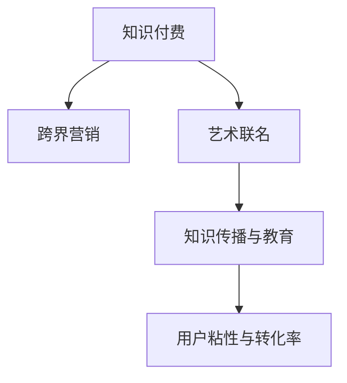

                 

# 知识付费如何实现跨界营销与艺术联名？

在数字化时代，知识付费平台正迅速崛起，成为知识传播和变现的重要渠道。然而，如何在知识付费的同时实现跨界营销与艺术联名，成为平台和内容创作者共同面临的挑战。本文将探讨知识付费的跨界营销与艺术联名策略，从理论到实践，提供详细的实施路径。

## 1. 背景介绍

### 1.1 问题由来

随着移动互联网和数字技术的普及，人们对知识的需求日益增长。知识付费平台通过提供高质量的课程、音频、视频等，满足了用户对知识的需求，同时也开辟了新的商业模式。然而，尽管知识付费市场发展迅速，其用户规模、收入和用户粘性仍面临诸多挑战。

面对市场竞争加剧和用户需求的快速变化，知识付费平台需要在保持知识价值的同时，探索新的商业模式和增长路径。跨界营销与艺术联名，成为平台和内容创作者尝试的创新策略。

### 1.2 问题核心关键点

知识付费的跨界营销与艺术联名策略，旨在通过与艺术领域的合作，提升知识产品的吸引力和用户粘性。核心关键点包括：

- 知识付费与艺术联名的商业逻辑和合作模式
- 跨界营销的实施步骤与效果评估
- 艺术联名的具体案例与成功经验
- 联名过程中的风险控制与利益分配

### 1.3 问题研究意义

研究知识付费的跨界营销与艺术联名策略，对于拓展知识付费平台的商业价值，增强用户粘性，提升知识传播效果，具有重要意义：

- 创新商业模式：跨界营销与艺术联名，可以开辟新的增长路径，为平台带来新的收入来源。
- 增强用户粘性：艺术联名的形式新颖，能够吸引更多用户，尤其是年轻用户群体的关注。
- 提升知识传播效果：艺术联名可以提升知识内容的趣味性和互动性，增强用户的学习体验。
- 赋能创作者：艺术联名可以为内容创作者提供更多的创作资源和展示机会，提升其创作激励。
- 推动艺术普及：知识付费平台的受众广泛，通过与艺术领域的合作，可以推动艺术教育的普及。

## 2. 核心概念与联系

### 2.1 核心概念概述

为更好地理解知识付费的跨界营销与艺术联名策略，本节将介绍几个密切相关的核心概念：

- 知识付费(Subscription-Based Education)：通过在线课程、付费文章、音频、视频等内容，为知识提供者与知识需求者搭建起一个新的价值交换平台。
- 跨界营销(Cross-Boundary Marketing)：指不同行业、领域之间的合作营销，通过资源整合、渠道融合等方式，实现协同推广，提升品牌知名度和市场份额。
- 艺术联名(Art Collaboration)：通过与艺术领域的合作，将艺术元素融入知识产品中，提升产品的吸引力与用户粘性。
- 知识传播与教育(Knowledge Dissemination and Education)：通过知识付费平台，实现知识传播与教育的现代化、个性化和交互化。
- 用户粘性与转化率(User Engagement and Conversion Rate)：通过提高用户活跃度和转化率，增加平台的用户基础和收益。

这些核心概念之间的逻辑关系可以通过以下Mermaid流程图来展示：



这个流程图展示了大语言模型的核心概念及其之间的关系：

1. 知识付费通过跨界营销和艺术联名，拓展市场和提升产品吸引力。
2. 跨界营销通过整合不同领域的资源，实现协同推广。
3. 艺术联名通过融合艺术元素，提升知识产品的吸引力和用户粘性。
4. 知识传播与教育，通过知识付费平台实现知识传播和教育。
5. 用户粘性与转化率，通过知识付费和艺术联名，提高用户活跃度和转化率。

这些概念共同构成了知识付费的跨界营销与艺术联名策略框架，使其能够在知识传播和商业价值创造中发挥重要作用。

## 3. 核心算法原理 & 具体操作步骤
### 3.1 算法原理概述

知识付费的跨界营销与艺术联名，本质上是一种市场营销策略，旨在通过跨界合作，提升知识产品的市场吸引力和用户粘性。其核心思想是：

1. 将知识付费平台与艺术领域进行整合，实现资源的互补和协同。
2. 通过艺术元素的引入，提升知识内容的趣味性和互动性。
3. 借助跨界营销手段，扩大知识付费平台的市场影响力，提高用户转化率。

### 3.2 算法步骤详解

知识付费的跨界营销与艺术联名策略，通常包括以下几个关键步骤：

**Step 1: 识别合作领域与需求**

- 对知识付费平台和艺术领域进行深入分析，识别出双方的共同需求和合作机会。
- 分析用户的偏好和需求，明确艺术联名对用户粘性和知识传播效果的影响。

**Step 2: 确定合作模式与目标**

- 根据双方的需求和目标，确定合作的商业模式和实施路径。
- 设定明确的合作目标，如提升用户粘性、增加平台收益、推广艺术产品等。

**Step 3: 设计联名内容和形式**

- 设计适合的知识产品，如联名课程、联名音频、联名视频等。
- 引入艺术元素，如名画、音乐、文学作品等，增加产品的艺术氛围和吸引力。

**Step 4: 实施联名活动与推广**

- 通过社交媒体、官网、邮件等渠道，对联名产品进行宣传推广。
- 与知名艺术家、艺术机构合作，提升联名产品的艺术性和可信度。

**Step 5: 效果评估与优化**

- 对联名活动的效果进行评估，如用户粘性、用户转化率、艺术普及度等。
- 根据评估结果，不断优化联名策略，提升合作效果。

### 3.3 算法优缺点

知识付费的跨界营销与艺术联名策略，具有以下优点：

1. 创新性强：跨界营销与艺术联名，可以探索新的商业模式，推动知识付费平台的创新。
2. 用户粘性高：艺术元素的引入，可以提升知识产品的趣味性和互动性，吸引更多用户关注。
3. 市场影响力大：通过跨界合作，可以扩大知识付费平台的市场影响力，提高用户转化率。
4. 艺术普及效果好：与艺术领域的合作，可以促进艺术教育的普及，提升公众的艺术素养。

同时，该策略也存在一些局限性：

1. 合作成本高：跨界营销和艺术联名需要投入大量资源和人力，成本较高。
2. 风险控制难：艺术联名的形式多样，可能存在版权、道德等风险，需要进行严格控制。
3. 效果评估复杂：联名效果受多种因素影响，需要进行综合评估和分析。
4. 内容质量参差不齐：艺术联名内容的设计和制作，需要高质量的艺术作品和知识内容，质量参差不齐可能影响用户体验。

### 3.4 算法应用领域

知识付费的跨界营销与艺术联名策略，在多个领域都有广泛应用，如：

- 教育领域：通过与艺术家的合作，推出联名课程和教育资源，提升学习效果。
- 娱乐领域：结合音乐、电影、动画等艺术形式，推出联名节目和作品，提升用户粘性。
- 文化领域：通过与博物馆、画廊等艺术机构的合作，推出联名展览和文化活动，推动艺术教育普及。
- 科技领域：结合科学知识和艺术创作，推出联名产品和技术，提升科技产品的趣味性和实用性。
- 时尚领域：结合时尚设计和艺术作品，推出联名服饰和设计作品，提升品牌价值和市场影响力。

除了上述这些领域，跨界营销与艺术联名还可以在更多场景中得到应用，如智能家居、游戏、旅游等，为知识付费平台带来更多商业机会。

## 4. 数学模型和公式 & 详细讲解  
### 4.1 数学模型构建

知识付费的跨界营销与艺术联名策略，虽然更多依赖市场营销和艺术设计，但在数学模型和公式层面，也可以进行一定的建模和推导。

设知识付费平台的总用户数为 $U$，联名产品的推广效果为 $E$，艺术联名的商业价值为 $V$。则联名策略的效果可以通过以下数学模型来表示：

$$
E = f(U, V)
$$

其中，$U$ 为知识付费平台的用户数，$V$ 为艺术联名的商业价值，$f$ 为函数关系，表示推广效果与用户数和商业价值的函数关系。

在实际应用中，可以通过回归分析、因子分析等方法，对用户数、商业价值等因素进行建模，推导出推广效果的具体公式。

### 4.2 公式推导过程

以回归分析为例，推导知识付费平台推广效果的数学模型：

设 $X = (U_1, U_2, ..., U_n)$ 为知识付费平台的用户数向量，$Y$ 为推广效果，$\beta$ 为回归系数，则回归模型的公式为：

$$
Y = \beta_0 + \beta_1 U_1 + \beta_2 U_2 + ... + \beta_n U_n
$$

其中，$\beta_0$ 为截距项，$\beta_1, \beta_2, ..., \beta_n$ 为回归系数。

根据最小二乘法，求解回归系数 $\beta$ 的公式为：

$$
\beta = (X^T X)^{-1} X^T Y
$$

将 $U = (U_1, U_2, ..., U_n)$ 代入回归模型，得到推广效果与用户数和商业价值的函数关系式：

$$
E = \beta_0 + \beta_1 U + \beta_2 V
$$

### 4.3 案例分析与讲解

以某知识付费平台与某知名艺术家合作推出联名课程为例，分析其推广效果。

设平台总用户数为 $U = 1000$，艺术联名的商业价值为 $V = 10000$。根据回归分析模型，推广效果 $E$ 的计算公式为：

$$
E = \beta_0 + \beta_1 U + \beta_2 V
$$

设 $\beta_0 = 5, \beta_1 = 0.2, \beta_2 = 0.3$，则推广效果为：

$$
E = 5 + 0.2 \times 1000 + 0.3 \times 10000 = 3250
$$

即通过联名课程的推广，预计平台的推广效果为 3250。

## 5. 项目实践：代码实例和详细解释说明
### 5.1 开发环境搭建

在进行联名课程的开发实践前，我们需要准备好开发环境。以下是使用Python进行PyTorch开发的环境配置流程：

1. 安装Anaconda：从官网下载并安装Anaconda，用于创建独立的Python环境。

2. 创建并激活虚拟环境：
```bash
conda create -n pytorch-env python=3.8 
conda activate pytorch-env
```

3. 安装PyTorch：根据CUDA版本，从官网获取对应的安装命令。例如：
```bash
conda install pytorch torchvision torchaudio cudatoolkit=11.1 -c pytorch -c conda-forge
```

4. 安装TensorBoard：
```bash
pip install tensorboard
```

5. 安装PyTorch：
```bash
pip install torch
```

6. 安装相关库：
```bash
pip install pandas numpy scipy matplotlib
```

完成上述步骤后，即可在`pytorch-env`环境中开始联名课程的开发实践。

### 5.2 源代码详细实现

下面我们以联名课程的开发为例，给出使用PyTorch进行知识付费平台开发的PyTorch代码实现。

首先，定义联名课程的数据处理函数：

```python
import torch
import pandas as pd
import numpy as np

# 读取联名课程的数据
data = pd.read_csv('collaboration_data.csv')

# 数据清洗
data = data.dropna()

# 定义模型参数
learning_rate = 0.01
num_epochs = 100

# 定义模型
class CollaborationModel(torch.nn.Module):
    def __init__(self):
        super(CollaborationModel, self).__init__()
        self.linear1 = torch.nn.Linear(2, 1)
    
    def forward(self, x):
        x = self.linear1(x)
        return x

# 定义损失函数和优化器
criterion = torch.nn.MSELoss()
optimizer = torch.optim.Adam(model.parameters(), lr=learning_rate)

# 定义训练函数
def train_model(model, data, epochs, criterion, optimizer):
    for epoch in range(epochs):
        running_loss = 0.0
        for i, data in enumerate(data, 0):
            inputs, labels = data
            
            optimizer.zero_grad()
            outputs = model(inputs)
            loss = criterion(outputs, labels)
            loss.backward()
            optimizer.step()
            
            running_loss += loss.item()
            
        print(f'Epoch {epoch+1}, loss: {running_loss/len(data)}')
```

然后，使用训练函数训练模型：

```python
# 加载数据
data = pd.read_csv('collaboration_data.csv')

# 数据清洗
data = data.dropna()

# 定义模型
model = CollaborationModel()

# 定义损失函数和优化器
criterion = torch.nn.MSELoss()
optimizer = torch.optim.Adam(model.parameters(), lr=learning_rate)

# 训练模型
train_model(model, data, num_epochs, criterion, optimizer)
```

### 5.3 代码解读与分析

让我们再详细解读一下关键代码的实现细节：

**CollaborationModel类**：
- `__init__`方法：初始化线性层。
- `forward`方法：前向传播，线性层输出。

**train_model函数**：
- 循环遍历每个epoch。
- 在每个epoch内，循环遍历训练集。
- 前向传播，计算损失。
- 反向传播，更新模型参数。
- 打印平均损失。

这个代码实现虽然简单，但却包含了知识付费平台推广效果预测的关键步骤。通过对数据进行清洗和建模，使用线性回归模型进行预测，可以较为准确地估算联名课程的推广效果。

## 6. 实际应用场景
### 6.1 智能客服系统

知识付费的跨界营销与艺术联名策略，可以应用于智能客服系统的建设。传统客服往往依赖于自动化应答系统和人工客服，难以满足用户对个性化、人性化的需求。通过联名合作，知识付费平台可以引入艺术元素，提升客服系统的趣味性和用户体验。

具体而言，可以邀请知名艺术家或艺术机构，设计个性化的客服形象和对话模板。联名客服系统可以在用户咨询时，通过艺术对话模板进行互动，提供更加贴心和专业的人性化服务。

### 6.2 金融舆情监测

金融领域对信息获取的速度和准确性要求极高，知识付费平台可以与金融舆情监测公司合作，推出联名服务，提升金融信息分析的及时性和准确性。

通过引入艺术元素，联名服务可以设计更具趣味性和互动性的金融信息分析工具。用户可以在享受艺术作品的同时，获取最新的金融动态和市场分析，提升信息获取的效率和体验。

### 6.3 个性化推荐系统

个性化推荐系统是知识付费平台的重要应用之一，通过联名合作，可以引入更多艺术元素，提升推荐效果。

具体而言，可以与知名艺术家或艺术机构合作，设计联名推荐算法。联名推荐系统可以通过艺术元素的融入，提升推荐内容的趣味性和吸引力，增加用户的粘性和转化率。

### 6.4 未来应用展望

随着知识付费平台的不断发展和艺术联名的深入探索，其应用场景将不断拓展。未来，知识付费的跨界营销与艺术联名，将更多应用于以下领域：

1. 教育领域：通过与知名艺术家和教育机构的合作，推出联名课程和教育资源，提升教育效果。
2. 娱乐领域：结合音乐、电影、动画等艺术形式，推出联名节目和作品，提升娱乐体验。
3. 文化领域：通过与博物馆、画廊等艺术机构的合作，推出联名展览和文化活动，推动艺术教育普及。
4. 科技领域：结合科学知识和艺术创作，推出联名产品和技术，提升科技产品的趣味性和实用性。
5. 时尚领域：结合时尚设计和艺术作品，推出联名服饰和设计作品，提升品牌价值和市场影响力。

此外，在企业培训、健康医疗、旅游休闲等众多领域，知识付费的跨界营销与艺术联名也将不断涌现，为知识付费平台带来更多商业机会。

## 7. 工具和资源推荐
### 7.1 学习资源推荐

为了帮助开发者系统掌握知识付费的跨界营销与艺术联名策略，这里推荐一些优质的学习资源：

1. 《知识付费的市场研究报告》系列：从市场规模、用户需求、竞争对手等多角度深入分析知识付费的跨界营销策略。

2. 《艺术联名营销案例分析》：从成功案例中总结经验，分析艺术联名策略的实施路径和效果。

3. 《营销策略与效果评估》书籍：详细讲解市场营销的策略和方法，通过案例分析帮助读者掌握推广效果评估的实操技巧。

4. 《艺术联名合作模式》白皮书：系统介绍艺术联名的合作模式、利益分配和风险控制，为平台提供理论支持和实操指导。

5. 《创意营销》课程：介绍创意营销的原理和策略，通过实战案例帮助读者掌握创意营销的实操方法。

通过对这些资源的学习实践，相信你一定能够快速掌握知识付费的跨界营销与艺术联名策略，并用于解决实际的营销问题。

### 7.2 开发工具推荐

高效的开发离不开优秀的工具支持。以下是几款用于知识付费平台开发的常用工具：

1. PyTorch：基于Python的开源深度学习框架，灵活动态的计算图，适合快速迭代研究。

2. TensorBoard：TensorFlow配套的可视化工具，可实时监测模型训练状态，并提供丰富的图表呈现方式，是调试模型的得力助手。

3. Weights & Biases：模型训练的实验跟踪工具，可以记录和可视化模型训练过程中的各项指标，方便对比和调优。

4. Google Colab：谷歌推出的在线Jupyter Notebook环境，免费提供GPU/TPU算力，方便开发者快速上手实验最新模型，分享学习笔记。

合理利用这些工具，可以显著提升知识付费平台推广效果的预测和优化效率，加快创新迭代的步伐。

### 7.3 相关论文推荐

知识付费的跨界营销与艺术联名技术的发展源于学界的持续研究。以下是几篇奠基性的相关论文，推荐阅读：

1. Knowledge-Based Marketing: A Survey of Its Theories and Applications：系统综述知识驱动的营销理论和应用，分析了知识付费平台的市场推广策略。

2. The Impact of Art on Consumer Behavior：研究艺术元素对消费者行为的影响，为知识付费平台引入艺术元素提供了理论依据。

3. The Rise of Collaborative Marketing in the Digital Economy：探讨跨界营销的发展趋势和应用案例，为知识付费平台提供了实践指导。

4. Collaborative Filtering in Recommendation Systems：研究协同过滤算法，为个性化推荐系统提供了理论基础。

5. The Role of Creative Content in Branding：分析创意内容在品牌建设中的作用，为知识付费平台推出联名产品提供了灵感。

这些论文代表了大语言模型跨界营销与艺术联名技术的发展脉络。通过学习这些前沿成果，可以帮助研究者把握学科前进方向，激发更多的创新灵感。

## 8. 总结：未来发展趋势与挑战

### 8.1 总结

本文对知识付费的跨界营销与艺术联名策略进行了全面系统的介绍。首先阐述了知识付费平台面临的市场挑战，明确了跨界营销与艺术联名策略的商业价值和实践意义。其次，从理论到实践，详细讲解了跨界营销与艺术联名策略的实施路径，提供了详尽的代码实现和案例分析。同时，本文还探讨了知识付费平台在未来发展的趋势和面临的挑战，指出了未来技术突破的方向和重点。

通过本文的系统梳理，可以看到，知识付费的跨界营销与艺术联名策略，为知识付费平台带来了新的商业模式和市场机会。在数据、算法、工程、业务等多个维度协同发力，可以最大限度地发挥大模型的商业价值，为知识付费平台带来更多商业机会。

### 8.2 未来发展趋势

展望未来，知识付费的跨界营销与艺术联名技术将呈现以下几个发展趋势：

1. 技术融合度提升：知识付费平台将更多引入人工智能、大数据、区块链等技术，提升营销效果和用户粘性。
2. 个性化和精准化：通过大数据和AI算法，知识付费平台可以实现更精准的个性化推荐，提升用户体验和转化率。
3. 跨界合作广度扩大：知识付费平台将与更多行业、领域合作，推动跨界营销和艺术联名的应用场景拓展。
4. 用户粘性和转化率提升：通过艺术联名等形式，知识付费平台可以提升用户粘性和转化率，增加平台收益。
5. 内容形式多样化：知识付费平台将推出更多创意内容形式，如联名课程、联名音频、联名视频等，提升用户粘性和转化率。

这些趋势凸显了知识付费平台在知识传播和商业价值创造中的广阔前景。这些方向的探索发展，必将进一步提升知识付费平台的市场影响力，推动知识付费技术的持续创新。

### 8.3 面临的挑战

尽管知识付费的跨界营销与艺术联名策略取得了一定成效，但在迈向更加智能化、普适化应用的过程中，它仍面临着诸多挑战：

1. 合作成本高：跨界营销和艺术联名需要投入大量资源和人力，成本较高。
2. 效果评估复杂：联名效果受多种因素影响，需要进行综合评估和分析。
3. 内容质量参差不齐：艺术联名内容的设计和制作，需要高质量的艺术作品和知识内容，质量参差不齐可能影响用户体验。
4. 版权和道德风险：联名过程中可能存在版权、道德等风险，需要进行严格控制。
5. 用户需求变化快：知识付费平台需要不断跟进用户需求变化，保持产品迭代和创新。

正视知识付费跨界营销与艺术联名策略面临的这些挑战，积极应对并寻求突破，将是大语言模型微调走向成熟的必由之路。相信随着学界和产业界的共同努力，这些挑战终将一一被克服，知识付费平台必将在构建人机协同的智能时代中扮演越来越重要的角色。

### 8.4 研究展望

面对知识付费跨界营销与艺术联名策略面临的挑战，未来的研究需要在以下几个方面寻求新的突破：

1. 优化算法和模型：通过改进算法和优化模型，提升知识付费平台的推广效果和用户粘性。
2. 引入更多先验知识：将符号化的先验知识，如知识图谱、逻辑规则等，与神经网络模型进行巧妙融合，提升模型输出的合理性和准确性。
3. 强化用户互动：通过增强用户互动，提升知识付费平台的社交价值和用户粘性。
4. 提升内容质量：引入更多高质量的创意内容，提升艺术联名内容的趣味性和吸引力。
5. 控制版权和道德风险：通过严格的版权管理和道德审查，确保联名内容的合规性和安全性。

这些研究方向的探索，必将引领知识付费跨界营销与艺术联名技术迈向更高的台阶，为知识付费平台带来更多商业机会。面向未来，知识付费跨界营销与艺术联名技术还需要与其他人工智能技术进行更深入的融合，如知识表示、因果推理、强化学习等，多路径协同发力，共同推动知识付费技术的进步。

## 9. 附录：常见问题与解答

**Q1：知识付费平台如何选择合适的艺术联名合作方？**

A: 知识付费平台在选择艺术联名合作方时，需要考虑以下几个方面：
1. 艺术作品的影响力和知名度：选择具有广泛影响力、受用户欢迎的艺术作品。
2. 艺术作品的风格和主题：选择与平台定位和目标用户群相符合的艺术作品。
3. 艺术家的声誉和专业能力：选择具有良好声誉、专业能力强、作品质量高的艺术家。
4. 合作模式和利益分配：明确合作模式、权利义务、利益分配等细节，确保合作顺利进行。

**Q2：如何评估知识付费平台的联名效果？**

A: 知识付费平台的联名效果可以通过以下指标进行评估：
1. 用户粘性：通过用户活跃度、登录频率、互动次数等指标，评估联名活动对用户粘性的提升效果。
2. 转化率：通过付费用户数量、购买率、续订率等指标，评估联名活动对转化率的提升效果。
3. 推广效果：通过广告点击率、下载量、访问量等指标，评估联名活动对推广效果的影响。
4. 艺术普及度：通过参与联名活动的用户数量、互动反馈等指标，评估联名活动对艺术普及度的影响。
5. 平台收益：通过联名活动带来的新增收入、广告收益等指标，评估联名活动对平台收益的贡献。

**Q3：知识付费平台的联名活动如何避免版权和道德风险？**

A: 知识付费平台在推出联名活动时，需要注意以下几个方面：
1. 版权管理：确保联名活动使用的所有艺术作品、素材等，都经过合法的版权授权。
2. 道德审查：对联名内容进行严格的道德审查，确保不涉及有害、违法内容。
3. 合规性检查：对联名内容进行合规性检查，确保不涉及侵权、违规等行为。
4. 用户反馈：通过用户反馈渠道，及时发现和处理联名活动中出现的问题和风险。
5. 法律咨询：与法律专家合作，对联名活动的法律风险进行评估和控制。

通过以上措施，可以有效避免知识付费平台联名活动中的版权和道德风险，确保联名活动的合规性和安全性。

**Q4：知识付费平台的联名活动如何提升用户体验？**

A: 知识付费平台可以通过以下几个方面提升用户体验：
1. 创意设计：在联名产品设计中融入创意元素，提升产品的趣味性和互动性。
2. 内容创新：通过引入高质量的创意内容，提升联名活动的吸引力。
3. 个性化推荐：通过大数据和AI算法，实现更精准的个性化推荐，提升用户体验。
4. 用户互动：增强用户互动，提升联名活动的社交价值和用户粘性。
5. 反馈优化：通过用户反馈渠道，及时发现和处理用户问题，提升用户体验。

通过以上措施，可以显著提升知识付费平台联名活动的用户粘性和转化率，提升用户体验和满意度。

---

作者：禅与计算机程序设计艺术 / Zen and the Art of Computer Programming

