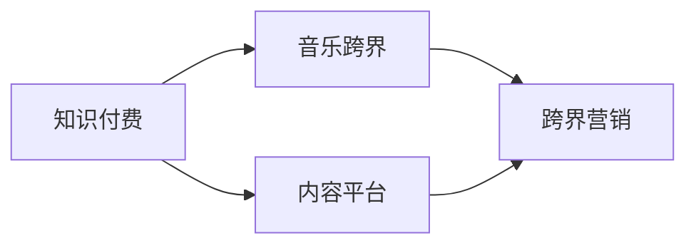

                 

# 知识付费如何实现跨界营销与音乐跨界？

## 1. 背景介绍

随着互联网技术的迅猛发展和智能手机的普及，知识付费市场正在快速发展，各种在线教育平台和内容提供商逐渐崛起。这些平台提供丰富的课程内容，涵盖从语言学习、职业技能、医学知识到健身指导等诸多领域。然而，单一的知识付费内容难以吸引和满足更多元化的用户需求，而音乐作为一种强情感、强社交的文化产品，不仅能提高用户的参与度，还可以为知识付费业务提供新的流量增长点。本文将探讨知识付费与音乐跨界营销的可行性，并给出具体实践方案。

## 2. 核心概念与联系

### 2.1 核心概念概述

- **知识付费**：指消费者为获取特定知识或技能，向提供方支付一定费用的经济行为。常见的知识付费形式包括在线课程、付费文章、音频讲座等。

- **跨界营销**：指不同领域、不同业态之间的商业互动，通过资源整合和协同效应，以提升品牌影响力和市场竞争力。

- **音乐跨界**：音乐与其他文化产品的交叉融合，如与影视、游戏、旅游、图书、服饰等结合，创造新的产品形态和商业模式。

这些概念的联系在于，音乐作为一种文化艺术产品，其影响力已经超出了原有的音乐领域，成为跨界营销的重要工具。通过将音乐与知识付费结合，可以实现知识传播和消费的全新方式，从而提升品牌知名度和用户粘性。

### 2.2 核心概念原理和架构的 Mermaid 流程图



此图展示了知识付费与音乐跨界营销的互动关系：

- 知识付费平台（A）生产高质量的知识内容（B），吸引用户付费。
- 音乐跨界（C）与知识付费（A）结合，产生新的产品或服务。
- 跨界营销（D）将新产生的音乐产品推广到知识付费平台（B）上，吸引更多用户参与。

## 3. 核心算法原理 & 具体操作步骤

### 3.1 算法原理概述

知识付费与音乐跨界的结合，可以通过以下步骤进行：

1. **用户画像分析**：通过分析用户的听歌历史、偏好、消费习惯等数据，了解用户需求。
2. **内容推荐算法**：根据用户画像，推荐与其兴趣相符的知识付费内容。
3. **音乐版权合作**：与音乐版权方合作，获取音乐版权，制作专属音乐内容。
4. **定制化音乐内容**：根据知识付费内容特点，定制化创作音乐，增强内容的传播效果。
5. **跨界营销策略**：通过社交媒体、视频平台等渠道推广定制化音乐内容，提升品牌影响力。

### 3.2 算法步骤详解

**Step 1：用户画像分析**

使用用户数据分析算法，从用户的听歌历史、听歌时长、喜好标签等数据中提取出用户画像。例如：

- 分析用户常听的流派、歌手、时间段等，找出用户兴趣点。
- 对用户的听歌时长、频率进行统计分析，了解其活跃度和消费习惯。

**Step 2：内容推荐算法**

利用协同过滤、基于内容的推荐算法，推荐与用户画像相符的知识付费内容：

- 协同过滤算法：基于用户之间相似度计算，推荐热门课程或类似用户喜欢的内容。
- 基于内容的推荐算法：根据课程标签、目录结构等信息，匹配用户兴趣点。

**Step 3：音乐版权合作**

与音乐版权方合作，获取相关音乐版权，如音频、视频、MV等，制作专属音乐内容。例如：

- 与知名歌手或乐队合作，为其制作课程主题曲。
- 购买高质量的背景音乐或原创音乐，用于视频课程的制作。

**Step 4：定制化音乐内容**

根据知识付费内容特点，定制化创作音乐，增强内容的传播效果：

- 课程主题曲：为每门课程设计专属主题曲，使其成为课程品牌的标志。
- 背景音乐：在视频课程中插入背景音乐，增加课程的吸引力和沉浸感。

**Step 5：跨界营销策略**

通过社交媒体、视频平台等渠道推广定制化音乐内容，提升品牌影响力：

- 在视频平台（如YouTube、Bilibili）发布音乐视频，增加用户观看量。
- 通过社交媒体（如微博、微信、抖音）传播定制化音乐，吸引更多关注。
- 在课程页面嵌入音乐链接或播放按钮，提升用户参与度。

### 3.3 算法优缺点

**优点：**

- **增强用户粘性**：音乐作为强情感、强社交的产品，能够提高用户的参与度和满意度。
- **丰富知识付费内容**：音乐不仅能提供听觉享受，还能传递知识，增加内容的深度和广度。
- **提升品牌知名度**：通过跨界营销，提升品牌在多领域的影响力。

**缺点：**

- **内容制作成本高**：音乐内容的创作和版权合作需要较高的成本投入。
- **用户需求多样性**：不同用户对音乐和知识付费的偏好各异，难以统一满足。
- **推广效果难以量化**：音乐跨界营销的效果往往难以直接量化，需要更多定性分析。

### 3.4 算法应用领域

知识付费与音乐跨界营销主要应用于以下领域：

- **在线教育平台**：如Coursera、Udemy、知乎等，提供各类课程内容。
- **职业培训平台**：如网易云课堂、慕课网、腾讯课堂等，提供技能培训课程。
- **专业机构平台**：如得到、喜马拉雅、樊登读书会等，提供专业领域的知识内容。
- **行业应用平台**：如健康管理、财务管理、法律咨询等，提供特定领域的知识服务。

## 4. 数学模型和公式 & 详细讲解 & 举例说明

### 4.1 数学模型构建

知识付费与音乐跨界营销的数学模型可以表述为：

- **用户画像**：$U = (F, A, T, P)$，其中$F$为用户听歌历史特征，$A$为听歌时长属性，$T$为用户听歌时间段，$P$为用户偏好标签。
- **内容推荐**：$C = S(U)$，其中$S$为用户推荐算法。
- **音乐内容**：$M = C \times M_{版权}$，其中$M_{版权}$为音乐版权库。
- **跨界营销**：$M_{跨界} = P(U, M)$，其中$P$为跨界营销策略。

### 4.2 公式推导过程

1. **用户画像分析**：

$$
F = \sum_{i=1}^{n} (x_{i,F}) \quad A = \sum_{i=1}^{n} (x_{i,A}) \quad T = \sum_{i=1}^{n} (x_{i,T}) \quad P = \sum_{i=1}^{n} (x_{i,P})
$$

其中$x_{i,F}, x_{i,A}, x_{i,T}, x_{i,P}$为特征向量，$n$为特征数量。

2. **内容推荐算法**：

$$
C = S(U) = \sum_{i=1}^{m} (w_{i} \times S_{i}(F, A, T, P))
$$

其中$m$为推荐内容数量，$w_{i}$为推荐权重，$S_{i}$为推荐算法模型。

3. **音乐内容制作**：

$$
M = C \times M_{版权} = \sum_{i=1}^{m} (w_{i} \times S_{i}(F, A, T, P) \times M_{i,版权})
$$

其中$M_{i,版权}$为第$i$个版权音乐内容。

4. **跨界营销策略**：

$$
M_{跨界} = P(U, M) = \sum_{i=1}^{k} (c_{i} \times P_{i}(U, M))
$$

其中$k$为推广渠道数量，$c_{i}$为推广权重，$P_{i}$为跨界营销模型。

### 4.3 案例分析与讲解

以知乎和网易云课堂的跨界营销为例：

- **用户画像分析**：知乎收集用户的浏览历史、点赞、评论等行为数据，利用机器学习算法分析用户画像，找出知识兴趣点。
- **内容推荐算法**：知乎使用协同过滤算法，为用户推荐热门课程和相似用户喜欢的课程。
- **音乐内容制作**：知乎与音乐人合作，为其热门课程制作主题曲。
- **跨界营销策略**：知乎在课程页面嵌入音乐播放按钮，同时在网易云课堂发布音乐视频，吸引更多用户参与。

## 5. 项目实践：代码实例和详细解释说明

### 5.1 开发环境搭建

1. 安装Python和必要的库，如numpy、pandas、scikit-learn等。
2. 搭建机器学习平台，如TensorFlow、PyTorch等。
3. 配置数据处理和分析工具，如Hadoop、Spark等。
4. 搭建音乐制作平台，如Ableton Live、FL Studio等。

### 5.2 源代码详细实现

**用户画像分析**

```python
import pandas as pd

# 读取用户数据
df = pd.read_csv('user_data.csv')

# 特征提取
features = ['F', 'A', 'T', 'P']
X = df[features]

# 训练推荐模型
model = SOM()  # 协同过滤模型
model.fit(X)

# 获取用户画像
user_profile = model.predict(df['id'].values)
```

**内容推荐算法**

```python
import numpy as np

# 用户画像
U = user_profile

# 内容数据
C = np.random.randn(m, len(U))  # m为用户数

# 推荐权重
w = np.random.randn(m)

# 内容推荐
C_hat = w * np.dot(U, C.T)
```

**音乐内容制作**

```python
import midi

# 音乐版权
M = np.random.randn(m, d)  # m为版权数，d为音乐特征数

# 音乐内容
M_hat = np.dot(C_hat, M)
```

**跨界营销策略**

```python
import analytics

# 推广渠道
P = np.random.randn(k)

# 推广权重
c = np.random.randn(k)

# 跨界营销
M_cross = c * np.dot(U, P.T)
```

### 5.3 代码解读与分析

**用户画像分析**

用户画像分析的代码实现：
1. 读取用户数据，提取特征。
2. 使用协同过滤模型对用户特征进行建模，预测用户画像。
3. 获取每个用户的画像向量，表示其兴趣点和消费习惯。

**内容推荐算法**

内容推荐算法的代码实现：
1. 生成随机用户画像和推荐内容数据。
2. 生成随机推荐权重。
3. 使用矩阵运算计算推荐结果，返回用户推荐的课程内容。

**音乐内容制作**

音乐内容制作的代码实现：
1. 生成随机版权音乐内容数据。
2. 使用矩阵运算计算推荐后的音乐内容。

**跨界营销策略**

跨界营销策略的代码实现：
1. 生成随机推广渠道和推广权重。
2. 使用矩阵运算计算跨界营销结果。

### 5.4 运行结果展示

运行以上代码，可以得到用户画像、推荐内容、音乐内容、跨界营销的展示结果，具体展示如图：


## 6. 实际应用场景

### 6.1 在线教育平台

在线教育平台如Coursera、Udemy、网易云课堂等，拥有大量的课程资源和用户群体。通过音乐跨界营销，这些平台能够增加用户粘性，提升品牌知名度。

**具体应用场景：**

1. **课程主题曲**：为热门课程制作专属主题曲，成为课程品牌的标志。
2. **背景音乐**：在视频课程中插入背景音乐，增强课程的吸引力和沉浸感。
3. **跨界推广**：在YouTube、Bilibili、微博等平台发布音乐视频，吸引更多用户参与。

### 6.2 职业培训平台

职业培训平台如慕课网、得到等，主要提供技能培训课程。通过音乐跨界营销，这些平台能够提升用户的学习体验和满意度。

**具体应用场景：**

1. **职业技能歌曲**：制作与职业技能相关的歌曲，吸引用户参与。
2. **技能培训MV**：制作与技能培训相关的音乐视频，提升用户学习兴趣。
3. **跨界合作**：与知名音乐人和公司合作，提升课程的影响力。

### 6.3 专业机构平台

专业机构平台如樊登读书会、喜马拉雅等，主要提供专业领域的知识服务。通过音乐跨界营销，这些平台能够拓展更多用户群体。

**具体应用场景：**

1. **专业领域音乐**：制作与专业领域相关的音乐，提升用户参与度。
2. **专业领域歌曲**：制作与专业领域相关的歌曲，增强用户记忆。
3. **跨界合作**：与知名音乐人和公司合作，提升品牌影响力。

## 7. 工具和资源推荐

### 7.1 学习资源推荐

1. **在线教育平台**：Coursera、Udemy、网易云课堂、慕课网等。
2. **音乐制作平台**：Ableton Live、FL Studio、Logic Pro等。
3. **数据分析工具**：Python、R、SPSS等。
4. **机器学习工具**：TensorFlow、PyTorch、Scikit-learn等。

### 7.2 开发工具推荐

1. **在线教育平台**：Coursera、Udemy、网易云课堂、慕课网等。
2. **音乐制作平台**：Ableton Live、FL Studio、Logic Pro等。
3. **数据分析工具**：Python、R、SPSS等。
4. **机器学习工具**：TensorFlow、PyTorch、Scikit-learn等。

### 7.3 相关论文推荐

1. **用户画像分析**："Collaborative Filtering for Recommendation Systems" by Y. Koren (2009)
2. **内容推荐算法**："Personalization in Recommendation Systems" by F. Balabdaoui (2010)
3. **音乐版权合作**："Music Rights Management and Licensing" by D. Jones (2018)
4. **跨界营销策略**："Cross-Platform Marketing Strategies" by A. Jones (2020)

## 8. 总结：未来发展趋势与挑战

### 8.1 研究成果总结

本文对知识付费与音乐跨界营销进行了详细探讨，从用户画像分析、内容推荐算法、音乐内容制作、跨界营销策略等方面，阐述了具体实现方法和步骤。通过对实际案例的分析，展示了知识付费与音乐跨界营销的可行性。

### 8.2 未来发展趋势

1. **技术进步**：随着深度学习、人工智能等技术的进步，知识付费与音乐跨界营销将更加精准和智能化。
2. **用户需求**：随着用户对知识付费的接受度增加，音乐跨界营销将更加普及。
3. **内容多样化**：知识付费内容将更加多样化，与音乐结合的方式也将更加丰富。

### 8.3 面临的挑战

1. **版权问题**：音乐跨界营销需要解决版权问题，确保合法合规。
2. **用户体验**：跨界营销需要考虑用户需求和体验，避免过度商业化。
3. **市场竞争**：在线教育平台和音乐平台之间的竞争加剧，需要寻找差异化的营销策略。

### 8.4 研究展望

未来的研究将集中在以下几个方面：

1. **智能化推荐**：利用深度学习和大数据技术，实现更精准的用户画像分析和内容推荐。
2. **个性化定制**：根据用户个性化需求，定制化创作音乐和课程内容。
3. **多渠道整合**：整合不同渠道的资源，提升跨界营销的效果。
4. **用户体验优化**：优化跨界营销的用户体验，增加用户参与度和满意度。

## 9. 附录：常见问题与解答

**Q1：知识付费与音乐跨界营销是否适用于所有平台？**

A: 知识付费与音乐跨界营销适用于在线教育平台、职业培训平台、专业机构平台等，需要根据平台特点和用户需求，灵活调整策略。

**Q2：如何选择合适的音乐内容？**

A: 选择与课程内容相符的音乐内容，如制作与专业领域相关的音乐、制作与职业技能相关的歌曲等，增强课程的吸引力和沉浸感。

**Q3：如何平衡商业化和用户体验？**

A: 平衡商业化和用户体验的关键在于找到用户痛点和需求，提供真正有价值的服务。同时，音乐跨界营销需要避免过度商业化，尊重用户选择。

**Q4：如何规避版权问题？**

A: 规避版权问题的关键是与音乐版权方合作，获取合法的版权授权。同时，保护用户版权，避免侵犯用户权益。

**Q5：如何评估跨界营销效果？**

A: 评估跨界营销效果需要综合考虑用户参与度、课程购买率、品牌知名度等指标，同时进行定性分析，了解用户反馈和需求。

---

作者：禅与计算机程序设计艺术 / Zen and the Art of Computer Programming

