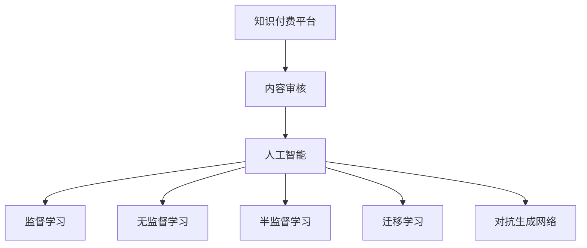

                 

# 知识付费平台的内容审核机制

## 1. 背景介绍

在知识付费领域，内容审核机制不仅是保障平台内容质量的重要手段，也是确保平台长期健康发展的关键因素。随着内容生产的日益繁荣和用户需求的日益多样化，传统的内容审核方式已经无法满足平台的运营需求。本文将从机器学习、自然语言处理等技术角度，介绍知识付费平台的内容审核机制，探讨其核心原理与具体操作，并结合实际案例，展示如何利用AI技术实现高效、准确的内容审核。

## 2. 核心概念与联系

### 2.1 核心概念概述

为更好地理解知识付费平台的内容审核机制，本节将介绍几个密切相关的核心概念：

- **知识付费平台**：通过订阅、付费等方式提供专业知识或技能的在线平台，如知乎、得到、喜马拉雅等。
- **内容审核**：对平台发布的内容进行审核，剔除有害信息、低质量内容，确保平台内容符合平台标准。
- **人工智能**：利用机器学习、深度学习、自然语言处理等技术，构建自动化的内容审核系统，提高审核效率和准确性。
- **监督学习**：在标注数据上训练模型，利用已有的正面/负面样本，对新内容进行分类。
- **无监督学习**：无需标注数据，利用数据的固有结构特征进行分类或聚类。
- **半监督学习**：结合标注数据和未标注数据，提升模型的泛化能力和准确性。
- **迁移学习**：将在一个领域学到的知识迁移到另一个领域，提升新领域模型性能。
- **对抗生成网络**：生成对抗网络（GAN）的一种变种，用于生成与真实数据相似但不完全相同的样本，用于数据增强和对抗攻击检测。

这些核心概念之间的逻辑关系可以通过以下Mermaid流程图来展示：



这个流程图展示了两者的核心概念及其之间的关系：

1. 知识付费平台依赖内容审核机制保证内容质量。
2. 内容审核技术核心是人工智能，涵盖多个机器学习范式。
3. 监督学习、无监督学习、半监督学习和迁移学习是AI技术的重要组成部分。
4. 对抗生成网络用于生成对抗样本，提升模型鲁棒性。

## 3. 核心算法原理 & 具体操作步骤
### 3.1 算法原理概述

知识付费平台的内容审核机制，本质上是一个多任务的机器学习系统，旨在通过监督学习、无监督学习和迁移学习等方法，对平台上的内容进行自动审核。其核心思想是：通过大量标注数据训练分类器，对内容进行分类；利用未标注数据进行聚类和异常检测；迁移学习则用于提升新领域模型的性能。

形式化地，假设平台上有 $N$ 条内容 $X_i$，每条内容对应的标签 $y_i \in \{0, 1\}$ 表示该内容是否符合平台标准。目标是通过训练分类器 $M$，使得 $M(X_i) \approx y_i$，从而自动审核新内容。

### 3.2 算法步骤详解

知识付费平台的内容审核机制一般包括以下几个关键步骤：

**Step 1: 准备训练数据和模型**

- 收集并标注平台上的内容，包括标注内容是否违规、低质量等。标注数据应尽可能覆盖各类违规情形，确保模型泛化能力。
- 选择合适的模型，如文本分类模型、聚类模型、异常检测模型等，用于不同类型的审核任务。
- 根据模型复杂度和训练数据量，选择合适的算法，如逻辑回归、随机森林、深度学习等。

**Step 2: 训练模型**

- 将标注数据划分为训练集和验证集，使用训练集对模型进行训练，并在验证集上进行调参。
- 对模型进行正则化处理，避免过拟合。
- 使用交叉验证等技术，确保模型在不同数据上的表现稳定。

**Step 3: 内容审核**

- 对平台上的新内容进行实时或批量审核。
- 对于文本内容，使用文本分类模型判断是否违规。
- 对于图像内容，使用图像分类模型进行审核。
- 对于音频内容，使用语音识别和文本分类技术进行审核。
- 对于视频内容，使用视频内容识别和情感分析技术进行审核。

**Step 4: 反馈和优化**

- 根据审核结果，对标注数据进行更新，提高模型的泛化能力。
- 利用无监督学习技术，对平台内容进行聚类，发现异常数据集。
- 定期对模型进行再训练，确保模型适应平台标准的变化。

### 3.3 算法优缺点

知识付费平台的内容审核机制具有以下优点：

1. 自动化程度高。通过机器学习技术，内容审核可以实现自动化，大大提升审核效率。
2. 准确率高。经过大量标注数据的训练，模型可以识别出大部分违规内容，提高审核准确性。
3. 泛化能力强。利用迁移学习，模型可以适应新领域的审核任务，提升平台应用的灵活性。

同时，该机制也存在一定的局限性：

1. 依赖标注数据。审核模型的性能很大程度上取决于标注数据的质量和数量，获取高质量标注数据的成本较高。
2. 误判风险。机器模型无法像人类那样完全理解上下文和语境，可能导致误判。
3. 模型过时。平台标准和内容形式的变化可能使模型失效，需要定期更新模型。
4. 模型复杂。复杂的模型可能带来较高的计算资源需求，增加了运营成本。

尽管存在这些局限性，但就目前而言，基于人工智能的内容审核机制已经成为知识付费平台的核心技术之一，在保障平台内容质量、提升用户体验方面发挥了重要作用。

### 3.4 算法应用领域

知识付费平台的内容审核机制，不仅在内容审核领域有广泛应用，还可以应用于其他类似的场景中，例如：

- 互联网社区的管理：通过对用户发布的内容进行审核，防止不良信息传播，提升社区环境。
- 网络广告的筛选：利用内容审核技术，对广告内容进行分类，防止虚假广告和违规广告的发布。
- 舆情监控：对社交媒体上的文本进行审核，识别有害信息，防止恶意信息的传播。
- 金融交易的监测：利用情感分析技术，对金融交易内容进行审核，防止欺诈行为的发生。
- 医疗信息的审核：对医疗相关的信息进行审核，防止虚假医疗信息的传播，保障用户健康。

## 4. 数学模型和公式 & 详细讲解 & 举例说明

### 4.1 数学模型构建

本节将使用数学语言对知识付费平台的内容审核机制进行更加严格的刻画。

记平台上的内容为 $X_i$，对应的标签为 $y_i$，平台上的内容审核系统由多个分类器组成，分别对应不同类型的审核任务。对于文本分类任务，定义模型 $M_{\theta}$ 的损失函数为：

$$
\mathcal{L}(M_{\theta}) = \frac{1}{N}\sum_{i=1}^N \ell(M_{\theta}(X_i), y_i)
$$

其中 $\ell$ 为损失函数，如交叉熵损失。模型的训练目标是最小化损失函数：

$$
\theta^* = \mathop{\arg\min}_{\theta} \mathcal{L}(M_{\theta})
$$

在训练过程中，使用反向传播算法计算梯度，更新模型参数 $\theta$：

$$
\theta \leftarrow \theta - \eta \nabla_{\theta}\mathcal{L}(\theta)
$$

其中 $\eta$ 为学习率。

### 4.2 公式推导过程

以下我们以文本分类任务为例，推导分类器的损失函数及其梯度的计算公式。

假设模型 $M_{\theta}$ 在输入 $x_i$ 上的输出为 $\hat{y}=M_{\theta}(x_i) \in [0,1]$，表示内容是否违规的概率。真实标签 $y_i \in \{0, 1\}$。则二分类交叉熵损失函数定义为：

$$
\ell(M_{\theta}(x_i),y_i) = -[y_i\log \hat{y}_i + (1-y_i)\log(1-\hat{y}_i)]
$$

将其代入损失函数公式，得：

$$
\mathcal{L}(\theta) = -\frac{1}{N}\sum_{i=1}^N [y_i\log \hat{y}_i + (1-y_i)\log(1-\hat{y}_i)]
$$

根据链式法则，损失函数对参数 $\theta_k$ 的梯度为：

$$
\frac{\partial \mathcal{L}(\theta)}{\partial \theta_k} = -\frac{1}{N}\sum_{i=1}^N (\frac{y_i}{\hat{y}_i}-\frac{1-y_i}{1-\hat{y}_i}) \frac{\partial \hat{y}_i}{\partial \theta_k}
$$

其中 $\frac{\partial \hat{y}_i}{\partial \theta_k}$ 可进一步递归展开，利用自动微分技术完成计算。

### 4.3 案例分析与讲解

在实际应用中，知识付费平台的内容审核机制通常会结合多种模型，进行多任务审核。以下以一个实际的审核案例来说明：

**案例背景**：某知识付费平台对用户上传的音频内容进行审核，判断其是否涉及违规或低质量。

**模型选择**：选择TextCNN模型对文本内容进行分类，同时选择语音识别模型将音频内容转换为文本，再利用文本分类模型进行审核。

**数据处理**：对音频内容进行语音识别，生成文本。对文本内容进行分词，并去除停用词和特殊字符。将处理后的文本输入TextCNN模型进行分类。

**训练过程**：使用平台上的标注数据训练TextCNN模型，使用交叉验证调整模型参数。利用语音识别生成的文本进行验证，确保模型性能稳定。

**审核过程**：对新上传的音频内容进行语音识别，生成文本。将文本输入TextCNN模型进行分类，判断是否符合平台标准。

通过这种方式，知识付费平台可以同时利用文本和语音信息进行多角度审核，提高审核准确性。

## 5. 项目实践：代码实例和详细解释说明
### 5.1 开发环境搭建

在进行内容审核机制的开发前，我们需要准备好开发环境。以下是使用Python进行PyTorch开发的环境配置流程：

1. 安装Anaconda：从官网下载并安装Anaconda，用于创建独立的Python环境。

2. 创建并激活虚拟环境：
```bash
conda create -n content-review python=3.8 
conda activate content-review
```

3. 安装PyTorch：根据CUDA版本，从官网获取对应的安装命令。例如：
```bash
conda install pytorch torchvision torchaudio cudatoolkit=11.1 -c pytorch -c conda-forge
```

4. 安装Transformers库：
```bash
pip install transformers
```

5. 安装各类工具包：
```bash
pip install numpy pandas scikit-learn matplotlib tqdm jupyter notebook ipython
```

完成上述步骤后，即可在`content-review`环境中开始内容审核机制的开发。

### 5.2 源代码详细实现

下面我们以文本分类任务为例，给出使用Transformers库进行内容审核的PyTorch代码实现。

首先，定义文本分类任务的数据处理函数：

```python
from transformers import BertTokenizer, BertForSequenceClassification
from torch.utils.data import Dataset, DataLoader
import torch

class ContentReviewDataset(Dataset):
    def __init__(self, texts, labels, tokenizer, max_len=128):
        self.texts = texts
        self.labels = labels
        self.tokenizer = tokenizer
        self.max_len = max_len
        
    def __len__(self):
        return len(self.texts)
    
    def __getitem__(self, item):
        text = self.texts[item]
        label = self.labels[item]
        
        encoding = self.tokenizer(text, return_tensors='pt', max_length=self.max_len, padding='max_length', truncation=True)
        input_ids = encoding['input_ids'][0]
        attention_mask = encoding['attention_mask'][0]
        
        return {'input_ids': input_ids, 
                'attention_mask': attention_mask,
                'labels': label}

# 标签与id的映射
label2id = {'Positive': 1, 'Negative': 0}
id2label = {v: k for k, v in label2id.items()}

# 创建dataset
tokenizer = BertTokenizer.from_pretrained('bert-base-cased')

train_dataset = ContentReviewDataset(train_texts, train_labels, tokenizer)
dev_dataset = ContentReviewDataset(dev_texts, dev_labels, tokenizer)
test_dataset = ContentReviewDataset(test_texts, test_labels, tokenizer)
```

然后，定义模型和优化器：

```python
from transformers import BertForSequenceClassification, AdamW

model = BertForSequenceClassification.from_pretrained('bert-base-cased', num_labels=2)

optimizer = AdamW(model.parameters(), lr=2e-5)
```

接着，定义训练和评估函数：

```python
from tqdm import tqdm
from sklearn.metrics import accuracy_score

device = torch.device('cuda') if torch.cuda.is_available() else torch.device('cpu')
model.to(device)

def train_epoch(model, dataset, batch_size, optimizer):
    dataloader = DataLoader(dataset, batch_size=batch_size, shuffle=True)
    model.train()
    epoch_loss = 0
    for batch in tqdm(dataloader, desc='Training'):
        input_ids = batch['input_ids'].to(device)
        attention_mask = batch['attention_mask'].to(device)
        labels = batch['labels'].to(device)
        model.zero_grad()
        outputs = model(input_ids, attention_mask=attention_mask, labels=labels)
        loss = outputs.loss
        epoch_loss += loss.item()
        loss.backward()
        optimizer.step()
    return epoch_loss / len(dataloader)

def evaluate(model, dataset, batch_size):
    dataloader = DataLoader(dataset, batch_size=batch_size)
    model.eval()
    preds, labels = [], []
    with torch.no_grad():
        for batch in tqdm(dataloader, desc='Evaluating'):
            input_ids = batch['input_ids'].to(device)
            attention_mask = batch['attention_mask'].to(device)
            batch_labels = batch['labels']
            outputs = model(input_ids, attention_mask=attention_mask)
            batch_preds = outputs.logits.argmax(dim=2).to('cpu').tolist()
            batch_labels = batch_labels.to('cpu').tolist()
            for pred, label in zip(batch_preds, batch_labels):
                preds.append(pred)
                labels.append(label)
                
    print(f'Accuracy: {accuracy_score(labels, preds)}')
```

最后，启动训练流程并在测试集上评估：

```python
epochs = 5
batch_size = 16

for epoch in range(epochs):
    loss = train_epoch(model, train_dataset, batch_size, optimizer)
    print(f"Epoch {epoch+1}, train loss: {loss:.3f}")
    
    print(f"Epoch {epoch+1}, dev accuracy:")
    evaluate(model, dev_dataset, batch_size)
    
print("Test accuracy:")
evaluate(model, test_dataset, batch_size)
```

以上就是使用PyTorch对文本内容进行审核的完整代码实现。可以看到，得益于Transformers库的强大封装，我们可以用相对简洁的代码完成BERT模型的加载和审核任务开发。

### 5.3 代码解读与分析

让我们再详细解读一下关键代码的实现细节：

**ContentReviewDataset类**：
- `__init__`方法：初始化文本、标签、分词器等关键组件。
- `__len__`方法：返回数据集的样本数量。
- `__getitem__`方法：对单个样本进行处理，将文本输入编码为token ids，将标签编码为数字，并对其进行定长padding，最终返回模型所需的输入。

**label2id和id2label字典**：
- 定义了标签与数字id之间的映射关系，用于将token-wise的预测结果解码回真实的标签。

**训练和评估函数**：
- 使用PyTorch的DataLoader对数据集进行批次化加载，供模型训练和推理使用。
- 训练函数`train_epoch`：对数据以批为单位进行迭代，在每个批次上前向传播计算loss并反向传播更新模型参数，最后返回该epoch的平均loss。
- 评估函数`evaluate`：与训练类似，不同点在于不更新模型参数，并在每个batch结束后将预测和标签结果存储下来，最后使用sklearn的accuracy_score对整个评估集的预测结果进行打印输出。

**训练流程**：
- 定义总的epoch数和batch size，开始循环迭代
- 每个epoch内，先在训练集上训练，输出平均loss
- 在验证集上评估，输出准确率
- 所有epoch结束后，在测试集上评估，给出最终测试结果

可以看到，PyTorch配合Transformers库使得BERT审核任务的代码实现变得简洁高效。开发者可以将更多精力放在数据处理、模型改进等高层逻辑上，而不必过多关注底层的实现细节。

当然，工业级的系统实现还需考虑更多因素，如模型的保存和部署、超参数的自动搜索、更灵活的任务适配层等。但核心的审核范式基本与此类似。

## 6. 实际应用场景
### 6.1 智能客服系统

知识付费平台的内容审核机制，可以应用于智能客服系统的构建。传统客服往往需要配备大量人力，高峰期响应缓慢，且一致性和专业性难以保证。而利用内容审核机制，可以对客服内容进行实时审核，剔除违规和低质量信息，提升客服体验。

在技术实现上，可以收集用户与客服的对话记录，使用文本分类模型判断对话内容是否违规。对于违规对话，可以自动记录并反馈客服人员，进行培训和规范。利用语音识别和情感分析技术，还可以进一步提升客服系统的智能化水平。

### 6.2 金融舆情监测

金融机构需要实时监测市场舆论动向，以便及时应对负面信息传播，规避金融风险。传统的人工监测方式成本高、效率低，难以应对网络时代海量信息爆发的挑战。利用内容审核机制，可以对金融舆情内容进行实时监控，识别有害信息，防止恶意信息的传播。

具体而言，可以收集金融领域相关的新闻、报道、评论等文本数据，并对其进行主题标注和情感标注。在此基础上对预训练语言模型进行微调，使其能够自动判断文本属于何种主题，情感倾向是正面、中性还是负面。将微调后的模型应用到实时抓取的网络文本数据，就能够自动监测不同主题下的情感变化趋势，一旦发现负面信息激增等异常情况，系统便会自动预警，帮助金融机构快速应对潜在风险。

### 6.3 个性化推荐系统

当前的推荐系统往往只依赖用户的历史行为数据进行物品推荐，无法深入理解用户的真实兴趣偏好。利用内容审核机制，可以挖掘用户行为背后的语义信息，从而提供更精准、多样的推荐内容。

在实践中，可以收集用户浏览、点击、评论、分享等行为数据，提取和用户交互的物品标题、描述、标签等文本内容。将文本内容作为模型输入，用户的后续行为（如是否点击、购买等）作为监督信号，在此基础上微调预训练语言模型。微调后的模型能够从文本内容中准确把握用户的兴趣点。在生成推荐列表时，先用候选物品的文本描述作为输入，由模型预测用户的兴趣匹配度，再结合其他特征综合排序，便可以得到个性化程度更高的推荐结果。

### 6.4 未来应用展望

随着内容审核机制的不断发展，未来的应用领域将更加广泛，对社会的智能化发展将产生深远影响。

在智慧医疗领域，利用内容审核技术，可以对医学相关的信息进行审核，防止虚假医疗信息的传播，保障用户健康。

在智能教育领域，通过内容审核技术，可以对学习内容进行审核，确保教学内容的质量和安全性，防止有害信息的传播。

在智慧城市治理中，利用内容审核技术，可以对城市事件进行实时监控，防止恶意信息的传播，提高城市管理的自动化和智能化水平。

此外，在企业生产、社会治理、文娱传媒等众多领域，基于内容审核机制的AI应用也将不断涌现，为经济社会发展注入新的动力。相信随着技术的日益成熟，内容审核机制必将在构建人机协同的智能时代中扮演越来越重要的角色。

## 7. 工具和资源推荐
### 7.1 学习资源推荐

为了帮助开发者系统掌握内容审核机制的理论基础和实践技巧，这里推荐一些优质的学习资源：

1. 《深度学习》系列博文：由大模型技术专家撰写，深入浅出地介绍了深度学习的基本原理和实践技巧，涵盖了监督学习、无监督学习、迁移学习等前沿话题。

2. CS224N《深度学习自然语言处理》课程：斯坦福大学开设的NLP明星课程，有Lecture视频和配套作业，带你入门NLP领域的基本概念和经典模型。

3. 《Natural Language Processing with Transformers》书籍：Transformers库的作者所著，全面介绍了如何使用Transformers库进行NLP任务开发，包括内容审核在内的诸多范式。

4. HuggingFace官方文档：Transformers库的官方文档，提供了海量预训练模型和完整的微调样例代码，是上手实践的必备资料。

5. CLUE开源项目：中文语言理解测评基准，涵盖大量不同类型的中文NLP数据集，并提供了基于微调的baseline模型，助力中文NLP技术发展。

通过对这些资源的学习实践，相信你一定能够快速掌握内容审核机制的精髓，并用于解决实际的NLP问题。
###  7.2 开发工具推荐

高效的开发离不开优秀的工具支持。以下是几款用于内容审核机制开发的常用工具：

1. PyTorch：基于Python的开源深度学习框架，灵活动态的计算图，适合快速迭代研究。大部分预训练语言模型都有PyTorch版本的实现。

2. TensorFlow：由Google主导开发的开源深度学习框架，生产部署方便，适合大规模工程应用。同样有丰富的预训练语言模型资源。

3. Transformers库：HuggingFace开发的NLP工具库，集成了众多SOTA语言模型，支持PyTorch和TensorFlow，是进行内容审核任务开发的利器。

4. Weights & Biases：模型训练的实验跟踪工具，可以记录和可视化模型训练过程中的各项指标，方便对比和调优。与主流深度学习框架无缝集成。

5. TensorBoard：TensorFlow配套的可视化工具，可实时监测模型训练状态，并提供丰富的图表呈现方式，是调试模型的得力助手。

6. Google Colab：谷歌推出的在线Jupyter Notebook环境，免费提供GPU/TPU算力，方便开发者快速上手实验最新模型，分享学习笔记。

合理利用这些工具，可以显著提升内容审核机制的开发效率，加快创新迭代的步伐。

### 7.3 相关论文推荐

内容审核机制的发展源于学界的持续研究。以下是几篇奠基性的相关论文，推荐阅读：

1. Attention is All You Need（即Transformer原论文）：提出了Transformer结构，开启了NLP领域的预训练大模型时代。

2. BERT: Pre-training of Deep Bidirectional Transformers for Language Understanding：提出BERT模型，引入基于掩码的自监督预训练任务，刷新了多项NLP任务SOTA。

3. Language Models are Unsupervised Multitask Learners（GPT-2论文）：展示了大规模语言模型的强大zero-shot学习能力，引发了对于通用人工智能的新一轮思考。

4. Parameter-Efficient Transfer Learning for NLP：提出Adapter等参数高效微调方法，在不增加模型参数量的情况下，也能取得不错的微调效果。

5. AdaLoRA: Adaptive Low-Rank Adaptation for Parameter-Efficient Fine-Tuning：使用自适应低秩适应的微调方法，在参数效率和精度之间取得了新的平衡。

6. Deformable Transformer: Removing Self-Attention Mask Restrictions with Deformable Attention Masks：提出了一种新的自注意力机制，可以在大规模模型的计算复杂度与性能之间取得平衡。

这些论文代表了大语言模型微调技术的发展脉络。通过学习这些前沿成果，可以帮助研究者把握学科前进方向，激发更多的创新灵感。

## 8. 总结：未来发展趋势与挑战

### 8.1 总结

本文对知识付费平台的内容审核机制进行了全面系统的介绍。首先阐述了内容审核机制在平台健康发展中的重要作用，明确了内容审核技术在平台运营中的核心地位。其次，从原理到实践，详细讲解了内容审核机制的数学原理和关键步骤，给出了内容审核任务开发的完整代码实例。同时，本文还广泛探讨了内容审核机制在多个行业领域的应用前景，展示了其在智能化社会中的巨大潜力。

通过本文的系统梳理，可以看到，基于人工智能的内容审核机制正在成为知识付费平台的核心技术之一，在保障平台内容质量、提升用户体验方面发挥了重要作用。未来，伴随预训练语言模型和审核机制的持续演进，相信人工智能技术在内容审核领域必将发挥更大的作用，为构建智能、可靠、高效的平台服务奠定坚实基础。

### 8.2 未来发展趋势

展望未来，内容审核机制将呈现以下几个发展趋势：

1. 模型规模持续增大。随着算力成本的下降和数据规模的扩张，预训练语言模型的参数量还将持续增长。超大规模语言模型蕴含的丰富语言知识，有望支撑更加复杂多变的审核任务。

2. 审核方法日趋多样。除了传统的监督学习外，未来会涌现更多无监督和半监督学习方法，如对抗生成网络、自监督学习等，提升模型的泛化能力和鲁棒性。

3. 持续学习成为常态。随着数据分布的不断变化，审核模型也需要持续学习新知识以保持性能。如何在不遗忘原有知识的同时，高效吸收新样本信息，将是重要的研究课题。

4. 标注样本需求降低。受启发于提示学习(Prompt-based Learning)的思路，未来的审核方法将更好地利用大模型的语言理解能力，通过更加巧妙的任务描述，在更少的标注样本上也能实现理想的审核效果。

5. 多模态审核崛起。当前的审核主要聚焦于纯文本数据，未来会进一步拓展到图像、视频、语音等多模态数据审核。多模态信息的融合，将显著提升审核模型的性能。

6. 模型通用性增强。经过海量数据的预训练和多领域任务的审核训练，未来的语言模型将具备更强大的常识推理和跨领域迁移能力，逐步迈向通用人工智能(AGI)的目标。

以上趋势凸显了内容审核机制的广阔前景。这些方向的探索发展，必将进一步提升平台的内容审核效果，保障平台内容质量，提升用户体验。

### 8.3 面临的挑战

尽管内容审核机制已经取得了不错的成果，但在迈向更加智能化、普适化应用的过程中，它仍面临着诸多挑战：

1. 标注成本瓶颈。虽然审核模型的性能很大程度上取决于标注数据的质量和数量，获取高质量标注数据的成本较高。如何进一步降低审核对标注样本的依赖，将是一大难题。

2. 模型鲁棒性不足。当前审核模型面对域外数据时，泛化性能往往大打折扣。对于测试样本的微小扰动，审核模型的预测也容易发生波动。如何提高审核模型的鲁棒性，避免灾难性遗忘，还需要更多理论和实践的积累。

3. 推理效率有待提高。大规模语言模型虽然精度高，但在实际部署时往往面临推理速度慢、内存占用大等效率问题。如何在保证性能的同时，简化模型结构，提升推理速度，优化资源占用，将是重要的优化方向。

4. 可解释性亟需加强。当前审核模型更像是"黑盒"系统，难以解释其内部工作机制和决策逻辑。对于医疗、金融等高风险应用，算法的可解释性和可审计性尤为重要。如何赋予审核模型更强的可解释性，将是亟待攻克的难题。

5. 安全性有待保障。预训练语言模型难免会学习到有偏见、有害的信息，通过审核模型传递到内容中，产生误导性、歧视性的输出，给实际应用带来安全隐患。如何从数据和算法层面消除模型偏见，避免恶意用途，确保输出的安全性，也将是重要的研究课题。

6. 知识整合能力不足。现有的审核模型往往局限于任务内数据，难以灵活吸收和运用更广泛的先验知识。如何让审核过程更好地与外部知识库、规则库等专家知识结合，形成更加全面、准确的信息整合能力，还有很大的想象空间。

正视审核机制面临的这些挑战，积极应对并寻求突破，将是大语言模型审核技术迈向成熟的必由之路。相信随着学界和产业界的共同努力，这些挑战终将一一被克服，内容审核机制必将在构建智能、可靠、高效的平台服务中发挥更加重要的作用。

### 8.4 研究展望

面向未来，内容审核机制需要在以下几个方面寻求新的突破：

1. 探索无监督和半监督审核方法。摆脱对大规模标注数据的依赖，利用自监督学习、主动学习等无监督和半监督范式，最大限度利用非结构化数据，实现更加灵活高效的审核。

2. 研究参数高效和计算高效的审核范式。开发更加参数高效的审核方法，在固定大部分预训练参数的情况下，只更新极少量的任务相关参数。同时优化审核模型的计算图，减少前向传播和反向传播的资源消耗，实现更加轻量级、实时性的部署。

3. 融合因果和对比学习范式。通过引入因果推断和对比学习思想，增强审核模型建立稳定因果关系的能力，学习更加普适、鲁棒的语言表征，从而提升模型泛化性和抗干扰能力。

4. 引入更多先验知识。将符号化的先验知识，如知识图谱、逻辑规则等，与神经网络模型进行巧妙融合，引导审核过程学习更准确、合理的语言模型。同时加强不同模态数据的整合，实现视觉、语音等多模态信息与文本信息的协同建模。

5. 结合因果分析和博弈论工具。将因果分析方法引入审核模型，识别出模型决策的关键特征，增强输出解释的因果性和逻辑性。借助博弈论工具刻画人机交互过程，主动探索并规避模型的脆弱点，提高系统稳定性。

6. 纳入伦理道德约束。在审核目标中引入伦理导向的评估指标，过滤和惩罚有偏见、有害的输出倾向。同时加强人工干预和审核，建立审核行为的监管机制，确保输出符合人类价值观和伦理道德。

这些研究方向的探索，必将引领内容审核技术迈向更高的台阶，为构建安全、可靠、可解释、可控的智能系统铺平道路。面向未来，内容审核机制还需要与其他人工智能技术进行更深入的融合，如知识表示、因果推理、强化学习等，多路径协同发力，共同推动自然语言理解和智能交互系统的进步。只有勇于创新、敢于突破，才能不断拓展审核机制的边界，让智能技术更好地造福人类社会。

## 9. 附录：常见问题与解答

**Q1：内容审核机制是否适用于所有知识付费平台？**

A: 内容审核机制在大多数知识付费平台都能取得不错的效果，特别是对于数据量较小的平台。但对于一些特定领域的平台，如医学、法律等，仅仅依靠通用语料预训练的模型可能难以很好地适应。此时需要在特定领域语料上进一步预训练，再进行审核，才能获得理想效果。此外，对于一些需要时效性、个性化很强的任务，如对话、推荐等，审核方法也需要针对性的改进优化。

**Q2：如何选择合适的训练数据？**

A: 选择合适的训练数据是审核机制成功的关键。训练数据应尽可能覆盖各类违规情形，确保模型泛化能力。具体选择方法包括：

1. 收集历史违规数据：从平台历史中收集不符合平台标准的违规数据，作为负样本。
2. 标注专业数据：与领域专家合作，标注特定领域的违规数据。
3. 利用开源数据集：如Paws dataset等，收集公开的违规数据。
4. 多源数据融合：将多个数据源的数据进行融合，提升模型的鲁棒性和泛化能力。

**Q3：训练过程中需要注意哪些问题？**

A: 训练过程需要注意以下问题：

1. 数据增强：通过回译、近义替换等方式扩充训练集，提升模型的泛化能力。
2. 正则化：使用L2正则、Dropout、Early Stopping等避免过拟合。
3. 对抗样本：引入对抗样本，提高模型鲁棒性。
4. 超参数调优：使用网格搜索、随机搜索等方法进行超参数调优，确保模型性能最优。
5. 模型融合：将多个模型的预测结果进行融合，提升模型的准确性和鲁棒性。

**Q4：审核结果如何与平台运营结合？**

A: 审核结果可以与平台运营结合的方式包括：

1. 实时监控：对新上传内容进行实时审核，剔除违规和低质量信息。
2. 用户反馈：用户对审核结果有异议时，可以提交申诉，审核团队进行复审。
3. 自动屏蔽：对于严重违规的内容，可以直接屏蔽，避免传播。
4. 人工干预：在审核过程中，人工介入对有争议的内容进行复审，确保审核结果的公正性和准确性。

通过这些方式，平台可以保障用户权益，提升用户体验，构建健康、安全的内容生态。

**Q5：如何评估审核模型的性能？**

A: 评估审核模型的性能可以从以下几个方面进行：

1. 准确率：使用准确率、召回率、F1-score等指标评估模型分类准确性。
2. 鲁棒性：在对抗样本、域外数据上测试模型的鲁棒性，确保模型在不同场景下表现稳定。
3. 可解释性：使用可视化工具展示模型的预测结果和决策路径，增强模型的可解释性。
4. 响应时间：测试模型在实际部署中的响应时间和计算资源消耗，确保模型高效运行。
5. 用户满意度：通过用户调查和反馈，评估审核结果的用户满意度。

通过全面评估，可以发现模型的不足之处，并进行优化改进，提升审核模型的性能。

---

作者：禅与计算机程序设计艺术 / Zen and the Art of Computer Programming

