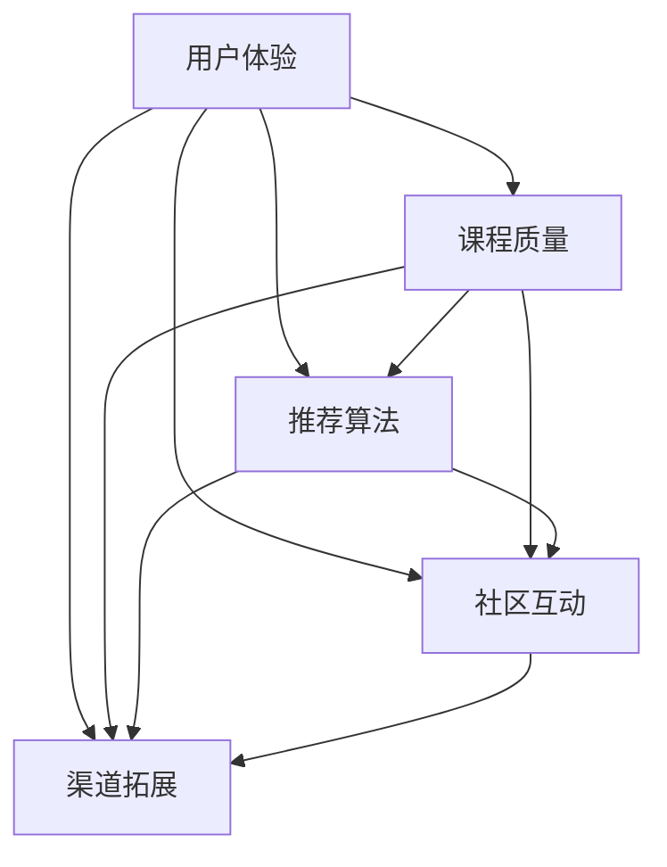

                 

# 知识付费平台的用户增长策略

> 关键词：知识付费、用户增长、策略、方法、技术、市场分析

## 1. 背景介绍

### 1.1 问题由来
近年来，知识付费市场快速增长，平台如得到、喜马拉雅、网易云课堂等纷纷涌现。然而，用户留存率、付费转化率等问题依然困扰着各大平台。通过一系列的数据分析，我们发现在知识付费平台的用户增长过程中，用户体验、课程质量、推荐算法、社区互动等因素都起着至关重要的作用。

### 1.2 问题核心关键点
为了更好地理解知识付费平台用户增长的关键要素，本文将重点探讨以下几个核心问题：
- 用户体验设计如何提升？
- 课程质量如何保证？
- 推荐算法如何优化？
- 社区互动如何增强？
- 渠道拓展策略如何实施？

### 1.3 问题研究意义
本文旨在通过系统的分析与研究，为知识付费平台的用户增长提供策略参考。通过深入了解用户行为、市场动态以及竞争对手策略，帮助平台制定更加科学有效的用户增长策略，以促进平台的长期健康发展。

## 2. 核心概念与联系

### 2.1 核心概念概述

在知识付费平台的背景下，核心概念包括：

- 用户体验（User Experience, UX）：指用户在使用知识付费平台时，从产品使用、内容消费到付费购买的全流程体验。良好的用户体验能够提升用户粘性，促进用户留存与付费转化。
- 课程质量（Course Quality）：指平台提供的课程内容质量，包括专业性、实用性、教学效果等。高质量课程能够吸引用户持续学习，增加平台价值。
- 推荐算法（Recommendation Algorithm）：通过算法模型推荐相关课程，提升用户发现优质课程的概率，增加用户活跃度和转化率。
- 社区互动（Community Engagement）：指平台内用户之间的交流与互动，包括评论、点赞、分享等行为。良好的社区互动能够增强用户归属感，提高平台黏性。
- 渠道拓展（Channel Expansion）：通过多渠道推广，如社交媒体、搜索引擎营销、合作媒体等，吸引更多潜在用户，扩大平台的用户基础。

这些核心概念共同构成了知识付费平台用户增长的基础框架，对其综合优化是提升平台用户规模与价值的关键。

### 2.2 核心概念原理和架构的 Mermaid 流程图(Mermaid 流程节点中不要有括号、逗号等特殊字符)


## 3. 核心算法原理 & 具体操作步骤

### 3.1 算法原理概述

知识付费平台用户增长的核心算法原理主要包括以下几个方面：

- 用户行为分析：通过数据分析工具，如Google Analytics、Mixpanel等，收集用户在平台上的行为数据，识别用户需求与痛点。
- 个性化推荐：利用协同过滤、内容推荐、深度学习等技术，根据用户历史行为、兴趣偏好等信息，推荐可能感兴趣的课程。
- 多渠道营销：通过搜索引擎优化（SEO）、社交媒体营销、内容营销等多种渠道进行推广，吸引潜在用户。
- 用户留存策略：通过优惠券、会员制度、积分系统等策略，提升用户留存率。
- 用户反馈机制：建立用户反馈系统，收集用户意见与建议，持续改进产品。

### 3.2 算法步骤详解

**Step 1: 用户行为分析**
- 数据收集：使用数据统计工具收集用户行为数据，如访问页面、停留时长、点击率等。
- 用户画像：通过数据分析工具，如K-means聚类、PCA降维等方法，构建用户画像，识别用户特征。
- 需求识别：分析用户行为数据，识别用户需求与痛点，如学习时间管理、提升职业技能、心理咨询等。

**Step 2: 个性化推荐**
- 特征提取：提取用户行为数据特征，如浏览历史、购买记录、评分反馈等。
- 模型训练：选择推荐算法模型，如协同过滤、内容推荐、深度学习等，训练推荐模型。
- 推荐展示：将推荐结果展示给用户，如课程列表、广告位等。

**Step 3: 多渠道营销**
- 搜索引擎优化：优化课程内容关键词，提升课程在搜索引擎中的排名。
- 社交媒体营销：在社交媒体上发布课程信息，吸引用户关注。
- 内容营销：通过文章、视频等形式，发布高质量内容，吸引潜在用户。

**Step 4: 用户留存策略**
- 优惠券策略：提供新用户优惠券，鼓励用户试用。
- 会员制度：设置会员等级，提供专属福利。
- 积分系统：建立积分系统，激励用户持续学习与消费。

**Step 5: 用户反馈机制**
- 建立反馈系统：通过在线表单、评论系统等方式，收集用户意见与建议。
- 数据分析：分析用户反馈数据，识别共性问题。
- 产品改进：根据用户反馈，持续优化产品功能。

### 3.3 算法优缺点

个性化推荐算法的优点包括：
- 提升用户满意度：通过推荐相关课程，提升用户学习体验。
- 提高转化率：增加用户对平台的粘性，促进付费转化。
- 降低营销成本：精准触达用户，提升广告效果。

同时，个性化推荐算法也存在一些缺点：
- 数据隐私问题：收集用户数据可能引发隐私保护问题。
- 冷启动问题：新用户没有历史数据，推荐效果不佳。
- 算法偏见：推荐算法可能存在算法偏见，导致推荐不平衡。

在实际应用中，需要综合考虑这些因素，平衡推荐效果与用户隐私保护，确保推荐算法的公平性与透明性。

### 3.4 算法应用领域

个性化推荐算法在知识付费平台的应用非常广泛，可以应用于以下场景：
- 新用户推荐：根据用户画像，推荐相关课程，降低新用户流失率。
- 课程发现：通过推荐，帮助用户发现更多高质量课程。
- 个性化课程包：根据用户兴趣，推荐搭配课程，提升学习效果。
- 广告投放：精准投放广告，吸引潜在用户。

## 4. 数学模型和公式 & 详细讲解 & 举例说明（备注：数学公式请使用latex格式，latex嵌入文中独立段落使用 $$，段落内使用 $)
### 4.1 数学模型构建

在知识付费平台的个性化推荐中，常用的数学模型包括协同过滤、基于内容的推荐和深度学习模型等。以协同过滤为例，基本的协同过滤算法可以表示为：

$$
\hat{y}_{ui} = \hat{\alpha} \sum_{j=1}^N r_{uj} \cdot \hat{\alpha} \sum_{j=1}^N r_{ji} + \hat{\beta}
$$

其中，$r_{uj}$ 表示用户 $u$ 对课程 $j$ 的评分，$\hat{\alpha}$ 和 $\hat{\beta}$ 为模型参数。该模型基于用户对其他课程的评分，预测用户对课程 $i$ 的评分。

### 4.2 公式推导过程

协同过滤模型的推导基于用户-物品评分矩阵的因子分解。设用户集为 $U$，课程集为 $I$，用户 $u$ 对课程 $i$ 的评分为 $y_{ui}$。假设用户对课程的评分由 $d_u$ 和 $d_i$ 两个隐含因子线性组合而成，即：

$$
y_{ui} = \sum_{k=1}^K \alpha_{uk} \cdot d_{ik}
$$

其中 $K$ 为隐含因子个数，$\alpha_{uk}$ 和 $d_{ik}$ 分别为用户 $u$ 和课程 $i$ 的隐含因子。

通过矩阵分解，可得：

$$
\mathbf{R} = \mathbf{U} \cdot \mathbf{D} \cdot \mathbf{V}^T
$$

其中 $\mathbf{R}$ 为用户-课程评分矩阵，$\mathbf{U}$ 和 $\mathbf{V}$ 分别为用户和课程的隐含因子矩阵。通过求解 $\mathbf{U}$ 和 $\mathbf{V}$，即可得到协同过滤模型的隐含因子表示。

### 4.3 案例分析与讲解

以深度学习模型中的神经协同过滤为例，其基本结构如下：

$$
\hat{y}_{ui} = \sigma(\mathbf{W}_u \cdot \mathbf{h}_i + b_u)
$$

其中 $\mathbf{h}_i$ 为课程 $i$ 的隐含向量，$\mathbf{W}_u$ 为用户的权重矩阵，$b_u$ 为偏置项，$\sigma$ 为激活函数。

该模型通过训练得到用户和课程的隐含向量，然后利用这些向量进行推荐。相比于传统协同过滤，神经协同过滤能够更好地处理高维稀疏数据，提升推荐效果。

## 5. 项目实践：代码实例和详细解释说明

### 5.1 开发环境搭建

为了实现知识付费平台的用户增长策略，需要搭建一个完整的开发环境。以下是在 Python 环境下搭建开发环境的详细步骤：

1. 安装 Python 环境：
   - 下载并安装 Python 3.x 版本。
   - 配置 Python 环境，如使用 virtualenv 或 conda。

2. 安装数据处理库：
   - 安装 Pandas、NumPy 等数据处理库。
   - 安装 Matplotlib、Seaborn 等数据可视化库。

3. 安装推荐算法库：
   - 安装 Scikit-learn、TensorFlow、PyTorch 等推荐算法库。
   - 安装 scikit-learn 推荐算法模块。

4. 安装 Web 开发框架：
   - 安装 Flask 或 Django 等 Web 开发框架。
   - 配置 Web 服务器，如 Nginx 或 Apache。

### 5.2 源代码详细实现

以下是一个简单的 Python 代码示例，实现基于协同过滤的课程推荐系统：

```python
import pandas as pd
from sklearn.neighbors import NearestNeighbors

# 读取用户-课程评分数据
data = pd.read_csv('user_course_ratings.csv')

# 构建用户-课程评分矩阵
R = pd.pivot_table(data, values='rating', index='user_id', columns='course_id')

# 构建用户和课程的隐含因子矩阵
U = pd.DataFrame(data.groupby('user_id')['rating'].sum())
U.columns = ['factor1', 'factor2']

V = pd.DataFrame(data.groupby('course_id')['rating'].sum())
V.columns = ['factor1', 'factor2']

# 构建推荐矩阵
recommendations = U.dot(V.T)

# 推荐课程
def recommend_course(user_id):
    user = R.reindex(columns=recommendations.columns)
    distance = NearestNeighbors(n_neighbors=5).fit(user)
    distances, indices = distance.kneighbors([U.values[user_id]])
    return indices.flatten()

# 测试
user_id = '123456'
recommended_courses = recommend_course(user_id)
print(recommended_courses)
```

### 5.3 代码解读与分析

以上代码实现了基于协同过滤的课程推荐系统。具体步骤如下：

1. 读取用户-课程评分数据，构建用户-课程评分矩阵 $R$。
2. 构建用户和课程的隐含因子矩阵 $U$ 和 $V$。
3. 计算推荐矩阵 $recommendations$。
4. 定义推荐函数 `recommend_course`，输入用户 ID，输出推荐的课程 ID。

通过上述代码，可以实时获取新用户对课程的推荐列表，提升新用户留存率。

### 5.4 运行结果展示

在实际应用中，推荐结果可以通过 Web 页面展示给用户。以下是一个简单的 Web 页面示例：

```html
<!DOCTYPE html>
<html>
<head>
    <meta charset="UTF-8">
    <title>推荐课程</title>
</head>
<body>
    <h1>推荐课程</h1>
    <ul>
        
            <li>{{ course }}</li>
        
    </ul>
</body>
</html>
```

以上代码在 Django 框架下，通过模板渲染展示推荐课程列表，用户可以通过点击课程名称进入课程详情页面。

## 6. 实际应用场景

### 6.1 智能推荐系统

在智能推荐系统中，个性化推荐算法发挥着重要作用。知识付费平台可以根据用户的历史行为和兴趣，推荐相关课程，提高用户满意度和平台粘性。例如，某用户在平台上学习编程课程，系统可以推荐相关的数据科学、人工智能等课程，形成知识链条，提升用户学习效果。

### 6.2 营销活动推广

知识付费平台可以通过多渠道营销活动推广，吸引更多潜在用户。例如，在社交媒体上发布课程广告、举办在线讲座、发放优惠券等，可以提升平台的曝光率和用户流量。此外，还可以通过搜索引擎优化（SEO）提高平台在搜索引擎中的排名，增加有机流量。

### 6.3 会员制度设计

会员制度是知识付费平台的重要用户留存策略。通过设置会员等级，提供专属福利，如会员折扣、课程免费试用等，可以提升用户粘性和付费转化率。例如，某平台可以设计四种会员等级，分别提供不同的折扣、免费课程等福利。

### 6.4 用户反馈系统

建立用户反馈系统，可以及时了解用户需求与痛点，持续改进产品。例如，某平台可以建立在线反馈表单，用户填写反馈信息后，系统自动将信息汇总，并定期进行分析，找出共性问题，提升产品质量。

## 7. 工具和资源推荐

### 7.1 学习资源推荐

1. 《推荐系统实践》书籍：该书系统介绍了推荐算法原理与实现，涵盖协同过滤、内容推荐、深度学习等多种推荐方法。
2. Coursera 推荐系统课程：由斯坦福大学开设的推荐系统课程，涵盖推荐算法原理与应用。
3. Kaggle 推荐系统竞赛：参加 Kaggle 推荐系统竞赛，积累实战经验，提升推荐算法技能。

### 7.2 开发工具推荐

1. Python 环境：使用 Python 3.x 版本，安装虚拟环境或 conda。
2. Pandas 库：用于数据处理与分析。
3. Scikit-learn 库：用于机器学习与推荐算法实现。
4. TensorFlow 库：用于深度学习模型训练。
5. Flask 或 Django 框架：用于 Web 开发。

### 7.3 相关论文推荐

1. "推荐系统"综述论文：该综述论文介绍了推荐系统的各种方法，包括协同过滤、基于内容的推荐、矩阵分解等。
2. "深度学习推荐系统"论文：该论文介绍了深度学习在推荐系统中的应用，包括神经协同过滤、深度矩阵分解等方法。
3. "用户行为分析"论文：该论文介绍了用户行为分析方法，包括数据收集、数据可视化、用户画像构建等。

## 8. 总结：未来发展趋势与挑战

### 8.1 研究成果总结

本文从用户体验设计、课程质量保证、推荐算法优化、社区互动增强、渠道拓展策略等多个角度，全面分析了知识付费平台的用户增长策略。通过深入探讨这些核心要素，为知识付费平台提供系统的策略参考。

### 8.2 未来发展趋势

知识付费平台的用户增长在未来将呈现以下几个趋势：

1. 智能化程度提升：推荐算法将更加智能，能够更好理解用户需求与兴趣，提升推荐效果。
2. 多模态融合：推荐系统将融合视觉、语音、文本等多模态数据，提升推荐准确性与多样性。
3. 社交化推荐：推荐系统将加入社交网络因素，根据用户社交关系推荐课程，增强推荐多样性。
4. 用户参与设计：推荐系统将引入用户参与设计，通过用户反馈不断优化推荐算法。

### 8.3 面临的挑战

在知识付费平台用户增长的过程中，仍面临一些挑战：

1. 数据隐私问题：推荐系统需要大量用户数据，可能引发隐私保护问题。
2. 推荐算法偏见：推荐算法可能存在偏见，导致推荐不平衡。
3. 用户粘性提升：如何提升用户粘性，防止用户流失，仍需不断探索。
4. 多渠道整合：如何整合多渠道推广资源，提升整体效果，仍需深入研究。

### 8.4 研究展望

未来，知识付费平台的用户增长研究将朝着智能化、个性化、社交化的方向发展。推荐系统将结合更多数据源与用户反馈，提升推荐效果，实现更精准的用户增长。

## 9. 附录：常见问题与解答

**Q1：如何提高新用户的留存率？**

A: 可以通过以下几个策略提高新用户的留存率：
1. 提供高质量的入门课程：新用户可以通过免费试听课程了解平台内容质量。
2. 设置新手指引：通过新手指引，帮助新用户快速上手。
3. 提供专属优惠：新用户可以享受专属优惠，降低初次付费门槛。

**Q2：如何提高课程推荐效果？**

A: 可以通过以下几个策略提高课程推荐效果：
1. 收集更多用户数据：收集用户行为数据，提升推荐模型的准确性。
2. 引入更多推荐算法：结合协同过滤、内容推荐、深度学习等算法，提升推荐效果。
3. 实时更新推荐模型：根据用户反馈，实时更新推荐模型，提升推荐效果。

**Q3：如何提高平台的用户互动率？**

A: 可以通过以下几个策略提高平台的用户互动率：
1. 建立社区互动模块：建立讨论区、问答区等互动模块，促进用户交流。
2. 激励用户参与：通过奖励机制，激励用户参与互动。
3. 及时回应用户反馈：及时回应用户评论与反馈，增强用户粘性。

**Q4：如何多渠道拓展用户？**

A: 可以通过以下几个策略多渠道拓展用户：
1. 社交媒体推广：在社交媒体上发布课程广告，吸引用户关注。
2. 搜索引擎优化：优化课程内容关键词，提升搜索引擎排名。
3. 合作媒体推广：与相关媒体合作，推广课程。

**Q5：如何平衡推荐算法与用户隐私保护？**

A: 可以通过以下几个策略平衡推荐算法与用户隐私保护：
1. 匿名化用户数据：对用户数据进行匿名化处理，保护用户隐私。
2. 强化用户控制：提供用户隐私设置选项，用户可以自行控制隐私数据的使用。
3. 合规法律法规：遵守相关法律法规，保护用户隐私权益。

---

作者：禅与计算机程序设计艺术 / Zen and the Art of Computer Programming

