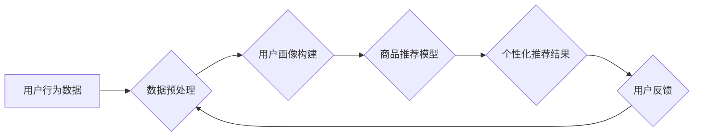

> AI, 购物粘性, 个性化推荐, 预测分析, 用户画像, 深度学习, 自然语言处理

## 1. 背景介绍

在当今数字化时代，电商平台竞争日益激烈。用户对购物体验的要求也越来越高，如何提升用户购物粘性成为电商平台发展的重要课题。传统电商平台依靠商品分类、标签和搜索等方式进行商品推荐，但这些方法缺乏个性化，难以满足用户多样化的需求。

人工智能（AI）技术的快速发展为提升用户购物粘性提供了新的机遇。AI能够通过分析用户行为、偏好和购买历史等数据，提供更精准、更个性化的商品推荐，从而提升用户购物体验和粘性。

## 2. 核心概念与联系

**2.1 购物粘性**

购物粘性是指用户对电商平台的重复访问和消费的倾向性。高购物粘性意味着用户更频繁地访问平台，购买更多商品，并对平台产生更高的忠诚度。

**2.2 AI 驱动的个性化推荐**

AI 驱动的个性化推荐是指利用 AI 技术分析用户数据，为用户推荐个性化的商品。

**2.3 用户画像**

用户画像是指对用户进行深入分析，构建出用户特征、行为模式、兴趣爱好等多维度的描述。

**2.4 预测分析**

预测分析是指利用历史数据和统计模型，预测未来用户的行为，例如购买意愿、浏览路径等。

**2.5  核心架构**



## 3. 核心算法原理 & 具体操作步骤

**3.1 算法原理概述**

AI 驱动的个性化推荐算法主要包括以下几种：

* **基于内容的推荐算法:** 根据用户历史购买记录、浏览记录等数据，推荐与用户兴趣相符的商品。
* **基于协同过滤的推荐算法:** 根据其他用户对商品的评分或购买记录，推荐与用户相似用户的商品。
* **基于深度学习的推荐算法:** 利用深度神经网络，从用户行为数据中学习用户兴趣和偏好，进行更精准的推荐。

**3.2 算法步骤详解**

以基于深度学习的推荐算法为例，其具体步骤如下：

1. **数据收集:** 收集用户行为数据，例如用户浏览记录、购买记录、评分记录等。
2. **数据预处理:** 对收集到的数据进行清洗、转换和特征提取，例如将用户浏览记录转换为用户兴趣向量。
3. **模型训练:** 利用深度学习模型，例如多层感知机（MLP）、深度神经网络（DNN）等，对预处理后的数据进行训练，学习用户兴趣和偏好。
4. **推荐生成:** 将训练好的模型应用于新的用户数据，预测用户对商品的兴趣，并生成个性化的商品推荐列表。
5. **效果评估:** 对推荐结果进行评估，例如点击率、转化率等，并根据评估结果进行模型优化。

**3.3 算法优缺点**

* **优点:** 能够学习用户复杂的兴趣偏好，提供更精准的推荐。
* **缺点:** 需要大量的训练数据，训练时间较长，模型复杂度较高。

**3.4 算法应用领域**

* **电商推荐:** 为用户推荐个性化的商品。
* **内容推荐:** 为用户推荐个性化的新闻、视频、音乐等内容。
* **广告推荐:** 为用户推荐个性化的广告。

## 4. 数学模型和公式 & 详细讲解 & 举例说明

**4.1 数学模型构建**

假设我们有一个用户-商品交互矩阵 $R$，其中 $R_{ui}$ 表示用户 $u$ 对商品 $i$ 的评分或购买行为。我们可以使用矩阵分解模型来学习用户和商品的潜在特征。

**4.2 公式推导过程**

矩阵分解模型的目标是将用户-商品交互矩阵 $R$ 分解成两个低维矩阵 $U$ 和 $V$，其中 $U$ 是用户特征矩阵，$V$ 是商品特征矩阵。

$$R \approx U V^T$$

其中，$U$ 是一个 $m \times k$ 的矩阵，$V$ 是一个 $n \times k$ 的矩阵，$k$ 是潜在特征的维度。

**4.3 案例分析与讲解**

例如，我们可以将用户特征矩阵 $U$ 中的每一行表示为一个用户的兴趣向量，商品特征矩阵 $V$ 中的每一列表示一个商品的属性向量。通过矩阵分解，我们可以学习到用户和商品的潜在特征，并利用这些特征进行个性化推荐。

## 5. 项目实践：代码实例和详细解释说明

**5.1 开发环境搭建**

* Python 3.6+
* TensorFlow 或 PyTorch
* Jupyter Notebook

**5.2 源代码详细实现**

```python
import tensorflow as tf

# 定义用户-商品交互矩阵
R = tf.constant([[5, 3, 4],
                 [4, 5, 2],
                 [3, 2, 5]])

# 定义潜在特征维度
k = 2

# 定义用户特征矩阵
U = tf.Variable(tf.random.normal([3, k]))

# 定义商品特征矩阵
V = tf.Variable(tf.random.normal([3, k]))

# 计算预测评分
predictions = tf.matmul(U, V, transpose_b=True)

# 定义损失函数
loss = tf.reduce_mean(tf.square(predictions - R))

# 定义优化器
optimizer = tf.keras.optimizers.Adam()

# 训练模型
for epoch in range(100):
    with tf.GradientTape() as tape:
        loss_value = loss
    gradients = tape.gradient(loss_value, [U, V])
    optimizer.apply_gradients(zip(gradients, [U, V]))

# 打印训练结果
print(predictions)
```

**5.3 代码解读与分析**

* 代码首先定义了用户-商品交互矩阵 $R$。
* 然后定义了潜在特征维度 $k$，以及用户特征矩阵 $U$ 和商品特征矩阵 $V$。
* 使用矩阵乘法计算预测评分，并定义损失函数和优化器。
* 最后使用梯度下降算法训练模型，并打印训练结果。

**5.4 运行结果展示**

训练完成后，我们可以使用预测评分矩阵来进行个性化推荐。例如，我们可以为用户 1 推荐评分最高的 3 个商品。

## 6. 实际应用场景

**6.1 个性化商品推荐**

电商平台可以利用 AI 驱动的个性化推荐算法，为用户推荐个性化的商品，提升用户购物体验和转化率。

**6.2 个性化内容推荐**

新闻网站、视频平台、音乐平台等可以利用 AI 驱动的个性化推荐算法，为用户推荐个性化的内容，提升用户粘性和参与度。

**6.3 个性化广告推荐**

广告平台可以利用 AI 驱动的个性化推荐算法，为用户推荐个性化的广告，提升广告点击率和转化率。

**6.4 未来应用展望**

随着 AI 技术的不断发展，AI 驱动的个性化推荐将在更多领域得到应用，例如医疗、教育、金融等。

## 7. 工具和资源推荐

**7.1 学习资源推荐**

* **书籍:**
    * 《深度学习》
    * 《推荐系统实践》
* **在线课程:**
    * Coursera: 深度学习
    * Udacity: 机器学习工程师

**7.2 开发工具推荐**

* **TensorFlow:** 开源深度学习框架
* **PyTorch:** 开源深度学习框架
* **Scikit-learn:** 机器学习库

**7.3 相关论文推荐**

* 《Collaborative Filtering for Implicit Feedback Datasets》
* 《Neural Collaborative Filtering》

## 8. 总结：未来发展趋势与挑战

**8.1 研究成果总结**

AI 驱动的个性化推荐技术取得了显著的成果，能够为用户提供更精准、更个性化的推荐，提升用户体验和粘性。

**8.2 未来发展趋势**

* **更精准的推荐:** 利用更先进的 AI 算法和模型，例如强化学习、迁移学习等，提升推荐的精准度。
* **更个性化的推荐:** 考虑用户更细粒度的特征，例如用户情绪、用户行为模式等，提供更个性化的推荐。
* **更交互式的推荐:** 利用自然语言处理技术，实现用户与推荐系统的交互，例如用户可以与推荐系统进行对话，表达自己的需求。

**8.3 面临的挑战**

* **数据稀疏性:** 用户-商品交互数据往往是稀疏的，难以训练有效的推荐模型。
* **冷启动问题:** 新用户和新商品难以获得有效的推荐。
* **用户隐私保护:** 个性化推荐需要收集和分析用户的个人数据，需要妥善处理用户隐私问题。

**8.4 研究展望**

未来研究将重点关注解决上述挑战，例如开发新的数据处理方法、冷启动算法和隐私保护技术，以提升 AI 驱动的个性化推荐的效率和安全性。

## 9. 附录：常见问题与解答

**9.1 如何解决数据稀疏性问题？**

可以使用以下方法解决数据稀疏性问题：

* **协同过滤:** 利用其他用户的行为数据进行推荐。
* **内容过滤:** 利用商品的属性信息进行推荐。
* **混合推荐:** 将协同过滤和内容过滤相结合进行推荐。

**9.2 如何解决冷启动问题？**

可以使用以下方法解决冷启动问题：

* **利用用户画像:** 根据用户的基本信息进行推荐。
* **利用商品属性:** 根据商品的属性信息进行推荐。
* **利用社会关系:** 利用用户的社交关系进行推荐。

**9.3 如何保护用户隐私？**

可以使用以下方法保护用户隐私：

* **数据匿名化:** 对用户数据进行匿名处理，去除个人识别信息。
* **差分隐私:** 利用差分隐私技术，保护用户数据在被使用过程中不被泄露。
* **联邦学习:** 利用联邦学习技术，在不共享用户数据的情况下进行模型训练。


作者：禅与计算机程序设计艺术 / Zen and the Art of Computer Programming 
<end_of_turn>