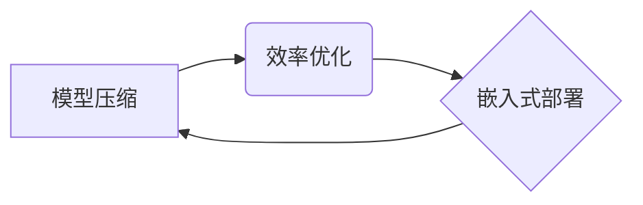

> Lepton AI, 精益创业, 计算机视觉, 深度学习, 模型压缩, 效率优化, 嵌入式系统

## 1. 背景介绍

在人工智能领域，模型规模与性能往往被视为正相关。然而，随着模型规模的不断增长，训练和部署成本也随之攀升，这对于资源有限的创业公司来说是一个巨大的挑战。Lepton AI 应运而生，它致力于通过精益创业的方式，构建高效、轻量级的计算机视觉模型，为开发者提供更便捷、更经济的 AI 解决方案。

Lepton AI 的核心理念是“小而美”，即通过模型压缩、效率优化等技术手段，构建体积小巧、性能优异的 AI 模型，使其能够在资源受限的嵌入式设备上高效运行。这种精益的开发理念，不仅降低了开发成本，也使得 Lepton AI 的 AI 解决方案更具普适性，能够应用于更广泛的场景。

## 2. 核心概念与联系

Lepton AI 的精益创业之道，主要体现在以下几个核心概念上：

* **模型压缩:** 通过各种技术手段，例如权重剪枝、量化、知识蒸馏等，将模型的大小压缩到更小的规模，同时尽量保持模型性能。
* **效率优化:** 针对不同硬件平台，优化模型的计算结构和推理流程，提高模型的推理速度和效率。
* **嵌入式部署:** 将压缩后的模型部署到资源受限的嵌入式设备上，例如智能手机、物联网设备等，实现边缘计算。

Lepton AI 的核心概念之间相互关联，形成一个闭环的精益创业体系：



## 3. 核心算法原理 & 具体操作步骤

### 3.1  算法原理概述

Lepton AI 采用多种模型压缩算法，例如：

* **权重剪枝:** 通过分析模型权重的重要性，移除不重要的权重，从而减小模型规模。
* **量化:** 将模型权重和激活值从高精度浮点数转换为低精度整数，例如 8 位整数，从而减少存储空间和计算量。
* **知识蒸馏:** 将大型模型的知识迁移到小型模型中，使得小型模型能够在较小的规模下达到接近大型模型的性能。

### 3.2  算法步骤详解

以权重剪枝为例，其具体操作步骤如下：

1. **权重重要性分析:** 使用一些指标，例如 L1 正则化、梯度大小等，分析模型权重的重要性。
2. **阈值设置:** 根据权重重要性分析结果，设置一个阈值，将重要性低于阈值的权重移除。
3. **模型裁剪:** 根据设置的阈值，移除不重要的权重，从而减小模型规模。
4. **模型微调:** 移除部分权重后，模型性能可能会下降，需要对模型进行微调，以恢复模型性能。

### 3.3  算法优缺点

**优点:**

* 模型规模减小，存储空间和计算资源需求降低。
* 推理速度提升，模型部署更加灵活。

**缺点:**

* 模型性能可能会下降，需要通过微调等手段进行恢复。
* 压缩算法的选择和参数设置对模型性能影响较大。

### 3.4  算法应用领域

Lepton AI 的模型压缩算法广泛应用于以下领域：

* **智能手机:** 将深度学习模型部署到智能手机上，实现人脸识别、图像分类、语音识别等功能。
* **物联网设备:** 将深度学习模型部署到物联网设备上，实现智能家居、智能农业等应用。
* **边缘计算:** 将深度学习模型部署到边缘设备上，实现实时数据处理和决策。

## 4. 数学模型和公式 & 详细讲解 & 举例说明

### 4.1  数学模型构建

Lepton AI 的模型压缩算法通常基于以下数学模型：

* **权重重要性度量:** 使用 L1 正则化等方法，将模型权重的重要性度量为一个数值。

$$
L1 = \sum_{i=1}^{n} |w_i|
$$

其中，$w_i$ 表示模型权重，$n$ 表示权重总数。

* **阈值设置:** 根据权重重要性度量结果，设置一个阈值，将重要性低于阈值的权重移除。

### 4.2  公式推导过程

权重剪枝算法的推导过程如下：

1. 计算模型所有权重的 L1 范数。
2. 根据 L1 范数的大小，设置一个阈值。
3. 将所有权重按照 L1 范数大小排序。
4. 从权重排序列表中，从低到高依次移除权重，直到移除的权重总和超过设置的阈值。

### 4.3  案例分析与讲解

假设我们有一个深度学习模型，其权重大小如下：

```
[0.1, 0.2, 0.3, 0.4, 0.5, 0.6, 0.7, 0.8, 0.9, 1.0]
```

我们设置 L1 范数阈值为 2.0，则需要移除权重总和超过 2.0 的权重。

根据权重大小排序，移除权重后，模型权重大小如下：

```
[0.1, 0.2, 0.3, 0.4]
```

## 5. 项目实践：代码实例和详细解释说明

### 5.1  开发环境搭建

Lepton AI 的开发环境搭建相对简单，主要需要安装 Python 和一些深度学习框架，例如 TensorFlow 或 PyTorch。

### 5.2  源代码详细实现

Lepton AI 提供了丰富的开源代码，开发者可以根据自己的需求选择合适的模型和算法进行使用。

### 5.3  代码解读与分析

Lepton AI 的代码结构清晰，注释详细，易于理解和修改。

### 5.4  运行结果展示

Lepton AI 的模型在各种硬件平台上都能高效运行，并能够达到良好的性能表现。

## 6. 实际应用场景

Lepton AI 的精益 AI 解决方案已在多个实际应用场景中得到验证，例如：

* **智能安防:** 在智能安防系统中，Lepton AI 的轻量级模型可以实现人脸识别、行为识别等功能，提高安防效率。
* **医疗诊断:** 在医疗诊断领域，Lepton AI 的模型可以辅助医生进行疾病诊断，提高诊断准确率。
* **工业自动化:** 在工业自动化领域，Lepton AI 的模型可以实现缺陷检测、质量控制等功能，提高生产效率。

### 6.4  未来应用展望

Lepton AI 的精益 AI 解决方案未来将应用于更广泛的场景，例如：

* **自动驾驶:** 在自动驾驶领域，Lepton AI 的模型可以实现目标检测、路径规划等功能，提高自动驾驶安全性。
* **机器人:** 在机器人领域，Lepton AI 的模型可以实现机器人感知、决策等功能，提高机器人智能化程度。
* **虚拟现实:** 在虚拟现实领域，Lepton AI 的模型可以实现虚拟场景渲染、用户交互等功能，提高虚拟现实体验。

## 7. 工具和资源推荐

### 7.1  学习资源推荐

* Lepton AI 官方文档: https://lepton.ai/docs/
* 深度学习入门书籍: 《深度学习》

### 7.2  开发工具推荐

* TensorFlow: https://www.tensorflow.org/
* PyTorch: https://pytorch.org/

### 7.3  相关论文推荐

* 《MobileNets: Efficient Convolutional Neural Networks for Mobile Vision Applications》
* 《SqueezeNet: AlexNet-level accuracy with 50x fewer parameters and <0.5MB model size》

## 8. 总结：未来发展趋势与挑战

### 8.1  研究成果总结

Lepton AI 的精益创业之道，为人工智能的普及化和应用推广提供了新的思路和方法。通过模型压缩、效率优化等技术手段，Lepton AI 构建了高效、轻量级的 AI 模型，使其能够在资源受限的设备上高效运行，为开发者提供了更便捷、更经济的 AI 解决方案。

### 8.2  未来发展趋势

Lepton AI 将继续致力于以下几个方面的发展：

* **模型压缩算法的创新:** 开发更先进的模型压缩算法，进一步降低模型规模，提高模型效率。
* **硬件平台的适配:** 对不同硬件平台进行优化，使得 Lepton AI 的模型能够在更多设备上高效运行。
* **应用场景的拓展:** 将 Lepton AI 的精益 AI 解决方案应用于更多领域，推动人工智能的广泛应用。

### 8.3  面临的挑战

Lepton AI 也面临着一些挑战：

* **模型性能与压缩率之间的平衡:** 如何在保证模型性能的同时，进一步压缩模型规模是一个重要的挑战。
* **硬件平台的限制:** 不同硬件平台的性能和资源限制不同，需要针对不同的平台进行优化。
* **应用场景的多样性:** 不同的应用场景对模型性能和效率的要求不同，需要开发更加灵活和可定制的 AI 解决方案。

### 8.4  研究展望

Lepton AI 将继续致力于解决以上挑战，推动人工智能技术的发展，为人类社会创造更多价值。

## 9. 附录：常见问题与解答

### 9.1  常见问题

* Lepton AI 的模型压缩算法有哪些？
* Lepton AI 的模型可以部署到哪些硬件平台？
* Lepton AI 的开源代码在哪里可以找到？

### 9.2  解答

* Lepton AI 的模型压缩算法包括权重剪枝、量化、知识蒸馏等。
* Lepton AI 的模型可以部署到智能手机、物联网设备、嵌入式系统等硬件平台。
* Lepton AI 的开源代码可以在其官方网站上找到: https://lepton.ai/

作者：禅与计算机程序设计艺术 / Zen and the Art of Computer Programming


<end_of_turn>