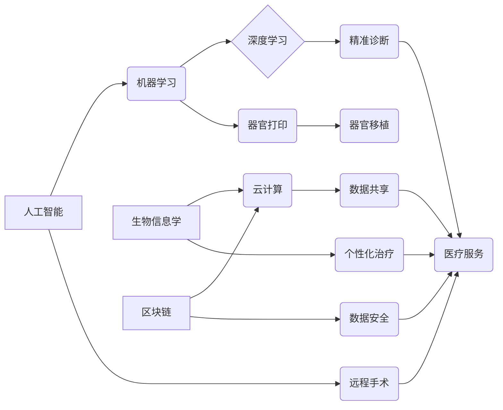

> 智能医疗，远程手术，器官打印，人工智能，机器学习，生物信息学，云计算，区块链

## 1. 背景介绍

医疗健康领域一直是人类社会关注的焦点。随着科技的飞速发展，人工智能、机器学习、生物信息学等技术正在深刻地改变着医疗健康的面貌。2050年，智能医疗将成为医疗保健的主流模式，其核心特征是：

* **个性化医疗：** 基于患者的基因信息、生活方式和病史等数据，提供定制化的诊断、治疗和预防方案。
* **精准医疗：** 利用大数据分析和人工智能算法，精准识别疾病风险和预测治疗效果，实现早期诊断和精准治疗。
* **远程医疗：** 通过远程医疗平台，患者可以随时随地获得医疗服务，打破地域限制，提高医疗服务的可及性。
* **智能辅助：** 人工智能辅助医生进行诊断、治疗决策，提高医疗效率和准确性。

## 2. 核心概念与联系

智能医疗的实现依赖于多个核心概念和技术的协同作用，包括：

* **人工智能 (AI)：** 赋予计算机模拟人类智能的能力，例如学习、推理、决策和语言理解。
* **机器学习 (ML)：** 一种人工智能技术，通过算法从数据中学习模式和规律，不断提高预测和决策能力。
* **深度学习 (DL)：** 一种更高级的机器学习技术，利用多层神经网络模拟人类大脑的学习机制，能够处理更复杂的数据和任务。
* **生物信息学 (Bioinformatics)：** 将生物学和计算机科学相结合，利用计算方法分析和处理生物数据，例如基因组序列、蛋白质结构和药物作用机制。
* **云计算 (Cloud Computing)：** 提供弹性、可扩展的计算资源和存储服务，支持大规模数据处理和人工智能模型训练。
* **区块链 (Blockchain)：** 一种分布式账本技术，能够确保数据安全、透明和不可篡改，适用于医疗数据的共享和管理。

**核心概念与联系流程图:**



## 3. 核心算法原理 & 具体操作步骤

### 3.1  算法原理概述

智能医疗的核心算法主要包括机器学习算法、深度学习算法和生物信息学算法。

* **机器学习算法：** 用于从数据中学习模式和规律，例如支持向量机 (SVM)、决策树 (Decision Tree)、随机森林 (Random Forest) 和逻辑回归 (Logistic Regression)。
* **深度学习算法：** 利用多层神经网络模拟人类大脑的学习机制，例如卷积神经网络 (CNN)、循环神经网络 (RNN) 和生成对抗网络 (GAN)。
* **生物信息学算法：** 用于分析和处理生物数据，例如基因组比对、蛋白质结构预测和药物靶点发现。

### 3.2  算法步骤详解

以机器学习算法为例，其基本步骤包括：

1. **数据收集和预处理：** 收集相关医疗数据，并进行清洗、转换和特征工程等预处理操作。
2. **模型选择：** 根据具体任务选择合适的机器学习算法模型。
3. **模型训练：** 利用训练数据训练模型参数，使模型能够学习数据中的模式和规律。
4. **模型评估：** 利用测试数据评估模型的性能，例如准确率、召回率和F1-score。
5. **模型部署：** 将训练好的模型部署到实际应用场景中，用于预测、诊断或治疗决策。

### 3.3  算法优缺点

**机器学习算法：**

* **优点：** 能够从数据中学习复杂模式，具有较高的预测精度。
* **缺点：** 需要大量的数据进行训练，对数据质量要求较高，解释性较差。

**深度学习算法：**

* **优点：** 能够处理更复杂的数据，具有更强的学习能力，能够自动提取特征。
* **缺点：** 需要更大的计算资源和训练数据，训练时间较长，解释性较差。

**生物信息学算法：**

* **优点：** 能够分析和处理生物数据，为疾病诊断和治疗提供新的思路。
* **缺点：** 生物数据复杂，算法开发难度较大，需要跨学科合作。

### 3.4  算法应用领域

智能医疗算法广泛应用于以下领域：

* **疾病诊断：** 利用机器学习和深度学习算法分析患者的影像、基因和临床数据，辅助医生进行疾病诊断。
* **疾病预测：** 利用机器学习算法分析患者的历史数据和生活习惯，预测疾病风险。
* **个性化治疗：** 利用生物信息学算法分析患者的基因信息，制定个性化的治疗方案。
* **药物研发：** 利用机器学习和深度学习算法加速药物研发过程，发现新的药物靶点和候选药物。

## 4. 数学模型和公式 & 详细讲解 & 举例说明

### 4.1  数学模型构建

在智能医疗领域，常用的数学模型包括：

* **线性回归模型：** 用于预测连续变量，例如患者的年龄、血压和血糖水平。

$$
y = \beta_0 + \beta_1x_1 + \beta_2x_2 + ... + \beta_nx_n + \epsilon
$$

其中：

* $y$ 是预测变量
* $x_1, x_2, ..., x_n$ 是自变量
* $\beta_0, \beta_1, ..., \beta_n$ 是模型参数
* $\epsilon$ 是误差项

* **逻辑回归模型：** 用于预测分类变量，例如患者是否患有某种疾病。

$$
P(Y=1|X) = \frac{1}{1 + e^{-( \beta_0 + \beta_1x_1 + \beta_2x_2 + ... + \beta_nx_n )}}
$$

其中：

* $P(Y=1|X)$ 是患者患有疾病的概率
* $X$ 是患者的特征向量
* $\beta_0, \beta_1, ..., \beta_n$ 是模型参数

### 4.2  公式推导过程

上述公式的推导过程涉及到概率论、统计学和线性代数等数学知识。

### 4.3  案例分析与讲解

例如，利用线性回归模型预测患者的血糖水平，可以将患者的年龄、体重、饮食习惯等特征作为自变量，血糖水平作为因变量。通过训练模型，可以得到模型参数，并利用这些参数预测其他患者的血糖水平。

## 5. 项目实践：代码实例和详细解释说明

### 5.1  开发环境搭建

智能医疗项目开发通常需要以下开发环境：

* **操作系统：** Linux、Windows 或 macOS
* **编程语言：** Python、Java 或 C++
* **机器学习框架：** TensorFlow、PyTorch 或 scikit-learn
* **云计算平台：** AWS、Azure 或 Google Cloud

### 5.2  源代码详细实现

以下是一个使用 Python 和 scikit-learn 库实现线性回归模型预测患者血糖水平的代码示例：

```python
import pandas as pd
from sklearn.linear_model import LinearRegression
from sklearn.model_selection import train_test_split

# 加载数据
data = pd.read_csv("diabetes_data.csv")

# 分割数据
X = data[['age', 'weight', 'diet']]
y = data['blood_sugar']
X_train, X_test, y_train, y_test = train_test_split(X, y, test_size=0.2, random_state=42)

# 创建线性回归模型
model = LinearRegression()

# 训练模型
model.fit(X_train, y_train)

# 预测测试数据
y_pred = model.predict(X_test)

# 评估模型性能
from sklearn.metrics import mean_squared_error
mse = mean_squared_error(y_test, y_pred)
print(f"Mean Squared Error: {mse}")
```

### 5.3  代码解读与分析

* 首先，加载糖尿病患者的数据集。
* 然后，将年龄、体重和饮食习惯作为自变量，血糖水平作为因变量。
* 使用 `train_test_split` 函数将数据分为训练集和测试集。
* 创建一个线性回归模型，并使用 `fit` 方法训练模型。
* 使用训练好的模型预测测试数据的血糖水平。
* 最后，使用 `mean_squared_error` 函数评估模型的性能。

### 5.4  运行结果展示

运行上述代码后，会输出测试数据的预测血糖水平和均方误差值。

## 6. 实际应用场景

### 6.1  远程手术

远程手术是指通过网络连接，由远程医生进行手术操作。智能医疗技术可以为远程手术提供以下支持：

* **高清晰度影像传输：** 利用5G网络和人工智能算法，实现高清晰度、低延迟的影像传输，使远程医生能够清晰地看到手术现场。
* **机器人辅助手术：** 利用机器人技术，远程医生可以远程控制手术机器人进行手术操作，提高手术精度和安全性。
* **远程专家咨询：** 远程手术过程中，远程医生可以与当地医生进行实时视频通话，进行远程专家咨询，提高手术决策的准确性。

### 6.2  器官打印

器官打印是指利用3D打印技术，将生物材料打印成人工器官。智能医疗技术可以为器官打印提供以下支持：

* **生物材料设计：** 利用生物信息学和材料科学，设计出更接近人体组织的生物材料。
* **打印工艺优化：** 利用人工智能算法，优化3D打印工艺参数，提高打印精度和器官功能。
* **器官功能测试：** 利用微流控技术和传感器，对打印出的器官进行功能测试，确保其能够正常工作。

### 6.3  精准诊断

精准诊断是指根据患者的个体特征，进行个性化的疾病诊断。智能医疗技术可以为精准诊断提供以下支持：

* **影像分析：** 利用深度学习算法，分析患者的影像数据，例如X光片、CT扫描和MRI扫描，辅助医生进行疾病诊断。
* **基因检测：** 利用基因测序技术，分析患者的基因信息，识别疾病风险和预测治疗效果。
* **临床数据分析：** 利用机器学习算法，分析患者的临床数据，例如病史、体征和实验室检查结果，辅助医生进行疾病诊断。

### 6.4  未来应用展望

智能医疗技术的发展将带来以下未来应用展望：

* **虚拟医生：** 利用人工智能技术，开发出虚拟医生，为患者提供24小时的医疗咨询和服务。
* **智能医疗器械：** 利用人工智能技术，开发出智能医疗器械，例如智能血糖仪、智能血压计和智能心电图仪，帮助患者更好地管理自己的健康。
* **个性化医疗方案：** 利用人工智能技术，为患者提供个性化的医疗方案，例如个性化的药物治疗方案和个性化的康复方案。

## 7. 工具和资源推荐

### 7.1  学习资源推荐

* **在线课程：** Coursera、edX、Udacity 等平台提供人工智能、机器学习和生物信息学等领域的在线课程。
* **书籍：** 《深度学习》、《机器学习实战》、《生物信息学导论》等书籍。
* **开源项目：** TensorFlow、PyTorch、scikit-learn 等开源项目。

### 7.2  开发工具推荐

* **编程语言：** Python、Java 或 C++
* **机器学习框架：** TensorFlow、PyTorch 或 scikit-learn
* **云计算平台：