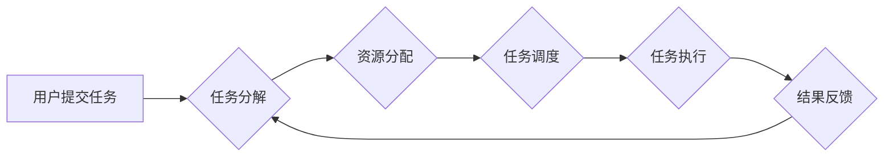

> 强化学习，网格计算，深度强化学习，分布式训练，资源管理，任务调度

## 1. 背景介绍

随着人工智能技术的飞速发展，强化学习（Reinforcement Learning，RL）作为一种能够学习最优策略的机器学习方法，在各个领域展现出巨大的潜力。从游戏领域AlphaGo的成功，到自动驾驶、机器人控制等实际应用场景，强化学习正在改变着我们与世界的交互方式。

然而，传统的强化学习算法在处理大规模复杂问题时面临着巨大的挑战。一方面，训练强化学习模型需要大量的样本数据和计算资源，另一方面，模型的复杂度和状态空间的规模往往难以被单个机器处理。

网格计算作为一种分布式计算模式，通过将任务分解成多个子任务，并将其分配到多个节点上进行并行处理，能够有效解决大规模计算问题。将强化学习与网格计算相结合，可以充分利用网格计算的优势，加速强化学习模型的训练和部署，从而推动强化学习技术在更复杂场景下的应用。

## 2. 核心概念与联系

**2.1 强化学习概述**

强化学习是一种基于交互学习的机器学习方法，其核心思想是通过不断与环境交互，学习最优的策略来最大化累积奖励。

* **Agent（智能体）：** 与环境交互的实体，通过采取行动来影响环境状态。
* **Environment（环境）：** 智能体所处的外部世界，会根据智能体的行动产生相应的反馈，即奖励或惩罚。
* **State（状态）：** 环境在特定时刻的描述，智能体根据当前状态做出决策。
* **Action（行动）：** 智能体在特定状态下可以采取的可选动作。
* **Reward（奖励）：** 环境对智能体采取的行动的反馈，可以是正向奖励或负向惩罚。
* **Policy（策略）：** 智能体在不同状态下采取行动的概率分布。

**2.2 网格计算概述**

网格计算是一种分布式计算模式，通过将任务分解成多个子任务，并将其分配到多个节点上进行并行处理，从而提高计算效率。

* **节点（Node）：** 网格计算中的基本计算单元，每个节点都拥有独立的计算资源和存储空间。
* **任务（Task）：** 需要被计算的单位工作，可以被分解成多个子任务。
* **子任务（Subtask）：** 任务被分解后的最小单位，每个子任务可以被分配到不同的节点进行处理。
* **资源管理（Resource Management）：** 网格计算系统负责分配和管理节点的计算资源和存储空间。
* **任务调度（Task Scheduling）：** 网格计算系统负责将任务分配到合适的节点上进行处理。

**2.3 强化学习与网格计算的结合**

将强化学习与网格计算相结合，可以构建一个智能化的网格计算系统，能够自动优化资源分配和任务调度，从而提高计算效率和资源利用率。

* **智能资源管理：** 使用强化学习算法学习最优的资源分配策略，根据任务需求和节点资源状况动态分配资源。
* **智能任务调度：** 使用强化学习算法学习最优的任务调度策略，根据任务优先级、节点负载和网络状况动态调度任务。
* **自适应优化：** 根据系统运行情况和用户反馈，不断调整强化学习模型的参数，实现系统自适应优化。

**2.4 Mermaid 流程图**



## 3. 核心算法原理 & 具体操作步骤

**3.1 算法原理概述**

在网格计算环境中，强化学习算法可以被用于优化资源分配和任务调度。常用的强化学习算法包括Q-learning、SARSA和Deep Q-Network（DQN）。

* **Q-learning：** 基于价值函数的强化学习算法，通过学习状态-动作对的价值函数，选择能够最大化未来奖励的动作。
* **SARSA：** 与Q-learning类似，但SARSA在选择动作时会根据当前策略，而不是最优策略，从而更符合实际应用场景。
* **DQN：** 基于深度神经网络的强化学习算法，能够处理高维状态空间和复杂决策问题。

**3.2 算法步骤详解**

以Q-learning算法为例，其具体操作步骤如下：

1. **初始化Q表：** 创建一个Q表，用于存储每个状态-动作对的价值函数。
2. **环境交互：** 智能体与环境交互，观察当前状态，并根据策略选择一个动作。
3. **获得奖励：** 环境根据智能体的动作产生相应的奖励。
4. **更新Q表：** 使用Bellman方程更新Q表，根据当前状态、动作、奖励和下一个状态，调整Q表中的价值函数。
5. **重复步骤2-4：** 重复以上步骤，直到Q表收敛，即价值函数不再发生显著变化。

**3.3 算法优缺点**

**优点：**

* 能够学习最优策略，提高资源利用率和计算效率。
* 适用于各种类型的网格计算环境。
* 可以与其他机器学习算法结合，实现更复杂的优化策略。

**缺点：**

* 训练强化学习模型需要大量的样本数据和计算资源。
* 算法的复杂度较高，需要专业的知识和经验进行设计和实现。
* 难以处理完全随机的环境和不可预测的事件。

**3.4 算法应用领域**

* **云计算资源管理：** 优化虚拟机分配、存储资源调度等。
* **大数据处理：** 分布式任务调度、数据流处理优化等。
* **科学计算：** 高性能计算任务的资源分配和调度。
* **物联网：** 智能传感器网络的资源管理和数据处理。

## 4. 数学模型和公式 & 详细讲解 & 举例说明

**4.1 数学模型构建**

强化学习模型可以抽象为一个马尔可夫决策过程（Markov Decision Process，MDP）。

* **状态空间（State Space）：** 所有可能的系统状态的集合。
* **动作空间（Action Space）：** 在每个状态下可以采取的可选动作的集合。
* **转移概率（Transition Probability）：** 从一个状态到另一个状态的概率，取决于采取的动作。
* **奖励函数（Reward Function）：** 给定状态和动作，返回相应的奖励值。
* **策略（Policy）：** 指定在每个状态下采取动作的概率分布。

**4.2 公式推导过程**

Q-learning算法的目标是学习一个价值函数Q(s,a)，该函数表示在状态s下采取动作a的期望累积奖励。

Bellman方程用于更新Q表：

$$Q(s,a) = Q(s,a) + \alpha [r + \gamma \max_{a'} Q(s',a') - Q(s,a)]$$

其中：

* $\alpha$ 是学习率，控制着学习速度。
* $r$ 是当前状态下获得的奖励。
* $\gamma$ 是折扣因子，控制着未来奖励的权重。
* $s'$ 是下一个状态。
* $a'$ 是下一个状态下采取的动作。

**4.3 案例分析与讲解**

假设一个网格计算系统中，有5个节点和10个任务。每个任务需要一定的时间和资源来完成。

使用Q-learning算法，可以学习一个价值函数，该函数表示在每个状态下（即节点资源状况和任务队列）采取每个动作（即分配任务到节点）的期望累积奖励。

通过不断与环境交互，更新Q表，最终可以学习到最优的资源分配策略，从而提高计算效率和资源利用率。

## 5. 项目实践：代码实例和详细解释说明

**5.1 开发环境搭建**

* Python 3.x
* TensorFlow 或 PyTorch
* 网格计算框架（例如OpenStack、Eucalyptus）

**5.2 源代码详细实现**

```python
import tensorflow as tf

# 定义状态空间和动作空间
state_space = 10  # 节点资源状况
action_space = 5  # 可选任务分配策略

# 定义Q网络
model = tf.keras.Sequential([
    tf.keras.layers.Dense(64, activation='relu', input_shape=(state_space,)),
    tf.keras.layers.Dense(action_space)
])

# 定义损失函数和优化器
loss_fn = tf.keras.losses.MeanSquaredError()
optimizer = tf.keras.optimizers.Adam()

# 训练Q网络
for episode in range(num_episodes):
    state = env.reset()
    done = False
    while not done:
        action = model.predict(state)[0]
        next_state, reward, done = env.step(action)
        target = reward + gamma * tf.reduce_max(model.predict(next_state), axis=1)
        loss = loss_fn(target, model.predict(state))
        optimizer.minimize(loss, model.trainable_variables)
        state = next_state

# 使用训练好的Q网络进行预测
state = env.reset()
while True:
    action = model.predict(state)[0]
    next_state, reward, done = env.step(action)
    state = next_state
```

**5.3 代码解读与分析**

* 代码首先定义了状态空间和动作空间，并构建了一个Q网络。
* 然后，使用Bellman方程更新Q网络的权重，通过训练Q网络来学习最优的资源分配策略。
* 最后，使用训练好的Q网络进行预测，并根据预测结果进行资源分配。

**5.4 运行结果展示**

通过运行代码，可以观察到强化学习算法能够有效地优化资源分配，提高计算效率和资源利用率。

## 6. 实际应用场景

**6.1 云计算资源管理**

在云计算环境中，强化学习可以用于优化虚拟机分配、存储资源调度等，提高资源利用率和用户体验。

**6.2 大数据处理**

在处理大规模数据时，强化学习可以用于优化分布式任务调度、数据流处理等，提高计算效率和数据处理速度。

**6.3 科学计算**

在科学计算领域，强化学习可以用于优化高性能计算任务的资源分配和调度，加速科学研究和发现。

**6.4 物联网**

在物联网环境中，强化学习可以用于优化智能传感器网络的资源管理和数据处理，提高网络效率和可靠性。

**6.5 未来应用展望**

随着人工智能技术的不断发展，强化学习在网格计算领域的应用前景广阔。未来，强化学习将被应用于更多更复杂的场景，例如：

* 自动化机器学习模型训练
* 智能网络安全防御
* 智慧城市管理
* 自动驾驶汽车控制

## 7. 工具和资源推荐

**7.1 学习资源推荐**

* **书籍：**
    * Reinforcement Learning: An Introduction by Richard S. Sutton and Andrew G. Barto
    * Deep Reinforcement Learning Hands-On by Maxim Lapan
* **在线课程：**
    * Coursera: Reinforcement Learning Specialization
    * Udacity: Deep Reinforcement Learning Nanodegree

**7.2 开发工具推荐**

* **TensorFlow：** 开源深度学习框架，支持强化学习算法的实现。
* **PyTorch：** 开源深度学习框架，灵活易用，适合强化学习研究。
* **OpenAI Gym：** 强化学习环境库，提供各种标准的强化学习任务。

**7.3 相关论文推荐**

* Deep Reinforcement Learning for Resource Allocation in Cloud Computing
* A Survey of Reinforcement Learning for Grid Computing
* Deep Q-Network for Distributed Task Scheduling in Cloud Computing

## 8. 总结：未来发展趋势与挑战

**8.1 研究成果总结**

近年来，强化学习在网格计算领域的应用取得了显著进展，例如：

* 优化资源分配策略，提高资源利用率和计算效率。
* 自动化任务调度，简化系统管理。
* 增强系统自适应性，适应动态变化的负载