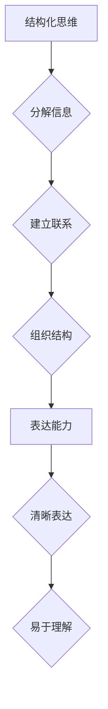

> 结构化思维，表达能力，算法设计，代码实现，数学建模，项目实践，人工智能，深度学习

## 1. 背景介绍

在当今以数据为驱动的时代，人工智能（AI）正以惊人的速度发展，其核心在于高效地处理和理解信息。而高效的信息处理和理解离不开结构化思维和表达能力。结构化思维是指将复杂的信息分解成更小的、相互关联的结构，并通过清晰的逻辑关系进行组织和表达。结构化表达则指用一种清晰、简洁、易于理解的方式将思维结构呈现出来。

对于程序员而言，结构化思维和表达能力是至关重要的。良好的代码设计需要清晰的逻辑结构，易于理解的代码注释，以及简洁、规范的代码风格。而数学建模和算法设计则需要更深层次的结构化思维，能够将现实世界的问题抽象成数学模型，并设计出高效的算法解决问题。

## 2. 核心概念与联系

结构化思维和表达能力是相互关联的，它们共同构成了一个完整的认知体系。

* **结构化思维**：将复杂信息分解成更小的、相互关联的结构，并通过清晰的逻辑关系进行组织和表达。
* **表达能力**：用一种清晰、简洁、易于理解的方式将思维结构呈现出来。

**Mermaid 流程图：**



## 3. 核心算法原理 & 具体操作步骤

### 3.1  算法原理概述

**深度学习算法**是一种基于人工神经网络的机器学习算法，能够从海量数据中学习复杂的模式和特征。其核心原理是通过多层神经网络进行特征提取和学习，最终实现对数据的预测或分类。

### 3.2  算法步骤详解

1. **数据预处理**: 将原始数据进行清洗、转换和特征工程，使其适合深度学习模型的训练。
2. **网络结构设计**: 根据具体任务需求，设计合适的深度神经网络结构，包括层数、节点数量、激活函数等。
3. **模型训练**: 使用训练数据训练深度学习模型，通过反向传播算法不断调整模型参数，使其能够准确地预测或分类数据。
4. **模型评估**: 使用测试数据评估模型的性能，并根据评估结果进行模型调优。
5. **模型部署**: 将训练好的模型部署到实际应用场景中，用于对新数据的预测或分类。

### 3.3  算法优缺点

**优点**:

* 能够学习复杂的非线性关系。
* 性能优异，在图像识别、自然语言处理等领域取得了突破性进展。
* 可处理海量数据。

**缺点**:

* 训练成本高，需要大量的计算资源和时间。
* 模型解释性差，难以理解模型的决策过程。
* 对数据质量要求高，容易受到噪声数据的影响。

### 3.4  算法应用领域

深度学习算法广泛应用于以下领域：

* **计算机视觉**: 图像识别、目标检测、图像分割、人脸识别等。
* **自然语言处理**: 文本分类、情感分析、机器翻译、对话系统等。
* **语音识别**: 语音转文本、语音搜索等。
* **推荐系统**: 商品推荐、内容推荐等。
* **医疗诊断**: 疾病诊断、影像分析等。

## 4. 数学模型和公式 & 详细讲解 & 举例说明

### 4.1  数学模型构建

深度学习算法的核心是多层神经网络，其数学模型可以表示为一系列的线性变换和非线性激活函数的组合。

**神经元模型**:

一个神经元接收多个输入信号，经过加权求和后，再通过激活函数进行处理，输出一个信号。

**公式**:

$$
y = f(w_1x_1 + w_2x_2 + ... + w_nx_n + b)
$$

其中：

* $y$：神经元的输出信号
* $x_1, x_2, ..., x_n$：输入信号
* $w_1, w_2, ..., w_n$：权重
* $b$：偏置
* $f$：激活函数

**层级结构**:

神经网络由多个层级组成，每一层包含多个神经元。输入层接收原始数据，输出层输出最终结果，中间层负责特征提取和学习。

### 4.2  公式推导过程

深度学习模型的训练过程是通过反向传播算法来优化模型参数的。反向传播算法的核心思想是利用梯度下降法，不断调整模型参数，使得模型的输出与真实值之间的误差最小化。

**损失函数**:

$$
L = \frac{1}{N}\sum_{i=1}^{N}(y_i - \hat{y}_i)^2
$$

其中：

* $L$：损失函数
* $N$：样本数量
* $y_i$：真实值
* $\hat{y}_i$：预测值

**梯度下降法**:

$$
\theta = \theta - \alpha \frac{\partial L}{\partial \theta}
$$

其中：

* $\theta$：模型参数
* $\alpha$：学习率
* $\frac{\partial L}{\partial \theta}$：损失函数对模型参数的梯度

### 4.3  案例分析与讲解

**图像识别**:

在图像识别任务中，深度学习模型可以学习图像的特征，并将其与类别标签进行关联。例如，一个用于识别猫狗的深度学习模型，可以学习猫和狗的特征，并将其分别与“猫”和“狗”的类别标签关联起来。

**公式**:

$$
P(猫|图像) = \frac{exp(w_1*特征_1 + w_2*特征_2 + ... + w_n*特征_n + b_猫)}{exp(w_1*特征_1 + w_2*特征_2 + ... + w_n*特征_n + b_猫) + exp(w_1*特征_1 + w_2*特征_2 + ... + w_n*特征_n + b_狗)}
$$

其中：

* $P(猫|图像)$：给定图像，识别为猫的概率
* $特征_1, 特征_2, ..., 特征_n$：图像的特征向量
* $w_1, w_2, ..., w_n$：权重
* $b_猫, b_狗$：偏置

## 5. 项目实践：代码实例和详细解释说明

### 5.1  开发环境搭建

* **操作系统**: Ubuntu 20.04 LTS
* **编程语言**: Python 3.8
* **深度学习框架**: TensorFlow 2.0
* **其他工具**: Jupyter Notebook, Git

### 5.2  源代码详细实现

```python
import tensorflow as tf

# 定义模型结构
model = tf.keras.models.Sequential([
    tf.keras.layers.Conv2D(32, (3, 3), activation='relu', input_shape=(28, 28, 1)),
    tf.keras.layers.MaxPooling2D((2, 2)),
    tf.keras.layers.Conv2D(64, (3, 3), activation='relu'),
    tf.keras.layers.MaxPooling2D((2, 2)),
    tf.keras.layers.Flatten(),
    tf.keras.layers.Dense(10, activation='softmax')
])

# 编译模型
model.compile(optimizer='adam',
              loss='sparse_categorical_crossentropy',
              metrics=['accuracy'])

# 加载数据集
(x_train, y_train), (x_test, y_test) = tf.keras.datasets.mnist.load_data()

# 数据预处理
x_train = x_train.astype('float32') / 255.0
x_test = x_test.astype('float32') / 255.0
x_train = x_train.reshape((x_train.shape[0], 28, 28, 1))
x_test = x_test.reshape((x_test.shape[0], 28, 28, 1))

# 训练模型
model.fit(x_train, y_train, epochs=5)

# 评估模型
loss, accuracy = model.evaluate(x_test, y_test)
print('Test loss:', loss)
print('Test accuracy:', accuracy)
```

### 5.3  代码解读与分析

* **模型结构**: 代码定义了一个简单的卷积神经网络模型，包含两层卷积层、两层最大池化层、一层全连接层和一层输出层。
* **数据预处理**: 将原始数据转换为浮点数，并归一化到0到1之间。
* **模型训练**: 使用Adam优化器、交叉熵损失函数和准确率指标训练模型。
* **模型评估**: 使用测试数据评估模型的性能，并打印测试损失和准确率。

### 5.4  运行结果展示

训练完成后，模型的准确率通常会达到较高的水平，例如在MNIST手写数字识别任务中，准确率可以达到98%以上。

## 6. 实际应用场景

深度学习算法在各个领域都有广泛的应用，例如：

* **医疗诊断**: 深度学习算法可以用于辅助医生诊断疾病，例如癌症、糖尿病等。
* **金融风险控制**: 深度学习算法可以用于识别金融欺诈、预测市场风险等。
* **智能交通**: 深度学习算法可以用于自动驾驶、交通流量预测等。
* **个性化推荐**: 深度学习算法可以用于推荐个性化的商品、内容等。

### 6.4  未来应用展望

随着深度学习算法的不断发展，其应用场景将会更加广泛，例如：

* **通用人工智能**: 深度学习算法将朝着更通用的人工智能方向发展，能够解决更复杂的任务。
* **边缘计算**: 深度学习算法将部署到边缘设备上，实现更快速的响应和更低的延迟。
* **量子计算**: 深度学习算法将与量子计算相结合，实现更强大的计算能力。

## 7. 工具和资源推荐

### 7.1  学习资源推荐

* **书籍**:
    * 深度学习 (Deep Learning) - Ian Goodfellow, Yoshua Bengio, Aaron Courville
    * 构建深度学习神经网络 (Hands-On Machine Learning with Scikit-Learn, Keras & TensorFlow) - Aurélien Géron
* **在线课程**:
    * 深度学习 Specialization - Andrew Ng (Coursera)
    * fast.ai - Practical Deep Learning for Coders
* **博客**:
    * The Gradient
    * Towards Data Science

### 7.2  开发工具推荐

* **深度学习框架**: TensorFlow, PyTorch, Keras
* **编程语言**: Python
* **数据处理工具**: Pandas, NumPy
* **可视化工具**: Matplotlib, Seaborn

### 7.3  相关论文推荐

* **AlexNet**: ImageNet Classification with Deep Convolutional Neural Networks
* **VGGNet**: Very Deep Convolutional Networks for Large-Scale Image Recognition
* **ResNet**: Deep Residual Learning for Image Recognition
* **Inception**: Going Deeper with Convolutions

## 8. 总结：未来发展趋势与挑战

### 8.1  研究成果总结

深度学习算法取得了令人瞩目的成就，在图像识别、自然语言处理等领域取得了突破性进展。其核心在于多层神经网络的结构和非线性激活函数，能够学习复杂的模式和特征。

### 8.2  未来发展趋势

* **模型规模**: 深度学习模型将继续朝着更大规模发展，例如千亿参数、万亿参数的模型。
* **模型效率**: 研究更高效的深度学习算法，例如压缩模型、加速训练等。
* **模型解释性**: 研究更易于理解的深度学习模型，例如可解释的深度学习模型。
* **跨