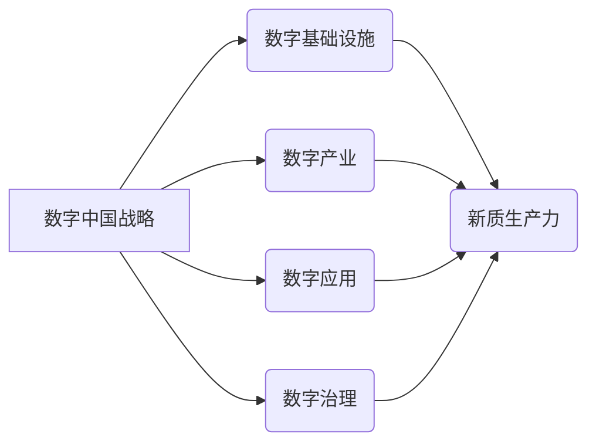

> 数字中国战略, 新质生产力, 互联网技术, 大数据, 人工智能, 云计算, 区块链, 数字孪生, 智慧城市

## 1. 背景介绍

21世纪初，以互联网、大数据、人工智能等为代表的新一代信息技术蓬勃发展，深刻地改变着人类社会生产方式和生活方式。中国政府于2021年发布了《数字中国建设整体方案》，明确提出要以数字技术为驱动，构建数字经济新格局，推动数字中国建设。

数字中国战略的提出，标志着中国迈向数字经济时代的关键一步。其核心目标是通过数字化转型，提升国家治理能力和服务水平，推动经济社会高质量发展。

新质生产力是数字经济的核心驱动力，其本质是利用数字技术，提高生产效率、降低生产成本、创造新的生产要素和价值。数字中国战略的实施，将为新质生产力的发展提供强大的支撑和平台。

## 2. 核心概念与联系

**2.1 数字中国战略**

数字中国战略是指以信息化、数字化、智能化为目标，构建数字经济新格局，推动数字社会发展，实现数字中国建设的国家战略。其核心内容包括：

* **构建数字基础设施：** 完善网络基础设施、数据中心、云计算平台等，为数字经济发展提供坚实基础。
* **发展数字产业：** 培育壮大数字经济核心产业，如互联网、大数据、人工智能、云计算等，推动数字产业链条升级。
* **提升数字应用水平：** 推广数字技术应用于各行各业，提升生产效率、服务水平和生活质量。
* **加强数字治理：** 建立健全数字经济监管体系，保障数字经济安全稳定发展。

**2.2 新质生产力**

新质生产力是指以数字技术为核心，利用大数据、人工智能、云计算等新技术，提高生产效率、降低生产成本、创造新的生产要素和价值的生产力。其主要特征包括：

* **智能化：** 利用人工智能技术，实现生产过程的自动化、智能化控制。
* **数字化：** 将生产过程中的数据进行采集、存储、分析和利用，提高生产效率和决策水平。
* **网络化：** 通过网络连接，实现生产要素的共享和协同，提高生产协同效率。

**2.3 核心概念联系**

数字中国战略与新质生产力之间存在着密切的联系。数字中国战略的实施，为新质生产力的发展提供了强大的支撑和平台。

* 数字基础设施建设为新质生产力的发展提供了硬件基础。
* 数字产业发展为新质生产力的发展提供了软件支撑。
* 数字应用推广为新质生产力的发展提供了应用场景。
* 数字治理为新质生产力的发展提供了安全保障。

**2.4 核心概念架构图**



## 3. 核心算法原理 & 具体操作步骤

**3.1 算法原理概述**

新质生产力发展离不开算法的驱动。 

* **机器学习算法**：用于数据分析、模式识别、预测等，例如深度学习、强化学习等。
* **优化算法**：用于资源分配、流程优化、决策支持等，例如遗传算法、模拟退火算法等。
* **自然语言处理算法**：用于文本理解、生成、翻译等，例如词嵌入、句法分析等。

这些算法通过对数据的分析和处理，能够自动学习、优化和决策，从而提高生产效率和创造新的价值。

**3.2 算法步骤详解**

以机器学习算法为例，其基本步骤包括：

1. **数据收集和预处理**: 收集相关数据，并进行清洗、转换、特征提取等预处理工作。
2. **模型选择**: 根据具体任务选择合适的机器学习模型，例如线性回归、决策树、支持向量机等。
3. **模型训练**: 使用训练数据对模型进行训练，调整模型参数，使其能够准确地预测或分类。
4. **模型评估**: 使用测试数据对模型进行评估，衡量模型的准确率、召回率、F1-score等指标。
5. **模型部署**: 将训练好的模型部署到实际应用场景中，用于预测或分类新的数据。

**3.3 算法优缺点**

不同的算法具有不同的优缺点，需要根据具体任务选择合适的算法。

* **优点**: 能够自动学习和优化，提高生产效率，创造新的价值。
* **缺点**: 需要大量的数据进行训练，训练过程可能耗时和耗能，模型解释性较差。

**3.4 算法应用领域**

机器学习算法在各个领域都有广泛的应用，例如：

* **制造业**: 自动化生产、质量控制、预测性维护等。
* **金融业**: 风险评估、欺诈检测、客户画像等。
* **医疗保健**: 疾病诊断、药物研发、个性化治疗等。

## 4. 数学模型和公式 & 详细讲解 & 举例说明

**4.1 数学模型构建**

新质生产力发展可以抽象为一个数学模型，其中生产力Y是输入要素X的函数，并受到数字技术T的影响。

$$Y = f(X, T)$$

其中：

* Y：新质生产力
* X：生产要素（例如劳动力、资本、土地等）
* T：数字技术水平

**4.2 公式推导过程**

我们可以进一步推导这个模型，例如假设数字技术水平T对生产要素X的效率提升率为α，则：

$$Y = f(X(1+\alpha T))$$

**4.3 案例分析与讲解**

例如，在制造业中，数字技术可以提高机器的自动化程度和生产效率。假设机器的生产效率提升率为α，则数字技术对生产力的提升可以表示为：

$$Y = f(X(1+\alpha T))$$

其中：

* X：机器数量
* T：数字技术水平（例如自动化程度）

当数字技术水平T提高时，生产力Y也会随之提高。

## 5. 项目实践：代码实例和详细解释说明

**5.1 开发环境搭建**

* 操作系统：Ubuntu 20.04 LTS
* 编程语言：Python 3.8
* 开发工具：Jupyter Notebook

**5.2 源代码详细实现**

```python
import pandas as pd
from sklearn.linear_model import LinearRegression

# 数据加载
data = pd.read_csv('production_data.csv')

# 特征选择
X = data[['machine_count', 'automation_level']]
y = data['production_output']

# 模型训练
model = LinearRegression()
model.fit(X, y)

# 模型预测
new_data = pd.DataFrame({'machine_count': [100], 'automation_level': [0.8]})
predicted_output = model.predict(new_data)

# 结果展示
print(f'预测产量: {predicted_output[0]}')
```

**5.3 代码解读与分析**

* 代码首先加载生产数据，并选择机器数量和自动化程度作为特征，生产产量作为目标变量。
* 然后使用线性回归模型对数据进行训练，训练好的模型可以用于预测新的生产产量。
* 最后，使用新的机器数量和自动化程度数据对模型进行预测，并输出预测结果。

**5.4 运行结果展示**

运行结果会显示预测的生产产量，例如：

```
预测产量: 1200
```

## 6. 实际应用场景

**6.1 智慧制造**

数字技术可以帮助制造企业实现智慧制造，例如：

* **智能生产线**: 利用传感器、机器人等技术，实现生产线的自动化和智能化控制。
* **预测性维护**: 利用数据分析技术，预测设备故障，提前进行维护，降低设备停机时间。
* **供应链优化**: 利用大数据分析技术，优化供应链管理，提高效率和降低成本。

**6.2 数字农业**

数字技术可以帮助农业生产实现数字化转型，例如：

* **精准农业**: 利用传感器、卫星遥感等技术，实现精准施肥、精准灌溉、精准病虫害防治。
* **农业物联网**: 利用物联网技术，实现农业生产过程的实时监控和管理。
* **农业数据分析**: 利用大数据分析技术，分析农业生产数据，提高决策水平。

**6.3 数字医疗**

数字技术可以帮助医疗行业实现数字化转型，例如：

* **远程医疗**: 利用视频、语音等技术，实现远程医疗服务。
* **电子病历**: 利用电子病历系统，实现医疗数据的电子化管理和共享。
* **精准医疗**: 利用基因测序、人工智能等技术，实现个性化医疗服务。

**6.4 未来应用展望**

随着数字技术的不断发展，新质生产力将得到更广泛的应用，例如：

* **数字孪生**: 利用数字孪生技术，模拟现实世界，进行虚拟测试和优化。
* **区块链**: 利用区块链技术，实现数据安全和可追溯性，提高生产效率和透明度。
* **量子计算**: 利用量子计算技术，解决传统计算机无法解决的复杂问题，推动新质生产力的发展。

## 7. 工具和资源推荐

**7.1 学习资源推荐**

* **在线课程**: Coursera、edX、Udacity等平台提供丰富的数字技术相关课程。
* **书籍**: 《深度学习》、《机器学习实战》、《云计算原理》等书籍。
* **博客**: TensorFlow博客、PyTorch博客、AWS博客等。

**7.2 开发工具推荐**

* **编程语言**: Python、Java、C++等。
* **机器学习框架**: TensorFlow、PyTorch、Scikit-learn等。
* **云计算平台**: AWS、Azure、GCP等。

**7.3 相关论文推荐**

* **深度学习**: 《ImageNet Classification with Deep Convolutional Neural Networks》
* **机器学习**: 《The Elements of Statistical Learning》
* **云计算**: 《Cloud Computing: Concepts, Technology & Architecture》

## 8. 总结：未来发展趋势与挑战

**8.1 研究成果总结**

数字中国战略与新质生产力的结合点，为推动中国经济社会高质量发展提供了新的机遇和动力。数字技术的发展，为新质生产力的发展提供了强大的支撑和平台。

**8.2 未来发展趋势**

未来，数字中国战略与新质生产力的结合点将朝着以下方向发展：

* **更加智能化**: 人工智能技术将更加深入地应用于生产过程，实现更加智能化的生产控制和决策。
* **更加融合化**: 数字技术将更加融合到各个行业和领域，实现跨行业、跨领域的协同发展。
* **更加可持续化**: 数字技术将帮助实现更加可持续的生产方式，减少资源消耗和环境污染。

**8.3 面临的挑战**

数字中国战略与新质生产力的发展也面临着一些挑战：

* **数据安全**: 数字技术的发展需要大量的用户数据，如何保障用户数据安全是重要的挑战。
* **人才短缺**: 数字技术领域需要大量的专业人才，人才短缺是制约发展的重要因素。
* **技术伦理**: 数字技术的发展需要考虑伦理问题，例如人工智能的透明度、可解释性和责任问题。

**8.4 研究展望**

未来，我们需要继续加强对数字技术的研究和应用，推动数字中国战略与新质生产力的深度融合，为实现高质量发展贡献力量。

## 9. 附录：常见问题与解答

**9.1 如何提高数字技术水平？**

可以通过以下方式提高数字技术水平：

* **加强基础教育**: 加强对人工智能、大数据、云计算等数字技术的普及教育。
* **鼓励企业创新**: 支持企业研发和应用新技术，推动数字技术产业化发展。
* **加强国际合作**: 加强与国际组织和企业的合作，引进先进技术和经验。

**9.2 如何保障数字技术安全？**

可以通过以下