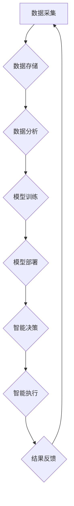

> 智能产业化、人工智能、机器学习、深度学习、数据驱动、云计算、边缘计算、工业互联网、数字孪生、自动化

## 1. 背景介绍

智能产业化是当前全球科技发展的重要趋势，其核心是将人工智能（AI）技术应用于各个产业领域，以提升生产效率、降低成本、创造新的价值。随着人工智能技术的快速发展，特别是深度学习算法的突破，智能产业化已从概念阶段进入实际应用阶段，并在制造业、金融业、医疗保健业等领域取得了显著成果。

然而，智能产业化的发展也面临着诸多挑战，例如数据孤岛、算法可解释性、人才短缺等。为了更好地推动智能产业化的发展，我们需要深入思考其未来发展方向，并制定相应的策略和措施。

## 2. 核心概念与联系

**2.1 智能产业化概念**

智能产业化是指利用人工智能技术，对传统产业进行数字化转型，实现智能化生产、智能化管理、智能化服务。其核心目标是通过数据驱动、算法优化、自动化流程，提升产业效率、降低成本、创造新的价值。

**2.2 核心概念联系**

智能产业化的发展离不开以下核心概念的相互支撑：

* **人工智能（AI）：** 赋予机器学习、推理、决策等智能能力，使其能够模拟人类智能行为。
* **机器学习（ML）：** 算法通过数据学习，不断提升预测、分类、聚类等能力。
* **深度学习（DL）：** 基于多层神经网络，能够处理复杂数据，实现更精准的智能化应用。
* **数据驱动：** 以数据为基础，通过数据分析、挖掘，为智能决策提供支撑。
* **云计算：** 提供强大的计算资源和存储能力，支持大规模数据处理和模型训练。
* **边缘计算：** 将计算能力部署到数据采集端，实现实时数据处理和决策。
* **工业互联网：** 连接设备、平台、应用，实现工业生产的智能化管理和控制。
* **数字孪生：** 建立虚拟的物理系统模型，用于模拟、预测和优化现实世界。

**2.3 核心概念架构**



## 3. 核心算法原理 & 具体操作步骤

**3.1 算法原理概述**

深度学习算法是智能产业化发展的重要驱动力，其核心原理是通过多层神经网络，模拟人类大脑的学习机制，从海量数据中提取特征，并进行预测、分类、聚类等任务。

**3.2 算法步骤详解**

1. **数据预处理：** 对原始数据进行清洗、转换、特征提取等操作，使其适合深度学习模型训练。
2. **网络结构设计：** 根据具体任务需求，设计合适的深度学习网络结构，例如卷积神经网络（CNN）、循环神经网络（RNN）、Transformer等。
3. **模型训练：** 使用训练数据，通过反向传播算法，不断调整网络参数，使模型的预测精度不断提升。
4. **模型评估：** 使用测试数据，评估模型的性能，例如准确率、召回率、F1-score等。
5. **模型部署：** 将训练好的模型部署到实际应用场景中，用于进行预测、分类、聚类等任务。

**3.3 算法优缺点**

**优点：**

* 能够处理复杂数据，提取高层次特征。
* 具有强大的学习能力，能够不断提升预测精度。
* 应用广泛，在图像识别、自然语言处理、语音识别等领域取得了突破性进展。

**缺点：**

* 训练数据量大，计算资源需求高。
* 模型解释性差，难以理解模型的决策过程。
* 对数据质量要求高，数据偏差会影响模型性能。

**3.4 算法应用领域**

深度学习算法已广泛应用于各个产业领域，例如：

* **制造业：** 智能制造、质量检测、设备故障预测。
* **金融业：** 风险评估、欺诈检测、客户画像。
* **医疗保健业：** 疾病诊断、药物研发、医疗影像分析。
* **零售业：** 商品推荐、库存管理、个性化营销。

## 4. 数学模型和公式 & 详细讲解 & 举例说明

**4.1 数学模型构建**

深度学习模型的核心是神经网络，其结构由多个层组成，每层包含多个神经元。每个神经元接收来自上一层的输入信号，并通过激活函数进行处理，输出到下一层。

**4.2 公式推导过程**

深度学习模型的训练过程基于梯度下降算法，其目标是找到最优的网络参数，使模型的预测误差最小化。

损失函数：

$$L = \frac{1}{N} \sum_{i=1}^{N} (y_i - \hat{y}_i)^2$$

其中：

* $L$ 为损失函数
* $N$ 为样本数量
* $y_i$ 为真实标签
* $\hat{y}_i$ 为模型预测值

梯度下降算法：

$$\theta = \theta - \alpha \nabla L$$

其中：

* $\theta$ 为网络参数
* $\alpha$ 为学习率
* $\nabla L$ 为损失函数的梯度

**4.3 案例分析与讲解**

以图像分类为例，假设我们训练一个深度学习模型，用于识别猫和狗的图片。

1. **数据预处理：** 将图片数据进行裁剪、缩放、归一化等操作。
2. **网络结构设计：** 设计一个卷积神经网络，包含多个卷积层、池化层和全连接层。
3. **模型训练：** 使用猫狗图片数据集，训练模型，并使用损失函数和梯度下降算法，不断调整网络参数。
4. **模型评估：** 使用测试数据集，评估模型的准确率、召回率等指标。
5. **模型部署：** 将训练好的模型部署到实际应用场景中，用于识别新的猫狗图片。

## 5. 项目实践：代码实例和详细解释说明

**5.1 开发环境搭建**

使用Python语言和深度学习框架TensorFlow或PyTorch进行开发。

**5.2 源代码详细实现**

```python
import tensorflow as tf

# 定义模型结构
model = tf.keras.models.Sequential([
    tf.keras.layers.Conv2D(32, (3, 3), activation='relu', input_shape=(28, 28, 1)),
    tf.keras.layers.MaxPooling2D((2, 2)),
    tf.keras.layers.Conv2D(64, (3, 3), activation='relu'),
    tf.keras.layers.MaxPooling2D((2, 2)),
    tf.keras.layers.Flatten(),
    tf.keras.layers.Dense(10, activation='softmax')
])

# 编译模型
model.compile(optimizer='adam',
              loss='sparse_categorical_crossentropy',
              metrics=['accuracy'])

# 训练模型
model.fit(x_train, y_train, epochs=10)

# 评估模型
loss, accuracy = model.evaluate(x_test, y_test)
print('Test loss:', loss)
print('Test accuracy:', accuracy)
```

**5.3 代码解读与分析**

这段代码定义了一个简单的卷积神经网络模型，用于手写数字识别任务。

* `tf.keras.models.Sequential` 创建一个顺序模型，层级结构清晰。
* `tf.keras.layers.Conv2D` 定义卷积层，提取图像特征。
* `tf.keras.layers.MaxPooling2D` 定义池化层，降低特征维度。
* `tf.keras.layers.Flatten` 将多维特征转换为一维向量。
* `tf.keras.layers.Dense` 定义全连接层，进行分类。
* `model.compile` 编译模型，指定优化器、损失函数和评价指标。
* `model.fit` 训练模型，使用训练数据进行迭代训练。
* `model.evaluate` 评估模型，使用测试数据计算损失和准确率。

**5.4 运行结果展示**

训练完成后，模型的准确率会不断提升，最终达到一定的水平。

## 6. 实际应用场景

**6.1 智能制造**

* **设备故障预测：** 利用传感器数据，训练深度学习模型，预测设备故障时间，提前进行维护，降低故障率。
* **质量检测：** 利用图像识别技术，自动检测产品缺陷，提高产品质量。
* **生产过程优化：** 利用数据分析，优化生产流程，提高生产效率。

**6.2 金融业**

* **风险评估：** 利用客户数据，训练深度学习模型，评估客户的信用风险，降低贷款风险。
* **欺诈检测：** 利用交易数据，训练深度学习模型，识别异常交易行为，防止欺诈行为。
* **客户画像：** 利用客户数据，构建客户画像，为客户提供个性化服务。

**6.3 医疗保健业**

* **疾病诊断：** 利用医学影像数据，训练深度学习模型，辅助医生诊断疾病。
* **药物研发：** 利用生物数据，训练深度学习模型，加速药物研发过程。
* **医疗影像分析：** 利用深度学习算法，自动分析医学影像，提取病灶信息。

**6.4 未来应用展望**

随着人工智能技术的不断发展，智能产业化将应用于更多领域，例如：

* **教育：** 个性化学习、智能辅导。
* **交通：** 自动驾驶、智能交通管理。
* **能源：** 智能能源管理、可再生能源预测。
* **农业：** 智能农业、精准农业。

## 7. 工具和资源推荐

**7.1 学习资源推荐**

* **在线课程：** Coursera、edX、Udacity等平台提供深度学习相关的在线课程。
* **书籍：** 《深度学习》、《动手学深度学习》等书籍。
* **开源项目：** TensorFlow、PyTorch等深度学习框架的开源项目。

**7.2 开发工具推荐**

* **深度学习框架：** TensorFlow、PyTorch、Keras等。
* **数据处理工具：** Pandas、NumPy等。
* **可视化工具：** Matplotlib、Seaborn等。

**7.3 相关论文推荐**

* **ImageNet Classification with Deep Convolutional Neural Networks**
* **Attention Is All You Need**
* **Generative Adversarial Networks**

## 8. 总结：未来发展趋势与挑战

**8.1 研究成果总结**

近年来，人工智能技术取得了显著进展，特别是深度学习算法在图像识别、自然语言处理、语音识别等领域取得了突破性进展。智能产业化已成为全球科技发展的重要趋势，并在各个产业领域取得了应用成果。

**8.2 未来发展趋势**

* **模型规模和能力提升：** 模型参数规模不断扩大，模型能力不断提升。
* **算法创新：** 新型深度学习算法不断涌现，例如Transformer、Generative Adversarial Networks等。
* **边缘计算和云计算融合：** 将计算能力部署到边缘端，实现实时数据处理和决策。
* **数据安全和隐私保护：** 加强数据安全和隐私保护措施，确保数据安全和可信赖。

**8.3 面临的挑战**

* **数据孤岛：** 数据分散、难以共享，制约了智能产业化的发展。
* **算法可解释性：** 深度学习模型的决策过程难以理解，缺乏可解释性。
* **人才短缺：** 缺乏深度学习和人工智能领域的专业人才。
* **伦理和社会影响：** 人工智能技术的发展可能带来伦理和社会问题，需要进行深入思考和探讨。

**8.4 研究展望**

未来，我们需要继续加强人工智能基础研究，探索更强大的算法和模型，并解决数据孤岛、算法可解释性、人才短缺等挑战。同时，