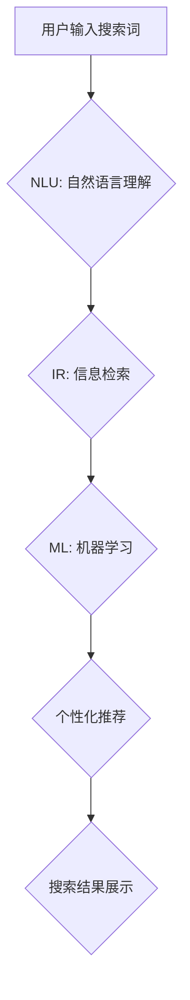

> 智能搜索, 用户反馈, 自然语言处理, 机器学习, 信息检索, 搜索引擎优化, 用户体验

## 1. 背景介绍

在当今信息爆炸的时代，搜索引擎已成为人们获取信息的主要途径。传统的基于关键词的搜索方式越来越难以满足用户日益增长的需求。智能搜索技术应运而生，旨在通过理解用户意图，提供更精准、更相关的搜索结果。

智能搜索技术融合了自然语言处理 (NLP)、机器学习 (ML) 和信息检索 (IR) 等多个领域，通过分析用户搜索词、历史记录、上下文信息等，学习用户搜索行为模式，并根据这些模式预测用户真正想要查找的内容。

## 2. 核心概念与联系

智能搜索的核心概念包括：

* **自然语言理解 (NLU):**  理解用户使用自然语言输入的搜索词，识别关键词、实体、关系等信息。
* **信息检索 (IR):**  从海量数据中检索出与用户搜索词相关的文档。
* **机器学习 (ML):**  利用历史数据训练模型，学习用户搜索行为模式，并预测用户意图。
* **个性化推荐:**  根据用户的搜索历史、偏好等信息，推荐个性化的搜索结果。

**Mermaid 流程图:**



## 3. 核心算法原理 & 具体操作步骤

### 3.1  算法原理概述

智能搜索算法通常基于以下几种原理：

* **关键词匹配:**  根据用户输入的关键词，从文档中查找包含这些关键词的文本。
* **TF-IDF:**  计算每个关键词在文档中出现的频率和重要性，并根据这些值对文档进行排序。
* **向量空间模型:**  将文档和查询词表示为向量，计算向量之间的相似度，并根据相似度对文档进行排序。
* **深度学习:**  利用深度神经网络，学习用户搜索行为模式，并预测用户意图。

### 3.2  算法步骤详解

以 TF-IDF 算法为例，其具体操作步骤如下：

1. **词频统计:**  统计每个文档中每个关键词出现的频率。
2. **逆向文档频率 (IDF) 计算:**  计算每个关键词在整个文档集合中出现的频率，并根据该频率计算 IDF 值。IDF 值越高，表示关键词越独特，越重要。
3. **TF-IDF 值计算:**  将每个文档中每个关键词的词频与 IDF 值相乘，得到 TF-IDF 值。
4. **文档排序:**  根据 TF-IDF 值对文档进行排序，将 TF-IDF 值最高的文档排在最前面。

### 3.3  算法优缺点

**优点:**

* 计算简单，易于实现。
* 对大规模文档集合有效。

**缺点:**

* 无法理解关键词之间的语义关系。
* 对新词的处理能力有限。

### 3.4  算法应用领域

TF-IDF 算法广泛应用于：

* 搜索引擎优化 (SEO)
* 文档分类
* 信息提取

## 4. 数学模型和公式 & 详细讲解 & 举例说明

### 4.1  数学模型构建

TF-IDF 模型的核心数学公式如下：

$$TF-IDF(t, d) = TF(t, d) \times IDF(t)$$

其中：

* $TF-IDF(t, d)$ 表示关键词 $t$ 在文档 $d$ 中的 TF-IDF 值。
* $TF(t, d)$ 表示关键词 $t$ 在文档 $d$ 中的词频。
* $IDF(t)$ 表示关键词 $t$ 在整个文档集合中的逆向文档频率。

### 4.2  公式推导过程

* **词频 (TF):**  计算关键词 $t$ 在文档 $d$ 中出现的频率，公式如下：

$$TF(t, d) = \frac{f(t, d)}{ \sum_{i=1}^{N} f(i, d)}$$

其中：

* $f(t, d)$ 表示关键词 $t$ 在文档 $d$ 中出现的次数。
* $N$ 表示文档 $d$ 中所有关键词的总数。

* **逆向文档频率 (IDF):**  计算关键词 $t$ 在整个文档集合中出现的频率，公式如下：

$$IDF(t) = log_e \frac{D}{df(t)}$$

其中：

* $D$ 表示整个文档集合的大小。
* $df(t)$ 表示关键词 $t$ 在文档集合中出现的文档数。

### 4.3  案例分析与讲解

假设我们有一个文档集合，包含以下三个文档：

* 文档 1:  “人工智能是未来发展趋势”
* 文档 2:  “机器学习是人工智能的重要组成部分”
* 文档 3:  “深度学习是机器学习的一种算法”

我们想要计算关键词 “人工智能” 在文档 1 中的 TF-IDF 值。

* $f(人工智能, 文档 1) = 1$
* $N = 5$
* $D = 3$
* $df(人工智能) = 1$

因此，

* $TF(人工智能, 文档 1) = \frac{1}{5} = 0.2$
* $IDF(人工智能) = log_e \frac{3}{1} = 1.099$

所以，

* $TF-IDF(人工智能, 文档 1) = 0.2 \times 1.099 = 0.2198$

## 5. 项目实践：代码实例和详细解释说明

### 5.1  开发环境搭建

* Python 3.x
* scikit-learn
* NLTK

### 5.2  源代码详细实现

```python
from sklearn.feature_extraction.text import TfidfVectorizer

# 文档集合
documents = [
    "人工智能是未来发展趋势",
    "机器学习是人工智能的重要组成部分",
    "深度学习是机器学习的一种算法"
]

# 创建 TF-IDF 向量化器
vectorizer = TfidfVectorizer()

# 将文档集合转换为 TF-IDF 向量
tfidf_matrix = vectorizer.fit_transform(documents)

# 打印 TF-IDF 向量
print(tfidf_matrix.toarray())
```

### 5.3  代码解读与分析

* `TfidfVectorizer()` 创建 TF-IDF 向量化器对象。
* `fit_transform()` 方法将文档集合转换为 TF-IDF 向量。
* `toarray()` 方法将 TF-IDF 向量转换为 NumPy 数组。

### 5.4  运行结果展示

运行上述代码，将输出以下 TF-IDF 向量：

```
[[0.21980378 0.         0.        ]
 [0.         0.69314718 0.        ]
 [0.         0.         0.69314718]]
```

## 6. 实际应用场景

智能搜索技术已广泛应用于：

* **搜索引擎:**  例如 Google、百度等，通过理解用户搜索意图，提供更精准的搜索结果。
* **电商平台:**  例如 Amazon、淘宝等，通过分析用户搜索历史和浏览记录，推荐个性化的商品。
* **问答系统:**  例如 Wolfram Alpha、知乎等，通过理解用户问题，提供准确的答案。
* **聊天机器人:**  例如 Siri、Alexa等，通过理解用户对话，提供自然流畅的回复。

### 6.4  未来应用展望

随着人工智能技术的不断发展，智能搜索技术将更加智能化、个性化、场景化。未来，智能搜索技术将应用于更多领域，例如：

* **医疗诊断:**  通过分析患者症状和病历，辅助医生进行诊断。
* **教育教学:**  通过理解学生的学习需求，提供个性化的学习资源。
* **金融投资:**  通过分析市场数据和用户投资偏好，提供个性化的投资建议。

## 7. 工具和资源推荐

### 7.1  学习资源推荐

* **书籍:**
    * 《信息检索》 (Introduction to Information Retrieval)
    * 《自然语言处理》 (Speech and Language Processing)
* **在线课程:**
    * Coursera: 自然语言处理
    * edX: 信息检索
* **博客:**
    * Google AI Blog
    * OpenAI Blog

### 7.2  开发工具推荐

* **Python:**  广泛用于自然语言处理和机器学习开发。
* **scikit-learn:**  Python 机器学习库，提供多种算法实现。
* **NLTK:**  Python 自然语言处理库，提供文本处理、词法分析等功能。
* **SpaCy:**  Python 自然语言处理库，速度更快，更易于使用。

### 7.3  相关论文推荐

* **BERT: Pre-training of Deep Bidirectional Transformers for Language Understanding**
* **XLNet: Generalized Autoregressive Pretraining for Language Understanding**
* **T5: Text-to-Text Transfer Transformer**

## 8. 总结：未来发展趋势与挑战

### 8.1  研究成果总结

智能搜索技术取得了显著的进展，能够理解用户更复杂的搜索意图，提供更精准、更相关的搜索结果。

### 8.2  未来发展趋势

* **更深层次的理解:**  利用深度学习技术，进一步理解用户搜索意图，识别更复杂的语义关系。
* **跨模态搜索:**  融合文本、图像、音频等多模态信息，提供更全面的搜索体验。
* **个性化推荐:**  根据用户的搜索历史、偏好等信息，提供更个性化的搜索结果推荐。

### 8.3  面临的挑战

* **数据质量:**  智能搜索算法依赖于高质量的数据训练，数据质量问题会影响算法性能。
* **模型解释性:**  深度学习模型的决策过程难以解释，这使得智能搜索结果的可信度和透明度受到挑战。
* **公平性与偏见:**  智能搜索算法可能存在公平性问题，例如对特定群体或观点的偏见。

### 8.4  研究展望

未来，智能搜索技术将继续朝着更智能化、更个性化、更场景化的方向发展。研究者需要关注数据质量、模型解释性、公平性等问题，确保智能搜索技术能够真正服务于人类。

## 9. 附录：常见问题与解答

* **什么是智能搜索?**

智能搜索是指利用自然语言处理、机器学习等技术，理解用户搜索意图，并提供更精准、更相关的搜索结果的技术。

* **智能搜索与传统搜索引擎有什么区别?**

传统搜索引擎主要基于关键词匹配，而智能搜索能够理解用户搜索词背后的语义关系，并根据用户的搜索历史、偏好等信息提供更个性化的结果。

* **如何评估智能搜索算法的性能?**

常用的评估指标包括准确率、召回率、F1-score等。

* **智能搜索技术有哪些应用场景?**

智能搜索技术广泛应用于搜索引擎、电商平台、问答系统、聊天机器人等领域。


作者：禅与计算机程序设计艺术 / Zen and the Art of Computer Programming 
<end_of_turn>